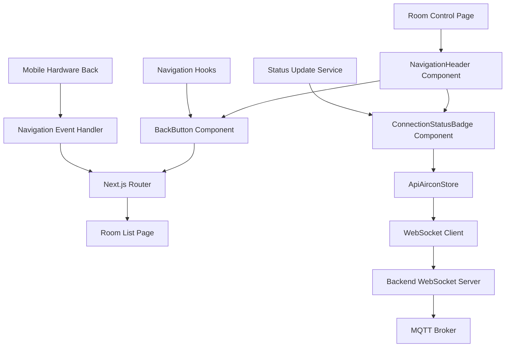
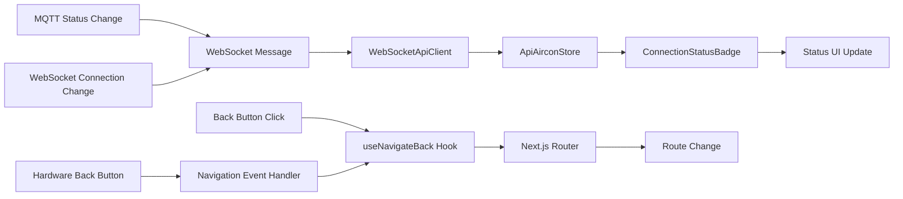
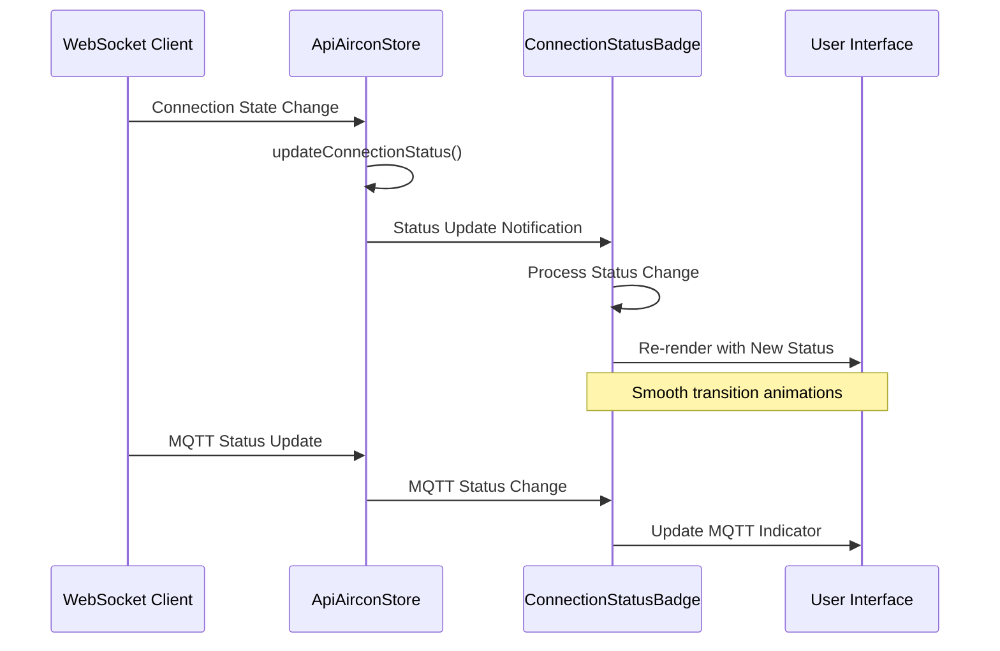
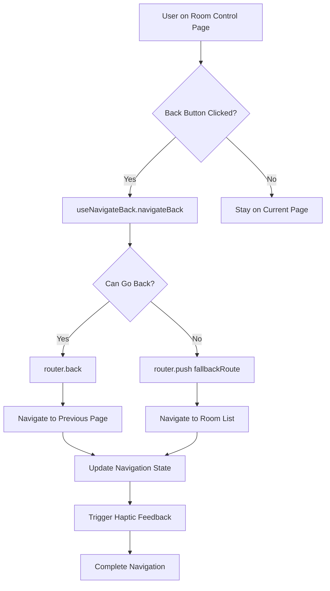
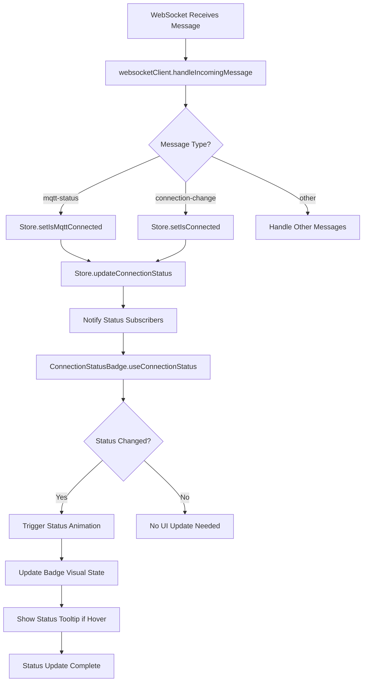
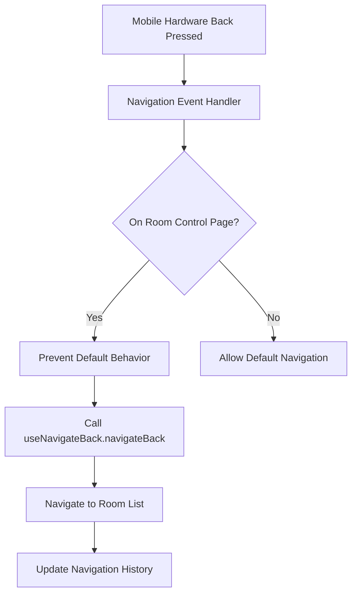
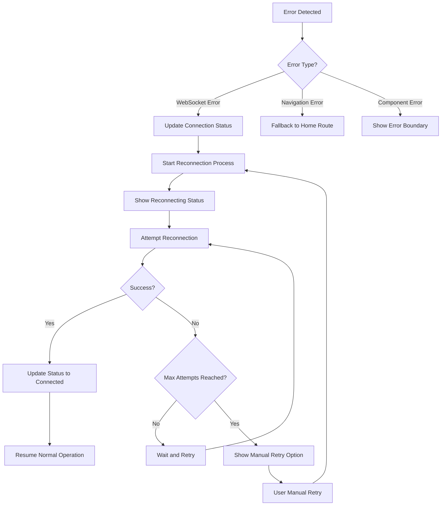

# Frontend Navigation UI Design Document

## Overview

This design document outlines the implementation of frontend navigation UI enhancements for the Mitsubishi Remote Control PWA. The enhancements focus on adding back button navigation from room control pages to the room list and improving MQTT status display synchronization with real-time updates.

### Design Goals
- Implement intuitive back button navigation for room control pages
- Enhance connection status display with real-time synchronization
- Maintain consistency with existing UI patterns and architecture
- Support both mobile and desktop user experiences
- Ensure offline functionality and graceful error handling

### Scope
- Navigation header component with back button functionality
- Enhanced connection status badge with real-time updates
- Integration with existing WebSocket client and Zustand store
- Mobile hardware back button support
- Error handling and offline scenarios

## Architecture Design

### System Architecture Diagram



### Data Flow Diagram



## Component Design

### NavigationHeader Component

**Responsibilities:**
- Provide consistent navigation header across room control pages
- Display back button and connection status
- Handle responsive layout for mobile and desktop
- Integrate with theme system

**Interfaces:**
```typescript
interface NavigationHeaderProps {
  roomName?: string;
  showBackButton?: boolean;
  customActions?: React.ReactNode;
  className?: string;
}

interface NavigationHeaderComponent {
  (props: NavigationHeaderProps): JSX.Element;
}
```

**Dependencies:**
- BackButton component
- ConnectionStatusBadge component
- Next.js useRouter hook
- Theme provider context

### BackButton Component

**Responsibilities:**
- Handle back navigation to room list
- Support keyboard navigation (Enter/Space)
- Provide haptic feedback on mobile devices
- Display appropriate loading states

**Interfaces:**
```typescript
interface BackButtonProps {
  fallbackRoute?: string;
  onNavigate?: () => void;
  disabled?: boolean;
  className?: string;
  variant?: 'default' | 'ghost' | 'outline';
}

interface BackButtonComponent {
  (props: BackButtonProps): JSX.Element;
}
```

**Dependencies:**
- useNavigateBack custom hook
- Button UI component
- useHaptic hook
- Lucide React icons

### ConnectionStatusBadge Component

**Responsibilities:**
- Display real-time WebSocket and MQTT connection status
- Show different status states with appropriate visual indicators
- Handle status transitions with smooth animations
- Provide status tooltips with detailed information

**Interfaces:**
```typescript
interface ConnectionStatus {
  websocket: 'connected' | 'connecting' | 'disconnected' | 'error';
  mqtt: 'connected' | 'disconnected' | 'unknown';
  lastUpdate: number;
}

interface ConnectionStatusBadgeProps {
  showDetails?: boolean;
  size?: 'sm' | 'md' | 'lg';
  variant?: 'compact' | 'detailed';
  className?: string;
}

interface ConnectionStatusBadgeComponent {
  (props: ConnectionStatusBadgeProps): JSX.Element;
}
```

**Dependencies:**
- useAirconContext hook
- Badge UI component
- Tooltip UI component
- Framer Motion for animations

### Navigation Hooks

**useNavigateBack Hook:**
```typescript
interface UseNavigateBackOptions {
  fallbackRoute?: string;
  confirmNavigation?: boolean;
}

interface UseNavigateBackReturn {
  navigateBack: () => void;
  canGoBack: boolean;
  isNavigating: boolean;
}

interface UseNavigateBack {
  (options?: UseNavigateBackOptions): UseNavigateBackReturn;
}
```

**useConnectionStatus Hook:**
```typescript
interface UseConnectionStatusReturn {
  status: ConnectionStatus;
  isOnline: boolean;
  retryConnection: () => void;
  lastError: string | null;
}

interface UseConnectionStatus {
  (): UseConnectionStatusReturn;
}
```

## Data Model

### Connection Status Data Structure

```typescript
// Core connection status interface
interface ConnectionStatus {
  websocket: {
    state: 'connected' | 'connecting' | 'disconnected' | 'error';
    lastConnected: number | null;
    reconnectAttempts: number;
  };
  mqtt: {
    state: 'connected' | 'disconnected' | 'unknown';
    lastUpdate: number | null;
  };
  overall: 'healthy' | 'degraded' | 'disconnected';
}

// Navigation state interface
interface NavigationState {
  currentRoute: string;
  previousRoute: string | null;
  canGoBack: boolean;
  isNavigating: boolean;
}

// Enhanced store state additions
interface ApiAirconStoreEnhancements {
  // Connection status tracking
  connectionStatus: ConnectionStatus;
  updateConnectionStatus: (status: Partial<ConnectionStatus>) => void;
  
  // Navigation state
  navigationState: NavigationState;
  updateNavigationState: (state: Partial<NavigationState>) => void;
  
  // Status polling
  startStatusPolling: () => void;
  stopStatusPolling: () => void;
}
```

### Connection Status Flow Diagram



## Business Process

### Process 1: Back Button Navigation Flow



### Process 2: Real-time Status Update Flow



### Process 3: Hardware Back Button Integration



## Error Handling Strategy

### Connection Error Handling

```typescript
// Connection error recovery strategy
interface ConnectionErrorHandler {
  handleWebSocketError: (error: WebSocketError) => void;
  handleMqttError: (error: MqttError) => void;
  retryConnection: (type: 'websocket' | 'mqtt') => Promise<void>;
  showErrorNotification: (message: string, type: 'warning' | 'error') => void;
}

// Error states and recovery actions
const ErrorHandlingStrategy = {
  websocketDisconnected: {
    action: 'Show reconnection status',
    retry: 'Exponential backoff (max 10 attempts)',
    fallback: 'Cache last known state'
  },
  mqttDisconnected: {
    action: 'Show MQTT offline status',
    retry: 'Request status update every 30s',
    fallback: 'Disable control commands'
  },
  navigationError: {
    action: 'Fallback to home route',
    retry: 'None',
    fallback: 'Show error boundary'
  }
};
```

### Error Recovery Process



## Testing Strategy

### Unit Testing

**Component Testing:**
- NavigationHeader component rendering with different props
- BackButton click handling and navigation logic
- ConnectionStatusBadge status display variations
- Hook behaviors under different state conditions

**Integration Testing:**
- Navigation flow from room control to room list
- Status updates propagation through WebSocket → Store → Components
- Hardware back button event handling
- Error scenarios and recovery mechanisms

### End-to-End Testing

**User Journey Tests:**
```typescript
describe('Navigation UI Features', () => {
  test('User can navigate back from room control to room list', async () => {
    // Test navigation flow
  });
  
  test('Connection status updates in real-time', async () => {
    // Test WebSocket status changes
  });
  
  test('Hardware back button works on mobile', async () => {
    // Test mobile hardware back button
  });
  
  test('Offline scenarios handled gracefully', async () => {
    // Test offline functionality
  });
});
```

### Performance Testing

**Metrics to Monitor:**
- Status update response time (<100ms)
- Navigation transition time (<200ms)
- Memory usage during status polling
- Battery impact on mobile devices

**Optimization Targets:**
- Debounce status updates to prevent excessive re-renders
- Lazy load navigation components
- Minimize WebSocket message frequency
- Cache navigation history efficiently

## Implementation Notes

### Integration with Existing Architecture

**WebSocket Client Enhancement:**
- Extend `WebSocketApiClient` with enhanced status tracking
- Add connection state change notifications
- Implement status polling with configurable intervals

**Zustand Store Updates:**
- Add navigation state management
- Enhance connection status tracking
- Implement status change notifications

**Component Integration:**
- Update room control page to use NavigationHeader
- Maintain existing status display while enhancing functionality
- Ensure theme consistency across new components

### Mobile Considerations

**Hardware Back Button:**
```typescript
// Mobile back button handler
useEffect(() => {
  const handlePopState = (event: PopStateEvent) => {
    if (isOnRoomControlPage) {
      event.preventDefault();
      navigateBack();
    }
  };
  
  window.addEventListener('popstate', handlePopState);
  return () => window.removeEventListener('popstate', handlePopState);
}, [isOnRoomControlPage, navigateBack]);
```

**Touch Interactions:**
- Haptic feedback for navigation actions
- Swipe gestures for back navigation (future enhancement)
- Touch-friendly button sizes and spacing

### Accessibility

**Keyboard Navigation:**
- Tab navigation through header components
- Enter/Space key support for back button
- Screen reader announcements for status changes

**Visual Indicators:**
- High contrast status colors
- Clear visual hierarchy
- Appropriate focus indicators

This design document provides a comprehensive foundation for implementing the frontend navigation UI enhancements while maintaining consistency with the existing architecture and ensuring optimal user experience across all devices and scenarios.