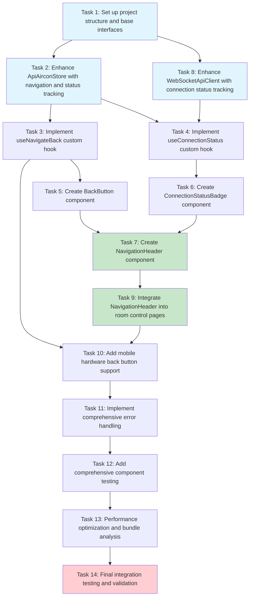

# Implementation Plan: Frontend Navigation UI Enhancements

## Overview

This implementation plan outlines the step-by-step development of frontend navigation UI enhancements for the Mitsubishi Air Conditioner Remote Control PWA. The implementation focuses on adding back button navigation from room control pages and enhancing connection status display with real-time synchronization.

## Implementation Tasks

- [ ] 1. Set up project structure and base interfaces
  - Create directory structure for navigation components and hooks
  - Define TypeScript interfaces for navigation state and connection status
  - Set up basic component scaffolding for NavigationHeader, BackButton, and ConnectionStatusBadge
  - _Requirements: 1.1, 1.2, 1.3, 1.4, 2.1, 2.2, 3.1, 3.2_

- [ ] 2. Enhance ApiAirconStore with navigation and status tracking
  - Add connection status state management to existing ApiAirconStore
  - Implement navigation state tracking with current/previous route tracking
  - Add connection status update methods for WebSocket and MQTT status
  - Create status polling functionality for real-time updates
  - Write unit tests for new store functionality
  - _Requirements: 2.4, 2.5, 4.2, 4.3, 4.6_

- [ ] 3. Implement useNavigateBack custom hook
  - Create hook with navigation logic using Next.js router
  - Add fallback route handling for edge cases
  - Implement navigation confirmation and loading states
  - Add prevention of duplicate navigation attempts
  - Include proper error handling for navigation failures
  - Write unit tests for hook behavior and edge cases
  - _Requirements: 1.1, 1.2, 1.6, 5.2, 5.4_

- [ ] 4. Implement useConnectionStatus custom hook
  - Create hook to subscribe to connection status updates from store
  - Add real-time status monitoring with WebSocket and MQTT status
  - Implement connection retry functionality
  - Handle connection status errors and unknown states
  - Add offline detection and status display
  - Write unit tests for status update scenarios
  - _Requirements: 2.1, 2.2, 2.3, 2.4, 2.5, 5.1, 5.3, 5.5, 5.8_

- [ ] 5. Create BackButton component
  - Build reusable back button component with proper styling
  - Integrate useNavigateBack hook for navigation logic
  - Add accessibility attributes (aria-label, role) and keyboard support
  - Implement haptic feedback for mobile devices using existing useHaptic hook
  - Add loading and disabled states with visual indicators
  - Ensure responsive design for mobile touch targets (44px minimum)
  - Write unit tests for component rendering and interactions
  - _Requirements: 1.1, 1.3, 1.4, 1.7, 3.1, 3.5, 5.2, 5.7_

- [ ] 6. Create ConnectionStatusBadge component
  - Build status display component with visual indicators for different states
  - Implement real-time status updates using useConnectionStatus hook
  - Add smooth status transition animations with appropriate colors
  - Create status tooltips with detailed connection information
  - Handle error states and fallback displays gracefully
  - Ensure accessibility with both visual and text indicators
  - Write unit tests for status display variations and animations
  - _Requirements: 2.1, 2.2, 2.3, 2.4, 2.5, 2.7, 2.8, 2.10, 5.1, 5.3_

- [ ] 7. Create NavigationHeader component
  - Build unified navigation header component containing BackButton and ConnectionStatusBadge
  - Implement conditional rendering of back button based on current route
  - Add responsive layout handling for mobile and desktop displays
  - Integrate with existing theme system and Tailwind CSS classes
  - Support optional room name display and custom actions
  - Ensure consistent spacing and alignment with existing UI components
  - Write unit tests for header composition and responsive behavior
  - _Requirements: 1.5, 2.6, 3.1, 3.2, 3.5, 3.6_

- [ ] 8. Enhance WebSocketApiClient with connection status tracking
  - Extend existing WebSocket client to emit connection status changes
  - Add enhanced status tracking for connection, reconnection attempts, and MQTT status
  - Implement connection state change notifications to store
  - Add proper error handling and status recovery mechanisms
  - Ensure status updates are debounced to prevent excessive re-renders
  - Write unit tests for WebSocket status tracking and error scenarios
  - _Requirements: 2.4, 2.5, 4.2, 4.3, 4.6, 5.1, 5.6_

- [ ] 9. Integrate NavigationHeader into room control pages
  - Update `/app/rooms/[roomId]/page.tsx` to include NavigationHeader component
  - Ensure proper positioning and layout integration with existing components
  - Test navigation flow from room control back to room list
  - Verify responsive design across different screen sizes
  - Ensure theme consistency and proper styling integration
  - Write integration tests for navigation flow and UI consistency
  - _Requirements: 1.1, 1.2, 1.5, 1.6, 2.6, 3.1, 3.2_

- [ ] 10. Add mobile hardware back button support
  - Implement popstate event listener for hardware back button handling
  - Add conditional navigation logic for room control pages
  - Prevent default browser navigation when on room control pages
  - Integrate with existing useNavigateBack hook for consistent behavior
  - Test hardware back button functionality on mobile devices
  - Write tests for hardware back button event handling
  - _Requirements: 1.1, 1.2, 4.1, 5.2_

- [ ] 11. Implement comprehensive error handling
  - Add error boundaries for navigation components
  - Implement graceful fallbacks for missing context or failed navigation
  - Handle WebSocket disconnection scenarios with appropriate user feedback
  - Add offline state detection and display
  - Implement connection retry mechanisms with user feedback
  - Create error notification system for navigation and connection failures
  - Write tests for error scenarios and recovery mechanisms
  - _Requirements: 5.1, 5.2, 5.3, 5.6, 5.7, 5.8_

- [ ] 12. Add comprehensive component testing
  - Create unit tests for all new components (NavigationHeader, BackButton, ConnectionStatusBadge)
  - Add integration tests for navigation flow and status updates
  - Test hook behaviors under different state conditions
  - Create tests for mobile hardware back button functionality
  - Add tests for error scenarios and edge cases
  - Test accessibility features and keyboard navigation
  - Ensure test coverage meets project standards
  - _Requirements: 4.8, 5.1, 5.2, 5.3, 5.4, 5.5_

- [ ] 13. Performance optimization and bundle analysis
  - Optimize component re-rendering with React.memo where appropriate
  - Implement efficient status update debouncing to prevent excessive renders
  - Analyze bundle size impact and ensure it stays under 5KB increase
  - Optimize WebSocket status polling intervals for performance
  - Add lazy loading for navigation components if beneficial
  - Test navigation transition performance (<300ms target)
  - _Requirements: 4.5, 4.6, 3.6, 4.3_

- [ ] 14. Final integration testing and validation
  - Conduct end-to-end testing of complete navigation flow
  - Test real-time status updates with WebSocket connection changes
  - Verify mobile responsiveness and touch interactions
  - Test offline functionality and error recovery
  - Validate accessibility compliance with screen readers and keyboard navigation
  - Perform cross-browser compatibility testing
  - Verify TypeScript compilation and type safety
  - _Requirements: All requirements validation_

## Tasks Dependency Diagram

## Implementation Notes

### Key Integration Points

**Existing Architecture Integration:**
- Use existing `ApiAirconStore` and enhance with navigation/status tracking
- Integrate with current `WebSocketApiClient` for real-time status updates  
- Leverage existing hooks (`useAirconContext`, `useHaptic`, `useMobile`)
- Maintain compatibility with current `ApiAirconProvider` React Context

**Component Architecture:**
- NavigationHeader acts as the main container component
- BackButton and ConnectionStatusBadge are independent, reusable components
- Custom hooks abstract navigation and status logic for testability

**State Management:**
- Enhanced `ApiAirconStore` handles both navigation state and connection status
- Real-time updates flow from WebSocket → Store → Components
- Navigation state tracks route history for back button functionality

### Performance Considerations

**Optimization Strategies:**
- Debounce status updates to prevent excessive re-renders
- Use React.memo for components that receive frequent status updates
- Lazy load navigation components to minimize initial bundle size
- Cache navigation history efficiently in store

**Monitoring Targets:**
- Navigation transitions: <300ms
- Status updates: <100ms response time
- Bundle size increase: <5KB
- Memory usage during status polling

### Testing Strategy

**Component Testing:**
- Unit tests for individual components with different prop variations
- Integration tests for navigation flow and status update propagation
- Accessibility testing for keyboard navigation and screen readers

**End-to-End Testing:**
- Complete user journey from room list to room control and back
- Real-time status updates during WebSocket connection changes
- Mobile hardware back button functionality
- Offline scenarios and error recovery

This implementation plan provides a systematic approach to building the navigation UI enhancements while maintaining integration with the existing architecture and ensuring comprehensive testing coverage.