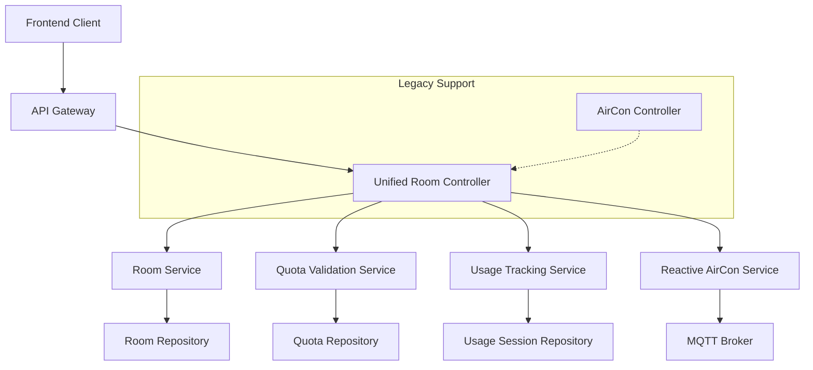

# Room Controller Consolidation Design

## Overview

This design consolidates room-related API endpoints into a single, unified RoomController under the `/api/rooms` path. Previously, room operations were split between the UnifiedRoomController (`/api/rooms`) and AirConController (`/api/aircon`), creating inconsistent API patterns and requiring multiple client integrations. This consolidation has provided a single, cohesive API for all room and device operations by fully replacing the old AirConController with enhanced UnifiedRoomController functionality.

The design leverages the existing Spring Boot WebFlux reactive architecture and integrates seamlessly with the current quota management, session tracking, and MQTT-based device communication systems.

## Architecture

### High-Level Architecture



### Component Integration

The consolidated controller integrates with existing services:

- **RoomService**: Manages room CRUD operations and device associations
- **QuotaValidationService**: Validates device control commands against user quotas
- **UsageTrackingService**: Automatically manages usage sessions based on device state changes
- **ReactiveAirConService**: Handles MQTT communication with physical devices
- **JwtAuthenticationContext**: Provides user authentication and authorization

### API Endpoint Structure

All room-related operations will be consolidated under `/api/rooms`:

```
/api/rooms
├── GET    /                           # Get all rooms
├── POST   /                           # Create room (parent-only)
├── GET    /{roomId}                   # Get room by ID
├── PUT    /{roomId}                   # Update room (parent-only)
├── DELETE /{roomId}                   # Delete room (parent-only)
├── GET    /identifier/{identifier}    # Get room by identifier
└── /{roomId}/devices/{deviceId}/
    ├── POST /control                  # Generic device control
    ├── POST /power                    # Set power state
    ├── POST /temperature              # Set temperature
    ├── POST /mode                     # Set operating mode
    ├── POST /fan                      # Set fan speed
    ├── POST /vane                     # Set vane position
    ├── POST /validate                 # Validate command
    └── GET  /status                   # Get device status
```

## Components and Interfaces

### 1. Unified Room Controller

**Responsibility**: Single entry point for all room and device operations

**Key Features**:
- Consolidates room CRUD and device control operations
- Integrates quota validation seamlessly into device control flow
- Automatic session management based on device power state changes
- Consistent error handling and response formats
- Real-time status updates via WebSocket integration

**Design Decisions**:
- **Reactive Programming**: Uses Spring WebFlux for non-blocking I/O operations
- **Integrated Validation**: Quota validation is embedded in device control flow rather than requiring separate calls
- **Automatic Session Management**: Sessions start/end automatically based on power state changes
- **Consistent Response Format**: All endpoints return standardized response objects

### 2. Device Control Integration

**Previous State**: Device control was handled through separate AirConController endpoints
**Current State**: Device control is fully integrated into room-scoped endpoints with automatic quota and session management

**Integration Points**:
```java
// Integrated device control flow
public Mono<DeviceControlResponse> controlDevice(UUID roomId, String deviceId, DeviceControlAction action) {
    return validateUserAccess(roomId)
        .flatMap(userInfo -> validateQuota(userInfo, action))
        .flatMap(quotaResult -> {
            if (quotaResult.isBlocked()) {
                return Mono.just(DeviceControlResponse.quotaBlocked(quotaResult));
            }
            return executeDeviceControl(roomId, deviceId, action)
                .flatMap(success -> handleSessionManagement(userInfo, roomId, action))
                .flatMap(session -> buildResponse(roomId, deviceId, action, success));
        });
}
```

### 3. Quota Integration Strategy

**Design Decision**: Embed quota validation directly into device control operations rather than requiring separate validation calls.

**Rationale**: 
- Reduces API calls from frontend (from 2 calls to 1)
- Ensures quota validation cannot be bypassed
- Provides atomic operation semantics
- Simplifies error handling

**Implementation**:
- Quota validation occurs automatically before device command execution
- Failed quota validation returns 403 Forbidden with detailed quota information
- Successful validation proceeds with command execution and session management

### 4. Session Management Integration

**Design Decision**: Automatically manage usage sessions based on device power state changes.

**Rationale**:
- Eliminates manual session management from frontend
- Ensures accurate usage tracking
- Reduces complexity for client applications
- Provides fail-safe session cleanup

**Implementation**:
```java
private Mono<UsageSession> handleSessionManagement(UserInfo user, UUID roomId, DeviceControlAction action) {
    return switch (action.getType()) {
        case "power" -> {
            if ("on".equals(action.getValue())) {
                yield usageTrackingService.startUsageSession(user.getUserId(), roomId, extractSettings(action));
            } else {
                yield usageTrackingService.endActiveSession(user.getUserId(), roomId);
            }
        }
        default -> Mono.empty(); // No session management for non-power actions
    };
}
```

## Data Models

### Request/Response Models

```java
// Unified device control request
public class DeviceControlAction {
    private String type;        // "power", "temperature", "mode", "fan", "vane"
    private Object value;       // Type-specific value
    private Map<String, Object> metadata; // Additional parameters
}

// Unified device control response
public class DeviceControlResponse {
    private boolean success;
    private String message;
    private UUID roomId;
    private String deviceId;
    private String action;
    private RoomResponse updatedRoom;    // Complete room state after operation
    private QuotaValidationResult quotaResult; // Quota validation details
    private UsageSession session;       // Session information if applicable
    private Instant timestamp;
}

// Enhanced room response with device information
public class RoomResponse {
    private UUID id;
    private String name;
    private String identifier;
    private List<DeviceInfo> devices;
    private RoomAggregateStatus aggregateStatus;
    private Instant lastUpdate;
}

// Device information within room context
public class DeviceInfo {
    private String deviceId;
    private String type;
    private String status;          // "available", "unavailable", "error"
    private Map<String, Object> currentState;
    private Map<String, Object> currentSettings;
    private UsageSession activeSession;
    private Instant lastUpdate;
}
```

### Database Schema Considerations

**No schema changes required** - the consolidation uses existing entities:
- Room entities remain unchanged
- Device associations handled through existing room-device relationships
- Usage sessions continue using current schema
- Quota management uses existing quota entities

## Error Handling

### Consistent Error Response Format

```java
public class ApiErrorResponse {
    private String error;
    private String message;
    private int status;
    private String path;
    private Instant timestamp;
    private Map<String, Object> details; // Context-specific error details
}
```

### Error Mapping Strategy

```java
private Throwable mapException(Throwable error) {
    return switch (error) {
        case QuotaExceededException qe -> 
            new ResponseStatusException(HttpStatus.FORBIDDEN, qe.getMessage(), qe);
        case DeviceUnavailableException due -> 
            new ResponseStatusException(HttpStatus.SERVICE_UNAVAILABLE, due.getMessage(), due);
        case NoSuchElementException nse -> 
            new ResponseStatusException(HttpStatus.NOT_FOUND, nse.getMessage(), nse);
        case IllegalArgumentException iae -> 
            new ResponseStatusException(HttpStatus.BAD_REQUEST, iae.getMessage(), iae);
        case IllegalStateException ise -> 
            new ResponseStatusException(HttpStatus.CONFLICT, ise.getMessage(), ise);
        default -> {
            log.error("Unexpected error in room controller", error);
            yield new ResponseStatusException(HttpStatus.INTERNAL_SERVER_ERROR, 
                "An unexpected error occurred");
        }
    };
}
```

### Quota-Specific Error Handling

When quota validation fails, the response includes detailed quota information:

```json
{
  "error": "Quota exceeded",
  "message": "Daily usage limit reached",
  "status": 403,
  "details": {
    "quotaType": "DAILY_USAGE",
    "currentUsage": 480,
    "limit": 420,
    "resetTime": "2024-01-02T00:00:00Z",
    "overrideAvailable": true
  }
}
```

## Testing Strategy

### Unit Testing

**Controller Layer Tests**:
- Test all endpoint mappings and parameter validation
- Mock service dependencies to test controller logic in isolation
- Verify error handling and response mapping
- Test security annotations and authorization

**Integration Tests**:
- Test complete request/response flow with embedded services
- Verify quota validation integration
- Test session management automation
- Validate WebSocket event publishing

**Service Integration Tests**:
- Test interaction between RoomService and device control services
- Verify quota validation service integration
- Test usage tracking service automation
- Validate MQTT service integration

### Performance Testing

**Load Testing Scenarios**:
- Concurrent device control operations
- High-frequency status polling
- Quota validation under load
- Session management performance

**Caching Strategy Testing**:
- Verify room data caching effectiveness
- Test cache invalidation on device state changes
- Validate quota cache performance

### Backward Compatibility Testing

**Legacy Endpoint Testing**:
- Verify `/api/aircon` endpoints continue to work during transition
- Test deprecation warnings are properly returned
- Validate migration path for existing clients

## Security and Authorization

### Authentication Requirements

All endpoints require JWT authentication via Authorization header:
```java
@RequestHeader(value = "Authorization", required = false) String authorization
```

### Authorization Matrix

| Operation | Authentication | Authorization | Notes |
|-----------|---------------|---------------|-------|
| GET rooms | Required | User access to household | |
| GET room by ID | Required | User access to household | |
| CREATE room | Required | PARENT role | |
| UPDATE room | Required | PARENT role | |
| DELETE room | Required | PARENT role | |
| Device control | Required | User access to room | Quota validation applied |
| Device status | Required | User access to room | |

### Security Design Decisions

**Room-Scoped Authorization**: Device control operations verify that the user has access to the specific room before allowing device control.

**Quota-Based Access Control**: Device control operations are subject to quota validation, which can block operations even for authorized users.

**Session-Based Tracking**: Usage sessions are tied to authenticated users, ensuring accurate attribution of usage.

## Performance Optimization

### Caching Strategy

**Room Data Caching**:
- Cache room information with embedded device data
- 30-second TTL for API-level caching
- Invalidate cache on device state changes
- Batch multiple room requests to reduce database load

**Quota Validation Caching**:
- Cache quota validation results for short periods (5 seconds)
- Invalidate on quota updates or usage changes
- Use Redis for distributed caching in production

### Request Batching

**Device Status Batching**:
- Batch multiple device status requests within 50ms window
- Reduce MQTT query overhead
- Optimize WebSocket update publishing

**Database Query Optimization**:
- Use reactive repositories for non-blocking database access
- Implement query batching for multiple room requests
- Optimize joins between rooms and devices

### Response Time Targets

- **Device Control Operations**: < 500ms for local operations
- **Room Status Queries**: < 200ms with caching
- **Quota Validation**: < 100ms with caching
- **Session Management**: < 50ms (asynchronous where possible)

## Real-time Updates

### WebSocket Integration

Device control operations trigger real-time updates via existing WebSocket infrastructure:

```java
// After successful device control
private Mono<Void> publishRoomUpdate(UUID roomId, RoomResponse updatedRoom) {
    return webSocketService.publishRoomUpdate(roomId, updatedRoom)
        .doOnSuccess(v -> log.debug("Published room update for room {}", roomId))
        .onErrorResume(error -> {
            log.warn("Failed to publish room update for room {}: {}", roomId, error.getMessage());
            return Mono.empty(); // Don't fail the main operation
        });
}
```

### Event Publishing Strategy

**Room-Level Events**:
- Device state changes
- Aggregate room status updates
- Session start/end events
- Quota validation results

**Batching Strategy**:
- Batch multiple device updates within a room
- Debounce rapid state changes (100ms window)
- Prioritize user-initiated changes over automatic updates

## Migration Strategy

### Phase 1: Parallel Operation

- Deploy consolidated controller alongside existing AirConController
- Frontend can use either API during transition
- Monitor usage patterns and performance
- Gradual migration of frontend components

### Phase 2: Deprecation

- Add deprecation warnings to `/api/aircon` endpoints
- Update documentation to recommend `/api/rooms` endpoints
- Provide migration guides for client applications
- Monitor deprecated endpoint usage

### Phase 3: Removal

- Return 410 Gone status for deprecated endpoints
- Include migration instructions in error responses
- Complete removal after sufficient transition period

### Backward Compatibility Guarantees

**During Transition Period**:
- All existing `/api/aircon` endpoints remain functional
- Response formats remain unchanged for existing endpoints
- No breaking changes to existing client integrations

**Migration Support**:
- Provide endpoint mapping documentation
- Offer client library updates with new endpoint support
- Maintain feature parity during transition

## Monitoring and Observability

### Metrics Collection

**Performance Metrics**:
- Request/response times per endpoint
- Device control success/failure rates
- Quota validation performance
- Session management overhead

**Business Metrics**:
- Device control operation frequency
- Quota violation rates
- Session duration statistics
- Error rate by operation type

### Logging Strategy

**Structured Logging**:
```java
log.info("Device control operation", 
    Map.of(
        "userId", userInfo.getUserId(),
        "roomId", roomId,
        "deviceId", deviceId,
        "action", action.getType(),
        "quotaStatus", quotaResult.getStatus(),
        "executionTime", duration.toMillis()
    ));
```

**Log Levels**:
- **INFO**: Successful operations, quota validations
- **WARN**: Quota violations, device communication issues
- **ERROR**: System errors, integration failures
- **DEBUG**: Detailed operation flow, performance data

### Health Checks

**Endpoint Health**:
- Room service connectivity
- MQTT broker connectivity
- Database connectivity
- Redis cache connectivity

**Business Logic Health**:
- Quota validation service health
- Session management service health
- Device communication health