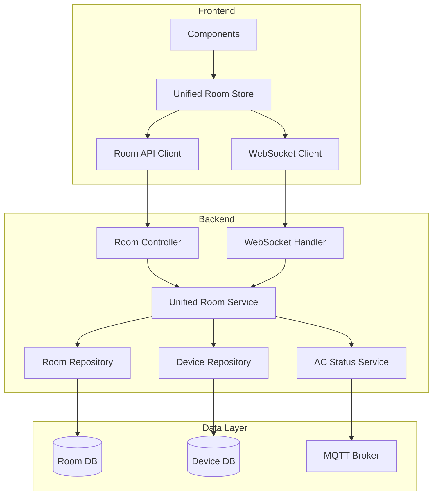

# Unified Room API Design

## Overview

The unified Room API consolidates fragmented room-related functionality into a cohesive system that provides complete room information through a single endpoint. This design eliminates the need for multiple API calls and complex state management by embedding device information and real-time status directly into room responses.

## Architecture

### High-Level Architecture



### API Endpoint Consolidation

**Current State:**
- `/api/room-management/*` - Room CRUD operations
- `/api/devices/*` - Device management
- `/api/rooms/{roomId}/*` - AC control operations

**New Unified Structure:**
- `/api/rooms` - All room operations
- `/api/rooms/{roomId}/devices/{deviceId}/*` - Device control operations

## Components and Interfaces

### Backend Components

#### 1. Unified Room Controller

```java
@RestController
@RequestMapping("/api/rooms")
public class UnifiedRoomController {
    
    // Room CRUD operations
    @GetMapping
    public Flux<EnhancedRoomResponse> getAllRooms();
    
    @GetMapping("/{roomId}")
    public Mono<EnhancedRoomResponse> getRoomById(@PathVariable UUID roomId);
    
    @PostMapping
    public Mono<EnhancedRoomResponse> createRoom(@RequestBody CreateRoomRequest request);
    
    @PutMapping("/{roomId}")
    public Mono<EnhancedRoomResponse> updateRoom(@PathVariable UUID roomId, @RequestBody UpdateRoomRequest request);
    
    @DeleteMapping("/{roomId}")
    public Mono<Void> deleteRoom(@PathVariable UUID roomId);
    
    // Device control operations (delegated to existing AC controller logic)
    @PostMapping("/{roomId}/devices/{deviceId}/power")
    public Mono<DeviceControlResponse> setPower(@PathVariable UUID roomId, @PathVariable String deviceId, @RequestBody PowerRequest request);
    
    @PostMapping("/{roomId}/devices/{deviceId}/temperature")
    public Mono<DeviceControlResponse> setTemperature(@PathVariable UUID roomId, @PathVariable String deviceId, @RequestBody TemperatureRequest request);
    
    // Additional device control endpoints...
}
```

#### 2. Unified Room Service

```java
@Service
public class UnifiedRoomService {
    
    private final RoomRepository roomRepository;
    private final DeviceRepository deviceRepository;
    private final AirConStatusService acStatusService;
    
    public Flux<EnhancedRoomResponse> getAllRoomsWithDevices(UUID householdId) {
        return roomRepository.findByHouseholdId(householdId)
            .flatMap(this::enrichRoomWithDevices);
    }
    
    public Mono<EnhancedRoomResponse> getRoomWithDevices(UUID householdId, UUID roomId) {
        return roomRepository.findByHouseholdIdAndId(householdId, roomId)
            .flatMap(this::enrichRoomWithDevices);
    }
    
    private Mono<EnhancedRoomResponse> enrichRoomWithDevices(Room room) {
        return deviceRepository.findByRoomId(room.getId())
            .flatMap(this::enrichDeviceWithStatus)
            .collectList()
            .map(devices -> EnhancedRoomResponse.from(room, devices));
    }
    
    private Mono<EnhancedDeviceInfo> enrichDeviceWithStatus(Device device) {
        return acStatusService.getDeviceStatus(device.getDeviceIdentifier())
            .map(status -> EnhancedDeviceInfo.from(device, status))
            .defaultIfEmpty(EnhancedDeviceInfo.from(device, null));
    }
}
```

#### 3. Enhanced Response DTOs

```java
@Data
@Builder
public class EnhancedRoomResponse {
    private UUID id;
    private UUID householdId;
    private String name;
    private String roomIdentifier;
    private String location;
    private String description;
    private List<EnhancedDeviceInfo> devices;
    private RoomAggregateStatus aggregateStatus;
    private Instant createdAt;
    private Instant updatedAt;
    
    public static EnhancedRoomResponse from(Room room, List<EnhancedDeviceInfo> devices) {
        return EnhancedRoomResponse.builder()
            .id(room.getId())
            .householdId(room.getHouseholdId())
            .name(room.getName())
            .roomIdentifier(room.getRoomIdentifier())
            .location(room.getLocation())
            .description(room.getDescription())
            .devices(devices)
            .aggregateStatus(RoomAggregateStatus.from(devices))
            .createdAt(room.getCreatedAt())
            .updatedAt(room.getUpdatedAt())
            .build();
    }
}

@Data
@Builder
public class EnhancedDeviceInfo {
    private UUID id;
    private String deviceIdentifier;
    private DeviceType type;
    private String name;
    private String manufacturer;
    private String model;
    private boolean enabled;
    private boolean online;
    private DeviceCurrentStatus currentStatus;
    
    public static EnhancedDeviceInfo from(Device device, DeviceStatus status) {
        return EnhancedDeviceInfo.builder()
            .id(device.getId())
            .deviceIdentifier(device.getDeviceIdentifier().getValue())
            .type(device.getDeviceType())
            .name(device.getName())
            .manufacturer(device.getManufacturer())
            .model(device.getModel())
            .enabled(device.isEnabled())
            .online(status != null && status.isOnline())
            .currentStatus(status != null ? DeviceCurrentStatus.from(status) : null)
            .build();
    }
}

@Data
@Builder
public class RoomAggregateStatus {
    private boolean hasActiveDevices;
    private Double averageTemperature;
    private int totalDevices;
    private int onlineDevices;
    private int enabledDevices;
    
    public static RoomAggregateStatus from(List<EnhancedDeviceInfo> devices) {
        if (devices.isEmpty()) {
            return RoomAggregateStatus.builder()
                .hasActiveDevices(false)
                .totalDevices(0)
                .onlineDevices(0)
                .enabledDevices(0)
                .build();
        }
        
        int onlineCount = (int) devices.stream().filter(EnhancedDeviceInfo::isOnline).count();
        int enabledCount = (int) devices.stream().filter(EnhancedDeviceInfo::isEnabled).count();
        
        OptionalDouble avgTemp = devices.stream()
            .filter(d -> d.getCurrentStatus() != null && d.getCurrentStatus().getRoomTemperature() != null)
            .mapToDouble(d -> d.getCurrentStatus().getRoomTemperature())
            .average();
        
        boolean hasActive = devices.stream()
            .anyMatch(d -> d.isOnline() && d.getCurrentStatus() != null && 
                          !"OFF".equals(d.getCurrentStatus().getMode()));
        
        return RoomAggregateStatus.builder()
            .hasActiveDevices(hasActive)
            .averageTemperature(avgTemp.isPresent() ? avgTemp.getAsDouble() : null)
            .totalDevices(devices.size())
            .onlineDevices(onlineCount)
            .enabledDevices(enabledCount)
            .build();
    }
}
```

### Frontend Components

#### 1. Unified Room Store

```typescript
interface UnifiedRoomState {
  // State
  rooms: EnhancedRoom[];
  isLoading: boolean;
  error: string | null;
  selectedRoom: EnhancedRoom | null;
  
  // Real-time status
  wsConnected: boolean;
  lastUpdated: number | null;
  
  // Computed getters
  getRoomById: (roomId: string) => EnhancedRoom | undefined;
  getRoomByIdentifier: (identifier: string) => EnhancedRoom | undefined;
  getActiveRooms: () => EnhancedRoom[];
  getTotalDevices: () => number;
  getOnlineDevices: () => number;
  
  // Actions
  fetchRooms: () => Promise<void>;
  fetchRoomById: (roomId: string) => Promise<EnhancedRoom>;
  createRoom: (request: CreateRoomRequest) => Promise<EnhancedRoom>;
  updateRoom: (roomId: string, request: UpdateRoomRequest) => Promise<EnhancedRoom>;
  deleteRoom: (roomId: string) => Promise<void>;
  
  // Device control actions
  controlDevice: (roomId: string, deviceId: string, action: DeviceControlAction) => Promise<void>;
  
  // Real-time updates
  updateDeviceStatus: (roomId: string, deviceId: string, status: DeviceStatus) => void;
  updateRoomStatus: (roomId: string, status: Partial<RoomAggregateStatus>) => void;
  
  // WebSocket management
  connectWebSocket: (roomId?: string) => void;
  disconnectWebSocket: () => void;
}

export const useUnifiedRoomStore = create<UnifiedRoomState>((set, get) => ({
  // Implementation details...
}));
```

#### 2. Enhanced Room API Client

```typescript
export class UnifiedRoomApiClient {
  private client: AxiosClient;
  private baseUrl = '/api/rooms';
  
  async getAllRooms(): Promise<EnhancedRoom[]> {
    return this.client.get<EnhancedRoom[]>(this.baseUrl);
  }
  
  async getRoomById(roomId: string): Promise<EnhancedRoom> {
    return this.client.get<EnhancedRoom>(`${this.baseUrl}/${roomId}`);
  }
  
  async createRoom(request: CreateRoomRequest): Promise<EnhancedRoom> {
    return this.client.post<EnhancedRoom>(this.baseUrl, request);
  }
  
  async updateRoom(roomId: string, request: UpdateRoomRequest): Promise<EnhancedRoom> {
    return this.client.put<EnhancedRoom>(`${this.baseUrl}/${roomId}`, request);
  }
  
  async deleteRoom(roomId: string): Promise<void> {
    return this.client.delete(`${this.baseUrl}/${roomId}`);
  }
  
  // Device control methods
  async controlDevice(roomId: string, deviceId: string, action: DeviceControlAction): Promise<DeviceControlResponse> {
    const endpoint = `${this.baseUrl}/${roomId}/devices/${deviceId}/${action.type}`;
    return this.client.post<DeviceControlResponse>(endpoint, action.payload);
  }
}
```

## Data Models

### Enhanced Room Model

```typescript
interface EnhancedRoom {
  id: string;
  householdId: string;
  name: string;
  roomIdentifier: string;
  location?: string;
  description?: string;
  devices: EnhancedDeviceInfo[];
  aggregateStatus: RoomAggregateStatus;
  createdAt: string;
  updatedAt: string;
}

interface EnhancedDeviceInfo {
  id: string;
  deviceIdentifier: string;
  type: DeviceType;
  name: string;
  manufacturer?: string;
  model?: string;
  enabled: boolean;
  online: boolean;
  currentStatus?: DeviceCurrentStatus;
}

interface RoomAggregateStatus {
  hasActiveDevices: boolean;
  averageTemperature?: number;
  totalDevices: number;
  onlineDevices: number;
  enabledDevices: number;
}

interface DeviceCurrentStatus {
  power: string;
  temperature: number;
  mode: string;
  fan: string;
  vane?: string;
  wideVane?: string;
  roomTemperature?: number;
}
```

## Error Handling

### Backend Error Handling

1. **Validation Errors**: Return 400 Bad Request with detailed field-level errors
2. **Not Found Errors**: Return 404 Not Found for missing rooms or devices
3. **Authorization Errors**: Return 403 Forbidden for insufficient permissions
4. **Device Communication Errors**: Return 503 Service Unavailable with retry information
5. **Internal Errors**: Return 500 Internal Server Error with correlation IDs for debugging

### Frontend Error Handling

1. **Network Errors**: Automatic retry with exponential backoff
2. **Validation Errors**: Display field-level error messages
3. **Permission Errors**: Redirect to appropriate access level page
4. **Device Offline Errors**: Show device status and suggest troubleshooting
5. **WebSocket Errors**: Graceful degradation to polling mode

## Testing Strategy

### Backend Testing

1. **Unit Tests**:
   - UnifiedRoomService logic for data enrichment
   - DTO conversion and aggregation calculations
   - Error handling and edge cases

2. **Integration Tests**:
   - End-to-end API workflows
   - Database operations and transactions
   - WebSocket message handling

3. **Performance Tests**:
   - Load testing for room data aggregation
   - Concurrent device control operations
   - WebSocket connection scaling

### Frontend Testing

1. **Unit Tests**:
   - Unified room store state management
   - API client request/response handling
   - Component rendering with enhanced room data

2. **Integration Tests**:
   - Store-to-component data flow
   - WebSocket real-time updates
   - Error boundary behavior

3. **E2E Tests**:
   - Complete room management workflows
   - Device control operations
   - Real-time status updates

## Migration Strategy

### Phase 1: Backend API Development
- Implement UnifiedRoomController alongside existing controllers
- Create enhanced DTOs and service layer
- Add comprehensive test coverage
- Deploy with feature flag disabled

### Phase 2: Frontend Store Migration
- Implement UnifiedRoomStore alongside existing stores
- Create adapter layer for backward compatibility
- Update key components to use unified store
- Gradual rollout with A/B testing

### Phase 3: Component Updates
- Update all room-related components
- Remove redundant API calls and state management
- Optimize performance and user experience
- Full rollout to all users

### Phase 4: Legacy Cleanup
- Deprecate old API endpoints with warnings
- Remove unused frontend stores and API clients
- Clean up redundant code and dependencies
- Monitor for any remaining usage

## Performance Considerations

### Backend Optimizations
- **Batch Device Status Fetching**: Retrieve multiple device statuses in parallel
- **Caching Strategy**: Cache room data with TTL and invalidation on updates
- **Database Optimization**: Optimize queries for room + device joins
- **WebSocket Efficiency**: Batch status updates to reduce message frequency

### Frontend Optimizations
- **Data Normalization**: Store rooms and devices in normalized state structure
- **Selective Updates**: Only re-render components when relevant data changes
- **Request Deduplication**: Prevent duplicate API calls for same data
- **Lazy Loading**: Load detailed room data only when needed

## Security Considerations

### Authentication & Authorization
- Maintain existing JWT-based authentication
- Ensure household-scoped data access
- Validate device control permissions
- Audit trail for all room and device operations

### Data Validation
- Server-side validation for all input data
- Sanitize user-provided room names and descriptions
- Validate device control parameters
- Rate limiting for device control operations

### WebSocket Security
- Authenticate WebSocket connections
- Validate message origins and permissions
- Encrypt sensitive device status information
- Implement connection limits per user