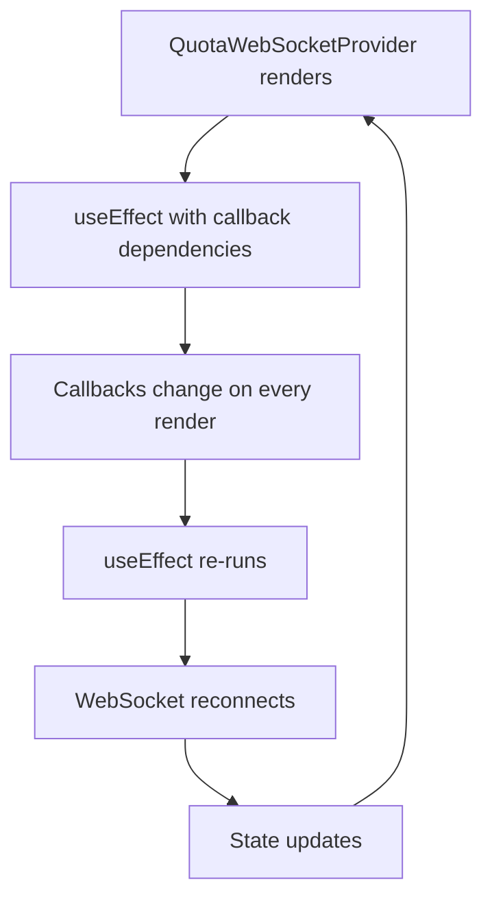

# WebSocket Connection Issue - Infinite Reloading Debug

## Overview
The application is experiencing infinite page reloading due to issues in the QuotaWebSocketProvider. Based on the codebase analysis and user memories about WebSocket dependency management, several problematic patterns have been identified that can cause infinite re-render cycles.

## Technology Stack
- Frontend: React with Next.js
- WebSocket: Custom ReconnectingWebSocketClient
- State Management: Zustand stores
- Authentication: JWT tokens

## Root Cause Analysis

### Identified Issues

#### 1. Unstable useEffect Dependencies in QuotaWebSocketProvider


**Critical Issues Found:**

1. **Callback Reference Updates in useEffect (Lines 935-940)**
   - useEffect that updates callback refs with unstable dependencies
   - This creates infinite re-render cycles

2. **WebSocket Function Refs Update (Lines 950-954)**
   - useEffect updating WebSocket function references without proper dependencies
   - Causes re-subscription loops

3. **Health Check Effect with Unstable Dependencies (Lines 956-982)**
   - useEffect depends on `webSocket.isConnected` and `debouncedSetConnectionStatus`
   - WebSocket object recreated on every render causing infinite loops

4. **Memoization Issues in useMemo Context Value (Lines 1010-1072)**
   - Context value includes unstable WebSocket function references
   - All WebSocket methods are recreated on every render

### 2. Unstable Dependencies in useQuotaWebSocket Hook

**Issues in useQuotaWebSocket:**

1. **WebSocket useEffect Dependencies (Line 732)**
   - Commented out callbacks from dependencies but they're still being used
   - Creates stale closure issues

2. **Callback Reference Instability**
   - Callbacks passed to WebSocket subscriptions change on every render
   - Causes re-subscription and connection cycles

## Debugging Strategy

### Phase 1: Comment Out Problematic useEffect Hooks

#### Step 1: Disable Callback Ref Updates
Comment out the useEffect that updates callback references:

```javascript
// COMMENT OUT THIS USEEFFECT - LIKELY CAUSE OF INFINITE RENDERS
// useEffect(() => {
//     callbacksRef.current.onConnectionChange = handleConnectionChange;
//     callbacksRef.current.onQuotaUpdate = handleQuotaUpdate;
//     callbacksRef.current.onOverrideRequest = handleOverrideRequest;
//     callbacksRef.current.onViolationAlert = handleViolationAlert;
// }, [handleConnectionChange, handleQuotaUpdate, handleOverrideRequest, handleViolationAlert]);
```

#### Step 2: Disable WebSocket Function Ref Updates
Comment out the WebSocket function reference updates:

```javascript
// COMMENT OUT THIS USEEFFECT - UNSTABLE WEBSOCKET REFERENCES
// useEffect(() => {
//     webSocketFunctionsRef.current.getConnectionHealth = () => webSocket.getConnectionHealth();
//     webSocketFunctionsRef.current.getPerformanceMetrics = () => webSocket.getPerformanceMetrics();
// }, []); // Empty dependency array - only set once
```

#### Step 3: Disable Health Check Effect
Comment out the periodic health monitoring:

```javascript
// COMMENT OUT THIS USEEFFECT - HEALTH CHECK CAUSING INFINITE RENDERS
// useEffect(() => {
//     if (!webSocket.isConnected) return;
//
//     const healthCheckInterval = setInterval(async () => {
//         try {
//             const isHealthy = await webSocket.getConnectionHealth();
//             const metrics = webSocket.getPerformanceMetrics();
//             
//             debouncedSetConnectionStatus(() => ({
//                 isHealthy,
//                 lastHealthCheck: Date.now(),
//                 performanceMetrics: metrics,
//             }));
//         } catch (error) {
//             console.error("Connection health check failed:", error);
//             debouncedSetConnectionStatus(prev => ({
//                 ...prev,
//                 isHealthy: false,
//                 lastHealthCheck: Date.now(),
//             }));
//         }
//     }, 30000);
//
//     return () => {
//         clearInterval(healthCheckInterval);
//     };
// }, [webSocket.isConnected, debouncedSetConnectionStatus]);
```

### Phase 2: Simplify Context Value

#### Step 4: Remove Unstable WebSocket Methods from Context
Remove WebSocket function methods that change on every render:

```javascript
const contextValue: QuotaWebSocketContextValue = useMemo(() => ({
    connectionState,
    isConnected,
    isConnecting,
    isReconnecting,
    lastMessage,
    connectionError,
    retryCount,
    queuedMessages,
    sendMessage,
    // COMMENT OUT THESE UNSTABLE FUNCTION REFERENCES
    // subscribe,
    // unsubscribe,
    // requestOverride,
    // approveOverride,
    // rejectOverride,
    // forceReconnect,
    // getConnectionHealth,
    // getPerformanceMetrics,
    // clearMessageQueue,
    quotaUpdates,
    violationAlerts,
    overrideRequests,
    connectionStatus,
}), [
    connectionState,
    isConnected,
    isConnecting,
    isReconnecting,
    lastMessage,
    connectionError,
    retryCount,
    queuedMessages,
    sendMessage,
    quotaUpdates,
    violationAlerts,
    overrideRequests,
    connectionStatus,
]);
```

## Testing Process

### Verification Steps

1. **Initial Test**: Comment out Step 1 (callback ref updates)
   - Verify if page stops auto-reloading
   - If fixed, this confirms callback dependency issue

2. **Progressive Testing**: If issue persists, add Step 2
   - Comment out WebSocket function ref updates
   - Test for stability

3. **Health Check Test**: If still reloading, add Step 3
   - Comment out health check effect
   - Verify stability

4. **Context Simplification**: If needed, apply Step 4
   - Remove unstable function references from context
   - Test final stability

### Expected Outcomes

After applying fixes progressively:
- Page should stop infinite reloading
- WebSocket basic connectivity should remain functional
- Some advanced features (health monitoring, performance metrics) will be temporarily disabled
- Core quota updates should continue working

## Implementation Approach

### Immediate Actions
1. Start with commenting out the callback ref useEffect (most likely culprit)
2. Test each change incrementally
3. Identify the minimal set of changes needed to stop infinite reloading
4. Document which specific useEffect was causing the issue

### Long-term Solutions
Once root cause is identified:
1. Implement stable callback patterns using refs without useEffect dependencies
2. Use direct WebSocket access instead of storing function references
3. Implement proper memoization for WebSocket methods
4. Apply lessons from user memory about avoiding unstable function references in useEffect

## Architecture Notes

### WebSocket Provider Pattern Issues
The current implementation has several anti-patterns:
- Storing function references in refs and updating them with useEffect
- Including unstable WebSocket methods in context value
- Using WebSocket object properties as useEffect dependencies
- Creating subscription loops through callback reference changes

### Recommended Pattern
Based on user memory lessons:
- Access WebSocket functions directly when needed
- Avoid updating refs with useEffect for function references
- Use stable callback references through proper memoization
- Exclude unstable function references from useEffect dependencies