# Devices Module Comprehensive Flow Analysis

## Overview

This document provides a comprehensive analysis of all flows within the devices module, including HTTP API flows, WebSocket flows, MQTT integration flows, and device state management flows. The analysis also identifies redundant implementations and architectural patterns.

## Module Structure Overview

```
src/devices/
├── entities/                    # Database entities
│   ├── device.entity.ts         # Device database model
│   └── device-status.entity.ts  # Device status history
├── dto/                         # Data Transfer Objects
│   ├── aircon-control.dto.ts   # AC control commands
│   ├── device-control.dto.ts   # Individual device control DTOs
│   └── register-device.dto.ts  # Device registration
├── services/                    # Business logic services
│   ├── devices.service.ts       # Main device management service
│   ├── device-status.service.ts # Device status caching service
│   ├── device-state-manager.service.ts # State management
│   ├── reactive-mqtt.service.ts # MQTT reactive streams
│   ├── quota-aware-aircon.service.ts # Quota integration
│   └── discovery.service.ts     # Device discovery
├── websocket/                   # WebSocket implementation
│   ├── device.gateway.ts        # Main WebSocket gateway
│   ├── strategies/              # Device strategy pattern
│   │   ├── air-conditioner.strategy.ts # AC device strategy
│   │   └── generic-device.strategy.ts  # Generic device strategy
│   ├── schemas/                 # Validation schemas
│   │   ├── air-conditioner.schema.ts   # AC message schemas
│   │   ├── generic-device.schema.ts    # Generic device schemas
│   │   └── air-conditioner-mqtt.schema.ts # MQTT schemas
│   ├── contracts/               # Type contracts
│   └── interfaces/              # TypeScript interfaces
├── interfaces/                  # Interface definitions
├── devices.controller.ts        # HTTP API controller
└── devices.module.ts           # NestJS module configuration
```

## 1. HTTP API Flow Analysis

### 1.1 Device Registration Flow

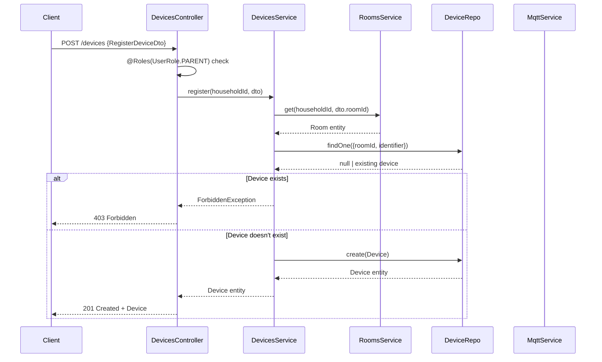

### 1.2 Device Control Flow (HTTP API)

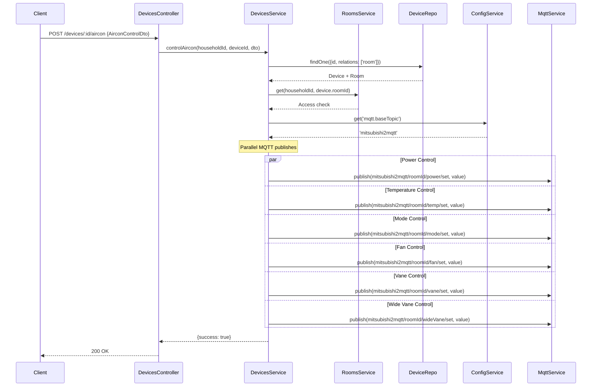

### 1.3 Device Status History Flow

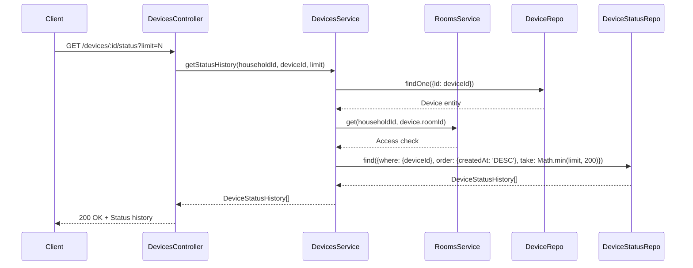

### 1.4 Individual Device Control Methods Flow

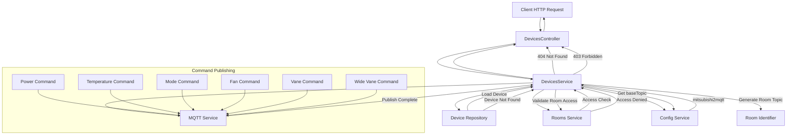

## 2. WebSocket Gateway Flow Analysis

### 2.1 WebSocket Connection Establishment Flow

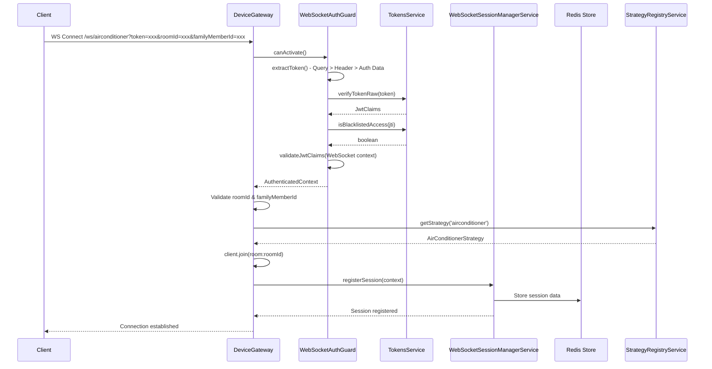

### 2.2 WebSocket Command Processing Flow

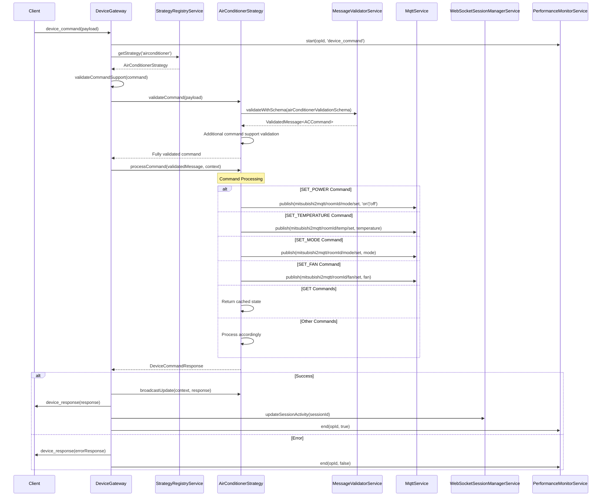

### 2.3 Real-time Event Broadcasting Flow

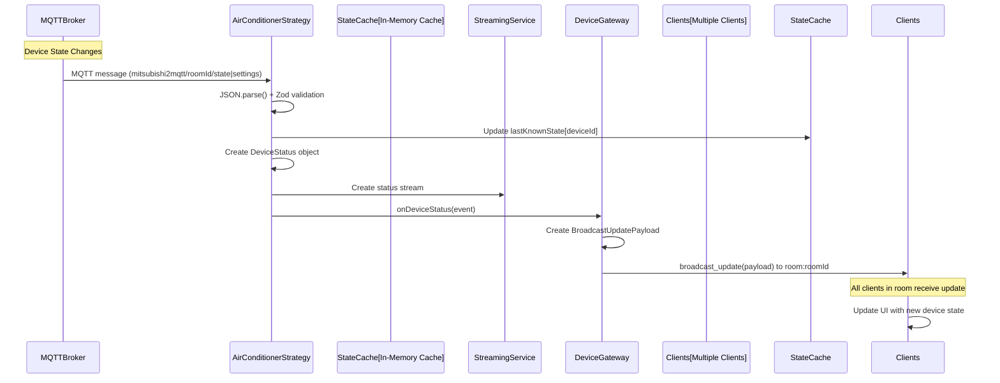

### 2.4 Strategy Registration Flow

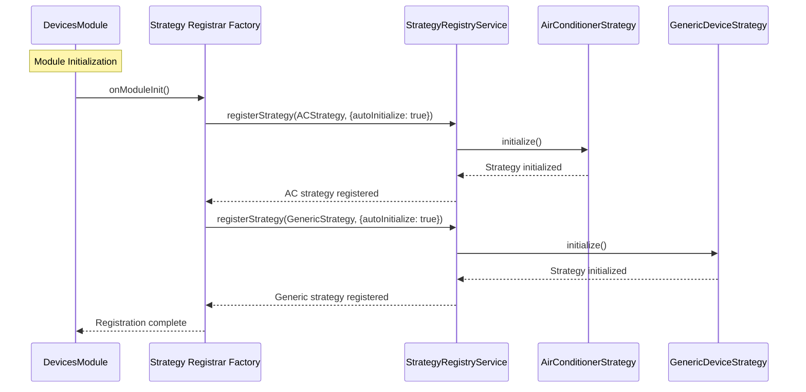

## 3. Device State Management Flow Analysis

### 3.1 Device State Manager Service Flow

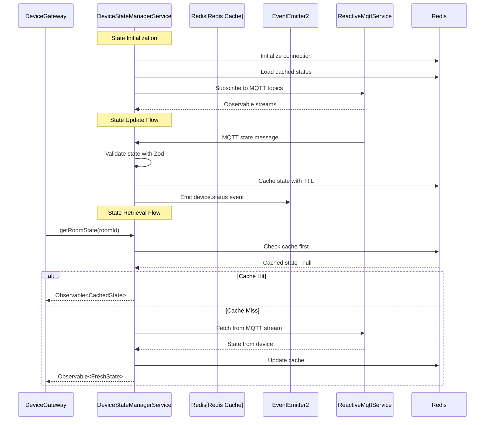

### 3.2 Device Status Service Flow

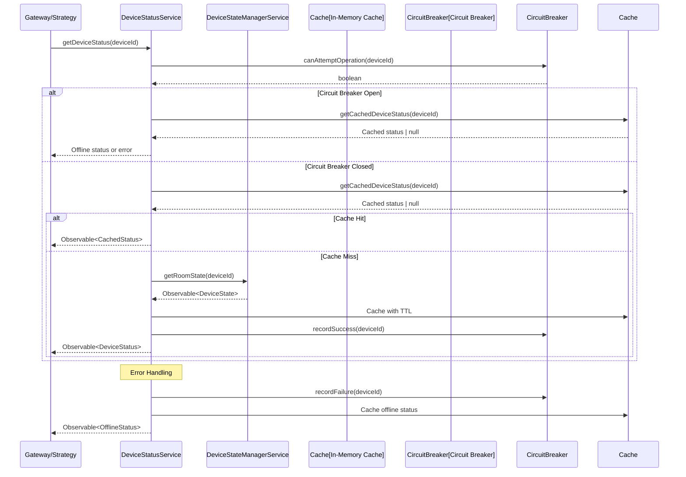

### 3.3 Reactive MQTT Service Flow

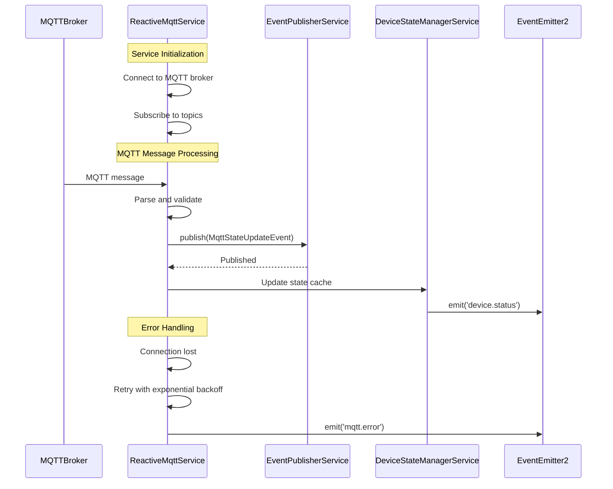

## 4. Integration Flows Between Services

### 4.1 Complete Device Control Flow (HTTP + WebSocket + MQTT)

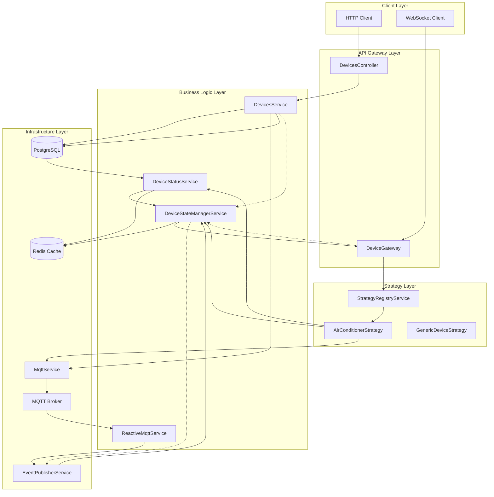

### 4.2 Event-Driven Architecture Flow

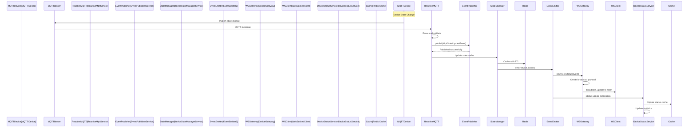

## 5. Redundant Implementation Analysis

### 5.1 Major Redundancies Identified

#### **🔴 HIGH PRIORITY REDUNDANCIES**

**1. Dual Device Control Implementations**
```typescript
// ❌ REDUNDANT: HTTP API Control Methods (DevicesService)
async controlAircon(deviceId: string, cmd: AirconControlDto)
async setDevicePower(deviceId: string, dto: SetDevicePowerDto)
async setDeviceTemperature(deviceId: string, dto: SetDeviceTemperatureDto)
async setDeviceMode(deviceId: string, dto: SetDeviceModeDto)
async setDeviceFanSpeed(deviceId: string, dto: SetDeviceFanSpeedDto)
async setDeviceVane(deviceId: string, dto: SetDeviceVaneDto)
async setDeviceWideVane(deviceId: string, dto: SetDeviceWideVaneDto)

// ❌ REDUNDANT: WebSocket Strategy Control (AirConditionerStrategy)
async handleSetPower(message, context)
async handleSetTemperature(message, context)
async handleSetMode(message, context)
async handleSetFan(message, context)
async handleSetVane(message, context)
async handleSetWideVane(message, context)
```

**Redundancy Analysis:**
- Both implement the same device control functionality
- Both use MQTT publishing with identical topic patterns
- Duplicate validation logic for commands
- Separate error handling for same operations
- Hardcoded MQTT topics in both implementations

**2. Multiple MQTT Topic Generation**
```typescript
// ❌ REDUNDANT: HTTP Service Topic Generation
const base = this.config.get<string>('mqtt.baseTopic', 'mitsubishi2mqtt');
const roomTopic = `${base}/${room.roomIdentifier}`;
await this.mqtt.publish(`${roomTopic}/power/set`, Buffer.from(power));

// ❌ REDUNDANT: Strategy Topic Generation
const topic = `mitsubishi2mqtt/${context.roomId}/mode/set`;
await this.mqttService.publish(topic, payload);
```

**3. Multiple Validation Schemas**
```typescript
// ❌ REDUNDANT: DTO Validation (HTTP)
export class SetDevicePowerDto {
  @IsIn(['on', 'off'])
  power!: 'on' | 'off';
}

// ❌ REDUNDANT: WebSocket Schema Validation
export const setPowerDataSchema = z.object({
  power: z.boolean(),
});

// ❌ REDUNDANT: MQTT Schema Validation
export const powerSchema = z.object({
  power: z.boolean(),
});
```

#### **🟡 MEDIUM PRIORITY REDUNDANCIES**

**4. Device State Caching**
```typescript
// ❌ REDUNDANT: Device Status Service Cache
private readonly statusCache = new Map<string, CachedDeviceStatus>();

// ❌ REDUNDANT: State Manager Cache
private readonly deviceStates = new Map<string, CachedDeviceState>();

// ❌ REDUNDANT: Strategy State Cache
private readonly lastKnownState = new Map<string, AirConState>();
```

**5. Error Handling Patterns**
```typescript
// ❌ REDUNDANT: Service Error Handling
catch (error) {
  this.logger.error(`Failed to control device: ${error.message}`);
  throw error;
}

// ❌ REDUNDANT: Strategy Error Handling
catch (error) {
  this.logger.error(`Command processing failed: ${error.message}`);
  throw error;
}
```

#### **🟠 LOW PRIORITY REDUNDANCIES**

**6. Multiple Metrics Tracking**
- PerformanceMonitorService metrics
- Strategy-specific metrics
- DeviceStatusService cache statistics

**7. Duplicate Configuration Loading**
- ConfigService usage in multiple services
- Hardcoded defaults scattered across files

### 5.2 Redundancy Impact Assessment

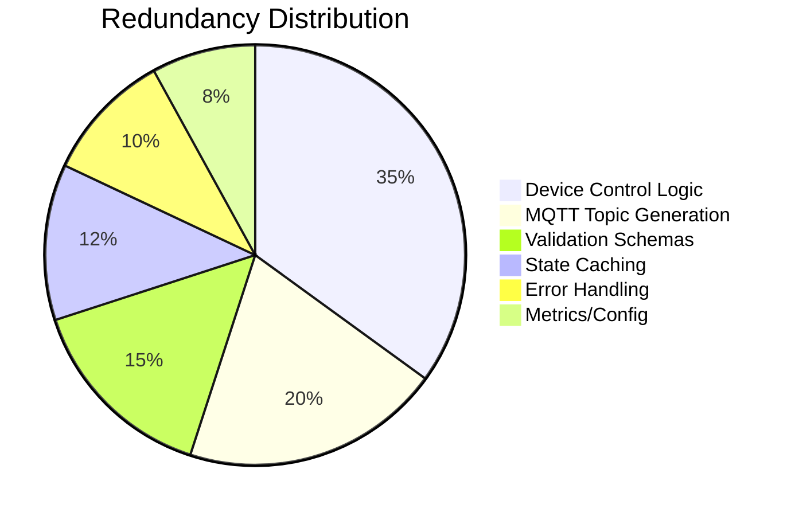

### 5.3 Consolidation Recommendations

#### **Immediate Actions (High Impact)**

**1. Unify Device Control Logic**
- Create a single `DeviceControlService` that handles all device operations
- Both HTTP and WebSocket layers use this service
- Eliminate duplicate MQTT topic generation
- Single validation pipeline for all commands

**2. Centralize MQTT Topic Management**
- Implement the planned `MqttTopicsService` from the MQTT topics configuration spec
- Remove all hardcoded topic strings
- Single source of truth for topic patterns

**3. Consolidate Validation Schemas**
- Use single Zod schemas across all layers
- Map HTTP DTOs to WebSocket schemas
- Remove duplicate validation logic

#### **Medium-term Improvements**

**4. Unify State Caching**
- Use Redis as single state cache source
- Remove in-memory caching redundancies
- Implement cache layers with proper hierarchy

**5. Standardize Error Handling**
- Create centralized error handling patterns
- Single error logging and reporting
- Consistent error response formats

### 5.4 Proposed Refactored Architecture

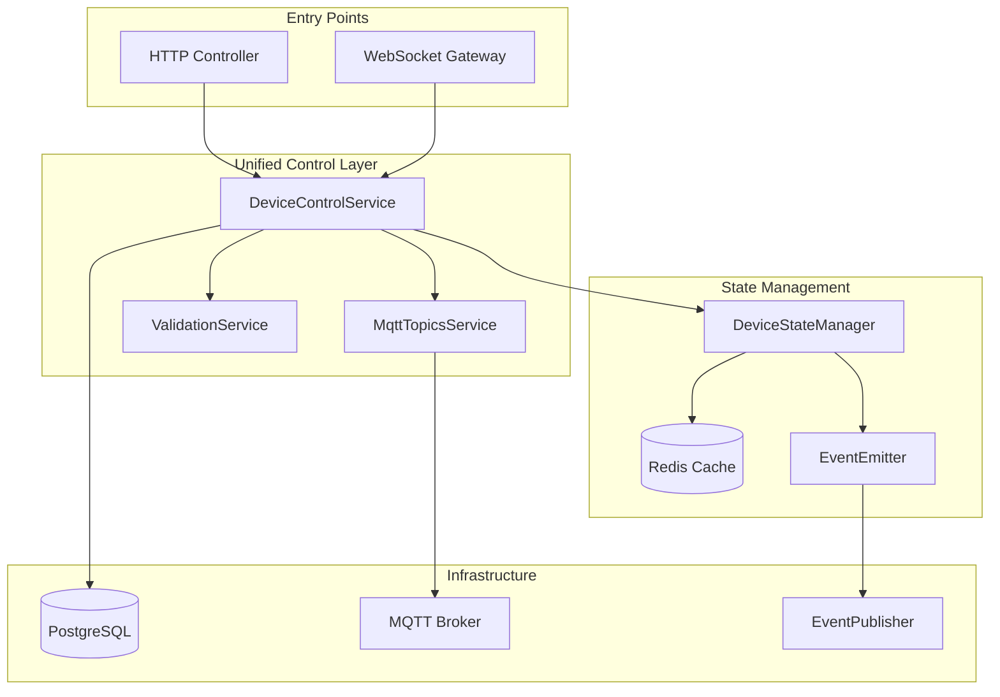

## 6. Performance and Scalability Analysis

### 6.1 Current Performance Characteristics

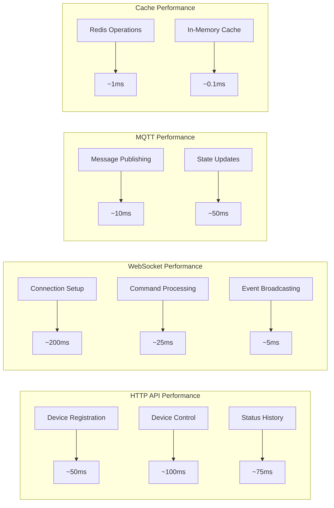

### 6.2 Scalability Concerns

**Current Limitations:**
1. **In-memory caching** - Not scalable across multiple instances
2. **Circuit breaker state** - Per-instance state management
3. **Strategy registry** - Static registration at startup
4. **Connection management** - Session state tied to specific instances

**Recommended Improvements:**
1. **Redis-backed state** for all caches and circuit breaker state
2. **Dynamic strategy registration** for hot-plugging device types
3. **Distributed session management** for WebSocket connections
4. **Horizontal scaling** support for multi-instance deployments

## 7. Security Analysis

### 7.1 Security Flows

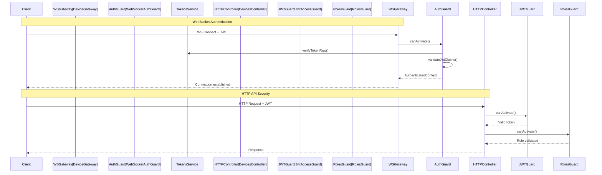

### 7.2 Security Vulnerabilities Identified

**Current Security Strengths:**
- ✅ JWT authentication with blacklist checking
- ✅ Role-based access control
- ✅ Household-level data isolation
- ✅ Input validation with Zod schemas
- ✅ Proper error handling without sensitive data exposure

**Potential Security Issues:**
- ⚠️ No rate limiting on device commands
- ⚠️ WebSocket connection timeout policies
- ⚠️ MQTT broker authentication configuration
- ⚠️ Cache poisoning prevention
- ⚠️ Audit logging for device control actions

## 8. Recommendations and Action Items

### 8.1 Immediate Actions (Week 1-2)

1. **Implement MQTT Topics Configuration**
   - Complete the spec-driven development workflow
   - Remove all hardcoded MQTT topics
   - Centralize topic management

2. **Consolidate Device Control Logic**
   - Create unified DeviceControlService
   - Remove duplicate control methods
   - Standardize error handling

3. **Unify Validation Schemas**
   - Use single Zod schemas across all layers
   - Map HTTP DTOs to WebSocket schemas
   - Remove validation duplication

### 8.2 Medium-term Improvements (Month 1)

1. **Redis Migration for State Management**
   - Migrate all in-memory caches to Redis
   - Implement distributed circuit breaker state
   - Add proper cache invalidation strategies

2. **Enhanced Monitoring and Metrics**
   - Consolidate metrics tracking
   - Add performance monitoring
   - Implement health checks

3. **Security Enhancements**
   - Add rate limiting
   - Implement audit logging
   - Enhance WebSocket security policies

### 8.3 Long-term Architecture (Quarter 1)

1. **Microservices Architecture Preparation**
   - Extract device control into separate service
   - Implement service discovery
   - Add distributed tracing

2. **Advanced Features**
   - Device type registry
   - Plugin architecture for new device types
   - Advanced scheduling and automation

## Conclusion

The devices module has a comprehensive but redundant architecture with multiple implementations for the same functionality. The WebSocket and HTTP layers provide good separation of concerns, but there's significant code duplication in device control logic, MQTT topic management, and validation schemas.

Key priorities should be:
1. **Eliminate redundancy** in device control and MQTT topic management
2. **Unify validation** across all entry points
3. **Centralize state management** with Redis
4. **Improve monitoring** and security posture

The module shows good architectural patterns with strategy pattern implementation, reactive programming with RxJS, and proper separation of concerns. With the recommended refactoring, it can become a highly maintainable and scalable system.