# Mitsubishi Remote Control System - Comprehensive Entity Relationship Diagram

## Overview
This document contains the complete ERD for the Mitsubishi Remote Control system, covering all 13 entities with their relationships, constraints, and database schema.

## Entity Relationship Diagram

```mermaid
erDiagram
    %% Abstract Base Entity
    BaseEntity {
        uuid id PK
        timestamp createdAt
        timestamp updatedAt
    }

    %% User Management Domain
    User {
        uuid id PK, FK
        uuid householdId FK
        string email UK
        string passwordHash
        string name
        enum role
        enum status
        date dateOfBirth
        string avatarUrl
        string phone
        jsonb preferences
        jsonb emergency_contacts
        string employee_id
        string department
        string cost_center
        timestamp lastLoginAt
        uuid createdBy FK
    }

    Household {
        uuid id PK, FK
        string name
        enum subscriptionPlan
        string billingEmail
        jsonb address
        string timezone
        uuid organizationId
        jsonb settings
        uuid created_by FK
    }

    FamilyInvitation {
        uuid id PK, FK
        uuid householdId FK
        uuid invitedByUserId FK
        string email
        string name
        enum role
        string token UK
        enum status
        text message
        timestamp sentAt
        timestamp expiresAt
        timestamp acceptedAt
        timestamp declinedAt
        uuid acceptedUserId FK
        int resendCount
    }

    %% Access Control Domain
    AccessAssignment {
        uuid id PK, FK
        uuid userId FK
        enum targetType
        uuid targetId FK
        enum accessLevel
        jsonb allowedActions
        jsonb restrictedActions
        timestamp validFrom
        timestamp validUntil
        jsonb accessSchedule
        jsonb constraints
        string assignmentReason
        uuid createdBy FK
        uuid modifiedBy FK
        timestamp deletedAt
        uuid deletedBy
        boolean isArchived
    }

    %% Physical Infrastructure Domain
    Room {
        uuid id PK, FK
        uuid householdId FK
        string name
        string roomIdentifier
        string location
        text description
    }

    Device {
        uuid id PK, FK
        uuid roomId FK
        enum deviceType
        string deviceIdentifier
        string manufacturer
        string model
        boolean enabled
        jsonb metadata
        string name
    }

    DeviceStatusHistory {
        uuid id PK, FK
        uuid deviceId FK
        uuid usageSessionId FK
        boolean powerState
        decimal currentTemperature
        decimal targetTemperature
        string operationMode
        string fanSpeedSetting
        string statusCode
        string errorCode
        decimal energyConsumption
    }

    %% Quota Management Domain
    Quota {
        uuid id PK, FK
        uuid userId FK
        uuid targetId FK
        string name
        text description
        enum quotaType
        enum scope
        decimal allowedAmount
        decimal usedAmount
        enum period
        timestamp periodStart
        interval periodDuration
        time resetTime
        enum enforcementAction
        enum status
        int priority
        boolean allowRollover
        decimal maxRolloverAmount
        jsonb warningThresholds
        jsonb notificationMethods
        int gracePeriodMinutes
        int maxGraceUses
        int graceCooldownHours
        boolean allowSharing
        boolean allowBorrowing
        uuid sharingPoolId
        timestamp lastResetAt
        uuid createdBy FK
    }

    UsageSession {
        uuid id PK, FK
        uuid userId FK
        uuid roomId FK
        uuid deviceId FK
        uuid quotaId FK
        timestamp startedAt
        timestamp endedAt
        int durationMinutes
        enum status
        jsonb initialSettings
        jsonb finalSettings
        decimal temperatureSet
        string mode
        string fanSpeed
        decimal energyConsumed
        decimal estimatedCost
        decimal efficiencyRating
        decimal outdoorTemperature
        string weatherConditions
        jsonb quotaViolations
        string overrideReason
        uuid overrideBy FK
        jsonb metadata
    }

    QuotaViolation {
        uuid id PK, FK
        uuid userId FK
        uuid quotaId FK
        string roomId
        uuid usageSessionId FK
        enum violationType
        decimal violationAmount
        decimal quotaLimit
        enum enforcementAction
        boolean overrideGranted
        uuid overrideBy FK
        text overrideReason
        text message
        jsonb metadata
        int overrideDurationMinutes
        boolean resolved
        timestamp resolvedAt
        uuid resolvedBy FK
        text resolutionNotes
    }

    QuotaOverride {
        uuid id PK, FK
        uuid quotaId FK
        uuid requestedByUserId FK
        uuid approvedByUserId FK
        enum type
        json parameters
        text reason
        enum status
        timestamp requestedAt
        timestamp approvedAt
        timestamp expiresAt
        timestamp activatedAt
        boolean isActive
    }

    %% Inheritance Relationships
    User ||--|| BaseEntity : inherits
    Household ||--|| BaseEntity : inherits
    FamilyInvitation ||--|| BaseEntity : inherits
    AccessAssignment ||--|| BaseEntity : inherits
    Room ||--|| BaseEntity : inherits
    Device ||--|| BaseEntity : inherits
    DeviceStatusHistory ||--|| BaseEntity : inherits
    Quota ||--|| BaseEntity : inherits
    UsageSession ||--|| BaseEntity : inherits
    QuotaViolation ||--|| BaseEntity : inherits
    QuotaOverride ||--|| BaseEntity : inherits

    %% User Management Relationships
    Household ||--o{ User : "contains"
    Household ||--o{ FamilyInvitation : "sends"
    User ||--o{ FamilyInvitation : "invites"
    User ||--o{ FamilyInvitation : "accepts"
    User ||--o{ AccessAssignment : "has"
    User ||--o{ AccessAssignment : "creates"

    %% Infrastructure Relationships
    Household ||--o{ Room : "contains"
    Room ||--o{ Device : "contains"
    Device ||--o{ DeviceStatusHistory : "tracks"
    UsageSession ||--o{ DeviceStatusHistory : "generates"
    User ||--o{ AccessAssignment : "assigned to devices"
    Room ||--o{ AccessAssignment : "assigned to rooms"
    Device ||--o{ AccessAssignment : "assigned to"

    %% Quota Management Relationships
    User ||--o{ Quota : "owns"
    Room ||--o{ Quota : "targets"
    User ||--o{ Quota : "creates"
    Quota ||--o{ UsageSession : "governs"
    User ||--o{ UsageSession : "creates"
    Room ||--o{ UsageSession : "occurs in"
    Device ||--o{ UsageSession : "uses"
    User ||--o{ UsageSession : "overrides"
    Quota ||--o{ QuotaViolation : "enforced by"
    User ||--o{ QuotaViolation : "violates"
    UsageSession ||--o{ QuotaViolation : "generates"
    User ||--o{ QuotaViolation : "overrides"
    User ||--o{ QuotaViolation : "resolves"
    Quota ||--o{ QuotaOverride : "modified by"
    User ||--o{ QuotaOverride : "requests"
    User ||--o{ QuotaOverride : "approves"

    %% Self-referential Relationships
    User ||--o{ User : "creates"
    User ||--o{ User : "modifies"
```



## Entity Details and Constraints

### 🏗️ Base Entity (Abstract)
- **Purpose**: Common fields for all entities
- **Table**: Not mapped (abstract class)
- **Fields**: id (UUID PK), createdAt, updatedAt
- **Inheritance**: All entities extend this base

### 👥 User Management Domain

#### User
- **Table**: `users`
- **Primary Key**: id (UUID)
- **Foreign Keys**:
  - householdId → households.id (CASCADE DELETE)
  - createdBy → users.id (SET NULL)
- **Unique Constraints**:
  - UQ_users_email (email)
- **Indexes**: householdId, email, role, status, createdAt, lastLoginAt
- **Enums**: UserRole, UserStatus

#### Household
- **Table**: `households`
- **Primary Key**: id (UUID)
- **Foreign Keys**:
  - created_by → users.id (SET NULL)
- **Indexes**: organizationId, subscriptionPlan, createdAt
- **Enums**: SubscriptionPlan

#### FamilyInvitation
- **Table**: `family_invitations`
- **Primary Key**: id (UUID)
- **Foreign Keys**:
  - householdId → households.id (CASCADE DELETE)
  - invitedByUserId → users.id (CASCADE DELETE)
  - acceptedUserId → users.id (SET NULL)
- **Unique Constraints**:
  - UQ_family_invitations_token (token)
- **Indexes**: householdId, email, token, status, invitedByUserId, expiresAt
- **Enums**: UserRole, InvitationStatus

#### AccessAssignment
- **Table**: `access_assignments`
- **Primary Key**: id (UUID)
- **Foreign Keys**:
  - userId → users.id (SET NULL)
  - targetId → rooms.id or devices.id (SET NULL)
  - createdBy → users.id (SET NULL)
  - modifiedBy → users.id (SET NULL)
  - deletedBy → users.id (SET NULL)
- **Unique Constraints**:
  - UQ_access_assignments_user_target (userId, targetType, targetId)
- **Indexes**: userId, targetType, targetId, accessLevel, validity
- **Enums**: UnifiedAccessLevel, UnifiedPermissionAction

### 🏠 Physical Infrastructure Domain

#### Room
- **Table**: `rooms`
- **Primary Key**: id (UUID)
- **Foreign Keys**:
  - householdId → households.id (CASCADE DELETE)
- **Unique Constraints**:
  - UQ_rooms_household_name (householdId, name)
  - UQ_rooms_household_identifier (householdId, roomIdentifier)
- **Indexes**: householdId, roomIdentifier
- **Business Keys**: roomIdentifier (unique within household)

#### Device
- **Table**: `devices`
- **Primary Key**: id (UUID)
- **Foreign Keys**:
  - roomId → rooms.id (CASCADE DELETE)
- **Unique Constraints**:
  - UQ_devices_room_type_identifier (roomId, deviceType, deviceIdentifier)
- **Indexes**: roomId, deviceType, deviceIdentifier, enabled
- **Enums**: DeviceType

#### DeviceStatusHistory
- **Table**: `device_status_history`
- **Primary Key**: id (UUID)
- **Foreign Keys**:
  - deviceId → devices.id (CASCADE DELETE)
  - usageSessionId → usage_sessions.id (SET NULL)
- **Indexes**: deviceId, createdAt, usageSessionId, powerState, operationMode, statusCode, currentTemperature, composite indexes for performance
- **Structured Fields**: powerState, currentTemperature, targetTemperature, operationMode, fanSpeedSetting, statusCode, errorCode, energyConsumption


### ⚖️ Quota Management Domain

#### Quota
- **Table**: `quotas`
- **Primary Key**: id (UUID)
- **Foreign Keys**:
  - userId → users.id (CASCADE DELETE)
  - targetId → rooms.id (CASCADE DELETE)
  - createdBy → users.id (SET NULL)
- **Indexes**: userId, targetId, status, type_scope, period, lastResetAt
- **Enums**: QuotaType, QuotaScope, QuotaPeriod, QuotaStatus, EnforcementAction

#### UsageSession
- **Table**: `usage_sessions`
- **Primary Key**: id (UUID)
- **Foreign Keys**:
  - userId → users.id (CASCADE DELETE)
  - roomId → rooms.id (CASCADE DELETE)
  - deviceId → devices.id (SET NULL)
  - quotaId → quotas.id (SET NULL)
  - overrideBy → users.id (NO ACTION)
- **Indexes**: userId, roomId, deviceId, startedAt, endedAt, status, dateRange, quotaValidation, deviceTracking
- **Enums**: SessionStatus

#### QuotaViolation
- **Table**: `quota_violations`
- **Primary Key**: id (UUID)
- **Foreign Keys**:
  - userId → users.id (CASCADE DELETE)
  - quotaId → quotas.id (CASCADE DELETE)
  - usageSessionId → usage_sessions.id (CASCADE DELETE)
  - overrideBy → users.id (NO ACTION)
  - resolvedBy → users.id (NO ACTION)
- **Indexes**: userId, quotaId, createdAt, violationType, resolved, usageSessionId, composite
- **Enums**: ViolationType, EnforcementAction

#### QuotaOverride
- **Table**: `quota_overrides`
- **Primary Key**: id (UUID)
- **Foreign Keys**:
  - quotaId → quotas.id (CASCADE DELETE)
  - requestedByUserId → users.id (CASCADE DELETE)
  - approvedByUserId → users.id (SET NULL)
- **Indexes**: quotaId, requestedByUserId, type, expiresAt
- **Enums**: OverrideType, OverrideStatus

## Enum Types

### 👤 User & Access Enums
- **UserRole**: ADMIN, PARENT, ADULT, TEEN, CHILD, GUEST
- **UserStatus**: ACTIVE, SUSPENDED, PENDING, ARCHIVED

### 🔐 Unified Access Control Enums
- **UnifiedAccessLevel**: FULL, LIMITED, VIEW_ONLY, SCHEDULED, EMERGENCY_ONLY, MAINTENANCE, NONE
- **UnifiedPermissionAction**: POWER_CONTROL, TEMPERATURE_CONTROL, MODE_CONTROL, FAN_CONTROL, SCHEDULE_CONTROL, AUTOMATION_CONTROL, VIEW_STATUS, VIEW_USAGE, VIEW_ENERGY, VIEW_LOGS, CONFIGURE_SETTINGS, DIAGNOSTICS, FIRMWARE_UPDATE, RESET_DEVICE, MANAGE_ACCESS, MANAGE_QUOTAS, OVERRIDE_QUOTAS, EMERGENCY_CONTROL, SAFETY_CONTROL

### 🏡 Household Enums
- **SubscriptionPlan**: basic, premium, enterprise
- **InvitationStatus**: PENDING, ACCEPTED, DECLINED, EXPIRED, CANCELLED

### 🔌 Device Enums
- **DeviceType**: AIRCONDITIONER, THERMOSTAT, HUMIDIFIER, FAN

### ⚖️ Quota Enums
- **QuotaType**: TIME_BASED, USAGE_COUNT, ENERGY_BASED, COST_BASED
- **QuotaScope**: GLOBAL, ROOM, DEVICE
- **QuotaPeriod**: HOURLY, DAILY, WEEKLY, MONTHLY, CUSTOM
- **QuotaStatus**: ACTIVE, PAUSED, EXCEEDED, EXPIRED
- **EnforcementAction**: WARN, RESTRICT, BLOCK

### 📊 Session Enums
- **SessionStatus**: ACTIVE, COMPLETED, INTERRUPTED, OVERRIDE

### 🔧 Override Enums
- **OverrideType**: ADD_TIME, UNLOCK_DAY, ERGENCY_OVERRIDE
- **OverrideStatus**: PENDING, APPROVED, REJECTED, EXPIRED, CANCELLED

### ⚠️ Violation Enums
- **ViolationType**: TIME_EXCEEDED, USAGE_EXCEEDED, ENERGY_EXCEEDED, COST_EXCEEDED, SCHEDULE_VIOLATION, ACCESS_VIOLATION

## Key Constraints and Relationships

### 🔐 Foreign Key Constraints
1. **User.householdId** → **Household.id** (CASCADE DELETE)
2. **Room.householdId** → **Household.id** (CASCADE DELETE)
3. **Device.roomId** → **Room.id** (CASCADE DELETE)
4. **Quota.userId** → **User.id** (CASCADE DELETE)
5. **Quota.targetId** → **Room.id** (CASCADE DELETE)
6. **UsageSession.userId** → **User.id** (CASCADE DELETE)
7. **UsageSession.roomId** → **Room.id** (CASCADE DELETE)
8. **UsageSession.quotaId** → **Quota.id** (SET NULL)

### 🔒 Unique Constraints
1. **User.email** (must be unique globally)
2. **Room.roomIdentifier** (unique within household)
3. **Room.name** (unique within household)
4. **Device.deviceIdentifier** (unique within room+type)
5. **FamilyInvitation.token** (unique globally)
6. **AccessAssignment.userId+targetType+targetId** (one assignment per user per target)

### 📊 Performance Indexes
- **Composite indexes** for common query patterns
- **Date range indexes** for time-based queries
- **Status indexes** for filtering by entity status
- **Foreign key indexes** for join performance

## Data Flow Patterns

### 🏠 Household Hierarchy
```
Household (1) → (*) Users
Household (1) → (*) Rooms
Room (1) → (*) Devices
User (1) → (*) Quotas
Room (1) → (*) Quotas
```

### 📊 Usage Tracking Flow
```
User → UsageSession → Device → DeviceStatusHistory
UsageSession → QuotaViolation (when limits exceeded)
Quota → QuotaOverride (for emergency access)
```

### 🔐 Access Control Flow
```
User → UserRoomAssignment → Room Access
User → DeviceUserAssignment → Device Control
Quota → UsageSession → Quota Enforcement
```

## Database Schema Summary

- **Total Entities**: 11 (1 abstract + 10 concrete)
- **Total Tables**: 10 (excluding abstract base)
- **Total Enum Types**: 15+
- **Total Indexes**: 40+ (including unique constraints)
- **Primary Keys**: All UUID-based
- **Foreign Keys**: 20+ relationships
- **Structured Fields**: 8+ structured device status fields
- **JSONB Fields**: 8+ for flexible metadata storage

This ERD represents the complete data model for the Mitsubishi Remote Control system, ensuring comprehensive coverage of all entities, relationships, and constraints required for the application's functionality.