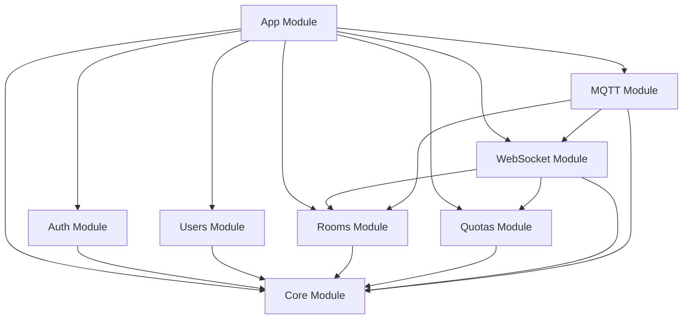

# NestJS Architecture & Design

## Overview

This document outlines the NestJS architecture design for migrating the Spring Boot backend while maintaining functional equivalence and implementing clean code principles. The design emphasizes modularity, maintainability, and scalability.

## Architecture Principles

### Clean Code Implementation

**DRY (Don't Repeat Yourself)**
- **Reusable Response Formatters**: Standard API response structure across all controllers
- **Common Error Handling**: Unified exception handling patterns
- **Shared Validation Logic**: Consistent DTO validation patterns
- **Generic Repository Pattern**: Base repository with common CRUD operations
- **Cache Management Utilities**: Redis interaction abstractions

**SOLID Principles Application**

1. **Single Responsibility Principle (SRP)**
   - Each module handles one domain (auth, rooms, quotas)
   - Services have single business purposes
   - Clear separation between data access and business logic

2. **Open/Closed Principle (OCP)**
   - Strategy pattern for quota validation types
   - Plugin architecture for future command types
   - Extensible authentication strategies

3. **Liskov Substitution Principle (LSP)**
   - Common interfaces for different handlers
   - Interchangeable repository implementations
   - Consistent contract fulfillment

4. **Interface Segregation Principle (ISP)**
   - Focused interfaces for specific concerns
   - Separation of read/write operations
   - Role-based permission interfaces

5. **Dependency Inversion Principle (DIP)**
   - Depend on abstractions (interfaces) not concretions
   - Constructor injection throughout
   - Configuration through dependency injection

**YAGNI (You Ain't Gonna Need It)**
- Implement only current requirements
- Avoid speculative features
- Iterative enhancement approach
- Simple solutions first

## Design Pattern Implementation

### 1. Strategy Pattern (High Priority)

**Problem**: Different quota validation types (TIME_BASED, USAGE_COUNT, ENERGY_BASED, COST_BASED) with different calculation logic.

**Solution**: Strategy pattern with pluggable validation algorithms.

```typescript
// Base Strategy Interface
interface IQuotaValidationStrategy {
  validateUsage(
    quota: Quota,
    currentUsage: number,
    command: AirConCommand
  ): QuotaValidationResult;
  calculateRemaining(quota: Quota, usedAmount: number): number;
  getWarningThreshold(quota: Quota): number;
}

// Concrete Implementations
@Injectable()
export class TimeBasedQuotaStrategy implements IQuotaValidationStrategy {
  validateUsage(quota: Quota, currentUsage: number, command: AirConCommand): QuotaValidationResult {
    // Time-based validation logic
    const totalSeconds = quota.allowedAmount * 3600; // Convert hours to seconds
    const remainingSeconds = totalSeconds - currentUsage;
    const warningThreshold = totalSeconds * 0.75; // 75% warning

    return {
      isValid: remainingSeconds > 0,
      isAtWarningThreshold: remainingSeconds <= warningThreshold && remainingSeconds > 0,
      remainingAmount: remainingSeconds,
      exceededAmount: Math.abs(Math.min(0, remainingSeconds))
    };
  }
}

@Injectable()
export class UsageCountQuotaStrategy implements IQuotaValidationStrategy {
  validateUsage(quota: Quota, currentUsage: number, command: AirConCommand): QuotaValidationResult {
    // Usage count validation logic
    const remainingCount = quota.allowedAmount - currentUsage;
    const warningThreshold = quota.allowedAmount * 0.75;

    return {
      isValid: remainingCount > 0,
      isAtWarningThreshold: remainingCount <= warningThreshold && remainingCount > 0,
      remainingAmount: remainingCount,
      exceededAmount: Math.abs(Math.min(0, remainingCount))
    };
  }
}

// Strategy Factory
@Injectable()
export class QuotaValidationStrategyFactory {
  constructor(
    private readonly timeBasedStrategy: TimeBasedQuotaStrategy,
    private readonly usageCountStrategy: UsageCountQuotaStrategy,
    private readonly energyBasedStrategy: EnergyBasedQuotaStrategy,
    private readonly costBasedStrategy: CostBasedQuotaStrategy,
  ) {}

  getStrategy(quotaType: QuotaType): IQuotaValidationStrategy {
    const strategies = {
      [QuotaType.TIME_BASED]: this.timeBasedStrategy,
      [QuotaType.USAGE_COUNT]: this.usageCountStrategy,
      [QuotaType.ENERGY_BASED]: this.energyBasedStrategy,
      [QuotaType.COST_BASED]: this.costBasedStrategy,
    };

    return strategies[quotaType] || this.timeBasedStrategy;
  }
}
```

**Benefits**: Easy to add new quota types, follows OCP, testable in isolation.

### 2. Observer Pattern (High Priority)

**Problem**: MQTT messages need to trigger WebSocket updates without tight coupling.

**Solution**: Event-driven architecture with NestJS EventEmitters.

```typescript
// Event Definitions
export class MqttStateUpdateEvent {
  constructor(
    public readonly roomId: string,
    public readonly state: AirConState,
    public readonly timestamp: Date,
  ) {}
}

export class MqttSettingsUpdateEvent {
  constructor(
    public readonly roomId: string,
    public readonly settings: AirConSettings,
    public readonly timestamp: Date,
  ) {}
}

// Event Publisher (MQTT Service)
@Injectable()
export class MqttService {
  constructor(private readonly eventEmitter: EventEmitter2) {}

  onStateUpdate(roomId: string, state: AirConState) {
    this.eventEmitter.emit(
      'mqtt.state.update',
      new MqttStateUpdateEvent(roomId, state, new Date()),
    );
  }

  onSettingsUpdate(roomId: string, settings: AirConSettings) {
    this.eventEmitter.emit(
      'mqtt.settings.update',
      new MqttSettingsUpdateEvent(roomId, settings, new Date()),
    );
  }
}

// Event Listener (WebSocket Gateway)
@WebSocketGateway({
  path: '/airconditioner',
  cors: true,
})
export class AirConditionerGateway {
  @OnEvent('mqtt.state.update')
  handleStateUpdate(event: MqttStateUpdateEvent) {
    this.broadcastStateUpdate(event.roomId, event.state);
  }

  @OnEvent('mqtt.settings.update')
  handleSettingsUpdate(event: MqttSettingsUpdateEvent) {
    this.broadcastSettingsUpdate(event.roomId, event.settings);
  }
}
```

**Benefits**: Loose coupling, easy to extend, testable components.

### 3. Factory Pattern (Medium Priority)

**Problem**: Creating different command types for AC control with consistent structure.

**Solution**: Command factory with type-safe creation.

```typescript
// Base Command Interface
export interface IAirConCommand {
  readonly roomId: string;
  readonly userId: string;
  readonly action: string;
  readonly value: any;
  readonly timestamp: Date;
  execute(): Promise<void>;
}

// Concrete Commands
export class SetPowerCommand implements IAirConCommand {
  constructor(
    public readonly roomId: string,
    public readonly userId: string,
    public readonly action: string = 'power',
    public readonly value: 'ON' | 'OFF',
    public readonly timestamp: Date = new Date(),
  ) {}

  async execute(): Promise<void> {
    // Implementation for power command
  }
}

export class SetTemperatureCommand implements IAirConCommand {
  constructor(
    public readonly roomId: string,
    public readonly userId: string,
    public readonly action: string = 'temp',
    public readonly value: number,
    public readonly timestamp: Date = new Date(),
  ) {}

  async execute(): Promise<void> {
    // Implementation for temperature command
  }
}

// Command Factory
@Injectable()
export class AirConCommandFactory {
  createCommand(
    action: string,
    value: any,
    roomId: string,
    userId: string,
  ): IAirConCommand {
    const commandMap = {
      power: (val) => new SetPowerCommand(roomId, userId, 'power', val),
      temp: (val) => new SetTemperatureCommand(roomId, userId, 'temp', val),
      mode: (val) => new SetModeCommand(roomId, userId, 'mode', val),
      fan: (val) => new SetFanCommand(roomId, userId, 'fan', val),
      vane: (val) => new SetVaneCommand(roomId, userId, 'vane', val),
      widevane: (val) => new SetWideVaneCommand(roomId, userId, 'widevane', val),
    };

    const commandCreator = commandMap[action];
    if (!commandCreator) {
      throw new BadRequestException(`Unknown action: ${action}`);
    }

    return commandCreator(value);
  }
}
```

**Benefits**: Centralized command creation, type safety, easy validation.

### 4. Repository Pattern (High Priority)

**Problem**: Data access abstraction needed for testing and flexibility.

**Solution**: Repository interfaces with TypeORM implementations.

```typescript
// Base Repository Interface
export interface IBaseRepository<T> {
  create(entity: DeepPartial<T>): Promise<T>;
  findById(id: string): Promise<T | null>;
  findMany(filter?: any): Promise<T[]>;
  update(id: string, updates: DeepPartial<T>): Promise<T>;
  delete(id: string): Promise<void>;
  exists(id: string): Promise<boolean>;
}

// Specific Repository Interface
export interface IUserRepository extends IBaseRepository<User> {
  findByEmail(email: string): Promise<User | null>;
  findByHouseholdId(householdId: string): Promise<User[]>;
  updateLastLogin(userId: string): Promise<void>;
}

// TypeORM Implementation
@Injectable()
export class UserRepository implements IUserRepository {
  constructor(
    @InjectRepository(User)
    private readonly repository: Repository<User>,
  ) {}

  async create(userData: DeepPartial<User>): Promise<User> {
    const user = this.repository.create(userData);
    return await this.repository.save(user);
  }

  async findById(id: string): Promise<User | null> {
    return await this.repository.findOne({ where: { id } });
  }

  async findByEmail(email: string): Promise<User | null> {
    return await this.repository.findOne({ where: { email } });
  }

  async findByHouseholdId(householdId: string): Promise<User[]> {
    return await this.repository.find({ where: { householdId } });
  }

  async updateLastLogin(userId: string): Promise<void> {
    await this.repository.update(userId, { lastLoginAt: new Date() });
  }

  // ... other methods
}
```

**Benefits**: Testable, interchangeable data sources, consistent interface.

## Module Architecture

### Core Module Structure

```
backend-2/src/
├── main.ts                          # Application entry point
├── app.module.ts                    # Root module
├── core/                            # Core functionality
│   ├── config/                      # Configuration management
│   │   ├── config.module.ts
│   │   ├── database.config.ts
│   │   ├── jwt.config.ts
│   │   ├── mqtt.config.ts
│   │   └── redis.config.ts
│   ├── database/                    # Database setup
│   │   ├── database.module.ts
│   │   ├── entities/                # TypeORM entities
│   │   └── migrations/              # Database migrations
│   ├── exceptions/                  # Global exception handling
│   │   ├── http-exception.filter.ts
│   │   ├── ws-exception.filter.ts
│   │   └── validation.exception.ts
│   ├── interceptors/                # Global interceptors
│   │   ├── logging.interceptor.ts
│   │   ├── transform.interceptor.ts
│   │   └── cache.interceptor.ts
│   ├── pipes/                       # Global pipes
│   │   ├── validation.pipe.ts
│   │   └── parse-uuid.pipe.ts
│   └── utils/                       # Shared utilities
│       ├── response.util.ts
│       ├── date.util.ts
│       └── crypto.util.ts
├── common/                          # Shared components
│   ├── dto/                         # Shared DTOs
│   ├── decorators/                  # Custom decorators
│   ├── enums/                       # Enums and constants
│   ├── interfaces/                  # Shared interfaces
│   └── validators/                  # Custom validators
├── modules/                         # Feature modules
│   ├── auth/                        # Authentication module
│   │   ├── auth.module.ts
│   │   ├── auth.controller.ts
│   │   ├── auth.service.ts
│   │   ├── dto/
│   │   ├── strategies/
│   │   └── guards/
│   ├── users/                       # User management
│   │   ├── users.module.ts
│   │   ├── users.controller.ts
│   │   ├── users.service.ts
│   │   ├── entities/
│   │   └── repositories/
│   ├── rooms/                       # Room & AC control
│   │   ├── rooms.module.ts
│   │   ├── rooms.controller.ts
│   │   ├── rooms.service.ts
│   │   ├── dto/
│   │   └── repositories/
│   ├── quotas/                      # Quota management
│   │   ├── quotas.module.ts
│   │   ├── quotas.controller.ts
│   │   ├── quotas.service.ts
│   │   ├── strategies/              # Quota validation strategies
│   │   ├── dto/
│   │   └── repositories/
│   └── websocket/                   # WebSocket module
│       ├── websocket.module.ts
│       ├── airconditioner.gateway.ts
│       ├── quota.gateway.ts
│       └── dto/
└── mqtt/                            # MQTT integration
    ├── mqtt.module.ts
    ├── mqtt.service.ts
    ├── mqtt.client.ts
    └── dto/
```

### Module Dependencies



### Module Configuration

**Core Module** (`core/config/config.module.ts`):
```typescript
@Module({
  imports: [
    ConfigModule.forRoot({
      isGlobal: true,
      envFilePath: ['.env.local', '.env'],
      validationSchema: Joi.object({
        NODE_ENV: Joi.string().valid('development', 'production', 'test').default('development'),
        PORT: Joi.number().default(3000),
        DATABASE_URL: Joi.string().required(),
        JWT_SECRET: Joi.string().required(),
        MQTT_BROKER_URL: Joi.string().required(),
        REDIS_URL: Joi.string().required(),
      }),
    }),
    TypeOrmModule.forRootAsync({
      imports: [ConfigModule],
      useFactory: (config: ConfigService) => ({
        type: 'postgres',
        url: config.get('DATABASE_URL'),
        entities: [__dirname + '/../**/*.entity{.ts,.js}'],
        synchronize: false,
        migrationsRun: true,
        logging: config.get('NODE_ENV') === 'development',
      }),
      inject: [ConfigService],
    }),
  ],
})
export class CoreModule {}
```

## Technology Stack Translation

### Spring Boot → NestJS Mapping

| Spring Boot | NestJS | Implementation Notes |
|-------------|---------|---------------------|
| `@RestController` | `@Controller()` | REST controllers with decorators |
| `@Service` | `@Injectable()` | Service classes with DI |
| `@Repository` | Repository + TypeORM | Data access layer |
| `@Configuration` | ConfigModule | Configuration management |
| `@WebSocketHandler` | `@WebSocketGateway()` | WebSocket handlers |
| `Spring Security` | Passport JWT Strategy | Authentication |
| `Spring Data JPA` | TypeORM | ORM and entities |
| `Eclipse Paho MQTT` | MQTT.js | MQTT client |
| `Spring Events` | EventEmitters | Event system |
| `@Value` | ConfigService | Configuration injection |
| `Mockito` | Jest | Testing framework |

### Reactive Programming Translation

**Spring WebFlux (RxJava)** → **NestJS (RxJS)**:

```typescript
// Spring Boot (Reactive)
@GET
public Flux<RoomInfo> getAllRooms() {
    return roomService.getAllRooms();
}

// NestJS (Observable)
@Get()
getAllRooms(): Observable<RoomInfo[]> {
    return this.roomsService.getAllRooms().asObservable();
}
```

**State Management Translation**:

```typescript
// Spring Boot (Concurrent Maps)
private final ConcurrentMap<String, AirConState> roomStates = new ConcurrentHashMap<>();

// NestJS (RxJS BehaviorSubject)
private readonly roomStates = new Map<string, BehaviorSubject<AirConState>>();
```

## Architecture Quality Assessment

### Cohesion Analysis
- **High Cohesion**: Each module focuses on a single domain
- **Related Functionality**: Grouped within modules
- **Clear Boundaries**: Well-defined module responsibilities

### Coupling Analysis
- **Loose Coupling**: Modules communicate through interfaces
- **Minimal Dependencies**: Cross-module dependencies minimized
- **Shared Dependencies**: Moved to core module

### Separation of Concerns
- **Layer Separation**: Controller → Service → Repository
- **Configuration Isolation**: Config module handles all configuration
- **WebSocket Logic**: Separated from business logic

### Dependency Direction
- **Inward Dependencies**: Dependencies point toward business logic
- **Outer Layer Dependence**: Controllers depend on services
- **Configuration Flow**: Core to specific modules

## Performance Considerations

### Caching Strategy
```typescript
@Injectable()
export class QuotaCacheService {
  constructor(
    @Inject(CACHE_MANAGER) private readonly cacheManager: Cache,
  ) {}

  async getBalance(userId: string, roomId: string): Promise<QuotaBalance | null> {
    const key = `quota:balance:${userId}:${roomId}`;
    return await this.cacheManager.get<QuotaBalance>(key);
  }

  async setBalance(
    userId: string,
    roomId: string,
    balance: QuotaBalance,
    ttl: number = 3600, // 1 hour
  ): Promise<void> {
    const key = `quota:balance:${userId}:${roomId}`;
    await this.cacheManager.set(key, balance, { ttl });
  }
}
```

### Connection Pooling
```typescript
// Database Configuration
TypeOrmModule.forRootAsync({
  useFactory: (config: ConfigService) => ({
    type: 'postgres',
    url: config.get('DATABASE_URL'),
    extra: {
      max: 20, // Maximum number of connections in pool
      idleTimeoutMillis: 30000,
      connectionTimeoutMillis: 2000,
    },
  }),
  inject: [ConfigService],
});
```

### WebSocket Optimization
```typescript
@WebSocketGateway({
  path: '/airconditioner',
  cors: true,
  transports: ['websocket'],
  options: {
    server: {
      pingTimeout: 60000,
      pingInterval: 25000,
    },
  },
})
export class AirConditionerGateway {
  // Optimized broadcasting with room-based filtering
  private broadcastToRoom(roomId: string, message: any) {
    this.server
      .to(`room:${roomId}`)
      .emit('message', message);
  }
}
```

This architecture design ensures a clean, maintainable, and scalable NestJS application while preserving all functionality from the Spring Boot backend and implementing clean code principles throughout.