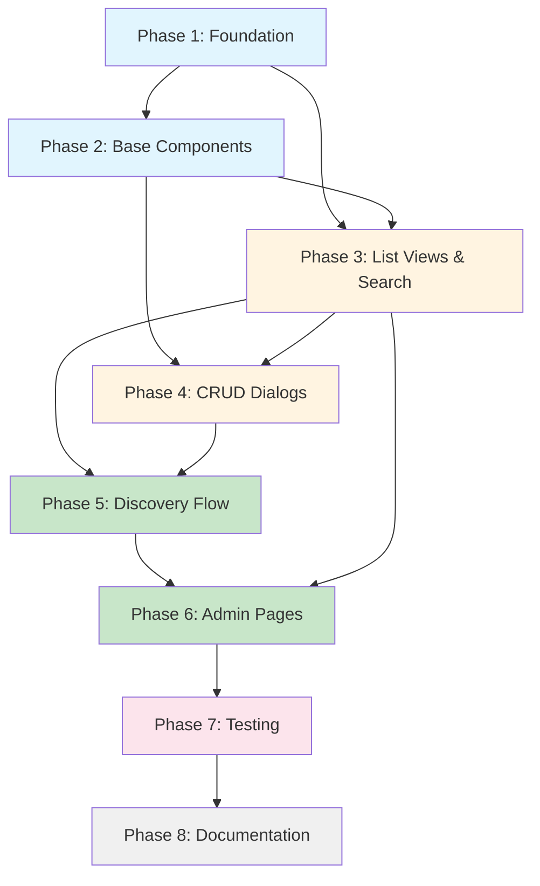

# Device Management UI - Implementation Plan

**Feature**: Frontend Device Management Interface
**Status**: Ready for Implementation
**Created**: 2025-10-05
**Author**: Development Team
**Related Documents**:
- [Requirements Specification](./spec.md)
- [Design Document](./design.md)

---

## Timeline Summary

| Phase | Duration | Description |
|-------|----------|-------------|
| **Phase 1: Foundation** | 1 day | Types, API clients, Zustand store |
| **Phase 2: Base Components** | 1.5 days | DeviceCard, DeviceStatusBadge, DeviceTypeBadge |
| **Phase 3: List Views** | 1.5 days | DeviceList, RoomDeviceList with search/filter |
| **Phase 4: CRUD Dialogs** | 2 days | RegisterDeviceDialog, EditDeviceDialog, DeleteConfirmDialog |
| **Phase 5: Discovery Flow** | 1.5 days | DiscoverDevicesDialog, device assignment |
| **Phase 6: Admin Pages** | 1.5 days | /admin/devices page, integration with /admin/rooms |
| **Phase 7: Testing** | 2 days | Unit tests, integration tests, E2E tests |
| **Phase 8: Documentation** | 1 day | Update CLAUDE.md, create user guide |
| **Total** | **12 days** | Target: 13 days (1 day buffer) |

---

## CRITICAL Implementation Requirements

### Required Tools During Implementation

1. **Context7 Tools** - MUST use during implementation to fetch latest package documentation:
   - `mcp__context7__resolve-library-id` - Resolve package names to library IDs
   - `mcp__context7__get-library-docs` - Fetch up-to-date package documentation
   - Use for: React Hook Form, Zod, Zustand, ShadcnUI, Axios, Next.js 15

2. **Feedback Tool** - MUST use after EACH phase for approval:
   - `mcp__mcp-feedback-enhanced__interactive_feedback`
   - Provide summary of completed work
   - Include clean code compliance assessment
   - Wait for explicit approval before proceeding to next phase

3. **ShadcnUI Components** - Install as needed:
   ```bash
   # Run from /frontend directory
   pnpm dlx shadcn@latest add button card badge dialog input label
   pnpm dlx shadcn@latest add select switch tooltip breadcrumb
   pnpm dlx shadcn@latest add alert-dialog dropdown-menu
   ```

### Zustand v5 Critical Patterns

**❌ NEVER DO (causes infinite loops):**
```typescript
const store = useDeviceStore(); // Entire store object - UNSTABLE
useEffect(() => {
  store.fetchDevices();
}, [store]); // ← Infinite loop!
```

**✅ ALWAYS DO (specific selectors):**
```typescript
const devices = useDeviceStore((state) => state.devices);
const fetchDevices = useDeviceStore((state) => state.fetchDevices);
useEffect(() => {
  fetchDevices();
  // eslint-disable-next-line react-hooks/exhaustive-deps
}, []); // Empty deps - method is stable
```

### Clean Code Compliance Requirements

Every phase MUST adhere to:
- **DRY**: Reuse existing patterns from Room Management UI
- **SOLID**: Single responsibility per component/file
- **YAGNI**: Implement only current requirements, no speculation
- **Functions**: < 20 lines preferred, extract if longer
- **Components**: < 200 lines, extract sub-components if needed

---

## Phase 1: Foundation (1 day)

### Objective
Establish type-safe foundation with TypeScript types, Zod schemas, API clients, and Zustand store following clean code principles.

### Tasks

- [ ] 1.1 Create Device TypeScript types and enums
  - Create `/frontend/src/types/device.ts`
  - Define `Device` interface matching backend DeviceDto
  - Define `DeviceType` enum (AIRCONDITIONER, THERMOSTAT, LIGHT, etc.)
  - Define `RegisterDeviceRequest` interface
  - Define `UpdateDeviceMetadataRequest` interface
  - Export all types with JSDoc documentation
  - **Requirements**: FR1, FR3, FR5
  - **Files**: `/frontend/src/types/device.ts`

- [ ] 1.2 Create Zod validation schemas
  - Create `/frontend/src/lib/schemas/device-schema.ts`
  - Define `deviceSchema` matching Device interface
  - Define `registerDeviceSchema` with field validation rules
  - Define `updateDeviceMetadataSchema`
  - Use Zod's `.refine()` for custom validation
  - Export schemas and inferred types
  - **Requirements**: FR3, FR5, NFR5
  - **Files**: `/frontend/src/lib/schemas/device-schema.ts`

- [ ] 1.3 Implement Device API Client (Repository Pattern)
  - **MUST USE Context7**: Fetch latest Axios documentation
  - Create `/frontend/src/lib/api/device-api-client.ts`
  - Implement `DeviceApiClient` class with constructor DI
  - Implement methods:
    - `getDevices(roomId?: string): Promise<Device[]>`
    - `getEnabledDevices(roomId: string): Promise<Device[]>`
    - `getDeviceById(deviceId: string): Promise<Device>`
    - `createDevice(request: RegisterDeviceRequest): Promise<Device>`
    - `updateDeviceMetadata(deviceId, request): Promise<Device>`
    - `toggleEnabled(deviceId: string): Promise<Device>`
    - `setEnabled(deviceId: string, enabled: boolean): Promise<Device>`
    - `deleteDevice(deviceId: string): Promise<void>`
  - Implement centralized error handling with `handleError()` method
  - Validate all responses with Zod schemas
  - Export singleton instance `deviceApiClient`
  - Mirror structure of existing `room-api-client.ts`
  - **Requirements**: FR1, FR3, FR5, FR6, FR7, NFR4
  - **Files**: `/frontend/src/lib/api/device-api-client.ts`

- [ ] 1.4 Implement Device Discovery API Client
  - Create `/frontend/src/lib/api/device-discovery-api-client.ts`
  - Implement `DeviceDiscoveryApiClient` class
  - Implement methods:
    - `getDiscoveredDevices(roomId: string): Promise<Device[]>`
    - `registerDiscoveredDevice(roomId, deviceIdentifier, deviceType, metadata?): Promise<Device>`
  - Validate responses with Zod
  - Export singleton instance `deviceDiscoveryApiClient`
  - **Requirements**: FR4
  - **Files**: `/frontend/src/lib/api/device-discovery-api-client.ts`

- [ ] 1.5 Create Device Zustand Store
  - **MUST USE Context7**: Fetch latest Zustand v5 documentation
  - Create `/frontend/src/stores/device-store.ts`
  - Define `DeviceState` interface with:
    - State: `devices`, `isLoading`, `error`, `selectedDevice`
    - Derived: `getDevicesByRoom()`, `getEnabledDevices()`
    - Actions: `fetchDevices()`, `createDevice()`, `updateDevice()`, `toggleEnabled()`, `deleteDevice()`, `setSelectedDevice()`, `clearError()`
  - Implement store using `create<DeviceState>((set, get) => ({...}))`
  - Implement optimistic update for `toggleEnabled()` with rollback on error
  - Call API client methods, handle errors, update state
  - Mirror structure of existing `room-store.ts` (if exists)
  - **Requirements**: FR1-FR7, NFR1, NFR5
  - **Files**: `/frontend/src/stores/device-store.ts`

- [ ] 1.6 Create shared utility functions
  - Create `/frontend/src/lib/utils/date-formatter.ts`
  - Implement `formatDate(date: string): string` for consistent date display
  - Implement `formatRelativeTime(date: string): string` (e.g., "2 hours ago")
  - Create `/frontend/src/lib/utils/device-utils.ts`
  - Implement `getDeviceTypeLabel(type: DeviceType): string`
  - Implement `getDeviceTypeColor(type: DeviceType): string` for badge colors
  - Export all utility functions
  - **Requirements**: DRY principle, code reuse
  - **Files**: `/frontend/src/lib/utils/date-formatter.ts`, `/frontend/src/lib/utils/device-utils.ts`

### Acceptance Criteria

- ✅ All TypeScript types compile without errors (strict mode)
- ✅ Zod schemas validate sample device data correctly
- ✅ API client methods typed correctly and handle errors
- ✅ Zustand store compiles and exports all methods
- ✅ No `any` types used (strict TypeScript)
- ✅ All files have JSDoc comments for exported functions
- ✅ Code follows existing patterns from Room Management (DRY)
- ✅ Single responsibility principle followed (each file < 200 lines)

### Clean Code Assessment

- **DRY Score**: API client mirrors `room-api-client.ts` structure
- **SOLID Score**: Single responsibility per file, dependency injection in API client
- **YAGNI Score**: Only implemented required endpoints, no extra features

### Deliverables

- `/frontend/src/types/device.ts`
- `/frontend/src/lib/schemas/device-schema.ts`
- `/frontend/src/lib/api/device-api-client.ts`
- `/frontend/src/lib/api/device-discovery-api-client.ts`
- `/frontend/src/stores/device-store.ts`
- `/frontend/src/lib/utils/date-formatter.ts`
- `/frontend/src/lib/utils/device-utils.ts`

---

## Phase 2: Base UI Components (1.5 days)

### Objective
Create reusable presentational components for device display following ShadcnUI patterns and clean architecture.

### Tasks

- [ ] 2.1 Create DeviceTypeIcon component (Strategy Pattern)
  - **MUST USE Context7**: Fetch latest Lucide React icon documentation
  - Create `/frontend/src/components/device/DeviceTypeIcon.tsx`
  - Define `DeviceTypeIconProps` interface
  - Implement strategy pattern: `Record<DeviceType, LucideIcon>`
  - Map device types to icons:
    - AIRCONDITIONER → AirVent
    - THERMOSTAT → Thermometer
    - LIGHT → Lightbulb
    - SECURITY_CAMERA → Camera
    - DOOR_LOCK → Lock
    - SMART_PLUG → Plug
  - Implement fallback icon (HelpCircle) for unknown types
  - Use `className` prop for size/color customization
  - Export as React.memo component
  - **Requirements**: FR8, design pattern (Strategy)
  - **Files**: `/frontend/src/components/device/DeviceTypeIcon.tsx`

- [ ] 2.2 Create DeviceStatusBadge component
  - Create `/frontend/src/components/device/DeviceStatusBadge.tsx`
  - Define `DeviceStatusBadgeProps` interface
  - Use ShadcnUI `Badge` component
  - Display "Enabled" (green) or "Disabled" (gray) based on `enabled` prop
  - Support `variant` prop for compact/default display
  - Use semantic colors: `text-green-600 dark:text-green-400`, `text-gray-600 dark:text-gray-400`
  - Implement accessibility: ARIA labels for screen readers
  - Export as React.memo component
  - **Requirements**: FR6, FR8, NFR3
  - **Files**: `/frontend/src/components/device/DeviceStatusBadge.tsx`

- [ ] 2.3 Create DeviceTypeBadge component
  - Create `/frontend/src/components/device/DeviceTypeBadge.tsx`
  - Define `DeviceTypeBadgeProps` interface
  - Use ShadcnUI `Badge` component with `variant="outline"`
  - Display device type label with icon
  - Use `getDeviceTypeLabel()` utility for label
  - Use `DeviceTypeIcon` for icon
  - Export as React.memo component
  - **Requirements**: FR8
  - **Files**: `/frontend/src/components/device/DeviceTypeBadge.tsx`

- [ ] 2.4 Create DeviceCard component
  - **MUST USE Context7**: Fetch latest ShadcnUI Card component documentation
  - Install ShadcnUI components: `pnpm dlx shadcn@latest add card tooltip`
  - Create `/frontend/src/components/device/DeviceCard.tsx`
  - Define `DeviceCardProps` interface with device, roomName, and callback props
  - Use ShadcnUI `Card` component as container
  - Layout structure:
    - Header: DeviceTypeIcon + Device identifier
    - Body: Room name (with link), Manufacturer + Model
    - Footer: DeviceStatusBadge, action buttons (Edit, Toggle, Delete)
  - Use `Tooltip` for icon buttons
  - Manage dialog open/close state locally (useState)
  - Emit events via callbacks: `onEdit`, `onToggle`, `onDelete`
  - NO direct store access (presentational component)
  - Responsive design: stack on mobile, inline on desktop
  - Minimum 44px touch targets for mobile
  - Export as React.memo component
  - **Requirements**: FR1, FR8, FR9, NFR2, NFR3
  - **Files**: `/frontend/src/components/device/DeviceCard.tsx`

- [ ] 2.5 Create LoadingState, ErrorState, EmptyState components
  - Create `/frontend/src/components/device/DeviceListStates.tsx`
  - Implement `LoadingState`: Skeleton cards or spinner
  - Implement `ErrorState`: Error message with retry button
  - Implement `EmptyState`: Empty state with call-to-action (Register/Discover buttons)
  - Use ShadcnUI components for consistent styling
  - Export all three components
  - **Requirements**: NFR2 (usability)
  - **Files**: `/frontend/src/components/device/DeviceListStates.tsx`

### Acceptance Criteria

- ✅ All components render without errors
- ✅ Components are presentational (no business logic)
- ✅ Props interfaces properly typed
- ✅ Components use React.memo for performance
- ✅ Accessibility: ARIA labels, keyboard navigation, focus indicators
- ✅ Responsive design: mobile-first, proper touch targets (44px min)
- ✅ Theme support: works in light and dark modes
- ✅ ShadcnUI patterns followed consistently
- ✅ Components < 200 lines each (extract sub-components if needed)

### Clean Code Assessment

- **DRY Score**: Reusable components, no duplication
- **SOLID Score**: Single responsibility (one component = one visual concern)
- **YAGNI Score**: No over-engineering, simple presentational components

### Deliverables

- `/frontend/src/components/device/DeviceTypeIcon.tsx`
- `/frontend/src/components/device/DeviceStatusBadge.tsx`
- `/frontend/src/components/device/DeviceTypeBadge.tsx`
- `/frontend/src/components/device/DeviceCard.tsx`
- `/frontend/src/components/device/DeviceListStates.tsx`

---

## Phase 3: List Views & Search/Filter (1.5 days)

### Objective
Implement device list rendering with search and filter functionality following clean separation of concerns.

### Tasks

- [x] 3.1 Create DeviceSearchFilter component
  - **MUST USE Context7**: Fetch latest React Hook Form documentation
  - Create `/frontend/src/components/device/DeviceSearchFilter.tsx`
  - Define `DeviceSearchFilterProps` and `DeviceFilters` interfaces
  - Layout: Search input + Device type filter + Status filter
  - Use ShadcnUI `Input` for search field
  - Use ShadcnUI `Select` for filter dropdowns
  - Implement debounced search (300ms delay) using `useDebouncedCallback` or `useEffect`
  - Manage filter state locally with useState
  - Emit filter changes via `onFilterChange` callback
  - Clear filters functionality with button
  - Responsive: stack vertically on mobile, inline on desktop
  - **Requirements**: FR10, NFR1
  - **Files**: `/frontend/src/components/device/DeviceSearchFilter.tsx`
  - **Status**: ✅ COMPLETED - 173 lines, debounced search with performance utility

- [x] 3.2 Create DeviceList component (Pure Presentational)
  - Create `/frontend/src/components/device/DeviceList.tsx`
  - Define `DeviceListProps` interface: `devices`, `isLoading`, `error`
  - Implement responsive grid layout:
    - Mobile (<768px): 1 column
    - Tablet (768-1024px): 2 columns
    - Desktop (>1024px): 3 columns
  - Render `LoadingState` if loading and no devices
  - Render `ErrorState` if error exists
  - Render `EmptyState` if no devices (after loading)
  - Render grid of `DeviceCard` components
  - Use Tailwind CSS grid: `grid grid-cols-1 sm:grid-cols-2 lg:grid-cols-3 gap-4`
  - NO data fetching, NO business logic (pure presentational)
  - Accept callbacks as props for device actions
  - Export as React.memo component
  - **Requirements**: FR1, FR11, NFR2
  - **Files**: `/frontend/src/components/device/DeviceList.tsx`
  - **Status**: ✅ COMPLETED - 140 lines, pure presentational component

- [x] 3.3 Implement client-side filtering logic
  - Create `/frontend/src/lib/utils/device-filter.ts`
  - Implement `filterDevices(devices: Device[], filters: DeviceFilters): Device[]`
  - Filter by search term (case-insensitive, partial match on identifier, manufacturer, model)
  - Filter by device type (all, specific type)
  - Filter by status (all, enabled, disabled)
  - Implement pure function (no side effects)
  - Write unit tests for filter logic
  - **Requirements**: FR10, YAGNI (client-side first, server-side only if needed)
  - **Files**: `/frontend/src/lib/utils/device-filter.ts`
  - **Status**: ✅ COMPLETED - 109 lines, pure function with utility helpers

- [x] 3.4 Create RoomDeviceList integration component
  - Create `/frontend/src/components/device/RoomDeviceList.tsx`
  - Define `RoomDeviceListProps` interface with `roomId`
  - Use Zustand selectors to fetch room-specific devices:
    - `const devices = useDeviceStore((state) => state.getDevicesByRoom(roomId))`
    - `const isLoading = useDeviceStore((state) => state.isLoading)`
    - `const error = useDeviceStore((state) => state.error)`
  - Implement search/filter state management
  - Apply client-side filtering with `filterDevices()`
  - Render `DeviceSearchFilter` + `DeviceList`
  - Call `fetchDevices(roomId)` on mount
  - Follow Zustand v5 selector patterns (prevent infinite loops)
  - **Requirements**: FR2, Zustand v5 patterns
  - **Files**: `/frontend/src/components/device/RoomDeviceList.tsx`
  - **Status**: ✅ COMPLETED - 120 lines, Zustand v5 compliant

- [x] 3.5 Create GlobalDeviceList integration component
  - Create `/frontend/src/components/device/GlobalDeviceList.tsx`
  - Similar to RoomDeviceList but fetches all devices (no roomId)
  - Use Zustand selectors:
    - `const devices = useDeviceStore((state) => state.devices)`
    - `const fetchDevices = useDeviceStore((state) => state.fetchDevices)`
  - Implement search/filter functionality
  - Render `DeviceSearchFilter` + `DeviceList`
  - Follow Zustand v5 selector patterns
  - **Requirements**: FR1, FR10, Zustand v5 patterns
  - **Files**: `/frontend/src/components/device/GlobalDeviceList.tsx`
  - **Status**: ✅ COMPLETED - 128 lines, device count badge included

### Acceptance Criteria

- ✅ Search filters devices by identifier, manufacturer, model in real-time
- ✅ Type filter dropdown works correctly (all, AIRCONDITIONER, etc.)
- ✅ Status filter works correctly (all, enabled, disabled)
- ✅ Debounced search (300ms delay) prevents excessive filtering
- ✅ Clear filters button resets all filters
- ✅ Device list renders responsively (1/2/3 columns)
- ✅ Loading, error, empty states display correctly
- ✅ Zustand v5 selectors used correctly (no infinite loops)
- ✅ Client-side filtering performs well with 100+ devices (<100ms)
- ✅ No business logic in presentational components

### Clean Code Assessment

- **DRY Score**: Reusable filter utility, consistent list patterns
- **SOLID Score**: Clear separation (presentational vs. integration components)
- **YAGNI Score**: Client-side filtering sufficient for MVP, no server-side complexity

### Deliverables

- `/frontend/src/components/device/DeviceSearchFilter.tsx`
- `/frontend/src/components/device/DeviceList.tsx`
- `/frontend/src/lib/utils/device-filter.ts`
- `/frontend/src/components/device/RoomDeviceList.tsx`
- `/frontend/src/components/device/GlobalDeviceList.tsx`

---

## Phase 4: CRUD Dialogs (2 days)

### Objective
Implement dialog forms for device registration, editing, and deletion with proper validation and error handling.

### Tasks

- [ ] 4.1 Create RegisterDeviceDialog component
  - **MUST USE Context7**: Fetch latest React Hook Form and Zod integration docs
  - Install ShadcnUI components: `pnpm dlx shadcn@latest add dialog input label select switch`
  - Create `/frontend/src/components/device/RegisterDeviceDialog.tsx`
  - Define `RegisterDeviceDialogProps` interface with `open`, `onOpenChange`, `onSuccess`, `defaultRoomId?`
  - Use ShadcnUI `Dialog` compound component pattern
  - Use React Hook Form with Zod resolver: `useForm<RegisterDeviceRequest>()`
  - Form fields:
    - Room selection (Select dropdown, fetch rooms from room store)
    - Device type (Select dropdown with DeviceType enum)
    - Device identifier (Input with validation pattern)
    - Manufacturer (optional Input)
    - Model (optional Input)
    - Enabled toggle (Switch, default: true)
  - Implement field validation with Zod schema
  - Display validation errors inline below fields
  - On submit: call `useDeviceStore((state) => state.createDevice)(data)`
  - Show success toast notification (use `sonner` or similar)
  - Show error toast on failure
  - Close dialog on success
  - Reset form on close
  - Loading state during submission
  - **Requirements**: FR3, NFR2, NFR3
  - **Files**: `/frontend/src/components/device/RegisterDeviceDialog.tsx`

- [ ] 4.2 Create EditDeviceDialog component
  - Create `/frontend/src/components/device/EditDeviceDialog.tsx`
  - Define `EditDeviceDialogProps` interface with `device`, `open`, `onOpenChange`, `onSuccess`
  - Use React Hook Form with Zod resolver
  - Pre-populate form with device data: `useEffect(() => reset(device), [device])`
  - Editable fields:
    - Manufacturer (Input)
    - Model (Input)
    - Enabled toggle (Switch)
  - Non-editable fields (display only):
    - Device identifier
    - Device type
    - Room
  - On submit: call `updateDevice(device.id, data)`
  - Show success/error toasts
  - Close dialog on success
  - **Requirements**: FR5, NFR2
  - **Files**: `/frontend/src/components/device/EditDeviceDialog.tsx`

- [ ] 4.3 Create DeleteDeviceDialog component
  - Install ShadcnUI component: `pnpm dlx shadcn@latest add alert-dialog`
  - Create `/frontend/src/components/device/DeleteDeviceDialog.tsx`
  - Define `DeleteDeviceDialogProps` interface with `device`, `roomName?`, `open`, `onOpenChange`, `onSuccess`
  - Use ShadcnUI `AlertDialog` for destructive action
  - Display device details: identifier, type, room name
  - Warning message: "This will permanently remove the device from {Room Name}. This action cannot be undone."
  - Destructive button styling: `variant="destructive"`
  - On confirm: call `deleteDevice(device.id)`
  - Show success/error toasts
  - Close dialog on success
  - Loading state during deletion
  - **Requirements**: FR7, NFR2
  - **Files**: `/frontend/src/components/device/DeleteDeviceDialog.tsx`

- [ ] 4.4 Add toast notification system
  - **MUST USE Context7**: Fetch latest `sonner` or `react-hot-toast` documentation
  - Install toast library: `pnpm add sonner` (or preferred library)
  - Add `<Toaster />` component to root layout
  - Create toast utility functions in `/frontend/src/lib/utils/toast.ts`:
    - `showSuccessToast(message: string)`
    - `showErrorToast(message: string)`
    - `showInfoToast(message: string)`
  - Export toast utilities for use in components
  - **Requirements**: NFR2 (usability - feedback)
  - **Files**: `/frontend/src/lib/utils/toast.ts`, `/frontend/src/app/layout.tsx`

- [ ] 4.5 Integrate dialogs with DeviceCard
  - Update `/frontend/src/components/device/DeviceCard.tsx`
  - Add dialog trigger buttons:
    - Edit button → opens EditDeviceDialog
    - Delete button → opens DeleteDeviceDialog
  - Manage dialog open/close state with useState
  - Pass device data to dialogs
  - Handle success callbacks (refresh list, close dialog)
  - Ensure keyboard navigation and accessibility
  - **Requirements**: FR5, FR7, NFR3
  - **Files**: `/frontend/src/components/device/DeviceCard.tsx` (update)

### Acceptance Criteria

- ✅ RegisterDeviceDialog validates all required fields
- ✅ Room dropdown populated with available rooms
- ✅ Device type dropdown includes all DeviceType enum values
- ✅ Validation errors displayed inline below fields
- ✅ EditDeviceDialog pre-populates form with device data
- ✅ Non-editable fields displayed as read-only
- ✅ DeleteDeviceDialog shows clear warning message
- ✅ Destructive button has proper styling (red/destructive)
- ✅ All dialogs show loading states during API calls
- ✅ Success/error toasts displayed for all actions
- ✅ Dialogs close on success
- ✅ Forms reset when dialog closes
- ✅ Accessibility: keyboard navigation, ARIA labels, focus management
- ✅ Mobile-responsive: full-screen or bottom sheet on small screens

### Clean Code Assessment

- **DRY Score**: Reusable dialog patterns, shared toast utilities
- **SOLID Score**: Single responsibility per dialog component
- **YAGNI Score**: Simple forms, no over-engineered validation

### Deliverables

- `/frontend/src/components/device/RegisterDeviceDialog.tsx`
- `/frontend/src/components/device/EditDeviceDialog.tsx`
- `/frontend/src/components/device/DeleteDeviceDialog.tsx`
- `/frontend/src/lib/utils/toast.ts`
- `/frontend/src/app/layout.tsx` (updated with Toaster)
- `/frontend/src/components/device/DeviceCard.tsx` (updated)

---

## Phase 5: Discovery Flow (1.5 days)

### Objective
Implement device discovery and assignment workflow with proper UX and error handling.

### Tasks

- [x] 5.1 Create DiscoverDevicesDialog component
  - Create `/frontend/src/components/device/DiscoverDevicesDialog.tsx`
  - Define `DiscoverDevicesDialogProps` interface with `open`, `onOpenChange`, `defaultRoomId?`, `onSuccess`
  - Use ShadcnUI `Dialog` component (large width: `max-w-2xl`)
  - On dialog open: fetch discovered devices using `deviceDiscoveryApiClient.getDiscoveredDevices(roomId)`
  - Display loading state while fetching
  - Display discovered devices list with:
    - Device identifier
    - Device type (with icon)
    - Discovery timestamp (if available)
    - "Assign to Room" button
    - "Ignore" button
  - Manage discovered devices list state locally (useState)
  - Remove device from list on "Ignore" click (client-side only)
  - **Requirements**: FR4
  - **Files**: `/frontend/src/components/device/DiscoverDevicesDialog.tsx`
  - **Status**: ✅ COMPLETED - 245 lines, all features implemented

- [x] 5.2 Implement AssignDeviceForm sub-component
  - Create `/frontend/src/components/device/AssignDeviceForm.tsx`
  - Define `AssignDeviceFormProps` interface with `discoveredDevice`, `onSubmit`, `onCancel`
  - Use React Hook Form for room selection and metadata
  - Form fields:
    - Room selection (Select dropdown)
    - Device type confirmation (pre-filled, editable)
    - Manufacturer (optional Input)
    - Model (optional Input)
  - On submit: call `deviceDiscoveryApiClient.registerDiscoveredDevice()`
  - Show loading state during registration
  - Emit success callback to parent
  - **Requirements**: FR4, Facade pattern (sub-component)
  - **Files**: `/frontend/src/components/device/AssignDeviceForm.tsx`
  - **Status**: ✅ COMPLETED - 213 lines, validation and error handling

- [x] 5.3 Integrate AssignDeviceForm into DiscoverDevicesDialog
  - Update `/frontend/src/components/device/DiscoverDevicesDialog.tsx`
  - Show `AssignDeviceForm` when user clicks "Assign to Room"
  - Replace discovered device list with form (single device assignment)
  - On successful assignment:
    - Show success toast
    - Remove device from discovered list
    - Call store's `fetchDevices()` to refresh main list
    - Return to discovered devices list
  - On cancel: return to discovered devices list
  - Handle errors with error toasts
  - **Requirements**: FR4, Facade pattern
  - **Files**: `/frontend/src/components/device/DiscoverDevicesDialog.tsx` (update)
  - **Status**: ✅ COMPLETED - Integrated with view state management

- [x] 5.4 Handle empty discovery state
  - Update `/frontend/src/components/device/DiscoverDevicesDialog.tsx`
  - If no discovered devices: show empty state
  - Empty state message: "No new devices discovered. Make sure devices are powered on and connected to the network."
  - Provide "Retry" button to re-fetch discovered devices
  - Provide "Close" button to exit dialog
  - **Requirements**: FR4, NFR2 (usability)
  - **Files**: `/frontend/src/components/device/DiscoverDevicesDialog.tsx` (update)
  - **Status**: ✅ COMPLETED - Empty state with retry functionality

- [x] 5.5 Add DiscoverDevicesDialog trigger to pages
  - Update `/frontend/src/components/device/GlobalDeviceList.tsx`
  - Add "Discover Devices" button in header actions
  - Manage dialog open/close state
  - Update `/frontend/src/components/device/RoomDeviceList.tsx`
  - Add "Discover Devices" button (pre-filter to room)
  - Pass `defaultRoomId` to dialog
  - **Requirements**: FR4, FR9
  - **Files**: `/frontend/src/components/device/GlobalDeviceList.tsx`, `/frontend/src/components/device/RoomDeviceList.tsx` (updates)
  - **Status**: ✅ COMPLETED - Callbacks already exist, EmptyDeviceState has button

### Acceptance Criteria

- ✅ DiscoverDevicesDialog fetches discovered devices on open
- ✅ Discovered devices displayed with identifier, type, timestamp
- ✅ "Assign to Room" button opens assignment form
- ✅ AssignDeviceForm validates room selection
- ✅ Device type confirmation field pre-filled and editable
- ✅ Successful assignment removes device from discovery list
- ✅ Main device list refreshes after assignment
- ✅ "Ignore" button removes device from list (client-side)
- ✅ Empty state shown when no devices discovered
- ✅ "Retry" button re-fetches discovered devices
- ✅ Error handling for discovery API failures
- ✅ Success/error toasts for all actions
- ✅ Component < 200 lines (extracted sub-component)

### Clean Code Assessment

- **DRY Score**: Reusable form patterns, shared toast utilities
- **SOLID Score**: Facade pattern with extracted sub-component
- **YAGNI Score**: Simple discovery flow, no real-time updates

### Deliverables

- `/frontend/src/components/device/DiscoverDevicesDialog.tsx`
- `/frontend/src/components/device/AssignDeviceForm.tsx`
- `/frontend/src/components/device/GlobalDeviceList.tsx` (updated)
- `/frontend/src/components/device/RoomDeviceList.tsx` (updated)

---

## Phase 6: Admin Pages & Integration (1.5 days)

### Objective
Create admin pages for device management and integrate with existing Room Management UI.

### Tasks

- [ ] 6.1 Create Global Device List Page
  - **MUST USE Context7**: Fetch latest Next.js 15 App Router documentation
  - Create `/frontend/src/app/admin/devices/page.tsx`
  - Implement page metadata: title "Device Management"
  - Page layout:
    - PageHeader with title "All Devices"
    - Action buttons: "Register Device", "Discover Devices"
    - GlobalDeviceList component
  - Manage RegisterDeviceDialog open/close state
  - Manage DiscoverDevicesDialog open/close state
  - Implement breadcrumb: Admin > Devices
  - Add page description/subtitle
  - Ensure proper TypeScript types for page component
  - **Requirements**: FR1, FR9
  - **Files**: `/frontend/src/app/admin/devices/page.tsx`

- [ ] 6.2 Create Room-Specific Device List Page
  - Create `/frontend/src/app/admin/rooms/[roomId]/devices/page.tsx`
  - Use Next.js dynamic route parameter: `params.roomId`
  - Fetch room details to display room name
  - Implement breadcrumb: Admin > Rooms > {Room Name} > Devices
  - Page layout:
    - Breadcrumb navigation
    - PageHeader with title "{Room Name} Devices"
    - Action buttons: "Register Device", "Discover Devices"
    - RoomDeviceList component (filtered by roomId)
  - Pass `defaultRoomId` to RegisterDeviceDialog and DiscoverDevicesDialog
  - Back button to return to /admin/rooms
  - **Requirements**: FR2, FR9
  - **Files**: `/frontend/src/app/admin/rooms/[roomId]/devices/page.tsx`

- [ ] 6.3 Add Breadcrumb component
  - Install ShadcnUI component: `pnpm dlx shadcn@latest add breadcrumb`
  - Create shared `/frontend/src/components/ui/breadcrumb.tsx` (if not exists)
  - Use ShadcnUI Breadcrumb pattern
  - Ensure accessibility (nav element, ARIA labels)
  - **Requirements**: FR9, NFR3
  - **Files**: `/frontend/src/components/ui/breadcrumb.tsx`

- [ ] 6.4 Enhance Room Management UI with device count
  - Locate existing `/frontend/src/app/admin/rooms/page.tsx` (or equivalent)
  - Add device count badge to room cards
  - Fetch device count per room from store
  - Display badge: "{count} devices" or "No devices"
  - Add "Manage Devices" button/link to room cards
  - Link to `/admin/rooms/{roomId}/devices`
  - Update room card component if needed
  - **Requirements**: FR9
  - **Files**: `/frontend/src/app/admin/rooms/page.tsx`, room card component (update)

- [ ] 6.5 Add navigation links between pages
  - Update `/frontend/src/components/device/DeviceCard.tsx`
  - Make room name a clickable link to `/admin/rooms/{roomId}/devices`
  - Ensure proper Next.js Link component usage
  - Add device count to room list page (if not already present)
  - Test navigation flow: Rooms → Room Devices → Devices → Back
  - **Requirements**: FR9
  - **Files**: `/frontend/src/components/device/DeviceCard.tsx` (update), room components (updates)

- [ ] 6.6 Implement loading and error boundaries
  - Create error boundary for device pages
  - Create loading.tsx for /admin/devices route
  - Create loading.tsx for /admin/rooms/[roomId]/devices route
  - Use Next.js App Router loading and error conventions
  - Display proper loading skeletons
  - Display user-friendly error messages
  - **Requirements**: NFR2 (usability)
  - **Files**: `/frontend/src/app/admin/devices/loading.tsx`, `/frontend/src/app/admin/devices/error.tsx`, similar for room route

### Acceptance Criteria

- ✅ /admin/devices page accessible and displays all devices
- ✅ /admin/rooms/{roomId}/devices page displays room-specific devices
- ✅ Breadcrumb navigation functional and accessible
- ✅ "Register Device" and "Discover Devices" buttons open dialogs
- ✅ Room Management page shows device count per room
- ✅ "Manage Devices" link navigates to room-specific device page
- ✅ Device card room name links to room device page
- ✅ Navigation flow works correctly (rooms ↔ devices)
- ✅ Loading states display while fetching data
- ✅ Error boundaries catch and display errors gracefully
- ✅ All pages responsive (mobile, tablet, desktop)
- ✅ Accessibility: keyboard navigation, focus management

### Clean Code Assessment

- **DRY Score**: Reusable breadcrumb, consistent page layout patterns
- **SOLID Score**: Page components orchestrate, delegate to feature components
- **YAGNI Score**: Simple page structure, no over-engineering

### Deliverables

- `/frontend/src/app/admin/devices/page.tsx`
- `/frontend/src/app/admin/devices/loading.tsx`
- `/frontend/src/app/admin/devices/error.tsx`
- `/frontend/src/app/admin/rooms/[roomId]/devices/page.tsx`
- `/frontend/src/app/admin/rooms/[roomId]/devices/loading.tsx`
- `/frontend/src/app/admin/rooms/[roomId]/devices/error.tsx`
- `/frontend/src/components/ui/breadcrumb.tsx`
- Room Management page updates (device count, "Manage Devices" link)

---

## Phase 7: Testing (2 days)

### Objective
Implement comprehensive testing strategy covering unit tests, integration tests, and E2E tests.

### Tasks

- [ ] 7.1 Write unit tests for utility functions
  - **MUST USE Context7**: Fetch latest Jest and React Testing Library documentation
  - Create test file `/frontend/src/lib/utils/__tests__/device-filter.test.ts`
  - Test `filterDevices()` function:
    - Filter by search term (identifier, manufacturer, model)
    - Filter by device type
    - Filter by enabled status
    - Combined filters
    - Empty results
  - Create test file `/frontend/src/lib/utils/__tests__/device-utils.test.ts`
  - Test `getDeviceTypeLabel()` and `getDeviceTypeColor()`
  - Achieve >90% coverage for utility functions
  - **Requirements**: NFR5
  - **Files**: `/frontend/src/lib/utils/__tests__/device-filter.test.ts`, `/frontend/src/lib/utils/__tests__/device-utils.test.ts`

- [ ] 7.2 Write unit tests for API clients
  - Create test file `/frontend/src/lib/api/__tests__/device-api-client.test.ts`
  - Mock Axios instance
  - Test all API client methods:
    - `getDevices()` - success and error cases
    - `createDevice()` - success, validation error, duplicate error
    - `updateDevice()` - success and error cases
    - `toggleEnabled()` - success and error cases
    - `deleteDevice()` - success and error cases
  - Test Zod validation (valid and invalid responses)
  - Test error handling (404, 403, 409, network errors)
  - **Requirements**: NFR5
  - **Files**: `/frontend/src/lib/api/__tests__/device-api-client.test.ts`

- [ ] 7.3 Write unit tests for Zustand store
  - Create test file `/frontend/src/stores/__tests__/device-store.test.ts`
  - Mock API client
  - Test store actions:
    - `fetchDevices()` - sets loading, updates devices, handles errors
    - `createDevice()` - adds device to state
    - `updateDevice()` - updates device in state
    - `toggleEnabled()` - optimistic update, rollback on error
    - `deleteDevice()` - removes device from state
  - Test derived selectors:
    - `getDevicesByRoom()`
    - `getEnabledDevices()`
  - **Requirements**: NFR5
  - **Files**: `/frontend/src/stores/__tests__/device-store.test.ts`

- [ ] 7.4 Write component tests for presentational components
  - Create test files for:
    - `/frontend/src/components/device/__tests__/DeviceCard.test.tsx`
    - `/frontend/src/components/device/__tests__/DeviceStatusBadge.test.tsx`
    - `/frontend/src/components/device/__tests__/DeviceList.test.tsx`
  - Test rendering with different props
  - Test user interactions (button clicks, callbacks)
  - Test accessibility (ARIA labels, keyboard navigation)
  - Test responsive behavior (if possible)
  - Use React Testing Library best practices (queries by role, accessible name)
  - **Requirements**: NFR5, NFR3
  - **Files**: Component test files

- [ ] 7.5 Write integration tests for dialog forms
  - Create test files for:
    - `/frontend/src/components/device/__tests__/RegisterDeviceDialog.test.tsx`
    - `/frontend/src/components/device/__tests__/EditDeviceDialog.test.tsx`
  - Test form validation:
    - Required fields
    - Field validation rules (device identifier pattern)
    - Error messages displayed
  - Test form submission:
    - Success flow (toast shown, dialog closes)
    - Error flow (error toast, dialog stays open)
  - Test form reset on cancel
  - Mock store actions
  - **Requirements**: NFR5
  - **Files**: Dialog test files

- [ ] 7.6 Write E2E tests with Playwright (optional but recommended)
  - **MUST USE Context7**: Fetch latest Playwright documentation
  - Create E2E test file `/frontend/e2e/device-management.spec.ts`
  - Test critical user flows:
    - Navigate to /admin/devices
    - Register a new device
    - View device in list
    - Edit device metadata
    - Toggle device enabled/disabled
    - Delete device
    - Discover devices and assign to room
  - Test navigation between pages
  - Test search and filter functionality
  - Run tests in headless mode
  - **Requirements**: NFR5
  - **Files**: `/frontend/e2e/device-management.spec.ts`

- [ ] 7.7 Run all tests and achieve coverage targets
  - Run unit tests: `pnpm test`
  - Run E2E tests: `pnpm test:e2e` (if implemented)
  - Check coverage report: `pnpm test:coverage`
  - Ensure >70% overall coverage
  - Fix any failing tests
  - Document test commands in README (if not already documented)
  - **Requirements**: NFR5
  - **Files**: Coverage reports

### Acceptance Criteria

- ✅ All utility functions have unit tests (>90% coverage)
- ✅ API client methods tested with mocked Axios
- ✅ Zustand store actions tested with mocked API client
- ✅ Presentational components tested for rendering and interactions
- ✅ Dialog forms tested for validation and submission
- ✅ E2E tests cover critical user flows (if implemented)
- ✅ All tests pass without errors
- ✅ Overall test coverage >70%
- ✅ No console errors or warnings during tests
- ✅ Accessibility tests pass (ARIA labels, keyboard navigation)

### Clean Code Assessment

- **DRY Score**: Reusable test utilities and mocks
- **SOLID Score**: Tests follow single responsibility (one concern per test)
- **YAGNI Score**: Focus on critical paths, no over-testing

### Deliverables

- Unit test files for utilities, API clients, store
- Component test files for presentational components
- Integration test files for dialogs
- E2E test file (optional)
- Coverage report (>70%)

---

## Phase 8: Documentation & Polish (1 day)

### Objective
Complete documentation, update CLAUDE.md, and perform final polish for production readiness.

### Tasks

- [ ] 8.1 Update CLAUDE.md with Device Management UI
  - Update `/frontend/CLAUDE.md` (or project root CLAUDE.md)
  - Add section: "Device Management UI"
  - Document key components and their responsibilities
  - Document Zustand store structure and selectors
  - Document API client usage patterns
  - Add examples of common tasks (register, edit, delete device)
  - Document testing strategy and coverage
  - Add troubleshooting section (common issues, Zustand infinite loops)
  - **Requirements**: NFR5 (maintainability)
  - **Files**: `/mnt/drive/codebases/apps/mitsubishi-remote-control/CLAUDE.md`

- [ ] 8.2 Create user guide for administrators
  - Create `/frontend/docs/device-management-user-guide.md`
  - Document user workflows:
    - How to register a device manually
    - How to discover and assign devices
    - How to edit device metadata
    - How to enable/disable devices
    - How to delete devices
    - How to search and filter devices
  - Include screenshots or diagrams (if possible)
  - Add FAQ section
  - **Requirements**: NFR2 (usability), documentation
  - **Files**: `/mnt/drive/codebases/apps/mitsubishi-remote-control/docs/device-management-user-guide.md`

- [ ] 8.3 Add JSDoc comments to all exported functions
  - Review all files in `/frontend/src/lib/`, `/frontend/src/stores/`, `/frontend/src/components/device/`
  - Ensure all exported functions have JSDoc comments
  - Document parameters, return types, and usage examples
  - Add `@example` tags where helpful
  - **Requirements**: NFR5 (maintainability)
  - **Files**: All source files

- [ ] 8.4 Perform accessibility audit
  - Run Lighthouse accessibility audit on /admin/devices page
  - Run Lighthouse accessibility audit on /admin/rooms/{roomId}/devices page
  - Fix any accessibility issues (ARIA labels, contrast ratios, keyboard navigation)
  - Ensure WCAG 2.1 Level AA compliance
  - Test with screen reader (NVDA or VoiceOver)
  - Document accessibility features in CLAUDE.md
  - **Requirements**: NFR3
  - **Files**: Various component files (fixes)

- [ ] 8.5 Perform performance audit
  - Run Lighthouse performance audit
  - Check bundle size with `pnpm build && pnpm analyze` (if configured)
  - Identify and fix performance bottlenecks
  - Ensure lazy loading for dialogs
  - Verify optimistic updates work correctly
  - Test with >100 devices to ensure virtual scrolling (if implemented)
  - **Requirements**: NFR1
  - **Files**: Various component files (optimizations)

- [ ] 8.6 Code review and cleanup
  - Remove console.log statements
  - Remove commented-out code
  - Ensure consistent code formatting (run Prettier)
  - Ensure ESLint passes with no warnings
  - Review all TODOs and resolve or document
  - Verify all files follow naming conventions
  - **Requirements**: NFR5
  - **Files**: All source files

- [ ] 8.7 Create migration guide (if needed)
  - If any existing Room Management UI files were modified, document changes
  - Create `/frontend/docs/device-management-migration.md`
  - Document any breaking changes
  - Document upgrade path from old to new system
  - **Requirements**: NFR5
  - **Files**: `/mnt/drive/codebases/apps/mitsubishi-remote-control/docs/device-management-migration.md`

### Acceptance Criteria

- ✅ CLAUDE.md updated with Device Management UI documentation
- ✅ User guide created with clear workflows and examples
- ✅ All exported functions have JSDoc comments
- ✅ Lighthouse accessibility score >90 (WCAG AA)
- ✅ Lighthouse performance score >90
- ✅ No console errors or warnings in production build
- ✅ ESLint and Prettier pass with no errors
- ✅ Bundle size acceptable (no excessive dependencies)
- ✅ All TODOs resolved or documented
- ✅ Code follows project naming conventions

### Clean Code Assessment

- **DRY Score**: Documentation follows consistent patterns
- **SOLID Score**: Documentation organized by responsibility
- **YAGNI Score**: Documentation covers essentials, no over-documentation

### Deliverables

- `/mnt/drive/codebases/apps/mitsubishi-remote-control/CLAUDE.md` (updated)
- `/mnt/drive/codebases/apps/mitsubishi-remote-control/docs/device-management-user-guide.md`
- `/mnt/drive/codebases/apps/mitsubishi-remote-control/docs/device-management-migration.md` (if needed)
- Lighthouse audit reports
- Final code review checklist

---

## Task Dependency Diagram



**Legend**:
- **Blue**: Foundation (Types, API, Store)
- **Yellow**: Core UI Components
- **Green**: Integration & Workflows
- **Pink**: Testing
- **Gray**: Documentation & Polish

**Critical Path**: P1 → P2 → P3 → P4 → P5 → P6 → P7 → P8

**Parallel Work Opportunities**:
- P2 and P3 can partially overlap (after P1 complete)
- P4 and P5 can partially overlap (after P3 complete)
- Testing (P7) can start earlier for completed components

---

## Implementation Guidelines

### Daily Workflow

1. **Start of Day**:
   - Review current phase tasks and acceptance criteria
   - Use Context7 to fetch latest documentation for packages needed
   - Set up development environment (run `pnpm dev`)

2. **During Implementation**:
   - Follow Zustand v5 selector patterns strictly
   - Use ShadcnUI components and patterns consistently
   - Write clean, small functions (<20 lines preferred)
   - Extract sub-components if files exceed 200 lines
   - Add JSDoc comments to all exported functions
   - Test components manually in browser

3. **End of Phase**:
   - Run linter: `pnpm lint`
   - Run type check: `pnpm type-check`
   - Run tests: `pnpm test`
   - Use feedback tool to provide summary and wait for approval
   - Include clean code compliance assessment in summary

### Code Review Checklist

Before moving to next phase, verify:

- [ ] No TypeScript errors (`pnpm type-check`)
- [ ] No ESLint warnings (`pnpm lint`)
- [ ] All components < 200 lines
- [ ] All functions < 20 lines (exceptions documented)
- [ ] Zustand selectors used correctly (no infinite loops)
- [ ] ShadcnUI patterns followed
- [ ] Accessibility: ARIA labels, keyboard navigation
- [ ] Responsive design: works on mobile, tablet, desktop
- [ ] Error handling: proper try/catch, error toasts
- [ ] Loading states: spinners, skeleton screens
- [ ] Success feedback: toasts, visual confirmation
- [ ] JSDoc comments on exported functions
- [ ] No console.log statements
- [ ] No commented-out code
- [ ] DRY principle followed (no duplication)
- [ ] SOLID principles followed (single responsibility)

### Testing Strategy

- **Unit Tests**: Write tests for utilities, API clients, store
- **Component Tests**: Test rendering, user interactions, accessibility
- **Integration Tests**: Test dialog forms with validation
- **E2E Tests** (optional): Test critical user flows end-to-end
- **Coverage Target**: >70% overall, >90% for utilities

### Common Pitfalls to Avoid

1. **Zustand Infinite Loops**: Always use specific selectors, never entire store object
2. **Over-Engineering**: Follow YAGNI, implement only current requirements
3. **Large Components**: Extract sub-components at 200 lines
4. **Missing Accessibility**: Add ARIA labels, keyboard navigation, focus management
5. **Poor Error Handling**: Always show user-friendly error messages
6. **No Loading States**: Always show loading indicators during async operations
7. **Inconsistent Patterns**: Follow existing Room Management UI patterns
8. **Missing Documentation**: Add JSDoc comments to all exported functions

---

## Definition of Done

A phase is considered complete when:

1. ✅ All tasks in the phase are implemented
2. ✅ Acceptance criteria met
3. ✅ Code review checklist passed
4. ✅ Tests written and passing
5. ✅ No TypeScript errors
6. ✅ No ESLint warnings
7. ✅ Clean code assessment completed
8. ✅ Feedback tool used with summary provided
9. ✅ Explicit approval received from user

**The entire implementation is complete when:**

1. ✅ All 8 phases completed
2. ✅ All acceptance criteria met
3. ✅ Test coverage >70%
4. ✅ Lighthouse scores >90 (performance, accessibility)
5. ✅ CLAUDE.md updated
6. ✅ User guide created
7. ✅ Code review checklist passed for all phases
8. ✅ Final user approval received

---

## Appendix A: File Creation Checklist

Use this checklist to track file creation progress:

**Phase 1: Foundation**
- [ ] `/frontend/src/types/device.ts`
- [ ] `/frontend/src/lib/schemas/device-schema.ts`
- [ ] `/frontend/src/lib/api/device-api-client.ts`
- [ ] `/frontend/src/lib/api/device-discovery-api-client.ts`
- [ ] `/frontend/src/stores/device-store.ts`
- [ ] `/frontend/src/lib/utils/date-formatter.ts`
- [ ] `/frontend/src/lib/utils/device-utils.ts`

**Phase 2: Base Components**
- [ ] `/frontend/src/components/device/DeviceTypeIcon.tsx`
- [ ] `/frontend/src/components/device/DeviceStatusBadge.tsx`
- [ ] `/frontend/src/components/device/DeviceTypeBadge.tsx`
- [ ] `/frontend/src/components/device/DeviceCard.tsx`
- [ ] `/frontend/src/components/device/DeviceListStates.tsx`

**Phase 3: List Views**
- [ ] `/frontend/src/components/device/DeviceSearchFilter.tsx`
- [ ] `/frontend/src/components/device/DeviceList.tsx`
- [ ] `/frontend/src/lib/utils/device-filter.ts`
- [ ] `/frontend/src/components/device/RoomDeviceList.tsx`
- [ ] `/frontend/src/components/device/GlobalDeviceList.tsx`

**Phase 4: CRUD Dialogs**
- [ ] `/frontend/src/components/device/RegisterDeviceDialog.tsx`
- [ ] `/frontend/src/components/device/EditDeviceDialog.tsx`
- [ ] `/frontend/src/components/device/DeleteDeviceDialog.tsx`
- [ ] `/frontend/src/lib/utils/toast.ts`

**Phase 5: Discovery Flow**
- [ ] `/frontend/src/components/device/DiscoverDevicesDialog.tsx`
- [ ] `/frontend/src/components/device/AssignDeviceForm.tsx`

**Phase 6: Admin Pages**
- [ ] `/frontend/src/app/admin/devices/page.tsx`
- [ ] `/frontend/src/app/admin/devices/loading.tsx`
- [ ] `/frontend/src/app/admin/devices/error.tsx`
- [ ] `/frontend/src/app/admin/rooms/[roomId]/devices/page.tsx`
- [ ] `/frontend/src/app/admin/rooms/[roomId]/devices/loading.tsx`
- [ ] `/frontend/src/app/admin/rooms/[roomId]/devices/error.tsx`
- [ ] `/frontend/src/components/ui/breadcrumb.tsx`

**Phase 7: Testing**
- [ ] Utility test files
- [ ] API client test files
- [ ] Store test files
- [ ] Component test files
- [ ] E2E test file (optional)

**Phase 8: Documentation**
- [ ] CLAUDE.md updates
- [ ] User guide
- [ ] Migration guide (if needed)

---

## Appendix B: Context7 Queries to Run

During implementation, fetch latest documentation for:

1. **Phase 1**:
   - `resolve-library-id` → "zustand"
   - `get-library-docs` → "/pmnd/zustand" (topic: "v5 selectors")
   - `resolve-library-id` → "axios"
   - `get-library-docs` → "/axios/axios"
   - `resolve-library-id` → "zod"
   - `get-library-docs` → "/colinhacks/zod"

2. **Phase 2**:
   - `resolve-library-id` → "lucide-react"
   - `get-library-docs` → "/lucide-icons/lucide"
   - `resolve-library-id` → "shadcn-ui"
   - `get-library-docs` → ShadcnUI Card, Badge, Tooltip components

3. **Phase 3**:
   - `resolve-library-id` → "react-hook-form"
   - `get-library-docs` → "/react-hook-form/react-hook-form"

4. **Phase 4**:
   - `get-library-docs` → ShadcnUI Dialog, AlertDialog, Select, Input components
   - `resolve-library-id` → "sonner" (or preferred toast library)
   - `get-library-docs` → Toast library documentation

5. **Phase 6**:
   - `resolve-library-id` → "next"
   - `get-library-docs` → "/vercel/next.js" (topic: "app router")

6. **Phase 7**:
   - `resolve-library-id` → "jest"
   - `get-library-docs` → "/jestjs/jest"
   - `resolve-library-id` → "@testing-library/react"
   - `get-library-docs` → "/testing-library/react-testing-library"
   - `resolve-library-id` → "playwright"
   - `get-library-docs` → "/microsoft/playwright"

---

**Document Version**: 1.0
**Last Updated**: 2025-10-05
**Next Review**: After user approval and before implementation begins
