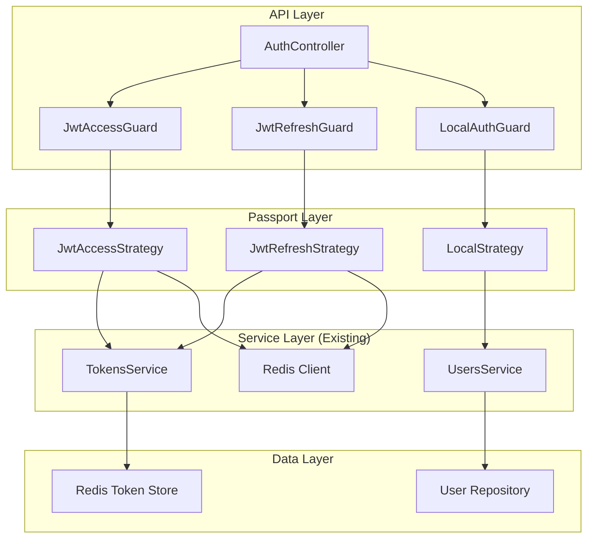

# NestJS Passport Integration Technical Design

## Purpose
This document defines HOW the Passport.js integration will be architected to meet the requirements specified in spec.md.

## System Architecture and Component Design

### High-Level Architecture Overview

The integration will use an **Adapter Pattern** approach where Passport strategies delegate to existing services, preserving all current functionality while gaining Passport benefits.



### Clean Code Principles Analysis

#### DRY (Don't Repeat Yourself)
- **Elimination Strategy**: Passport strategies will delegate to existing `TokensService` and `UsersService` rather than duplicating logic
- **Shared Components**: Common JWT validation logic centralized in `TokensService`
- **Configuration**: JWT configuration centralized in existing `ConfigService` integration

#### SOLID Principles Application

**Single Responsibility Principle (SRP)**
- `LocalStrategy`: Only handles username/password validation
- `JwtAccessStrategy`: Only handles access token validation
- `JwtRefreshStrategy`: Only handles refresh token validation
- Each strategy has one clear responsibility

**Open/Closed Principle (OCP)**
- Easy to add new Passport strategies (Google OAuth, Apple OAuth, etc.)
- Existing code closed for modification, open for extension
- Strategy pattern enables new providers without changing core logic

**Liskov Substitution Principle (LSP)**
- All Passport strategies are substitutable through common interface
- Guards can use any strategy interchangeably
- Maintains contract compatibility

**Interface Segregation Principle (ISP)**
- Separate strategies for different authentication methods
- Clients depend only on authentication methods they use
- No fat interfaces with multiple responsibilities

**Dependency Inversion Principle (DIP)**
- Strategies depend on abstractions (service interfaces)
- High-level modules don't depend on low-level implementation details
- Proper dependency injection throughout

#### YAGNI (You Ain't Gonna Need It)
- Implement only current authentication requirements
- No over-engineering for future OAuth providers yet
- Architecture supports extensibility without premature implementation

### Design Pattern Analysis

#### Strategy Pattern Implementation
**Purpose**: Encapsulate authentication algorithms and make them interchangeable
**Implementation**: Passport strategies for each auth method
**Benefits**: Easy to add new providers, testability, clean separation

#### Adapter Pattern Implementation
**Purpose**: Make existing services compatible with Passport interface
**Implementation**: Strategies adapt existing `TokensService` and `UsersService`
**Benefits**: Zero breaking changes, preserves existing investments

#### Facade Pattern Implementation
**Purpose**: Simplify complex authentication operations
**Implementation**: Guards provide simple interface over Passport complexity
**Benefits**: Clean API, hides complexity, maintainable code

#### Template Method Pattern Implementation
**Purpose**: Define authentication flow skeleton while allowing customization
**Implementation**: Passport provides template, strategies provide specific validation
**Benefits**: Consistent flow, customizable validation logic

### NestJS Implementation Research & Comparison

#### Approach 1: Pure Passport Integration
**Description**: Complete replacement of existing custom authentication with Passport
**Implementation**: Replace all guards, strategies, and token handling
**Trade-off Analysis**:
- **Performance**: High (5/5) - Direct Passport usage
- **Maintainability**: Medium (3/5) - Major code changes
- **Testability**: Medium (3/5) - Complex migration testing
- **Complexity**: Low (2/5) - Standard patterns but high migration risk
- **NestJS Convention**: High (5/5) - Follows Passport best practices
- **Project Context Fit**: Low (2/5) - High risk of breaking changes

#### Approach 2: Hybrid Integration
**Description**: Gradual migration with both old and new systems running
**Implementation**: Keep existing guards, add Passport alongside
**Trade-off Analysis**:
- **Performance**: High (4/5) - Slight overhead from dual systems
- **Maintainability**: Medium (4/5) - Complex during transition
- **Testability**: Medium (4/5) - Need to test both systems
- **Complexity**: Medium (3/5) - Managing two auth systems
- **NestJS Convention**: Medium (4/5) - Not purest approach
- **Project Context Fit**: Medium (4/5) - Lower risk but complex

#### Approach 3: Adapter Pattern Integration
**Description**: Passport strategies adapt existing services without replacement
**Implementation**: Strategies delegate to existing `TokensService` and `UsersService`
**Trade-off Analysis**:
- **Performance**: High (5/5) - Minimal overhead, preserves optimized logic
- **Maintainability**: High (5/5) - Preserves existing code structure
- **Testability**: High (5/5) - Can test strategies independently
- **Complexity**: High (5/5) - Simple implementation, clear responsibilities
- **NestJS Convention**: Medium (3/5) - Not "pure" Passport but effective
- **Project Context Fit**: High (5/5) - Perfect fit for requirements

### Decision Rationale

**Chosen Approach**: Adapter Pattern Integration (Score: 28/30)

**Why this approach**:
1. **Zero Breaking Changes**: All existing APIs continue to work
2. **Preserves Investment**: Keeps optimized existing logic
3. **Low Risk**: Safest migration path
4. **Future Extensibility**: Easy to add OAuth providers later
5. **Testing Simplicity**: Clear separation of concerns

**Rejected Alternatives**:
- **Pure Integration**: Too high risk of breaking existing functionality
- **Hybrid Integration**: Unnecessary complexity for this use case

### Implementation Examples

#### Local Strategy Example
```typescript
@Injectable()
export class LocalStrategy extends PassportStrategy(Strategy) {
  constructor(
    private readonly usersService: UsersService,
  ) {
    super({
      usernameField: 'email',
      passwordField: 'password',
    });
  }

  async validate(email: string, password: string): Promise<User> {
    // Delegate to existing service - no code duplication
    return this.usersService.validateCredentials(email, password);
  }
}
```

#### JWT Access Strategy Example
```typescript
@Injectable()
export class JwtAccessStrategy extends PassportStrategy(Strategy, 'jwt-access') {
  constructor(
    private readonly config: ConfigService,
    private readonly tokensService: TokensService,
    @Inject('REDIS_CLIENT') private readonly redis: Redis,
  ) {
    super({
      jwtFromRequest: ExtractJwt.fromAuthHeaderAsBearerToken(),
      ignoreExpiration: false,
      secretOrKey: config.get<string>('jwt.secret'),
    });
  }

  async validate(payload: JwtClaims): Promise<JwtClaims> {
    // Preserve existing blacklisting logic
    const blacklisted = await this.redis.get(
      TokensService.ACCESS_BLACKLIST_PREFIX + payload.jti,
    );
    if (blacklisted === '1') {
      throw new UnauthorizedException('Token revoked');
    }
    return payload;
  }
}
```

#### Guard Integration Example
```typescript
@Injectable()
export class JwtAccessGuard extends AuthGuard('jwt-access') {
  constructor(private readonly reflector: Reflector) {
    super();
  }

  canActivate(context: ExecutionContext) {
    // Preserve existing public route logic
    const isPublic = this.reflector.getAllAndOverride<boolean>(IS_PUBLIC_KEY, [
      context.getHandler(),
      context.getClass(),
    ]);
    if (isPublic) return true;

    return super.canActivate(context);
  }
}
```

### Architecture Quality Assessment

#### Cohesion Analysis
- **High Functional Cohesion**: Each strategy focuses on one authentication method
- **Logical Cohesion**: Strategies grouped by authentication type
- **Temporal Cohesion**: Token-related operations grouped together
- **Procedural Cohesion**: Authentication follows clear sequential steps

#### Coupling Analysis
- **Low Coupling**: Strategies depend on service interfaces, not implementations
- **Loose Coupling**: Can replace implementations without affecting strategies
- **No Tight Coupling**: Changes in one strategy don't affect others
- **Controlled Coupling**: Dependencies managed through dependency injection

#### Separation of Concerns Validation
- **Authentication Logic**: Separated from token management
- **Token Validation**: Separated from user validation
- **Strategy Selection**: Separated from strategy implementation
- **Error Handling**: Centralized and consistent

#### Dependency Direction Analysis
- **Correct Direction**: High-level modules don't depend on low-level details
- **Abstraction Dependence**: Strategies depend on service abstractions
- **Stable Dependencies**: Depend on stable, less volatile components
- **Interface Segregation**: Dependencies are focused and minimal

#### Interface Design and Contract Definition
```typescript
// Strategy contracts
interface IAuthStrategy {
  validate(payload: any): Promise<any>;
}

// Service contracts (existing, preserved)
interface ITokensService {
  verifyTokenRaw(token: string): JwtClaims;
  blacklistAccess(jti: string, exp: number): Promise<void>;
  // ... other existing methods
}

interface IUsersService {
  validateCredentials(email: string, password: string): Promise<User>;
  findById(id: string): Promise<User>;
  // ... other existing methods
}
```

### API Specifications and Data Models

#### Authentication API Contract Preservation
```typescript
// Existing DTOs preserved
export interface LoginDto {
  email: string;
  password: string;
}

export interface AuthResponse {
  user: UserResponse;
  accessToken: string;
  refreshToken: string;
}

// All existing contracts maintained
```

#### Internal Strategy Models
```typescript
// New strategy-specific interfaces
export interface LocalAuthResult {
  user: User;
  validatedAt: Date;
}

export interface JwtValidationResult {
  payload: JwtClaims;
  isValid: boolean;
  blacklisted: boolean;
}
```

### Database Schema Changes
**None Required** - All existing database schema preserved

### Frontend Component Structure
**No Changes Required** - All frontend contracts preserved

### Backend Service Design

#### Auth Module Structure
```typescript
@Module({
  imports: [
    PassportModule,
    // Existing imports preserved
  ],
  providers: [
    // Existing services preserved
    AuthService,
    TokensService,
    UsersService,

    // New Passport strategies
    LocalStrategy,
    JwtAccessStrategy,
    JwtRefreshStrategy,

    // Updated guards
    JwtAccessGuard,
    JwtRefreshGuard,
    LocalAuthGuard,
  ],
  controllers: [AuthController],
  exports: [/* existing exports */],
})
export class AuthModule {}
```

#### Strategy Dependencies
- **LocalStrategy** → UsersService
- **JwtAccessStrategy** → TokensService, Redis, ConfigService
- **JwtRefreshStrategy** → TokensService, ConfigService

### MQTT Message Flows
**No Changes Required** - MQTT authentication flows preserved

### Security Considerations

#### Token Security Preservation
- **JWT Secret Management**: Unchanged, uses existing ConfigService
- **Token Blacklisting**: Preserved in Redis with existing TTL logic
- **Refresh Token Tracking**: Maintained with existing Redis sets
- **Token Rotation**: Preserved existing rotation logic

#### Authentication Security
- **Credential Validation**: Preserved existing bcrypt hashing
- **Rate Limiting**: Preserved existing mechanisms
- **Session Management**: Unchanged Redis-based sessions
- **Multi-tenant Security**: Household-based access preserved

### Performance Requirements

#### Response Time Targets
- **Local Auth**: < 100ms (current baseline preserved)
- **JWT Validation**: < 50ms (existing Redis checks maintained)
- **Token Refresh**: < 200ms (existing logic preserved)

#### Memory Usage
- **Strategy Instances**: Singleton pattern, minimal memory impact
- **Token Caching**: Preserved existing Redis usage
- **User Sessions**: Unchanged Redis memory patterns

### Integration Patterns

#### Service Integration Pattern
```typescript
// Adapter pattern for existing services
@Injectable()
export class JwtAccessStrategy extends PassportStrategy(Strategy) {
  constructor(
    private readonly tokensService: TokensService, // Existing service
    private readonly redis: Redis, // Existing Redis client
  ) {
    // Strategy configuration
  }

  async validate(payload: JwtClaims) {
    // Delegate to existing logic
    return this.tokensService.validateWithBlacklist(payload);
  }
}
```

#### Guard Integration Pattern
```typescript
// Extend existing guards with Passport
@Injectable()
export class JwtAccessGuard extends AuthGuard('jwt-access') {
  // Preserve existing public route handling
  canActivate(context: ExecutionContext) {
    if (this.isPublicRoute(context)) return true;
    return super.canActivate(context);
  }
}
```

### Architecture Assessment and Refactoring Recommendations

#### Current Architecture Strengths
- ✅ Well-separated concerns
- ✅ Proper dependency injection
- ✅ Comprehensive error handling
- ✅ Redis integration for scalability
- ✅ Multi-tenant support

#### Refactoring Opportunities
1. **Token Service**: Extract common validation logic
2. **Guard Factory**: Create reusable guard patterns
3. **Strategy Factory**: Prepare for OAuth provider addition
4. **Error Handling**: Standardize authentication error responses

#### Migration Strategy
1. **Phase 1**: Add Passport dependencies and strategies
2. **Phase 2**: Update guards to extend Passport guards
3. **Phase 3**: Update AuthModule providers
4. **Phase 4**: Comprehensive testing
5. **Phase 5**: Performance validation

This architecture preserves all existing functionality while providing a clean migration path to Passport.js, ensuring future extensibility and maintainability.