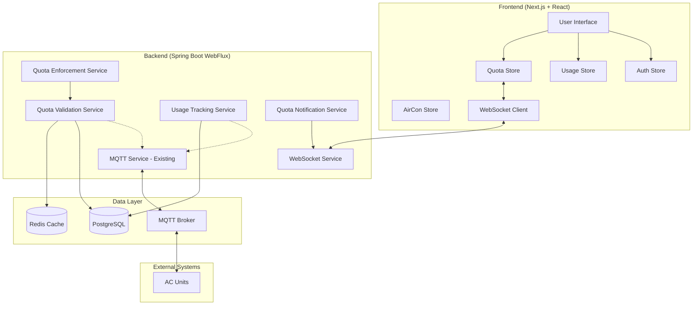

# Usage Control & Quota Management - Technical Design Document

## 1. Executive Summary

### 1.1 System Overview
This document provides the comprehensive technical design for the Usage Control & Quota Management MVP feature integration with the existing Mitsubishi AC Remote Control PWA. The design follows a reactive middleware pattern that preserves existing functionality while adding quota enforcement capabilities.

### 1.2 Design Principles
- **Non-Breaking Integration**: Existing AC control functionality remains unaffected
- **High Performance**: Quota validation adds minimal latency (<100ms)
- **Fail-Safe Operation**: System degrades gracefully when quota services are unavailable
- **Real-time Feedback**: Users receive immediate quota status updates
- **Extensible Architecture**: Clean boundaries enable future enterprise features

### 1.3 Architecture Decision Summary
- **Backend**: Reactive middleware pattern with Spring WebFlux
- **Frontend**: Separate Zustand stores with WebSocket integration
- **Integration**: MQTT command interception with failover mechanisms
- **Caching**: Redis-based performance optimization
- **Database**: PostgreSQL with reactive R2DBC access

---

## 2. System Architecture Overview

### 2.1 High-Level Architecture



### 2.2 Integration Points with Existing System

**Existing Components (No Changes Required)**:
- `ReactiveAirConService`: Core AC control functionality
- MQTT message handling and WebSocket streams
- Frontend AC control components and state management

**New Integration Points**:
- **Command Pipeline**: Quota validation middleware before MQTT publishing
- **State Monitoring**: Usage tracking listener on existing AC state streams
- **WebSocket Enhancement**: Additional channels for quota-specific updates

### 2.3 Data Flow Architecture

**1. AC Command Flow with Quota Validation**:
```
User Action → Frontend Validation → Backend Quota Check → MQTT Command → AC Unit
     ↓              ↓                      ↓                   ↓           ↓
Optimistic UI → Local Cache Check → Database Validation → State Update → Usage Tracking
```

**2. Real-time Usage Tracking Flow**:
```
AC State Change → MQTT Event → Usage Service → Database Update → Cache Update → WebSocket Push → Frontend Update
```

**3. Quota Status Synchronization**:
```
Database Change → Cache Invalidation → WebSocket Notification → Frontend Store Update → UI Refresh
```

---

## 3. Backend Service Design

### 3.1 Service Layer Architecture

#### 3.1.1 QuotaValidationService
**Purpose**: High-performance quota validation with caching

```java
@Service
@Slf4j
public class QuotaValidationService {
    
    @Autowired
    private ReactiveRedisTemplate<String, Object> redisTemplate;
    
    @Autowired
    private QuotaRepository quotaRepository;
    
    /**
     * Validates if a command would exceed user's quota
     * Performance target: <100ms response time
     */
    @Cacheable(value = "quota-validation", unless = "#result.hasError()")
    public Mono<QuotaValidationResult> validateCommand(
        String userId, 
        String roomId, 
        AirConCommand command
    ) {
        return getCurrentQuotaBalance(userId, roomId)
            .map(balance -> evaluateCommand(balance, command))
            .onErrorReturn(QuotaValidationResult.failOpen("Quota service unavailable"))
            .timeout(Duration.ofMillis(100))
            .doOnNext(result -> logValidationResult(userId, roomId, result));
    }
    
    /**
     * Get real-time quota balance with cache optimization
     */
    public Mono<QuotaBalance> getCurrentQuotaBalance(String userId, String roomId) {
        String cacheKey = String.format("quota:balance:%s:%s", userId, roomId);
        
        return redisTemplate.opsForValue().get(cacheKey)
            .cast(QuotaBalance.class)
            .switchIfEmpty(loadBalanceFromDatabase(userId, roomId)
                .doOnNext(balance -> cacheBalance(cacheKey, balance)));
    }
    
    /**
     * Fail-open strategy for quota validation errors
     */
    private QuotaValidationResult failOpen(String reason) {
        log.warn("Quota validation failed, allowing command: {}", reason);
        return QuotaValidationResult.allow().withWarning(reason);
    }
}
```

**Key Features**:
- **Sub-100ms Response**: Redis caching for hot quota data
- **Fail-Safe Design**: Allows AC commands when quota service is down
- **Cache Strategy**: 1-hour TTL with invalidation on quota changes
- **Performance Monitoring**: Metrics for validation latency and cache hit rates

#### 3.1.2 UsageTrackingService
**Purpose**: Real-time AC usage session management

```java
@Service
@Slf4j  
public class UsageTrackingService {
    
    @Autowired
    private UsageSessionRepository sessionRepository;
    
    @Autowired
    private QuotaNotificationService notificationService;
    
    /**
     * Handles AC state changes for usage tracking
     * Processes asynchronously to avoid blocking MQTT flow
     */
    @EventListener
    @Async("usageTrackingExecutor")
    public void handleAirConStateChange(MqttStateUpdateEvent event) {
        processUsageEvent(event)
            .doOnNext(session -> updateQuotaBalances(session))
            .doOnNext(session -> checkQuotaThresholds(session))
            .subscribe(
                session -> log.debug("Updated usage session: {}", session.getId()),
                error -> log.error("Failed to track usage for event: {}", event, error)
            );
    }
    
    /**
     * Calculate session duration and update quota consumption
     */
    private Mono<UsageSession> processUsageEvent(MqttStateUpdateEvent event) {
        if (event.getState().getPower().equals("ON")) {
            return startUsageSession(event);
        } else {
            return endUsageSession(event);
        }
    }
    
    /**
     * Real-time quota threshold monitoring
     */
    private Mono<Void> checkQuotaThresholds(UsageSession session) {
        return getCurrentQuotaUsage(session.getUserId(), session.getRoomId())
            .filter(usage -> usage.exceedsThreshold(0.75)) // 75% warning
            .flatMap(usage -> notificationService.sendQuotaWarning(session.getUserId(), usage))
            .then();
    }
}
```

**Key Features**:
- **Asynchronous Processing**: Doesn't block MQTT message flow
- **Real-time Calculation**: Updates quota balances within 30 seconds
- **Threshold Monitoring**: Automatic warnings at 75% quota usage
- **Error Resilience**: Failed usage tracking doesn't affect AC operation

#### 3.1.3 QuotaEnforcementService
**Purpose**: Business logic for quota rules and parent overrides

```java
@Service
@Transactional
public class QuotaEnforcementService {
    
    /**
     * Apply quota rules and determine enforcement action
     */
    public Mono<EnforcementDecision> enforceQuota(
        String userId, 
        String roomId, 
        AirConCommand command
    ) {
        return quotaRepository.findActiveQuotaByUserAndRoom(userId, roomId)
            .flatMap(quota -> evaluateQuotaRules(quota, command))
            .defaultIfEmpty(EnforcementDecision.allow("No quota configured"));
    }
    
    /**
     * Handle parent override requests
     */
    public Mono<Void> grantParentOverride(
        String parentUserId,
        String childUserId, 
        String roomId,
        OverrideRequest request
    ) {
        return validateParentAuthority(parentUserId, childUserId)
            .then(applyOverride(childUserId, roomId, request))
            .doOnSuccess(v -> auditOverrideEvent(parentUserId, childUserId, request));
    }
    
    /**
     * Daily quota reset scheduling
     */
    @Scheduled(cron = "0 0 0 * * *") // Daily at midnight
    public void resetDailyQuotas() {
        quotaRepository.resetDailyUsage()
            .doOnNext(count -> log.info("Reset {} daily quotas", count))
            .subscribe();
    }
}
```

### 3.2 Integration with Existing ReactiveAirConService

**Minimal Intrusive Integration**:

```java
@Service
public class ReactiveAirConService {
    
    @Autowired
    private QuotaValidationService quotaValidationService;
    
    /**
     * Enhanced command methods with quota validation
     * Preserves existing method signatures for backward compatibility
     */
    public Mono<Void> setPower(String roomId, String power) {
        return getCurrentUser()
            .flatMap(user -> validateWithQuota(user.getId(), roomId, "power", power))
            .then(validateRoomId(roomId))
            .then(mqttService.publishCommand(roomId, "power", power))
            .doOnSuccess(v -> log.info("Power command sent for room {}: {}", roomId, power));
    }
    
    /**
     * Quota validation middleware - only active for users with quotas
     */
    private Mono<Void> validateWithQuota(String userId, String roomId, String command, Object value) {
        return quotaValidationService.validateCommand(userId, roomId, 
            new AirConCommand(command, value))
            .flatMap(result -> {
                if (result.isBlocked()) {
                    return Mono.error(new QuotaExceededException(result.getReason()));
                }
                return Mono.empty();
            })
            .onErrorResume(QuotaServiceException.class, ex -> {
                log.warn("Quota validation failed, allowing command: {}", ex.getMessage());
                return Mono.empty(); // Fail open
            });
    }
}
```

**Integration Benefits**:
- **Zero Breaking Changes**: Existing API contracts preserved
- **Optional Feature**: Users without quotas experience no changes
- **Performance Impact**: <100ms additional latency for quota users
- **Reliability**: Quota failures don't break AC functionality

---

## 4. Frontend Architecture Design

### 4.1 State Management Strategy

#### 4.1.1 Zustand Store Architecture

**Separate Stores for Clean Boundaries**:

```typescript
// quota-store.ts
interface QuotaState {
  // Current quota balances per user/room
  balances: Record<string, Record<string, QuotaBalance>>;
  // Active quota violations and warnings
  violations: QuotaViolation[];
  // Parent override states
  overrides: Record<string, OverrideStatus>;
  
  // Actions
  updateBalance: (userId: string, roomId: string, balance: QuotaBalance) => void;
  addViolation: (violation: QuotaViolation) => void;
  requestOverride: (userId: string, roomId: string) => Promise<void>;
  clearViolation: (violationId: string) => void;
}

export const useQuotaStore = create<QuotaState>()((set, get) => ({
  balances: {},
  violations: [],
  overrides: {},
  
  updateBalance: (userId, roomId, balance) => {
    set(state => ({
      balances: {
        ...state.balances,
        [userId]: {
          ...state.balances[userId],
          [roomId]: balance
        }
      }
    }));
  },
  
  // Additional actions...
}));
```

```typescript
// usage-store.ts
interface UsageState {
  // Active usage sessions per room
  activeSessions: Record<string, UsageSession>;
  // Daily usage summaries
  dailyUsage: Record<string, DailyUsageSummary>;
  // Historical data for dashboard
  history: UsageHistory[];
  
  // Actions
  startSession: (roomId: string, userId: string) => void;
  updateSession: (roomId: string, session: UsageSession) => void;
  endSession: (roomId: string) => void;
  updateDailyUsage: (userId: string, usage: DailyUsageSummary) => void;
}

export const useUsageStore = create<UsageState>()(/* implementation */);
```

```typescript
// auth-store.ts - Extension of existing auth
interface AuthState {
  // Existing auth state
  user: User | null;
  isAuthenticated: boolean;
  
  // New quota-related auth properties
  household: Household | null;
  userRole: 'PARENT' | 'CHILD' | 'ADMIN';
  assignedRooms: string[];
  
  // Actions
  setHousehold: (household: Household) => void;
  updateRoomAssignments: (rooms: string[]) => void;
}
```

#### 4.1.2 WebSocket Integration Pattern

**Real-time Quota Updates**:

```typescript
// hooks/use-quota-websocket.ts
export const useQuotaWebSocket = () => {
  const updateBalance = useQuotaStore(state => state.updateBalance);
  const addViolation = useQuotaStore(state => state.addViolation);
  const user = useAuthStore(state => state.user);
  
  useEffect(() => {
    if (!user) return;
    
    const quotaStream$ = new Observable<QuotaUpdate>(subscriber => {
      const ws = new WebSocket(`ws://localhost:8080/ws/quota/${user.id}/status`);
      
      ws.onmessage = (event) => {
        const update = JSON.parse(event.data) as QuotaUpdate;
        subscriber.next(update);
      };
      
      return () => ws.close();
    });
    
    const subscription = quotaStream$
      .pipe(
        distinctUntilChanged((a, b) => a.balance === b.balance),
        debounceTime(1000) // Avoid excessive re-renders
      )
      .subscribe({
        next: (update) => {
          updateBalance(update.userId, update.roomId, update.balance);
          
          if (update.violation) {
            addViolation(update.violation);
          }
        },
        error: (error) => console.error('Quota WebSocket error:', error)
      });
    
    return () => subscription.unsubscribe();
  }, [user?.id, updateBalance, addViolation]);
};
```

### 4.2 Component Architecture

#### 4.2.1 Quota-Aware AC Controls

**Enhanced AirCon Remote with Quota Integration**:

```typescript
// components/quota/QuotaAwareACRemote.tsx
export const QuotaAwareACRemote: React.FC<{ roomId: string }> = ({ roomId }) => {
  const user = useAuthStore(state => state.user);
  const quotaBalance = useQuotaStore(state => 
    state.balances[user?.id || '']?.[roomId]
  );
  const sendCommand = useAirconStore(state => state.sendCommand);
  
  const [isQuotaWarningOpen, setQuotaWarningOpen] = useState(false);
  
  const handleACCommand = useCallback(async (command: ACCommand) => {
    // Optimistic local validation for immediate feedback
    if (quotaBalance && wouldExceedQuota(quotaBalance, command)) {
      setQuotaWarningOpen(true);
      return;
    }
    
    try {
      // Send command through existing flow (now with server-side quota validation)
      await sendCommand(roomId, command);
    } catch (error) {
      if (error instanceof QuotaExceededException) {
        setQuotaWarningOpen(true);
      } else {
        // Handle other errors normally
        throw error;
      }
    }
  }, [quotaBalance, roomId, sendCommand]);
  
  return (
    <>
      <AirConRemote 
        roomId={roomId}
        onCommand={handleACCommand}
        quotaStatus={quotaBalance} // Pass quota info to existing component
      />
      
      <QuotaWarningDialog 
        open={isQuotaWarningOpen}
        onClose={() => setQuotaWarningOpen(false)}
        quotaBalance={quotaBalance}
      />
    </>
  );
};
```

#### 4.2.2 Quota Status Components

```typescript
// components/quota/QuotaStatusBadge.tsx
export const QuotaStatusBadge: React.FC<{ userId: string; roomId: string }> = ({ 
  userId, roomId 
}) => {
  const balance = useQuotaStore(state => state.balances[userId]?.[roomId]);
  
  if (!balance) return null;
  
  const percentage = (balance.used / balance.total) * 100;
  const variant = percentage >= 90 ? 'destructive' : 
                  percentage >= 75 ? 'warning' : 'default';
  
  return (
    <Badge variant={variant} className="flex items-center gap-1">
      <Clock className="h-3 w-3" />
      {balance.remaining}h left
    </Badge>
  );
};
```

```typescript
// components/quota/ParentOverrideDialog.tsx  
export const ParentOverrideDialog: React.FC<ParentOverrideProps> = ({ 
  open, onClose, childUserId, roomId 
}) => {
  const grantOverride = useQuotaStore(state => state.requestOverride);
  
  const handleQuickOverride = (hours: number) => {
    grantOverride(childUserId, roomId, { 
      type: 'ADD_TIME', 
      value: hours * 3600 // seconds
    });
    onClose();
  };
  
  return (
    <Dialog open={open} onOpenChange={onClose}>
      <DialogContent>
        <DialogHeader>
          <DialogTitle>Grant Additional AC Time</DialogTitle>
        </DialogHeader>
        
        <div className="space-y-4">
          <Button onClick={() => handleQuickOverride(1)}>
            Add 1 Hour
          </Button>
          <Button onClick={() => handleQuickOverride(2)}>
            Add 2 Hours  
          </Button>
          <Button variant="outline" onClick={() => handleQuickOverride(24)}>
            Unlock for Today
          </Button>
        </div>
      </DialogContent>
    </Dialog>
  );
};
```

### 4.3 Optimistic UI Pattern

**Immediate Feedback with Server Validation**:

```typescript
// hooks/use-optimistic-quota.ts
export const useOptimisticQuota = (userId: string, roomId: string) => {
  const [optimisticBalance, setOptimisticBalance] = useState<QuotaBalance | null>(null);
  const serverBalance = useQuotaStore(state => state.balances[userId]?.[roomId]);
  
  const predictQuotaImpact = (command: ACCommand): Partial<QuotaBalance> => {
    // Local prediction logic for immediate UI feedback
    const estimatedUsage = estimateCommandDuration(command);
    return {
      remaining: (serverBalance?.remaining || 0) - estimatedUsage,
      used: (serverBalance?.used || 0) + estimatedUsage
    };
  };
  
  const applyOptimisticUpdate = (command: ACCommand) => {
    const prediction = predictQuotaImpact(command);
    setOptimisticBalance({
      ...serverBalance!,
      ...prediction
    });
  };
  
  // Sync with server state when it updates
  useEffect(() => {
    setOptimisticBalance(null); // Clear optimistic state on server update
  }, [serverBalance]);
  
  return {
    balance: optimisticBalance || serverBalance,
    applyOptimisticUpdate
  };
};
```

---

## 5. API Design Specification

### 5.1 REST API Endpoints

#### 5.1.1 Quota Management APIs

```yaml
# OpenAPI 3.0 specification excerpt
paths:
  /api/quotas:
    post:
      summary: Create or update user quota
      security:
        - bearerAuth: []
      requestBody:
        required: true
        content:
          application/json:
            schema:
              $ref: '#/components/schemas/QuotaRequest'
      responses:
        200:
          description: Quota created/updated successfully
        403:
          description: Insufficient permissions (parent role required)
          
  /api/quotas/user/{userId}:
    get:
      summary: Get current quota status for user
      parameters:
        - name: userId
          in: path
          required: true
          schema:
            type: string
      responses:
        200:
          description: User quota status
          content:
            application/json:
              schema:
                $ref: '#/components/schemas/QuotaStatus'
                
  /api/quotas/{quotaId}/override:
    post:
      summary: Grant parent override (add time/unlock AC)
      security:
        - bearerAuth: []
      requestBody:
        required: true
        content:
          application/json:
            schema:
              type: object
              properties:
                type:
                  type: string
                  enum: [ADD_TIME, UNLOCK_DAY, EMERGENCY_OVERRIDE]
                value:
                  type: number
                  description: Additional seconds for ADD_TIME
                reason:
                  type: string
                  description: Reason for override (audit trail)
      responses:
        200:
          description: Override granted successfully
        403:
          description: Not authorized (parent role required)
```

#### 5.1.2 Usage Analytics APIs

```yaml
/api/usage/summary/{userId}:
  get:
    summary: Get usage history and analytics
    parameters:
      - name: userId
        in: path
        required: true
        schema:
          type: string
      - name: period
        in: query
        schema:
          type: string
          enum: [daily, weekly, monthly]
          default: weekly
    responses:
      200:
        description: Usage analytics data
        content:
          application/json:
            schema:
              type: object
              properties:
                summary:
                  $ref: '#/components/schemas/UsageSummary'
                history:
                  type: array
                  items:
                    $ref: '#/components/schemas/UsageDataPoint'
```

#### 5.1.3 User Management APIs

```yaml
/api/users:
  post:
    summary: Add family member to household
    security:
      - bearerAuth: []
    requestBody:
      required: true
      content:
        application/json:
          schema:
            type: object
            properties:
              email:
                type: string
                format: email
              name:
                type: string
              role:
                type: string
                enum: [PARENT, CHILD]
              assignedRooms:
                type: array
                items:
                  type: string
    responses:
      201:
        description: User created successfully
      409:
        description: User already exists in household
```

### 5.2 WebSocket Channel Specifications

#### 5.2.1 Quota Status Updates

```typescript
// Channel: /ws/quota/{userId}/status
interface QuotaStatusUpdate {
  userId: string;
  roomId: string;
  balance: {
    total: number;        // Total daily quota in seconds
    used: number;         // Used time in seconds
    remaining: number;    // Remaining time in seconds
    resetTime: string;    // ISO timestamp of next reset
  };
  violations?: {
    id: string;
    type: 'WARNING' | 'EXCEEDED' | 'BLOCKED';
    message: string;
    timestamp: string;
  }[];
}
```

#### 5.2.2 Real-time Usage Tracking

```typescript  
// Channel: /ws/usage/{roomId}/session
interface UsageSessionUpdate {
  sessionId: string;
  roomId: string;
  userId: string;
  status: 'STARTED' | 'ACTIVE' | 'ENDED';
  startTime: string;
  endTime?: string;
  duration: number;      // Seconds
  currentSettings: {
    temperature: number;
    mode: string;
    fanSpeed: string;
  };
}
```

#### 5.2.3 Household Activity Dashboard

```typescript
// Channel: /ws/household/{householdId}/activity
interface HouseholdActivityUpdate {
  householdId: string;
  activities: {
    userId: string;
    userName: string;
    roomId: string;
    roomName: string;
    action: 'AC_ON' | 'AC_OFF' | 'SETTINGS_CHANGE' | 'QUOTA_WARNING';
    timestamp: string;
    details?: Record<string, any>;
  }[];
}
```

---

## 6. Database Integration Design

### 6.1 Repository Layer (Spring Data R2DBC)

```java
// QuotaRepository.java
@Repository
public interface QuotaRepository extends ReactiveCrudRepository<Quota, UUID> {
    
    @Query("""
        SELECT q.* FROM quotas q 
        JOIN user_room_assignments ura ON q.user_id = ura.user_id 
        WHERE ura.user_id = :userId AND ura.room_id = :roomId 
        AND q.is_active = true AND q.end_date >= NOW()
        """)
    Mono<Quota> findActiveQuotaByUserAndRoom(
        @Param("userId") UUID userId, 
        @Param("roomId") String roomId
    );
    
    @Query("UPDATE quotas SET daily_used_seconds = 0 WHERE quota_type = 'DAILY'")
    @Modifying
    Mono<Integer> resetDailyUsage();
    
    @Query("""
        SELECT u.id as user_id, u.name, q.daily_limit_seconds, 
               COALESCE(SUM(us.duration_seconds), 0) as used_today
        FROM users u
        LEFT JOIN quotas q ON u.id = q.user_id AND q.is_active = true
        LEFT JOIN usage_sessions us ON u.id = us.user_id 
            AND us.start_time >= CURRENT_DATE
        WHERE u.household_id = :householdId
        GROUP BY u.id, u.name, q.daily_limit_seconds
        """)
    Flux<QuotaStatusProjection> getHouseholdQuotaStatus(
        @Param("householdId") UUID householdId
    );
}
```

```java
// UsageSessionRepository.java
@Repository
public interface UsageSessionRepository extends ReactiveCrudRepository<UsageSession, UUID> {
    
    @Query("""
        SELECT * FROM usage_sessions 
        WHERE user_id = :userId AND room_id = :roomId 
        AND end_time IS NULL
        ORDER BY start_time DESC
        LIMIT 1
        """)
    Mono<UsageSession> findActiveSession(
        @Param("userId") UUID userId, 
        @Param("roomId") String roomId
    );
    
    @Query("""
        SELECT 
            DATE(start_time) as usage_date,
            SUM(duration_seconds) as total_duration,
            COUNT(*) as session_count,
            AVG(duration_seconds) as avg_session_duration
        FROM usage_sessions
        WHERE user_id = :userId 
        AND start_time >= :startDate AND start_time < :endDate
        GROUP BY DATE(start_time)
        ORDER BY usage_date
        """)
    Flux<DailyUsageSummary> getDailyUsageSummary(
        @Param("userId") UUID userId,
        @Param("startDate") LocalDateTime startDate,
        @Param("endDate") LocalDateTime endDate
    );
}
```

### 6.2 Caching Strategy Implementation

```java
// QuotaCacheService.java
@Service
@Slf4j
public class QuotaCacheService {
    
    @Autowired
    private ReactiveRedisTemplate<String, Object> redisTemplate;
    
    private static final Duration BALANCE_TTL = Duration.ofHours(1);
    private static final Duration SESSION_TTL = Duration.ofHours(24);
    
    public Mono<QuotaBalance> getCachedBalance(String userId, String roomId) {
        String key = balanceKey(userId, roomId);
        return redisTemplate.opsForValue()
            .get(key)
            .cast(QuotaBalance.class)
            .doOnNext(balance -> log.debug("Cache hit for balance: {}", key))
            .doOnError(error -> log.warn("Cache read error for key: {}", key, error));
    }
    
    public Mono<Void> cacheBalance(String userId, String roomId, QuotaBalance balance) {
        String key = balanceKey(userId, roomId);
        return redisTemplate.opsForValue()
            .set(key, balance, BALANCE_TTL)
            .doOnSuccess(v -> log.debug("Cached balance: {}", key))
            .then();
    }
    
    public Mono<Void> invalidateBalance(String userId, String roomId) {
        String key = balanceKey(userId, roomId);
        return redisTemplate.delete(key)
            .doOnNext(count -> log.debug("Invalidated {} cache entries for: {}", count, key))
            .then();
    }
    
    /**
     * Cache active usage sessions for fast lookups
     */
    public Mono<Void> cacheActiveSession(String userId, String roomId, UsageSession session) {
        String key = sessionKey(userId, roomId);
        return redisTemplate.opsForValue()
            .set(key, session, SESSION_TTL)
            .then();
    }
    
    public Mono<UsageSession> getCachedActiveSession(String userId, String roomId) {
        String key = sessionKey(userId, roomId);
        return redisTemplate.opsForValue()
            .get(key)
            .cast(UsageSession.class);
    }
    
    // Helper methods
    private String balanceKey(String userId, String roomId) {
        return String.format("quota:balance:%s:%s", userId, roomId);
    }
    
    private String sessionKey(String userId, String roomId) {
        return String.format("quota:session:%s:%s", userId, roomId);
    }
}
```

---

## 7. Security & Authorization Design

### 7.1 Authentication Enhancement

```java
// QuotaSecurityService.java
@Service
public class QuotaSecurityService {
    
    /**
     * Verify user has permission to modify quotas
     */
    public boolean canManageQuotas(Authentication auth, String targetUserId) {
        QuotaUserDetails user = (QuotaUserDetails) auth.getPrincipal();
        
        // Parents can manage children in same household
        if (user.getRole() == UserRole.PARENT) {
            return isInSameHousehold(user.getId(), targetUserId);
        }
        
        // Users can manage their own quotas (view only)
        return user.getId().equals(targetUserId);
    }
    
    /**
     * Verify user can control specific room
     */
    public boolean canControlRoom(Authentication auth, String roomId) {
        QuotaUserDetails user = (QuotaUserDetails) auth.getPrincipal();
        
        // Check room assignment
        return userRepository.isAssignedToRoom(user.getId(), roomId)
            .defaultIfEmpty(false)
            .block(); // Acceptable for security check
    }
    
    /**
     * Check parent-child relationship for overrides
     */
    public boolean canOverrideQuota(Authentication auth, String childUserId) {
        QuotaUserDetails parent = (QuotaUserDetails) auth.getPrincipal();
        
        return parent.getRole() == UserRole.PARENT && 
               isInSameHousehold(parent.getId(), childUserId);
    }
}
```

### 7.2 Method-Level Security

```java
// QuotaController.java
@RestController
@RequestMapping("/api/quotas")
@PreAuthorize("hasRole('USER')")
public class QuotaController {
    
    @PostMapping
    @PreAuthorize("hasRole('PARENT') and @quotaSecurityService.canManageQuotas(authentication, #request.userId)")
    public Mono<ResponseEntity<QuotaResponse>> createQuota(@RequestBody QuotaRequest request) {
        return quotaService.createQuota(request)
            .map(quota -> ResponseEntity.ok(quota))
            .onErrorReturn(ResponseEntity.badRequest().build());
    }
    
    @PostMapping("/{quotaId}/override")
    @PreAuthorize("@quotaSecurityService.canOverrideQuota(authentication, #childUserId)")
    public Mono<ResponseEntity<Void>> grantOverride(
        @PathVariable UUID quotaId,
        @RequestParam String childUserId,
        @RequestBody OverrideRequest request
    ) {
        return quotaEnforcementService.grantParentOverride(
            getCurrentUserId(), childUserId, quotaId, request
        ).map(v -> ResponseEntity.ok().build());
    }
}
```

### 7.3 Data Access Security

```java
// Row-level security with household scoping
@Query("""
    SELECT q.* FROM quotas q 
    JOIN users u ON q.user_id = u.id
    WHERE u.household_id = :householdId 
    AND (:currentUserId = q.user_id OR EXISTS(
        SELECT 1 FROM users p WHERE p.id = :currentUserId 
        AND p.household_id = :householdId AND p.role = 'PARENT'
    ))
    """)
Flux<Quota> findAccessibleQuotas(
    @Param("currentUserId") UUID currentUserId,
    @Param("householdId") UUID householdId
);
```

---

## 8. Error Handling & Resilience

### 8.1 Comprehensive Error Strategy

#### 8.1.1 Quota Service Error Handling

```java
// QuotaValidationService error handling
@Service
public class ResilientQuotaValidationService {
    
    private static final Duration VALIDATION_TIMEOUT = Duration.ofMillis(100);
    private static final int MAX_RETRIES = 2;
    
    public Mono<QuotaValidationResult> validateCommand(
        String userId, 
        String roomId, 
        AirConCommand command
    ) {
        return performValidation(userId, roomId, command)
            .timeout(VALIDATION_TIMEOUT)
            .retry(MAX_RETRIES)
            .onErrorResume(this::handleValidationError)
            .doOnError(error -> logValidationFailure(userId, roomId, error));
    }
    
    private Mono<QuotaValidationResult> handleValidationError(Throwable error) {
        if (error instanceof TimeoutException) {
            log.warn("Quota validation timeout, failing open");
            return Mono.just(QuotaValidationResult.failOpen("Validation timeout"));
        }
        
        if (error instanceof ConnectException) {
            log.error("Database connection failed, failing open");
            return Mono.just(QuotaValidationResult.failOpen("Database unavailable"));
        }
        
        log.error("Unexpected quota validation error, failing open", error);
        return Mono.just(QuotaValidationResult.failOpen("Service error"));
    }
    
    /**
     * Circuit breaker pattern for database operations
     */
    @Component
    public class QuotaCircuitBreaker {
        private final CircuitBreaker circuitBreaker;
        
        public QuotaCircuitBreaker() {
            this.circuitBreaker = CircuitBreaker.ofDefaults("quota-db")
                .toBuilder()
                .failureRateThreshold(50)
                .waitDurationInOpenState(Duration.ofSeconds(30))
                .slidingWindowSize(10)
                .build();
        }
        
        public <T> Mono<T> executeWithBreaker(Supplier<Mono<T>> operation) {
            return Mono.fromSupplier(() -> circuitBreaker.executeSupplier(operation::get))
                .flatMap(Function.identity());
        }
    }
}
```

#### 8.1.2 Frontend Error Boundaries

```typescript
// components/error/QuotaErrorBoundary.tsx
export class QuotaErrorBoundary extends React.Component<
  { children: React.ReactNode; fallback?: React.ComponentType<any> },
  { hasError: boolean; error?: Error }
> {
  constructor(props: any) {
    super(props);
    this.state = { hasError: false };
  }
  
  static getDerivedStateFromError(error: Error) {
    return { hasError: true, error };
  }
  
  componentDidCatch(error: Error, errorInfo: ErrorInfo) {
    console.error('Quota system error:', error, errorInfo);
    
    // Report error to monitoring service
    if (error.name === 'QuotaServiceError') {
      // Don't break AC functionality for quota errors
      this.setState({ hasError: false });
    }
  }
  
  render() {
    if (this.state.hasError) {
      const Fallback = this.props.fallback || QuotaServiceErrorFallback;
      return <Fallback error={this.state.error} />;
    }
    
    return this.props.children;
  }
}

// Graceful degradation component
const QuotaServiceErrorFallback: React.FC<{ error?: Error }> = ({ error }) => (
  <div className="p-2 text-sm text-yellow-600 bg-yellow-50 rounded">
    <AlertTriangle className="h-4 w-4 inline mr-1" />
    Quota monitoring temporarily unavailable. AC controls working normally.
  </div>
);
```

### 8.2 WebSocket Connection Resilience

```typescript
// hooks/use-resilient-websocket.ts
export const useResilientWebSocket = (url: string) => {
  const [connectionState, setConnectionState] = useState<'connecting' | 'connected' | 'disconnected'>('connecting');
  const [messageQueue, setMessageQueue] = useState<any[]>([]);
  
  const connect = useCallback(() => {
    const ws = new WebSocket(url);
    let reconnectAttempts = 0;
    const maxReconnectAttempts = 5;
    
    ws.onopen = () => {
      setConnectionState('connected');
      reconnectAttempts = 0;
      
      // Send queued messages
      messageQueue.forEach(message => ws.send(JSON.stringify(message)));
      setMessageQueue([]);
    };
    
    ws.onclose = () => {
      setConnectionState('disconnected');
      
      // Exponential backoff reconnection
      if (reconnectAttempts < maxReconnectAttempts) {
        const delay = Math.pow(2, reconnectAttempts) * 1000;
        setTimeout(() => {
          reconnectAttempts++;
          connect();
        }, delay);
      }
    };
    
    return ws;
  }, [url, messageQueue]);
  
  return { connectionState, connect };
};
```

### 8.3 Data Consistency Handling

```java
// EventualConsistencyService.java
@Service
@Slf4j
public class EventualConsistencyService {
    
    /**
     * Periodic reconciliation for quota data consistency
     */
    @Scheduled(fixedDelay = 300000) // Every 5 minutes
    public void reconcileQuotaData() {
        quotaRepository.findInconsistentQuotas()
            .flatMap(this::reconcileQuota)
            .doOnNext(quota -> log.info("Reconciled quota for user: {}", quota.getUserId()))
            .doOnError(error -> log.error("Quota reconciliation failed", error))
            .subscribe();
    }
    
    private Mono<Quota> reconcileQuota(Quota quota) {
        return usageSessionRepository.calculateActualUsage(quota.getUserId(), LocalDate.now())
            .map(actualUsage -> {
                if (Math.abs(quota.getDailyUsedSeconds() - actualUsage) > 300) { // 5 minute tolerance
                    log.warn("Quota usage inconsistency detected: expected={}, actual={}", 
                        quota.getDailyUsedSeconds(), actualUsage);
                    quota.setDailyUsedSeconds(actualUsage);
                }
                return quota;
            })
            .flatMap(quotaRepository::save);
    }
}
```

---

## 9. Performance Optimization

### 9.1 Caching Strategy

**Multi-Layer Caching Architecture**:

```java
// Redis caching configuration
@Configuration
@EnableCaching
public class QuotaCacheConfig {
    
    @Bean
    public CacheManager quotaCacheManager() {
        RedisCacheManager.Builder builder = RedisCacheManager.builder(redisConnectionFactory())
            .cacheDefaults(cacheConfiguration(Duration.ofHours(1)))
            .withCacheConfiguration("quota-balances", 
                cacheConfiguration(Duration.ofMinutes(30)))
            .withCacheConfiguration("quota-validation", 
                cacheConfiguration(Duration.ofMinutes(5)))
            .withCacheConfiguration("usage-sessions",
                cacheConfiguration(Duration.ofHours(6)));
        
        return builder.build();
    }
    
    private RedisCacheConfiguration cacheConfiguration(Duration ttl) {
        return RedisCacheConfiguration.defaultCacheConfig()
            .entryTtl(ttl)
            .serializeKeysWith(RedisSerializationContext.SerializationPair
                .fromSerializer(new StringRedisSerializer()))
            .serializeValuesWith(RedisSerializationContext.SerializationPair
                .fromSerializer(new GenericJackson2JsonRedisSerializer()));
    }
}
```

**Intelligent Cache Warming**:

```java
@Component
public class QuotaCacheWarmer {
    
    /**
     * Pre-warm cache for active users during peak hours
     */
    @EventListener
    @Async
    public void warmCacheOnUserLogin(UserLoginEvent event) {
        String userId = event.getUserId();
        
        // Pre-load user's room assignments and current quotas
        userRoomAssignmentRepository.findByUserId(userId)
            .flatMap(assignment -> 
                quotaValidationService.getCurrentQuotaBalance(userId, assignment.getRoomId())
            )
            .subscribe(
                balance -> log.debug("Pre-warmed quota cache for user: {}", userId),
                error -> log.warn("Failed to warm cache for user: {}", userId, error)
            );
    }
    
    /**
     * Scheduled cache refresh for frequently accessed data
     */
    @Scheduled(fixedRate = 1800000) // Every 30 minutes
    public void refreshHotCache() {
        // Refresh quotas for users active in last hour
        usageSessionRepository.findRecentActiveUsers(Duration.ofHours(1))
            .flatMap(this::refreshUserQuotaCache)
            .subscribe();
    }
}
```

### 9.2 Database Optimization

**Query Optimization**:

```sql
-- Optimized quota validation query with proper indexing
CREATE INDEX CONCURRENTLY idx_quotas_user_room_active 
ON quotas (user_id, room_id) 
WHERE is_active = true AND end_date >= NOW();

-- Optimized usage session queries
CREATE INDEX CONCURRENTLY idx_usage_sessions_user_date 
ON usage_sessions (user_id, start_time DESC) 
WHERE end_time IS NOT NULL;

-- Materialized view for fast dashboard queries
CREATE MATERIALIZED VIEW quota_dashboard_stats AS
SELECT 
    u.household_id,
    u.id as user_id,
    u.name,
    q.daily_limit_seconds,
    COALESCE(us.daily_used, 0) as daily_used_seconds,
    (q.daily_limit_seconds - COALESCE(us.daily_used, 0)) as remaining_seconds
FROM users u
LEFT JOIN quotas q ON u.id = q.user_id AND q.is_active = true
LEFT JOIN (
    SELECT 
        user_id,
        SUM(duration_seconds) as daily_used
    FROM usage_sessions 
    WHERE start_time >= CURRENT_DATE
    GROUP BY user_id
) us ON u.id = us.user_id;

-- Refresh materialized view every 5 minutes
SELECT cron.schedule('refresh-quota-dashboard', '*/5 * * * *', 'REFRESH MATERIALIZED VIEW CONCURRENTLY quota_dashboard_stats;');
```

### 9.3 Frontend Performance Optimization

**Optimized Component Re-rendering**:

```typescript
// Memoized quota status component
export const QuotaStatusDisplay = React.memo<{
  userId: string;
  roomId: string;
}>({ userId, roomId }) => {
  // Use specific selector to prevent unnecessary re-renders
  const balance = useQuotaStore(
    useShallow(state => state.balances[userId]?.[roomId])
  );
  
  const isLowQuota = useMemo(() => {
    if (!balance) return false;
    return (balance.used / balance.total) > 0.75;
  }, [balance?.used, balance?.total]);
  
  // Only re-render when balance actually changes
  if (!balance) return null;
  
  return (
    <div className={cn(
      "px-2 py-1 rounded text-xs",
      isLowQuota ? "bg-red-100 text-red-800" : "bg-green-100 text-green-800"
    )}>
      {Math.floor(balance.remaining / 3600)}h {Math.floor((balance.remaining % 3600) / 60)}m left
    </div>
  );
});

// Debounced WebSocket updates to prevent excessive re-renders
const useDebouncedQuotaUpdates = () => {
  const updateBalance = useQuotaStore(state => state.updateBalance);
  
  const debouncedUpdate = useMemo(
    () => debounce((userId: string, roomId: string, balance: QuotaBalance) => {
      updateBalance(userId, roomId, balance);
    }, 1000),
    [updateBalance]
  );
  
  return debouncedUpdate;
};
```

---

## 10. Monitoring & Observability

### 10.1 Application Metrics

```java
// Custom metrics for quota system monitoring
@Component
public class QuotaMetrics {
    
    private final MeterRegistry meterRegistry;
    private final Counter quotaValidationCounter;
    private final Timer quotaValidationTimer;
    private final Gauge activeSessionsGauge;
    
    public QuotaMetrics(MeterRegistry meterRegistry) {
        this.meterRegistry = meterRegistry;
        this.quotaValidationCounter = Counter.builder("quota.validation.total")
            .tag("result", "success")
            .register(meterRegistry);
        this.quotaValidationTimer = Timer.builder("quota.validation.duration")
            .register(meterRegistry);
        this.activeSessionsGauge = Gauge.builder("quota.sessions.active")
            .register(meterRegistry, this, QuotaMetrics::getActiveSessionCount);
    }
    
    public void recordValidation(boolean success, Duration duration) {
        quotaValidationCounter.increment(
            Tags.of(Tag.of("result", success ? "success" : "failure"))
        );
        quotaValidationTimer.record(duration);
    }
    
    private double getActiveSessionCount() {
        return usageSessionRepository.countActiveSessions().block();
    }
}
```

### 10.2 Health Checks

```java
// Quota system health indicators
@Component
public class QuotaHealthIndicator implements ReactiveHealthIndicator {
    
    @Override
    public Mono<Health> health() {
        return checkQuotaComponents()
            .map(results -> {
                boolean allHealthy = results.stream().allMatch(Boolean::booleanValue);
                return allHealthy ? Health.up().build() : Health.down().build();
            });
    }
    
    private Mono<List<Boolean>> checkQuotaComponents() {
        return Flux.merge(
            checkDatabaseConnection(),
            checkRedisConnection(),
            checkWebSocketEndpoints()
        ).collectList();
    }
    
    private Mono<Boolean> checkDatabaseConnection() {
        return quotaRepository.count()
            .map(count -> true)
            .onErrorReturn(false);
    }
}
```

### 10.3 Audit Logging

```java
// Comprehensive audit trail for quota activities
@Service
@Slf4j
public class QuotaAuditService {
    
    @EventListener
    public void auditQuotaViolation(QuotaViolationEvent event) {
        AuditLog.builder()
            .userId(event.getUserId())
            .action("QUOTA_VIOLATION")
            .details(Map.of(
                "roomId", event.getRoomId(),
                "quotaType", event.getQuotaType(),
                "violationType", event.getViolationType(),
                "usage", event.getCurrentUsage(),
                "limit", event.getQuotaLimit()
            ))
            .timestamp(Instant.now())
            .build()
            .save();
    }
    
    @EventListener  
    public void auditParentOverride(ParentOverrideEvent event) {
        AuditLog.builder()
            .userId(event.getParentUserId())
            .action("PARENT_OVERRIDE")
            .details(Map.of(
                "childUserId", event.getChildUserId(),
                "overrideType", event.getOverrideType(),
                "additionalTime", event.getAdditionalTimeSeconds(),
                "reason", event.getReason()
            ))
            .timestamp(Instant.now())
            .build()
            .save();
    }
}
```

---

## 11. Migration & Deployment Strategy

### 11.1 Database Migration Plan

```sql
-- Migration V1: Core quota tables
-- File: V001__Create_quota_tables.sql

CREATE EXTENSION IF NOT EXISTS "uuid-ossp";

-- Households table for multi-tenancy
CREATE TABLE households (
    id UUID PRIMARY KEY DEFAULT uuid_generate_v4(),
    name VARCHAR(255) NOT NULL,
    created_at TIMESTAMP WITH TIME ZONE DEFAULT NOW(),
    updated_at TIMESTAMP WITH TIME ZONE DEFAULT NOW()
);

-- Enhanced users table with quota roles
ALTER TABLE users ADD COLUMN IF NOT EXISTS household_id UUID REFERENCES households(id);
ALTER TABLE users ADD COLUMN IF NOT EXISTS role VARCHAR(20) DEFAULT 'CHILD';
ALTER TABLE users ADD COLUMN IF NOT EXISTS created_at TIMESTAMP WITH TIME ZONE DEFAULT NOW();

-- User room assignments
CREATE TABLE user_room_assignments (
    id UUID PRIMARY KEY DEFAULT uuid_generate_v4(),
    user_id UUID NOT NULL REFERENCES users(id) ON DELETE CASCADE,
    room_id VARCHAR(100) NOT NULL,
    assigned_at TIMESTAMP WITH TIME ZONE DEFAULT NOW(),
    assigned_by UUID REFERENCES users(id),
    UNIQUE(user_id, room_id)
);

-- Quotas table
CREATE TABLE quotas (
    id UUID PRIMARY KEY DEFAULT uuid_generate_v4(),
    user_id UUID NOT NULL REFERENCES users(id) ON DELETE CASCADE,
    quota_type VARCHAR(20) NOT NULL DEFAULT 'DAILY',
    daily_limit_seconds INTEGER NOT NULL,
    daily_used_seconds INTEGER DEFAULT 0,
    warning_threshold_percent INTEGER DEFAULT 75,
    is_active BOOLEAN DEFAULT true,
    start_date DATE NOT NULL DEFAULT CURRENT_DATE,
    end_date DATE,
    created_at TIMESTAMP WITH TIME ZONE DEFAULT NOW(),
    updated_at TIMESTAMP WITH TIME ZONE DEFAULT NOW()
);

-- Usage sessions for detailed tracking
CREATE TABLE usage_sessions (
    id UUID PRIMARY KEY DEFAULT uuid_generate_v4(),
    user_id UUID NOT NULL REFERENCES users(id) ON DELETE CASCADE,
    room_id VARCHAR(100) NOT NULL,
    start_time TIMESTAMP WITH TIME ZONE NOT NULL,
    end_time TIMESTAMP WITH TIME ZONE,
    duration_seconds INTEGER,
    start_settings JSONB,
    end_settings JSONB,
    created_at TIMESTAMP WITH TIME ZONE DEFAULT NOW()
);

-- Quota violations for enforcement tracking
CREATE TABLE quota_violations (
    id UUID PRIMARY KEY DEFAULT uuid_generate_v4(),
    user_id UUID NOT NULL REFERENCES users(id) ON DELETE CASCADE,
    quota_id UUID NOT NULL REFERENCES quotas(id) ON DELETE CASCADE,
    room_id VARCHAR(100) NOT NULL,
    violation_type VARCHAR(20) NOT NULL,
    violated_at TIMESTAMP WITH TIME ZONE DEFAULT NOW(),
    override_by UUID REFERENCES users(id),
    override_at TIMESTAMP WITH TIME ZONE,
    override_reason TEXT
);

-- Create indexes for performance
CREATE INDEX idx_quotas_user_active ON quotas (user_id, is_active, end_date);
CREATE INDEX idx_usage_sessions_user_time ON usage_sessions (user_id, start_time DESC);
CREATE INDEX idx_user_room_assignments_user ON user_room_assignments (user_id);
CREATE INDEX idx_quota_violations_user_time ON quota_violations (user_id, violated_at DESC);
```

### 11.2 Application Configuration

```yaml
# application-quota.yml - New quota-specific configuration
spring:
  datasource:
    quota:
      url: ${QUOTA_DB_URL:jdbc:postgresql://localhost:5432/turing}
      username: ${QUOTA_DB_USERNAME:postgres}
      password: ${QUOTA_DB_PASSWORD:postgres}
      
  redis:
    quota:
      host: ${QUOTA_REDIS_HOST:localhost}
      port: ${QUOTA_REDIS_PORT:6379}
      database: ${QUOTA_REDIS_DB:1}
      password: ${QUOTA_REDIS_PASSWORD:}
      
management:
  endpoints:
    web:
      exposure:
        include: health,metrics,quota-health
  metrics:
    export:
      prometheus:
        enabled: true
        
# Quota-specific settings
quota:
  validation:
    timeout: 100ms
    cache-ttl: 1h
  usage-tracking:
    batch-size: 100
    flush-interval: 30s
  notifications:
    warning-threshold: 75
    violation-threshold: 100
```

### 11.3 Feature Flag Strategy

```java
// Feature flag service for gradual rollout
@Service
public class QuotaFeatureService {
    
    @Value("${quota.enabled:false}")
    private boolean quotaEnabled;
    
    @Value("${quota.households.enabled:}")
    private Set<String> enabledHouseholds;
    
    public boolean isQuotaEnabledForUser(String userId) {
        if (!quotaEnabled) return false;
        
        return userRepository.findById(userId)
            .map(user -> enabledHouseholds.contains(user.getHouseholdId().toString()))
            .blockOptional()
            .orElse(false);
    }
    
    public boolean isQuotaEnabledForHousehold(String householdId) {
        return quotaEnabled && enabledHouseholds.contains(householdId);
    }
}
```

### 11.4 Rollback Plan

```yaml
# Rollback checklist and procedures
rollback:
  triggers:
    - "AC control response time > 2 seconds"
    - "MQTT message processing errors > 5%"
    - "Database connection pool exhaustion"
    - "Redis cache failures > 10%"
    
  procedures:
    immediate:
      - "Disable quota validation via feature flag"
      - "Route traffic to pre-quota backend version"
      - "Monitor AC functionality restoration"
    
    database:
      - "Maintain quota data integrity during rollback"
      - "Export quota configurations for later restoration"
      - "Do not drop quota tables (preserve data)"
      
    frontend:
      - "Hide quota-related UI components"
      - "Revert to basic AC control interface"
      - "Clear quota-related cache and state"
```

---

## 12. Implementation Phases

### 12.1 Phase 1: Foundation (Week 1-2)

**Backend Infrastructure**:
```java
// Core service interfaces and basic implementations
public interface QuotaValidationService {
    Mono<QuotaValidationResult> validateCommand(String userId, String roomId, AirConCommand command);
    Mono<QuotaBalance> getCurrentBalance(String userId, String roomId);
}

public interface UsageTrackingService {
    Mono<UsageSession> startSession(String userId, String roomId, AirConSettings settings);
    Mono<UsageSession> endSession(UUID sessionId);
    Flux<UsageSession> getActiveSessions(String userId);
}
```

**Database Setup**:
- Execute core migration scripts
- Set up basic repository layer
- Configure connection pooling and basic caching

**Testing Infrastructure**:
- Integration test setup with TestContainers
- MQTT testing framework
- Basic performance benchmarks

### 12.2 Phase 2: Core Quota Logic (Week 3-4)  

**Quota Enforcement**:
```java
// Implement quota validation with MQTT integration
@Component
public class QuotaAwareMqttInterceptor {
    
    @EventListener
    @Order(Ordered.HIGHEST_PRECEDENCE) // Execute before normal MQTT processing
    public void interceptMqttCommand(MqttCommandEvent event) {
        if (quotaFeatureService.isQuotaEnabledForUser(event.getUserId())) {
            quotaValidationService.validateCommand(
                event.getUserId(), event.getRoomId(), event.getCommand()
            ).subscribe(
                result -> {
                    if (result.isBlocked()) {
                        event.preventDefault();
                        notificationService.sendQuotaViolation(event.getUserId(), result);
                    }
                },
                error -> {
                    // Fail open - allow command but log error
                    log.warn("Quota validation failed, allowing command", error);
                }
            );
        }
    }
}
```

**Usage Tracking**:
```java
// Real-time usage session management
@EventListener
public void handleAcStateChange(MqttStateUpdateEvent event) {
    if (event.getState().getPower().equals("ON")) {
        startUsageSession(event.getUserId(), event.getRoomId(), event.getState());
    } else {
        endActiveSession(event.getUserId(), event.getRoomId());
    }
}
```

### 12.3 Phase 3: Frontend Integration (Week 5-6)

**Quota Store Implementation**:
```typescript
// Complete quota store with WebSocket integration
export const useQuotaStore = create<QuotaState>()((set, get) => ({
  balances: {},
  violations: [],
  
  // WebSocket connection management
  connectWebSocket: (userId: string) => {
    const ws = new WebSocket(`/ws/quota/${userId}/status`);
    ws.onmessage = (event) => {
      const update = JSON.parse(event.data) as QuotaStatusUpdate;
      get().updateBalance(update.userId, update.roomId, update.balance);
    };
  },
  
  // Optimistic quota prediction
  predictQuotaImpact: (userId: string, roomId: string, command: ACCommand) => {
    const currentBalance = get().balances[userId]?.[roomId];
    if (!currentBalance) return null;
    
    const estimatedUsage = estimateCommandDuration(command);
    return {
      ...currentBalance,
      remaining: currentBalance.remaining - estimatedUsage,
      used: currentBalance.used + estimatedUsage
    };
  }
}));
```

**UI Components**:
```typescript
// Quota-aware AC remote component
export const QuotaAwareACRemote: React.FC<{ roomId: string }> = ({ roomId }) => {
  const user = useAuthStore(state => state.user);
  const quotaBalance = useQuotaStore(state => state.balances[user?.id || '']?.[roomId]);
  
  const handleACCommand = async (command: ACCommand) => {
    // Optimistic validation
    const prediction = useQuotaStore.getState().predictQuotaImpact(
      user!.id, roomId, command
    );
    
    if (prediction && prediction.remaining < 0) {
      // Show quota warning modal
      setQuotaWarningOpen(true);
      return;
    }
    
    // Send command through existing MQTT flow
    await sendACCommand(roomId, command);
  };
  
  return (
    <div className="space-y-4">
      <QuotaStatusBadge userId={user?.id} roomId={roomId} />
      <AirConControls onCommand={handleACCommand} />
      <QuotaWarningModal 
        open={quotaWarningOpen} 
        onClose={() => setQuotaWarningOpen(false)}
      />
    </div>
  );
};
```

### 12.4 Phase 4: Advanced Features (Week 7-8)

**Parent Override System**:
```typescript
// Parent override interface
export const ParentOverrideDialog: React.FC<{
  childUserId: string;
  roomId: string;
  open: boolean;
  onClose: () => void;
}> = ({ childUserId, roomId, open, onClose }) => {
  const grantOverride = useQuotaStore(state => state.grantOverride);
  
  const handleQuickOverride = async (type: OverrideType, value?: number) => {
    await grantOverride(childUserId, roomId, { type, value });
    onClose();
    
    // Show confirmation toast
    toast.success(`Additional AC time granted to ${childUserName}`);
  };
  
  return (
    <Dialog open={open} onOpenChange={onClose}>
      <DialogContent>
        <DialogHeader>
          <DialogTitle>Grant Additional AC Time</DialogTitle>
          <DialogDescription>
            {childUserName} has reached their daily AC limit for {roomName}.
          </DialogDescription>
        </DialogHeader>
        
        <div className="grid grid-cols-2 gap-4">
          <Button onClick={() => handleQuickOverride('ADD_TIME', 3600)}>
            Add 1 Hour
          </Button>
          <Button onClick={() => handleQuickOverride('ADD_TIME', 7200)}>
            Add 2 Hours
          </Button>
          <Button 
            variant="outline" 
            onClick={() => handleQuickOverride('UNLOCK_DAY')}
          >
            Unlock for Today
          </Button>
          <Button 
            variant="destructive"
            onClick={() => handleQuickOverride('EMERGENCY_OVERRIDE')}
          >
            Emergency Override
          </Button>
        </div>
      </DialogContent>
    </Dialog>
  );
};
```

**Usage Analytics Dashboard**:
```typescript
// Usage analytics component for parents
export const UsageDashboard: React.FC = () => {
  const household = useAuthStore(state => state.household);
  const [usageData, setUsageData] = useState<UsageAnalytics[]>([]);
  
  useEffect(() => {
    if (household) {
      fetchHouseholdUsage(household.id, 'weekly')
        .then(setUsageData);
    }
  }, [household]);
  
  return (
    <Card>
      <CardHeader>
        <CardTitle>Weekly AC Usage</CardTitle>
      </CardHeader>
      <CardContent>
        <div className="space-y-4">
          {usageData.map(data => (
            <div key={data.userId} className="flex items-center justify-between">
              <div className="flex items-center gap-2">
                <Avatar className="h-6 w-6">
                  <AvatarFallback>{data.userName[0]}</AvatarFallback>
                </Avatar>
                <span className="text-sm">{data.userName}</span>
              </div>
              <div className="text-right">
                <div className="text-sm font-medium">
                  {formatDuration(data.totalUsage)}
                </div>
                <div className="text-xs text-muted-foreground">
                  {data.sessionsCount} sessions
                </div>
              </div>
            </div>
          ))}
        </div>
      </CardContent>
    </Card>
  );
};
```

---

## 13. Success Criteria & Validation

### 13.1 Technical Success Metrics

**Performance Benchmarks**:
- **Quota Validation Latency**: < 100ms for 95th percentile
- **MQTT Command Processing**: No degradation from current performance
- **Database Query Performance**: < 50ms for quota balance queries
- **WebSocket Update Latency**: < 500ms from state change to UI update
- **Cache Hit Ratio**: > 80% for quota balance queries

**Reliability Metrics**:
- **System Availability**: 99.9% uptime for quota services
- **Fail-Safe Operation**: 100% of quota service failures result in fail-open behavior
- **Data Consistency**: < 1% discrepancy between cached and database quota balances
- **Error Recovery**: < 30 seconds to recover from Redis or database failures

### 13.2 User Experience Validation

**Usability Testing Checklist**:
```typescript
// Automated E2E testing scenarios
describe('Quota Management MVP', () => {
  it('should show quota status on AC controls', async () => {
    // Child user with active quota
    await loginAs('child-user');
    await navigateToRoom('living-room');
    
    // Should display quota balance badge
    expect(page.locator('[data-testid="quota-status-badge"]')).toBeVisible();
    expect(page.locator('[data-testid="quota-remaining"]')).toContainText('h left');
  });
  
  it('should block AC commands when quota exceeded', async () => {
    await setQuotaBalance('child-user', 'living-room', 0); // No time left
    await clickACPowerButton();
    
    // Should show quota warning modal instead of executing command
    expect(page.locator('[data-testid="quota-warning-modal"]')).toBeVisible();
    expect(page.locator('[data-testid="ac-power-status"]')).toContainText('OFF');
  });
  
  it('should allow parent override', async () => {
    await loginAs('parent-user');
    await grantOverride('child-user', 'living-room', '1-hour');
    
    // Child should now be able to use AC
    await loginAs('child-user');
    await clickACPowerButton();
    expect(page.locator('[data-testid="ac-power-status"]')).toContainText('ON');
  });
});
```

**Parent User Journey Testing**:
1. **Setup**: Parent can add child users and assign rooms within 5 minutes
2. **Quota Configuration**: Daily time limits can be set with clear time picker
3. **Monitoring**: Real-time usage updates visible within 30 seconds
4. **Override**: Emergency AC access granted within 10 seconds

**Child User Journey Testing**:
1. **Awareness**: Clear display of remaining quota time at all times
2. **Warnings**: 75% usage warning appears prominently
3. **Blocked Access**: Friendly error message with parent contact option
4. **Request Process**: One-click request for additional time

### 13.3 Business Success Validation

**MVP Adoption Metrics** (3-month target):
- **Family Signups**: 50+ families actively using quota features
- **Feature Engagement**: 70% of families with quotas check usage weekly
- **Parent Satisfaction**: 4.0+ rating for quota management features
- **Child Compliance**: 80% acceptance rate of quota limits without circumvention attempts

**Technical Performance Validation**:
- **Zero Breaking Changes**: Existing AC functionality maintains 100% compatibility
- **System Performance**: No degradation in core AC control response times
- **Error Handling**: All quota service failures result in graceful degradation
- **Data Integrity**: Quota calculations accurate within 5-minute tolerance

---

## 14. Conclusion

### 14.1 Architecture Summary

The technical design provides a robust, scalable foundation for the Usage Control & Quota Management MVP that:

- **Preserves Existing Functionality**: Zero breaking changes to current AC control system
- **Ensures High Performance**: Sub-100ms quota validation with intelligent caching
- **Provides Excellent User Experience**: Real-time updates with optimistic UI patterns
- **Maintains System Reliability**: Comprehensive error handling with fail-safe defaults
- **Enables Future Growth**: Clean service boundaries and extensible data model

### 14.2 Key Technical Decisions

**1. Reactive Middleware Pattern**: Quota validation integrates seamlessly without blocking existing MQTT flows

**2. Fail-Safe Architecture**: System prioritizes AC functionality over quota enforcement during failures

**3. Multi-Layer Caching**: Redis caching with database fallback ensures performance and consistency

**4. Separate Frontend Stores**: Clean state management boundaries prevent quota issues from affecting core AC controls

**5. Event-Driven Usage Tracking**: Asynchronous processing ensures real-time accuracy without performance impact

### 14.3 Implementation Readiness

The design is ready for implementation with:
- **Complete Database Schema**: All tables and relationships defined with migration scripts
- **Service Architecture**: Clear interfaces and implementation patterns for all backend services  
- **Frontend Integration**: Detailed component structure and state management patterns
- **API Specifications**: Full REST and WebSocket API definitions with security considerations
- **Performance Strategy**: Comprehensive caching and optimization approaches
- **Deployment Plan**: Migration scripts, feature flags, and rollback procedures

### 14.4 Risk Mitigation

**Technical Risks Addressed**:
- Performance degradation mitigated through caching and fail-open design
- Integration complexity reduced through minimal invasive middleware pattern
- Data consistency maintained through eventual consistency reconciliation
- System reliability ensured through comprehensive error handling

**Business Risks Addressed**:
- User adoption supported through excellent UX and backward compatibility
- Feature complexity minimized through MVP-focused scope
- Development timeline protected through phased implementation approach

This technical design provides a solid foundation for implementing the Usage Control & Quota Management MVP while maintaining the high quality and reliability standards of the existing Mitsubishi AC Remote Control system.

---

*This technical design document serves as the authoritative guide for implementing the Usage Control & Quota Management MVP feature. All implementation decisions should reference and validate against this design.*