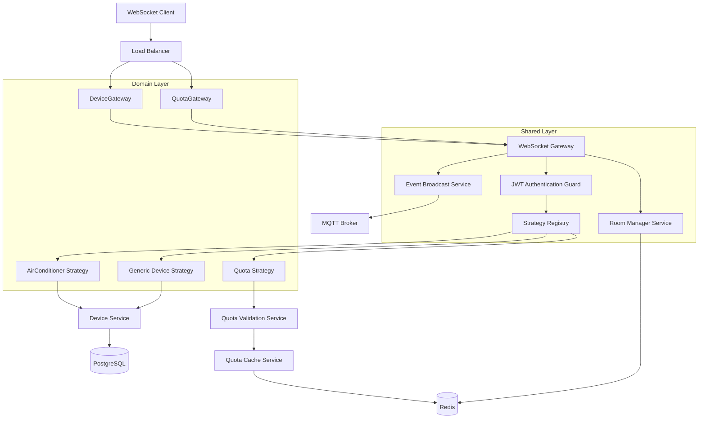
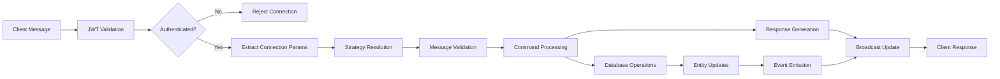
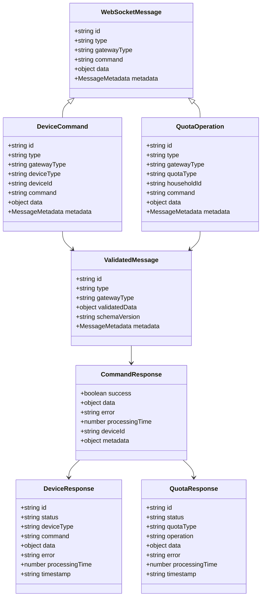
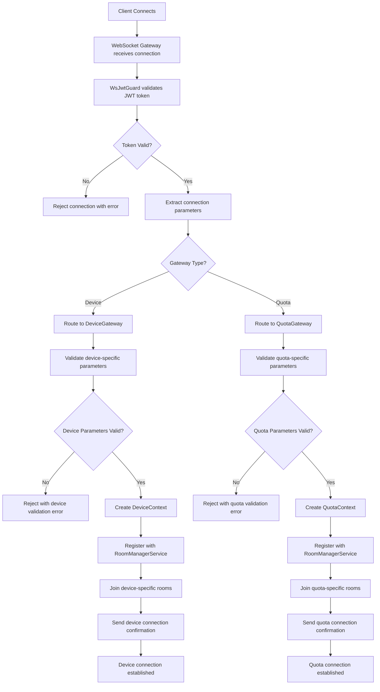
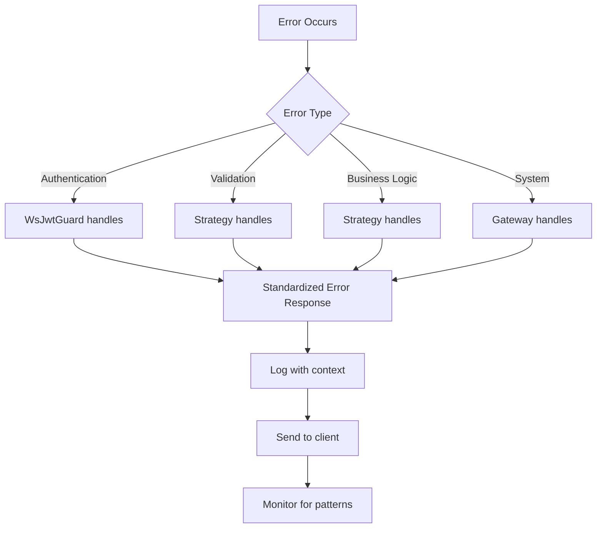

# WebSocket Gateway Refactoring - Technical Design Document

## Overview

This technical design document outlines the architecture for refactoring the WebSocket gateway system in the Mitsubishi Remote Control backend. The refactoring addresses gateway redundancy, implements the strategy pattern for device type handling, and establishes a maintainable WebSocket architecture with clear shared/domain separation that follows SOLID principles and NestJS best practices.

Decision (Option B): retain per-domain gateways and use a shared infrastructure module. No single unified `/ws/gateway` endpoint is introduced. Devices continue on `/ws/airconditioner`, quota on `/ws/quota`, each living in its feature module while relying on shared providers (auth, validation, streaming, session, performance, strategy registry).

### Current Architecture Issues

The existing implementation suffers from several architectural problems:

1. **Gateway Redundancy**: Multiple gateways serving similar purposes
   - Device gateways: `device.gateway.ts` and `airconditioner.gateway.ts` (both `/ws/airconditioner`)
   - Quota gateways: `quota.gateway.ts` and `quota-websocket.gateway.ts` (different approaches)

2. **Code Duplication**: Significant repetition in connection handling, authentication, and message routing

3. **Inconsistent Patterns**: Different gateways follow different architectural approaches

4. **Clean Code Violations**:
   - **DRY**: Duplicate authentication, validation, and routing logic
   - **SRP**: Gateways handling multiple responsibilities
   - **OCP**: Adding new device types requires modifying existing code
   - **DIP**: Concrete dependencies scattered throughout

### Design Goals

- **Consolidate** redundant gateways into focused components
- **Implement** strategy pattern for device-specific logic
- **Eliminate** code duplication while preserving functionality
- **Enable** easy addition of new device types without modifying existing code
- **Maintain** performance requirements (<500ms device, <200ms quota operations)
- **Follow** NestJS conventions and clean code principles
- **Establish** clear shared/domain separation with common gateway functionality

## Architecture Design

### System Architecture Diagram



### Data Flow Diagram



### Component Design

#### DeviceGateway

**Responsibilities:**
- Device-specific connection handling
- Device command routing and delegation
- Device response formatting
- Device-specific error handling
- Device state broadcasting

**Interfaces:**
```typescript
interface IDeviceGateway {
  handleDeviceConnection(client: Socket, context: WebSocketContext): Promise<void>
  routeDeviceCommand(client: Socket, command: DeviceCommand): Promise<DeviceResponse>
  broadcastDeviceUpdate(roomId: string, update: DeviceUpdate): Promise<void>
  getDeviceConnectionStats(): DeviceConnectionStats
}
```

**Dependencies:**
- WebSocket Gateway (common base functionality)
- Strategy Registry (for device type resolution)
- Device Service (for device operations)

#### QuotaGateway

**Responsibilities:**
- Quota-specific connection handling
- Quota operation routing and delegation
- Quota response formatting
- Quota validation and enforcement
- Quota state broadcasting

**Interfaces:**
```typescript
interface IQuotaGateway {
  handleQuotaConnection(client: Socket, context: WebSocketContext): Promise<void>
  routeQuotaOperation(client: Socket, operation: QuotaOperation): Promise<QuotaResponse>
  broadcastQuotaUpdate(householdId: string, update: QuotaUpdate): Promise<void>
  getQuotaConnectionStats(): QuotaConnectionStats
}
```

**Dependencies:**
- WebSocket Gateway (common base functionality)
- Strategy Registry (for quota operation resolution)
- Quota Validation Service (for quota enforcement)

#### WebSocket Gateway (Common)

**Responsibilities:**
- Base connection lifecycle management
- JWT authentication coordination
- Room management and client tracking
- Event broadcasting infrastructure
- Performance monitoring and logging
- Error handling and recovery

**Interfaces:**
```typescript
interface IWebSocketGateway {
  handleConnection(client: Socket): Promise<WebSocketContext>
  handleDisconnect(client: Socket): Promise<void>
  authenticateClient(client: Socket): Promise<AuthenticatedContext>
  joinRoom(client: Socket, roomId: string): Promise<void>
  leaveRoom(client: Socket, roomId: string): Promise<void>
  broadcastToRoom(roomId: string, event: string, data: any): Promise<void>
  getConnectionMetrics(): ConnectionMetrics
}
```

**Dependencies:**
- JWT Guard (for authentication)
- Room Manager Service (for connection management)
- Event Broadcast Service (for real-time updates)
- Error Handler Service (for consistent error handling)

#### Device Strategy Interface

**Responsibilities:**
- Device-specific command validation
- Business logic execution
- Response formatting
- Update broadcasting

**Interfaces:**
```typescript
interface IDeviceStrategy {
  readonly deviceType: string
  readonly supportedCommands: string[]

  validateCommand(message: unknown): Promise<ValidatedMessage>
  processCommand(message: ValidatedMessage, context: WebSocketContext): Promise<CommandResponse>
  broadcastUpdate(context: WebSocketContext, response: CommandResponse): Promise<void>
  getDeviceCapabilities(): DeviceCapabilities
}
```

#### Strategy Registry Service

**Responsibilities:**
- Strategy registration and resolution
- Dynamic strategy loading
- Strategy lifecycle management
- Performance monitoring

**Interfaces:**
```typescript
interface IStrategyRegistry {
  registerStrategy(strategy: IDeviceStrategy): void
  getStrategy(deviceType: string): IDeviceStrategy | undefined
  getSupportedDeviceTypes(): string[]
  unregisterStrategy(deviceType: string): boolean
}
```

## Data Model

### Core Data Structure Definitions

```typescript
// WebSocket Message
interface WebSocketMessage {
  id: string
  type: 'device_command' | 'quota_operation' | 'health_check'
  gatewayType: 'device' | 'quota'
  command: string
  data: Record<string, unknown>
  metadata: {
    roomId: string
    userId: string
    householdId: string
    timestamp: string
  }
}

// Device Command Message
interface DeviceCommand extends WebSocketMessage {
  type: 'device_command'
  gatewayType: 'device'
  deviceType: 'airconditioner' | 'generic'
  deviceId: string
}

// Quota Operation Message
interface QuotaOperation extends WebSocketMessage {
  type: 'quota_operation'
  gatewayType: 'quota'
  quotaType: 'daily' | 'monthly' | 'custom'
  householdId: string
}

// Validated Message (post-validation)
interface ValidatedMessage extends WebSocketMessage {
  validatedData: Record<string, unknown>
  schemaVersion: string
}

// Command Response (from strategies)
interface CommandResponse {
  success: boolean
  data?: unknown
  error?: string
  processingTime: number
  deviceId?: string
  metadata: Record<string, unknown>
}

// Device Response (to client)
interface DeviceResponse {
  id: string
  status: 'success' | 'error'
  deviceType: string
  command: string
  data?: unknown
  error?: string
  processingTime: number
  timestamp: string
}

// Quota Response (to client)
interface QuotaResponse {
  id: string
  status: 'success' | 'error'
  quotaType: string
  operation: string
  data?: unknown
  error?: string
  processingTime: number
  timestamp: string
}

// WebSocket Connection Context
interface WebSocketContext {
  socket: Socket
  user: {
    id: string
    email: string
    householdId: string
    familyMemberId: string
  }
  roomId: string
  familyMemberId: string
  lastActivity: Date
  connectedAt: Date
  metadata: {
    namespace: string
    userAgent: string
    ip: string
  }
}
```

### Data Model Diagrams



## Business Process

### Process 1: Client Connection and Authentication



### Process 2: Message Processing and Strategy Delegation

```mermaid
flowchart TD
    A[Client sends message] --> B{Message Type?}
    B -->|Device Command| C[DeviceGateway receives message]
    B -->|Quota Operation| D[QuotaGateway receives message]
    C --> E[Extract deviceType from message]
    D --> F[Extract quotaType from message]
    E --> G[StrategyRegistry.getStrategy(deviceType)]
    F --> H[StrategyRegistry.getStrategy(quotaType)]
    G --> I{Device Strategy Found?}
    H --> J{Quota Strategy Found?}
    I -->|No| K[Return error: Unsupported device type]
    J -->|No| L[Return error: Unsupported quota type]
    I -->|Yes| M[Device Strategy.validateCommand(message)]
    J -->|Yes| N[Quota Strategy.validateCommand(message)]
    M --> O{Device Validation Passed?}
    N --> P{Quota Validation Passed?}
    O -->|No| Q[Return device validation error]
    P -->|No| R[Return quota validation error]
    O -->|Yes| S[Device Strategy.processCommand(validatedMessage, context)]
    P -->|Yes| T[Quota Strategy.processCommand(validatedMessage, context)]
    S --> U[Execute device business logic]
    T --> V[Execute quota business logic]
    U --> W[Generate Device CommandResponse]
    V --> X[Generate Quota CommandResponse]
    W --> Y[Device Strategy.broadcastUpdate(context, response)]
    X --> Z[Quota Strategy.broadcastUpdate(context, response)]
    Y --> AA[Format DeviceResponse]
    Z --> BB[Format QuotaResponse]
    AA --> CC[Send device response to client]
    BB --> DD[Send quota response to client]
    CC --> EE[Log device processing metrics]
    DD --> FF[Log quota processing metrics]
```

### Process 3: Strategy Registration and Resolution

```mermaid
flowchart TD
    A[Application Startup] --> B[WebSocketModule initializes]
    B --> C[StrategyRegistry initializes]
    C --> D[Register AirConditionerStrategy in DeviceGateway]
    D --> E[Register DailyQuotaStrategy in QuotaGateway]
    E --> F[Register MonthlyQuotaStrategy in QuotaGateway]
    F --> G[Register GenericDeviceStrategy in DeviceGateway]
    G --> H[Strategy registry ready]
    H --> I[Message requires strategy]
    I --> J{Gateway Type?}
    J -->|Device| K[Extract deviceType from message]
    J -->|Quota| L[Extract quotaType from message]
    K --> M[registry.getStrategy(deviceType)]
    L --> N[registry.getStrategy(quotaType)]
    M --> O{Device Strategy exists?}
    N --> P{Quota Strategy exists?}
    O -->|No| Q[Throw UnsupportedDeviceType error]
    P -->|No| R[Throw UnsupportedQuotaType error]
    O -->|Yes| S[Return device strategy instance]
    P -->|Yes| T[Return quota strategy instance]
    S --> U[Use device strategy for processing]
    T --> V[Use quota strategy for processing]
```

## Error Handling Strategy

### Error Handling Hierarchy



### Error Response Format

```typescript
interface ErrorResponse {
  id: string
  status: 'error'
  error: {
    code: string
    message: string
    details?: unknown
    category: 'authentication' | 'validation' | 'business_logic' | 'system'
  }
  timestamp: string
  processingTime: number
}
```

### Error Categories and Handling

1. **Authentication Errors** (401)
   - Invalid JWT token
   - Expired token
   - Missing token

2. **Authorization Errors** (403)
   - Insufficient permissions
   - Room access denied
   - Device access denied

3. **Validation Errors** (400)
   - Invalid message format
   - Missing required fields
   - Invalid parameter values

4. **Business Logic Errors** (422)
   - Device not available
   - Quota exceeded
   - Invalid operation state

5. **System Errors** (500)
   - Database connection failed
   - Strategy resolution failed
   - Unexpected system errors

## Testing Strategy

### Unit Testing

**Strategy Tests:**
- Test each strategy in isolation
- Mock external dependencies
- Validate command processing logic
- Test error handling scenarios

```typescript
describe('AirConditionerStrategy', () => {
  let strategy: AirConditionerStrategy
  let mockDevicesService: jest.Mocked<DevicesService>

  beforeEach(() => {
    mockDevicesService = createMockDevicesService()
    strategy = new AirConditionerStrategy(mockDevicesService)
  })

  it('should validate SET_TEMPERATURE command correctly', async () => {
    const message = createValidTemperatureMessage()
    const result = await strategy.validateCommand(message)
    expect(result.validatedData.parameters.temperature).toBe(22)
  })
})
```

**Gateway Tests:**
- Test message routing logic
- Test strategy delegation
- Test error aggregation
- Test connection management

### Integration Testing

**Gateway-Strategy Integration:**
- Test complete message flow
- Test strategy resolution
- Test response formatting
- Test error propagation

**Database Integration:**
- Test strategy database operations
- Test transaction handling
- Test data consistency

### End-to-End Testing

**WebSocket Client Tests:**
- Test connection lifecycle
- Test real-time message exchange
- Test multi-client scenarios
- Test reconnection handling

### Performance Testing

**Load Testing:**
- 1000+ concurrent connections
- Message processing latency (<500ms)
- Memory usage monitoring
- CPU usage profiling

**Stress Testing:**
- Rapid message bursts
- Connection churn
- Resource exhaustion scenarios

## Performance Optimization

### Strategy Resolution Optimization

```typescript
class OptimizedStrategyRegistry {
  private strategyCache = new Map<string, IDeviceStrategy>()
  private cacheHits = 0
  private cacheMisses = 0

  getStrategy(deviceType: string): IDeviceStrategy {
    // Check cache first
    if (this.strategyCache.has(deviceType)) {
      this.cacheHits++
      return this.strategyCache.get(deviceType)!
    }

    // Resolve and cache
    this.cacheMisses++
    const strategy = this.resolveStrategy(deviceType)
    if (strategy) {
      this.strategyCache.set(deviceType, strategy)
    }

    return strategy
  }
}
```

### Connection Pool Management

- Redis adapter for multi-instance scaling
- Connection reuse and pooling
- Lazy loading of strategies
- Periodic cleanup of inactive connections

### Message Batching

```typescript
class MessageBatcher {
  private batchQueue: Array<{ message: any; client: Socket }> = []
  private batchTimer: NodeJS.Timeout | null = null

  addToBatch(message: any, client: Socket): void {
    this.batchQueue.push({ message, client })

    if (!this.batchTimer) {
      this.batchTimer = setTimeout(() => {
        this.processBatch()
      }, 10) // 10ms batch window
    }
  }

  private processBatch(): void {
    // Process batched messages efficiently
    const batch = this.batchQueue.splice(0)
    // Batch processing logic
    this.batchTimer = null
  }
}
```

## Security Considerations

### Authentication and Authorization

**JWT Authentication:**
- Reuse existing WsJwtGuard
- Token validation on every connection
- Automatic token refresh support
- Logout and token revocation handling

**Room-based Authorization:**
- Validate user access to rooms
- Device access control per room
- Household membership verification
- Role-based permission checking

### Input Validation

**Message Schema Validation:**
- Type-safe message parsing
- Parameter sanitization
- SQL injection prevention
- XSS protection

```typescript
class MessageValidator {
  async validateMessage(message: unknown): Promise<ValidatedMessage> {
    // Schema validation
    const schema = z.object({
      id: z.string(),
      type: z.enum(['device_command', 'quota_operation', 'health_check']),
      deviceType: z.string(),
      command: z.string(),
      data: z.record(z.unknown()),
    })

    const validated = await schema.parseAsync(message)
    return new ValidatedMessage(validated)
  }
}
```

### Rate Limiting

```typescript
class RateLimiter {
  private connectionLimits = new Map<string, number>()

  checkRateLimit(clientId: string, limit: number = 100): boolean {
    const current = this.connectionLimits.get(clientId) || 0
    if (current >= limit) {
      return false
    }
    this.connectionLimits.set(clientId, current + 1)

    // Reset counter every minute
    setTimeout(() => {
      this.connectionLimits.delete(clientId)
    }, 60000)

    return true
  }
}
```

## Deployment and Monitoring

### Health Checks

```typescript
@SubscribeMessage('health')
handleHealthCheck(): HealthResponse {
  return {
    status: 'healthy',
    timestamp: new Date().toISOString(),
    gateway: 'websocket-gateway',
    metrics: {
      connectionCount: this.connectionCount,
      deviceGatewayConnections: this.deviceGateway.getConnectionCount(),
      quotaGatewayConnections: this.quotaGateway.getConnectionCount(),
      activeStrategies: this.strategyRegistry.getSupportedDeviceTypes().length,
      averageResponseTime: this.getAverageResponseTime(),
      errorRate: this.getErrorRate(),
    },
  }
}
```

### Metrics Collection

**Performance Metrics:**
- Connection count and duration
- Message processing latency
- Strategy execution time
- Error rates by category
- Memory and CPU usage

**Business Metrics:**
- Device command frequency
- Quota operation volume
- Active rooms and households
- Peak usage patterns

### Logging Strategy

```typescript
class StructuredLogger {
  logMessageProcessing(context: {
    messageId: string
    deviceType: string
    command: string
    processingTime: number
    success: boolean
    error?: string
  }): void {
    this.logger.info('Message processed', {
      messageId: context.messageId,
      deviceType: context.deviceType,
      command: context.command,
      processingTime: context.processingTime,
      success: context.success,
      error: context.error,
      timestamp: new Date().toISOString(),
    })
  }
}
```

## Migration Strategy

### Phase 1: Foundation Setup (Week 1)

1. **Create Common Layer**
   - Create `shared/websocket-gateway/` module
   - Implement `WebSocketGateway` service
   - Define base interfaces and classes

2. **Create Strategy Interfaces and Registry**
   - Define `IDeviceStrategy` and `IQuotaStrategy` interfaces
   - Implement `StrategyRegistry` service
   - Create base strategy classes

3. **Create Domain Gateway Modules**
   - Create `devices/` module with `DeviceGateway`
   - Create `quotas/` module with `QuotaGateway`
   - Set up module dependencies on shared gateway functionality

### Phase 2: Strategy Implementation (Week 2-3)

1. **Extract Air Conditioner Logic**
   - Create `AirConditionerStrategy`
   - Move logic from `airconditioner.gateway.ts`
   - Test strategy in isolation

2. **Extract Quota Logic**
   - Create `QuotaStrategy`
   - Move logic from `quota.gateway.ts`
   - Test strategy in isolation

### Phase 3: Integration and Testing (Week 4)

1. **Integrate Domain Gateways with Common Layer**
   - Wire up DeviceGateway with WebSocketGateway
   - Wire up QuotaGateway with WebSocketGateway
   - Test cross-gateway strategy resolution
   - Validate response formatting for both gateway types

2. **Comprehensive Testing**
   - Unit tests for all strategies
   - Integration tests for domain gateways
   - Common layer testing
   - End-to-end workflow tests for both device and quota flows

### Phase 4: Migration and Cleanup (Week 5)

1. **Gradual Migration**
   - Deploy DeviceGateway and QuotaGateway alongside existing gateways
   - Route device traffic to DeviceGateway
   - Route quota traffic to QuotaGateway
   - Monitor performance and errors for each gateway type

2. **Remove Redundant Gateways**
   - Decommission `device.gateway.ts` (replaced by DeviceGateway)
   - Decommission `quota-websocket.gateway.ts` (replaced by QuotaGateway)
   - Clean up unused code and dependencies

### Phase 5: Optimization and Monitoring (Week 6)

1. **Performance Optimization**
   - Optimize strategy caching
   - Fine-tune connection pooling
   - Optimize message batching

2. **Monitoring and Alerting**
   - Set up performance dashboards
   - Configure error alerts
   - Document operational procedures

## Success Metrics and Validation

### Quantitative Metrics

| Metric | Target | Measurement Method |
|--------|--------|-------------------|
| Code Reduction | 30% fewer LOC | SLOC analysis before/after |
| Response Time | <500ms (device), <200ms (quota) | Performance monitoring |
| Memory Usage | <20% increase | Memory profiling |
| Error Rate | <1% of requests | Error tracking |
| Test Coverage | >90% | Coverage reports |

### Qualitative Metrics

- **Developer Experience**: Survey developers on ease of adding new device types
- **Code Review Efficiency**: Measure time spent reviewing WebSocket changes
- **System Stability**: Track incident frequency and resolution time
- **Onboarding Time**: Measure time for new developers to understand WebSocket architecture

### Acceptance Criteria Validation

1. **Gateway Consolidation**: ✅ Single DeviceGateway and single QuotaGateway with common functionality
2. **Common/Domain Separation**: ✅ Clear separation between common gateway functionality and domain-specific gateways
3. **Strategy Pattern**: ✅ New device types require only strategy implementation
4. **Performance**: ✅ All response time targets met
5. **Backward Compatibility**: ✅ Existing clients continue to function
6. **Code Quality**: ✅ Clean code principles followed throughout
7. **Naming Consistency**: ✅ All "Unified" references removed, clear and direct naming established

## RxJS Streaming Architecture

### Overview

The WebSocket gateway refactoring incorporates RxJS reactive programming patterns to handle real-time data streaming, backpressure management, and complex event processing. RxJS observables provide a powerful abstraction for managing asynchronous WebSocket events, enabling sophisticated streaming patterns while maintaining clean, testable code.

### Reactive Design Principles

**Observable Streams as First-Class Citizens:**
- All WebSocket events are converted to RxJS observable streams
- Device and quota operations are modeled as observable transformations
- Real-time aggregations use RxJS operators for efficient computation
- Error handling is centralized through RxJS error operators

**Backpressure and Flow Control:**
- Buffering strategies for high-frequency events using `bufferTime` and `bufferCount`
- Throttling and debouncing for resource-intensive operations
- Drop strategies for non-critical events during system overload
- Adaptive backpressure based on system capacity and client capabilities

**Memory Management and Resource Cleanup:**
- Automatic subscription cleanup on socket disconnection
- Subscription tracking for debugging and monitoring
- Proper operator chaining to prevent memory leaks
- Resource pooling for expensive operations

### Device Gateway Streaming Patterns

#### Device Status Aggregation Pattern

```typescript
@Injectable()
export class DeviceStatusAggregationService {
  private readonly deviceStatusStreams = new Map<string, Observable<DeviceStatus>>();
  private readonly aggregationStreams = new Map<string, Observable<AggregatedDeviceStatus>>();

  constructor(
    private readonly devicesService: DevicesService,
    private readonly webSocketGateway: WebSocketGateway,
  ) {}

  // Create observable stream for device status updates
  createDeviceStatusStream(deviceId: string): Observable<DeviceStatus> {
    return this.webSocketGateway.getDeviceEvents(deviceId).pipe(
      // Filter for status-related events
      filter(event => event.type === 'status_update'),
      // Transform to device status
      map(event => this.transformToDeviceStatus(event)),
      // Handle errors gracefully
      catchError(error => {
        console.error(`Device ${deviceId} status stream error:`, error);
        return of(this.createErrorStatus(deviceId, error));
      }),
      // Retry on connection issues
      retry({ count: 3, delay: 1000 }),
      // Share across multiple subscribers
      shareReplay({ bufferSize: 1, refCount: true }),
    );
  }

  // Aggregate status across multiple devices in a room
  createRoomAggregationStream(roomId: string): Observable<AggregatedDeviceStatus> {
    const deviceStreams$ = this.devicesService.getDevicesByRoom(roomId).pipe(
      map(devices =>
        devices.map(device => this.getOrCreateDeviceStream(device.id))
      ),
    );

    return deviceStreams$.pipe(
      switchMap(deviceStreams =>
        combineLatest(deviceStreams).pipe(
          map(statuses => this.aggregateDeviceStatuses(statuses)),
          // Debounce rapid changes to reduce noise
          debounceTime(200),
          // Only emit when aggregation actually changes
          distinctUntilChanged((prev, curr) =>
            JSON.stringify(prev) === JSON.stringify(curr)
          ),
        )
      ),
      // Handle room-level errors
      catchError(error => {
        console.error(`Room ${roomId} aggregation error:`, error);
        return of(this.createErrorAggregation(roomId, error));
      }),
      shareReplay({ bufferSize: 1, refCount: true }),
    );
  }

  private transformToDeviceStatus(event: DeviceEvent): DeviceStatus {
    return {
      deviceId: event.deviceId,
      status: event.data.status,
      lastUpdated: event.timestamp,
      properties: event.data.properties || {},
      health: this.calculateDeviceHealth(event),
    };
  }

  private aggregateDeviceStatuses(statuses: DeviceStatus[]): AggregatedDeviceStatus {
    const onlineDevices = statuses.filter(s => s.status === 'online');
    const totalDevices = statuses.length;
    const healthScore = statuses.reduce((sum, s) => sum + s.health, 0) / totalDevices;

    return {
      totalDevices,
      onlineDevices: onlineDevices.length,
      offlineDevices: totalDevices - onlineDevices.length,
      healthScore: Math.round(healthScore * 100) / 100,
      lastUpdated: new Date().toISOString(),
      deviceBreakdown: statuses.reduce((acc, status) => {
        acc[status.deviceId] = status;
        return acc;
      }, {} as Record<string, DeviceStatus>),
    };
  }
}
```

#### Command Processing Pipeline Pattern

```typescript
@Injectable()
export class DeviceCommandPipelineService {
  constructor(
    private readonly validationService: CommandValidationService,
    private readonly executionService: CommandExecutionService,
    private readonly monitoringService: MonitoringService,
  ) {}

  // Create reactive command processing pipeline
  createCommandPipeline(context: WebSocketContext): Observable<CommandResult> {
    return this.getCommandStream(context).pipe(
      // Validate commands before processing
      mergeMap(command => this.validateCommand(command, context)),
      // Process validated commands
      mergeMap(validatedCommand => this.processCommand(validatedCommand, context)),
      // Track processing metrics
      tap(result => this.trackMetrics(result)),
      // Handle processing errors
      catchError(error => this.handleCommandError(error, context)),
      // Buffer rapid commands to prevent overwhelming
      bufferTime(100, null, 10), // Max 10 commands per 100ms
      mergeMap(buffer => buffer), // Process buffered commands
      // Share results across multiple subscribers
      share(),
    );
  }

  // High-frequency command processing with backpressure
  createHighFrequencyPipeline(context: WebSocketContext): Observable<CommandResult> {
    return this.getCommandStream(context).pipe(
      // Apply backpressure - drop excess commands
      auditTime(50), // Process at most 1 command every 50ms
      // Validate with timeout to prevent hanging
      mergeMap(command =>
        this.validateCommand(command, context).pipe(
          timeout(1000), // 1 second validation timeout
          catchError(error => of(this.createTimeoutResult(command, error)))
        )
      ),
      // Execute with concurrency limit
      mergeMap(validatedCommand =>
        this.processCommand(validatedCommand, context).pipe(
          timeout(5000), // 5 second execution timeout
          catchError(error => of(this.createTimeoutResult(validatedCommand.command, error)))
        ),
        5 // Max 5 concurrent commands
      ),
      // Track performance metrics
      tap(result => this.monitoringService.recordCommandMetrics(result)),
      share(),
    );
  }

  private validateCommand(command: DeviceCommand, context: WebSocketContext): Observable<ValidatedCommand> {
    return from(this.validationService.validate(command, context)).pipe(
      map(validationResult => ({
        command,
        validationResult,
        context,
        timestamp: new Date().toISOString(),
      })),
      catchError(error => {
        throw new CommandValidationError(`Validation failed: ${error.message}`, error);
      }),
    );
  }

  private processCommand(validatedCommand: ValidatedCommand, context: WebSocketContext): Observable<CommandResult> {
    return from(this.executionService.execute(validatedCommand.command, context)).pipe(
      map(executionResult => ({
        success: true,
        result: executionResult,
        command: validatedCommand.command,
        processingTime: Date.now() - new Date(validatedCommand.timestamp).getTime(),
        context,
      })),
      catchError(error => {
        throw new CommandExecutionError(`Execution failed: ${error.message}`, error);
      }),
    );
  }
}
```

#### Real-time Device Monitoring Pattern

```typescript
@Injectable()
export class DeviceMonitoringService {
  private readonly monitoringStreams = new Map<string, Observable<DeviceMetrics>>();
  private readonly alertStreams = new Map<string, Observable<DeviceAlert>>();

  constructor(
    private readonly metricsCollector: MetricsCollector,
    private readonly alertingService: AlertingService,
  ) {}

  // Create real-time device monitoring stream
  createMonitoringStream(deviceId: string): Observable<DeviceMetrics> {
    return this.getDeviceEventStream(deviceId).pipe(
      // Transform events to metrics
      map(event => this.eventToMetrics(event)),
      // Sliding window for time-based aggregations
      scan((acc, metrics) => this.updateMetricsWindow(acc, metrics), {
        windowSize: 60, // 60-second window
        samples: [] as DeviceMetrics[],
      } as MetricsWindow),
      // Calculate rolling statistics
      map(window => this.calculateRollingStats(window)),
      // Detect anomalies using statistical analysis
      map(metrics => this.detectAnomalies(metrics)),
      // Emit metrics at regular intervals
      sampleTime(1000), // Emit every second
      distinctUntilChanged((prev, curr) =>
        JSON.stringify(prev.stats) === JSON.stringify(curr.stats)
      ),
      shareReplay({ bufferSize: 1, refCount: true }),
    );
  }

  // Create alerting stream for device issues
  createAlertingStream(deviceId: string): Observable<DeviceAlert> {
    return this.createMonitoringStream(deviceId).pipe(
      // Filter for anomaly conditions
      filter(metrics => metrics.anomalies.length > 0),
      // Transform anomalies to alerts
      map(metrics => this.createAlertsFromAnomalies(deviceId, metrics.anomalies)),
      // Flatten array of alerts
      mergeMap(alerts => from(alerts)),
      // Debounce similar alerts to prevent spam
      groupBy(alert => alert.type),
      mergeMap(group$ =>
        group$.pipe(
          debounceTime(5000), // 5 seconds between similar alerts
        )
      ),
      // Enforce alert rate limits
      throttleTime(10000), // Max 1 alert every 10 seconds per device
      share(),
    );
  }

  // Multi-device health monitoring
  createRoomHealthStream(roomId: string): Observable<RoomHealthMetrics> {
    const deviceStreams$ = this.getDeviceIdsByRoom(roomId).pipe(
      map(deviceIds =>
        deviceIds.map(deviceId => this.createMonitoringStream(deviceId))
      ),
    );

    return deviceStreams$.pipe(
      switchMap(deviceStreams =>
        combineLatest(deviceStreams).pipe(
          map(deviceMetrics => this.calculateRoomHealth(deviceMetrics)),
          // Health updates only when significant changes occur
          distinctUntilChanged((prev, curr) =>
            Math.abs(prev.healthScore - curr.healthScore) < 0.05
          ),
          sampleTime(5000), // Update room health every 5 seconds
        )
      ),
      shareReplay({ bufferSize: 1, refCount: true }),
    );
  }

  private calculateRollingStats(window: MetricsWindow): DeviceMetrics {
    const samples = window.samples;
    if (samples.length === 0) {
      return this.createEmptyMetrics();
    }

    const cpuValues = samples.map(s => s.cpuUsage);
    const memoryValues = samples.map(s => s.memoryUsage);
    const responseTimeValues = samples.map(s => s.responseTime);

    return {
      deviceId: samples[0].deviceId,
      timestamp: new Date().toISOString(),
      cpuUsage: {
        current: cpuValues[cpuValues.length - 1],
        average: cpuValues.reduce((a, b) => a + b) / cpuValues.length,
        max: Math.max(...cpuValues),
        min: Math.min(...cpuValues),
      },
      memoryUsage: {
        current: memoryValues[memoryValues.length - 1],
        average: memoryValues.reduce((a, b) => a + b) / memoryValues.length,
        max: Math.max(...memoryValues),
        min: Math.min(...memoryValues),
      },
      responseTime: {
        current: responseTimeValues[responseTimeValues.length - 1],
        average: responseTimeValues.reduce((a, b) => a + b) / responseTimeValues.length,
        p95: this.calculatePercentile(responseTimeValues, 0.95),
        p99: this.calculatePercentile(responseTimeValues, 0.99),
      },
      anomalies: [],
    };
  }
}
```

### Quota Gateway Streaming Patterns

#### Quota Usage Calculation Pattern

```typescript
@Injectable()
export class QuotaUsageCalculationService {
  private readonly usageStreams = new Map<string, Observable<QuotaUsage>>();
  private readonly predictionStreams = new Map<string, Observable<QuotaPrediction>>;

  constructor(
    private readonly usageDataService: UsageDataService,
    private readonly predictionEngine: PredictionEngine,
  ) {}

  // Create real-time quota usage calculation stream
  createUsageStream(quotaId: string, timeWindow: number = 3600): Observable<QuotaUsage> {
    return this.getUsageEventsStream(quotaId).pipe(
      // Buffer events into time windows
      bufferTime(5000), // 5-second buffers
      mergeMap(events => this.processUsageBuffer(events)),
      // Calculate rolling usage over time window
      scan((acc, usage) => this.updateUsageWindow(acc, usage), {
        quotaId,
        timeWindow,
        usagePoints: [] as UsagePoint[],
        currentUsage: 0,
        projectedUsage: 0,
      } as UsageWindow),
      // Calculate usage statistics
      map(window => this.calculateUsageStats(window)),
      // Detect usage patterns and trends
      map(usage => this.detectUsagePatterns(usage)),
      // Emit updates when usage changes significantly
      distinctUntilChanged((prev, curr) =>
        Math.abs(prev.currentUsage - curr.currentUsage) < 0.01
      ),
      shareReplay({ bufferSize: 1, refCount: true }),
    );
  }

  // Create predictive usage stream
  createPredictionStream(quotaId: string): Observable<QuotaPrediction> {
    return this.createUsageStream(quotaId).pipe(
      // Collect historical data for prediction
      scan((acc, usage) => this.collectHistoricalData(acc, usage), {
        historicalData: [] as UsagePoint[],
        models: new Map<string, PredictionModel>(),
      } as PredictionContext),
      // Update prediction models periodically
      sampleTime(300000), // Update every 5 minutes
      mergeMap(context => this.generatePredictions(context)),
      // Filter for significant predictions
      filter(prediction => prediction.confidence > 0.7),
      // Alert on concerning predictions
      tap(prediction => {
        if (prediction.riskLevel === 'HIGH') {
          this.alertHighUsageRisk(prediction);
        }
      }),
      share(),
    );
  }

  // Multi-quota aggregation for household-level monitoring
  createHouseholdUsageStream(householdId: string): Observable<HouseholdUsage> {
    const quotaStreams$ = this.getQuotaIdsByHousehold(householdId).pipe(
      map(quotaIds =>
        quotaIds.map(quotaId => this.createUsageStream(quotaId))
      ),
    );

    return quotaStreams$.pipe(
      switchMap(quotaStreams =>
        combineLatest(quotaStreams).pipe(
          map(quotaUsages => this.aggregateQuotaUsage(quotaUsages)),
          // Calculate household-level efficiency metrics
          map(usage => ({
            ...usage,
            efficiencyScore: this.calculateEfficiencyScore(usage),
            recommendations: this.generateOptimizationRecommendations(usage),
          })),
          sampleTime(10000), // Update every 10 seconds
        )
      ),
      shareReplay({ bufferSize: 1, refCount: true }),
    );
  }

  private processUsageBuffer(events: UsageEvent[]): Observable<UsagePoint> {
    return from(events).pipe(
      // Group by resource type
      groupBy(event => event.resourceType),
      mergeMap(group$ =>
        group$.pipe(
          // Calculate usage per resource type
          reduce((acc, event) => ({
            resourceType: event.resourceType,
            amount: acc.amount + event.amount,
            count: acc.count + 1,
            timestamp: event.timestamp,
          }), { resourceType: '', amount: 0, count: 0, timestamp: '' })
        )
      ),
      toArray(),
      map(resourceUsages => ({
        timestamp: new Date().toISOString(),
        totalUsage: resourceUsages.reduce((sum, usage) => sum + usage.amount, 0),
        resourceBreakdown: resourceUsages.reduce((acc, usage) => {
          acc[usage.resourceType] = usage.amount;
          return acc;
        }, {} as Record<string, number>),
        eventCount: resourceUsages.reduce((sum, usage) => sum + usage.count, 0),
      })),
    );
  }
}
```

#### Override Workflow Pattern

```typescript
@Injectable()
export class QuotaOverrideWorkflowService {
  constructor(
    private readonly overrideService: OverrideService,
    private readonly notificationService: NotificationService,
    private readonly approvalService: ApprovalService,
  ) {}

  // Create reactive override workflow stream
  createOverrideWorkflowStream(): Observable<OverrideWorkflowEvent> {
    return this.getOverrideRequestStream().pipe(
      // Process override requests through workflow
      mergeMap(request => this.processOverrideWorkflow(request)),
      // Track workflow state changes
      scan((workflow, event) => this.updateWorkflowState(workflow, event), {
        activeOverrides: new Map<string, OverrideState>(),
        pendingApprovals: new Map<string, PendingApproval>(),
        completedOverrides: [] as CompletedOverride[],
      } as WorkflowState),
      // Emit workflow events
      mergeMap(workflow => this.generateWorkflowEvents(workflow)),
      // Handle workflow timeouts
      mergeMap(event => this.handleWorkflowTimeouts(event)),
      share(),
    );
  }

  // Create approval processing stream
  createApprovalStream(approverId: string): Observable<ApprovalEvent> {
    return this.getApprovalRequests(approverId).pipe(
      // Filter for pending approvals
      filter(request => request.status === 'PENDING'),
      // Process approvals with timeout
      mergeMap(request =>
        this.processApproval(request).pipe(
          timeout(300000), // 5 minute approval timeout
          catchError(error => this.handleApprovalTimeout(request, error))
        )
      ),
      // Track approval metrics
      tap(approval => this.trackApprovalMetrics(approval)),
      // Notify stakeholders
      mergeMap(approval => this.notifyApprovalOutcome(approval)),
      share(),
    );
  }

  // Real-time override monitoring
  createOverrideMonitoringStream(): Observable<OverrideMetrics> {
    return this.createOverrideWorkflowStream().pipe(
      // Calculate override statistics
      scan((metrics, event) => this.calculateOverrideMetrics(metrics, event), {
        totalRequests: 0,
        approvedRequests: 0,
        rejectedRequests: 0,
        pendingRequests: 0,
        averageProcessingTime: 0,
        overrideTypes: new Map<string, number>(),
      } as OverrideMetrics),
      // Update processing time averages
      map(metrics => this.updateProcessingTimeMetrics(metrics)),
      // Detect unusual patterns
      map(metrics => this.detectUnusualPatterns(metrics)),
      // Emit metrics updates
      sampleTime(30000), // Update every 30 seconds
      distinctUntilChanged((prev, curr) =>
        prev.totalRequests === curr.totalRequests &&
        prev.pendingRequests === curr.pendingRequests
      ),
      shareReplay({ bufferSize: 1, refCount: true }),
    );
  }

  private processOverrideWorkflow(request: OverrideRequest): Observable<OverrideWorkflowEvent> {
    return of(request).pipe(
      // Validate override request
      mergeMap(req => this.validateOverrideRequest(req)),
      // Check for duplicate requests
      mergeMap(validatedReq => this.checkForDuplicates(validatedReq)),
      // Route to appropriate workflow
      mergeMap(req => this.routeToWorkflow(req)),
      // Track workflow progress
      tap(event => this.trackWorkflowProgress(event)),
      // Handle errors in workflow
      catchError(error => this.handleWorkflowError(request, error)),
    );
  }

  private routeToWorkflow(request: OverrideRequest): Observable<OverrideWorkflowEvent> {
    switch (request.type) {
      case 'AUTO_APPROVED':
        return this.processAutoApprovedOverride(request);
      case 'MANUAL_APPROVAL':
        return this.processManualApprovalOverride(request);
      case 'ESCALATION':
        return this.processEscalationOverride(request);
      default:
        return this.handleUnknownOverrideType(request);
    }
  }
}
```

#### Real-time Quota Monitoring Pattern

```typescript
@Injectable()
export class QuotaMonitoringService {
  private readonly monitoringStreams = new Map<string, Observable<QuotaStatus>>();
  private readonly alertStreams = new Map<string, Observable<QuotaAlert>>;

  constructor(
    private readonly quotaService: QuotaService,
    private readonly alertingService: AlertingService,
    private readonly analyticsService: AnalyticsService,
  ) {}

  // Create comprehensive quota monitoring stream
  createQuotaMonitoringStream(quotaId: string): Observable<QuotaStatus> {
    return combineLatest([
      this.createUsageStream(quotaId),
      this.createLimitStream(quotaId),
      this.createPolicyStream(quotaId),
    ]).pipe(
      map(([usage, limits, policies]) => ({
        quotaId,
        usage,
        limits,
        policies,
        timestamp: new Date().toISOString(),
        utilizationRate: this.calculateUtilizationRate(usage, limits),
        riskLevel: this.calculateRiskLevel(usage, limits, policies),
        timeRemaining: this.calculateTimeRemaining(limits),
      })),
      // Apply real-time policy enforcement
      map(status => this.enforcePolicies(status)),
      // Generate proactive alerts
      mergeMap(status => this.generateProactiveAlerts(status)),
      // Track quota efficiency
      map(status => this.trackEfficiency(status)),
      // Emit status updates
      distinctUntilChanged((prev, curr) =>
        prev.utilizationRate === curr.utilizationRate &&
        prev.riskLevel === curr.riskLevel
      ),
      shareReplay({ bufferSize: 1, refCount: true }),
    );
  }

  // Create intelligent alerting stream
  createIntelligentAlertingStream(quotaId: string): Observable<QuotaAlert> {
    return this.createQuotaMonitoringStream(quotaId).pipe(
      // Generate alerts based on multiple conditions
      mergeMap(status => this.generateMultiConditionAlerts(status)),
      // Apply machine learning for alert optimization
      mergeMap(alerts => this.optimizeAlertsWithML(alerts)),
      // Prevent alert fatigue
      groupBy(alert => alert.type),
      mergeMap(group$ =>
        group$.pipe(
          // Adaptive debouncing based on alert severity
          debounceTime(alert => this.getDebounceTime(alert.severity)),
          // Rate limiting per alert type
          throttleTime(alert => this.getThrottleTime(alert.type)),
        )
      ),
      // Enrich alerts with context
      map(alert => this.enrichAlertWithContext(alert)),
      // Prioritize critical alerts
      sortBy(alert => alert.severity),
      share(),
    );
  }

  // Predictive quota management
  createPredictiveManagementStream(quotaId: string): Observable<PredictiveAction> {
    return this.createQuotaMonitoringStream(quotaId).pipe(
      // Collect historical data for predictions
      scan((context, status) => this.collectHistoricalContext(context, status), {
        history: [] as QuotaStatus[],
        patterns: new Map<string, UsagePattern>(),
        predictions: [] as Prediction[],
      } as PredictiveContext),
      // Generate predictions using ML models
      sampleTime(60000), // Analyze every minute
      mergeMap(context => this.generatePredictions(context)),
      // Recommend proactive actions
      map(predictions => this.recommendActions(predictions)),
      // Filter for high-confidence recommendations
      filter(action => action.confidence > 0.8),
      // Validate actions against policies
      mergeMap(action => this.validateActionAgainstPolicies(action)),
      share(),
    );
  }

  private calculateRiskLevel(usage: QuotaUsage, limits: QuotaLimits, policies: QuotaPolicies): RiskLevel {
    const utilizationRate = usage.currentUsage / limits.hardLimit;
    const trendRate = this.calculateUsageTrend(usage);
    const bufferZone = policies.bufferZone || 0.1;

    if (utilizationRate > 0.9) return 'CRITICAL';
    if (utilizationRate > 0.8) return 'HIGH';
    if (utilizationRate > (0.7 - bufferZone) && trendRate > 0.1) return 'MEDIUM';
    return 'LOW';
  }

  private generateMultiConditionAlerts(status: QuotaStatus): Observable<QuotaAlert[]> {
    const alerts: QuotaAlert[] = [];

    // Utilization-based alerts
    if (status.utilizationRate > 0.9) {
      alerts.push(this.createUtilizationAlert(status, 'CRITICAL'));
    } else if (status.utilizationRate > 0.8) {
      alerts.push(this.createUtilizationAlert(status, 'HIGH'));
    }

    // Trend-based alerts
    const trend = this.calculateUsageTrend(status.usage);
    if (trend > 0.2) {
      alerts.push(this.createTrendAlert(status, 'WARNING'));
    }

    // Policy-based alerts
    if (status.policies.enforcementMode === 'STRICT' && status.utilizationRate > 0.7) {
      alerts.push(this.createPolicyAlert(status, 'INFO'));
    }

    return from(alerts);
  }
}
```

### RxJS Operator Usage Examples

#### Core Operator Patterns

```typescript
// Error handling and retry logic
export class RobustWebSocketService {
  createRobustConnection(): Observable<WebSocketMessage> {
    return this.createWebSocketConnection().pipe(
      // Retry with exponential backoff
      retryWhen(errors =>
        errors.pipe(
          delay(1000),
          take(5),
          concat(throwError(new Error('Max retry attempts exceeded')))
        )
      ),
      // Timeout for individual operations
      timeout(30000),
      // Graceful error handling
      catchError(error => {
        console.error('WebSocket connection error:', error);
        return this.createFallbackConnection();
      }),
      // Ensure only one subscription
      share(),
    );
  }

  // Complex data transformation pipeline
  createDataProcessingPipeline(): Observable<ProcessedData> {
    return this.getRawDataStream().pipe(
      // Filter valid data
      filter(data => this.isValidData(data)),
      // Transform to normalized format
      map(data => this.normalizeData(data)),
      // Enrich with additional context
      mergeMap(data => this.enrichWithData(data)),
      // Group by category for batch processing
      groupBy(data => data.category),
      mergeMap(group$ =>
        group$.pipe(
          // Buffer within categories
          bufferTime(5000, null, 100),
          // Process batches
          mergeMap(batch => this.processBatch(batch)),
        )
      ),
      // Deduplicate results
      distinctUntilKeyChanged('id'),
      // Final validation
      filter(data => this.isValidProcessedData(data)),
      shareReplay({ bufferSize: 10, refCount: true }),
    );
  }

  // Real-time analytics with sliding windows
  createAnalyticsStream(): Observable<AnalyticsData> {
    return this.getEventStream().pipe(
      // Create sliding window for time-series analysis
      windowTime(60000), // 1-minute windows
      mergeMap(window$ =>
        window$.pipe(
          // Calculate metrics within window
          reduce((acc, event) => this.updateMetrics(acc, event), {
            count: 0,
            sum: 0,
            min: Infinity,
            max: -Infinity,
            events: [] as Event[],
          }),
          // Calculate derived metrics
          map(metrics => this.calculateDerivedMetrics(metrics)),
        )
      ),
      // Detect anomalies using statistical analysis
      map(data => this.detectAnomalies(data)),
      // Trigger alerts on significant changes
      filter(data => data.hasAnomalies),
      share(),
    );
  }
}
```

#### Performance Optimization Patterns

```typescript
// Memory-efficient streaming with backpressure
export class PerformanceOptimizedService {
  createHighVolumeStream(): Observable<ProcessedEvent> {
    return this.getHighVolumeEventStream().pipe(
      // Apply backpressure - drop excess events
      auditTime(100),
      // Batch processing for efficiency
      bufferCount(50, 1000), // Batch 50 or wait 1 second
      mergeMap(batch => from(batch).pipe(
        // Parallel processing with concurrency limit
        mergeMap(event => this.processEvent(event), 10),
        // Error isolation per event
        catchError(error => of(this.createErrorEvent(error))),
      )),
      // Memory management - limit buffer size
      takeUntil(this.shutdown$),
      // Cleanup on completion
      finalize(() => this.cleanupResources()),
      share(),
    );
  }

  // Adaptive performance tuning
  createAdaptiveStream(): Observable<AdaptiveData> {
    return this.getDataStream().pipe(
      // Monitor performance and adapt
      scan((state, data) => this.adaptProcessing(state, data), {
        bufferSize: 100,
        concurrency: 5,
        processingTime: 0,
      } as AdaptiveState),
      // Adjust parameters based on performance
      switchMap(state => this.createOptimizedStream(state)),
      // Continuous performance monitoring
      tap(data => this.updatePerformanceMetrics(data)),
      shareReplay({ bufferSize: 1, refCount: true }),
    );
  }

  private adaptProcessing(state: AdaptiveState, data: any): AdaptiveState {
    const currentTime = performance.now();
    const processingTime = currentTime - state.processingTime;

    // Adjust concurrency based on processing time
    if (processingTime > 1000) {
      state.concurrency = Math.max(1, state.concurrency - 1);
    } else if (processingTime < 100) {
      state.concurrency = Math.min(20, state.concurrency + 1);
    }

    // Adjust buffer size based on memory pressure
    const memoryUsage = process.memoryUsage();
    if (memoryUsage.heapUsed > memoryUsage.heapTotal * 0.8) {
      state.bufferSize = Math.max(10, state.bufferSize - 10);
    }

    state.processingTime = currentTime;
    return state;
  }
}
```

### Error Handling and Recovery

#### Comprehensive Error Strategy

```typescript
@Injectable()
export class RobustStreamingService {
  private readonly destroy$ = new Subject<void>();

  createResilientStream(): Observable<Data> {
    return this.getDataStream().pipe(
      // Handle different error types with specific strategies
      catchError((error, caught) => {
        if (error instanceof NetworkError) {
          return this.handleNetworkError(error, caught);
        } else if (error instanceof ValidationError) {
          return this.handleValidationError(error);
        } else {
          return this.handleUnknownError(error, caught);
        }
      }),
      // Global error recovery
      retryWhen(errors =>
        errors.pipe(
          // Exponential backoff with jitter
          mergeMap((error, i) => {
            const delay = Math.min(1000 * Math.pow(2, i) + Math.random() * 1000, 30000);
            console.warn(`Retry attempt ${i + 1} after ${delay}ms:`, error.message);
            return timer(delay);
          }),
          take(10), // Max 10 retries
          concat(throwError(new Error('Max retries exceeded'))),
        )
      ),
      // Circuit breaker pattern
      circuitBreaker(
        this.createCircuitBreakerConfig()
      ),
      // Take until shutdown
      takeUntil(this.destroy$),
    );
  }

  private handleNetworkError(error: NetworkError, caught: Observable<Data>): Observable<Data> {
    return of(error).pipe(
      // Wait for network recovery
      delayWhen(() => this.waitForNetworkRecovery()),
      // Resume with original stream
      concat(caught),
    );
  }

  private createCircuitBreakerConfig(): CircuitBreakerConfig {
    return {
      resetTimeout: 30000,
      threshold: 5,
      successThreshold: 2,
    };
  }

  ngOnDestroy() {
    this.destroy$.next();
    this.destroy$.complete();
  }
}
```

### Testing RxJS Streams

#### Marble Testing Examples

```typescript
describe('Device Status Aggregation', () => {
  let service: DeviceStatusAggregationService;
  let testScheduler: TestScheduler;

  beforeEach(() => {
    testScheduler = new TestScheduler((actual, expected) => {
      expect(actual).toEqual(expected);
    });
  });

  it('should aggregate device status updates correctly', () => {
    testScheduler.run(({ cold, expectObservable }) => {
      const deviceEvents = cold('-a-b-c-d|', {
        a: { deviceId: 'device1', status: 'online', timestamp: 1000 },
        b: { deviceId: 'device1', status: 'offline', timestamp: 2000 },
        c: { deviceId: 'device1', status: 'online', timestamp: 3000 },
        d: { deviceId: 'device1', status: 'online', timestamp: 4000 },
      });

      const expected = '---x---y|';
      const expectedValues = {
        x: { deviceId: 'device1', status: 'offline', lastUpdated: 2000 },
        y: { deviceId: 'device1', status: 'online', lastUpdated: 4000 },
      };

      const result = service.createDeviceStatusStream('device1');
      expectObservable(result).toBe(expected, expectedValues);
    });
  });

  it('should handle backpressure correctly', () => {
    testScheduler.run(({ cold, expectObservable }) => {
      const highVolumeEvents = cold('abcdefg|', {
        a: { id: 1, value: 10 },
        b: { id: 2, value: 20 },
        c: { id: 3, value: 30 },
        d: { id: 4, value: 40 },
        e: { id: 5, value: 50 },
        f: { id: 6, value: 60 },
        g: { id: 7, value: 70 },
      });

      const expected = '--a--c--e--g|';
      const expectedValues = {
        a: { id: 1, value: 10 },
        c: { id: 3, value: 30 },
        e: { id: 5, value: 50 },
        g: { id: 7, value: 70 },
      };

      const result = service.createBackpressureHandledStream(highVolumeEvents);
      expectObservable(result).toBe(expected, expectedValues);
    });
  });
});
```

### Performance and Memory Management

#### Resource Cleanup Patterns

```typescript
@Injectable()
export class StreamingResourceManager {
  private readonly subscriptions = new Set<Subscription>();
  private readonly cleanupTasks = new Set<() => void>();

  createManagedStream(): Observable<Data> {
    const stream = this.createRawStream().pipe(
      // Automatic cleanup on completion
      finalize(() => this.cleanup()),
      // Track subscription for manual cleanup
      tap({
        subscribe: () => this.trackSubscription(),
        unsubscribe: () => this.untrackSubscription(),
      }),
    );

    return stream;
  }

  private cleanup(): void {
    // Execute all cleanup tasks
    this.cleanupTasks.forEach(task => {
      try {
        task();
      } catch (error) {
        console.error('Cleanup task failed:', error);
      }
    });
    this.cleanupTasks.clear();

    // Unsubscribe from all tracked subscriptions
    this.subscriptions.forEach(sub => sub.unsubscribe());
    this.subscriptions.clear();
  }

  addCleanupTask(task: () => void): void {
    this.cleanupTasks.add(task);
  }

  ngOnDestroy() {
    this.cleanup();
  }
}
```

## Conclusion

This technical design provides a comprehensive solution for WebSocket gateway refactoring that addresses all identified architectural issues while maintaining system performance and enabling future extensibility. The strategy pattern implementation ensures clean separation of concerns and eliminates code duplication, while the shared/domain separation approach provides clear boundaries and consistent behavior across all device types.

The RxJS streaming architecture brings powerful reactive programming capabilities to the WebSocket gateway system, enabling sophisticated real-time data processing, intelligent backpressure handling, and robust error recovery mechanisms. The streaming patterns designed for both device and quota gateways provide a solid foundation for handling complex asynchronous workflows while maintaining clean, testable, and maintainable code.

The design establishes a clean architecture with common gateway functionality supporting domain-specific gateways, eliminates all "Unified" naming conventions for clearer code organization, maintains proper dependency flow from domain modules to shared components, and introduces reactive programming patterns that significantly enhance the system's real-time capabilities. This approach prioritizes clean code principles, NestJS best practices, operational excellence, and modern reactive programming paradigms, setting a solid foundation for future WebSocket feature development and system scaling.
