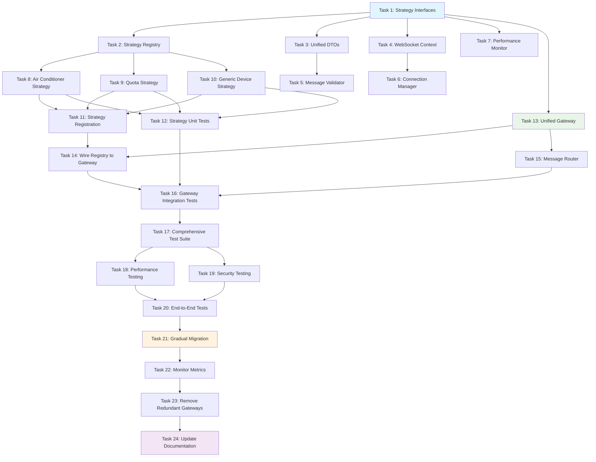

# WebSocket Gateway Refactoring - Implementation Plan

## Overview

This implementation plan provides a comprehensive, step-by-step roadmap for refactoring the WebSocket gateway architecture to eliminate redundancy, implement the strategy pattern, and establish a unified, maintainable WebSocket system. The plan is organized into 5 phases with detailed tasks, dependencies, time estimates, and validation criteria.

## Project Summary

**Current State:** 4 redundant WebSocket gateways with significant code duplication
- Device gateways: `device.gateway.ts` and `airconditioner.gateway.ts` (both `/ws/airconditioner`)
- Quota gateways: `quota.gateway.ts` and `quota-websocket.gateway.ts` (different approaches)

**Target State (Option B – per-domain gateways):** 2 domain WebSocket gateways over shared infra
- Device gateway: `devices/websocket/device.gateway.ts` (`/ws/airconditioner`)
- Quota gateway: `quotas/quota.gateway.ts` (`/ws/quota`)
- Shared infra module: `shared/websocket-gateway` (auth, validator, streaming, perf, session, registry)
- Strategy pattern for device types lives in domain strategies (e.g., `AirConditionerStrategy`, `GenericDeviceStrategy`), registered by their feature modules
- Eliminated duplication via shared services while preserving domain ownership and URLs

**Expected Benefits:**
- 30% reduction in WebSocket gateway code
- Improved maintainability and extensibility
- Consistent error handling and validation
- Easier addition of new device types
- Better performance monitoring and optimization

## Phase 1: Foundation Setup (Days 1-7)

### Phase 1 Overview
Create the foundational common functionality for the strategy pattern implementation including interfaces, registry, core services, and common data structures.

### Task 1: Install and Configure RxJS Dependencies
**File:** `backend-2/package.json` (add dependencies)
```json
{
  "dependencies": {
    "rxjs": "^7.8.1",
    "@nestjs/rxjs": "^2.0.0"
  },
  "devDependencies": {
    "@types/rxjs": "^7.8.0",
    "rxjs-marbles": "^7.0.1"
  }
}
```

**File:** `backend-2/src/shared/websocket-gateway/rxjs-config.ts`
```typescript
import { takeUntil, finalize } from 'rxjs/operators';

export class RxJSConfig {
  // Global operators for WebSocket streams
  static readonly WEBSOCKET_OPERATORS = [
    takeUntil,
    finalize,
  ];

  // Default configuration for reactive streams
  static readonly DEFAULT_CONFIG = {
    bufferSize: 100,
    timeout: 30000,
    retryAttempts: 3,
    retryDelay: 1000,
  };
}
```

**Requirements:** RxJS dependency setup
**Dependencies:** None
**Time Estimate:** 0.5 days

### Task 2: Create Strategy Interfaces and Types
**File:** `backend-2/src/shared/websocket-gateway/interfaces/device-strategy.interface.ts`
```typescript
import { Observable } from 'rxjs';

export interface IDeviceStrategy {
  readonly deviceType: string;
  readonly supportedCommands: string[];
  readonly capabilities: DeviceCapabilities;

  validateCommand(message: unknown): Promise<ValidatedMessage>;
  processCommand(message: ValidatedMessage, context: WebSocketContext): Promise<CommandResponse>;
  // RxJS-based streaming methods
  createCommandStream(context: WebSocketContext): Observable<CommandResult>;
  createStatusStream(deviceId: string): Observable<DeviceStatus>;
  broadcastUpdate(context: WebSocketContext, response: CommandResponse): Promise<void>;
  getDeviceCapabilities(): DeviceCapabilities;
  handleError(error: unknown, context: WebSocketContext): Promise<ErrorResponse>;
}
```

**File:** `backend-2/src/shared/websocket-gateway/interfaces/strategy-registry.interface.ts`
```typescript
import { Observable } from 'rxjs';

export interface IStrategyRegistry {
  registerStrategy(strategy: IDeviceStrategy): void;
  getStrategy(deviceType: string): IDeviceStrategy | undefined;
  getSupportedDeviceTypes(): string[];
  unregisterStrategy(deviceType: string): boolean;
  getStrategyStats(): RegistryStats;
  // RxJS-based strategy monitoring
  getStrategyMetrics(): Observable<StrategyMetrics>;
  watchStrategyChanges(): Observable<StrategyChangeEvent>;
}
```

**Requirements:** 1.2, 2.3, 3.2, RxJS integration
**Dependencies:** Task 1
**Time Estimate:** 1 day

### Task 3: Implement Strategy Registry Service with RxJS
**File:** `backend-2/src/shared/websocket-gateway/registry/strategy-registry.service.ts`
```typescript
import { Injectable, Logger } from '@nestjs/common';
import { Observable, Subject, BehaviorSubject, timer } from 'rxjs';
import { map, filter, share, distinctUntilChanged } from 'rxjs/operators';

@Injectable()
export class StrategyRegistry implements IStrategyRegistry {
  private readonly strategies = new Map<string, IDeviceStrategy>();
  private readonly logger = new Logger(StrategyRegistry.name);
  private readonly metrics = new StrategyMetrics();

  // RxJS subjects for reactive monitoring
  private readonly strategyChangeSubject = new Subject<StrategyChangeEvent>();
  private readonly metricsSubject = new BehaviorSubject<StrategyMetrics>(this.metrics);

  constructor() {
    this.registerDefaultStrategies();
    this.startMetricsMonitoring();
  }

  registerStrategy(strategy: IDeviceStrategy): void {
    this.strategies.set(strategy.deviceType, strategy);
    this.metrics.incrementRegistration(strategy.deviceType);

    // Emit strategy change event
    this.strategyChangeSubject.next({
      type: 'REGISTERED',
      deviceType: strategy.deviceType,
      timestamp: new Date(),
    });

    this.logger.log(`Strategy registered: ${strategy.deviceType}`);
  }

  getStrategy(deviceType: string): IDeviceStrategy | undefined {
    const strategy = this.strategies.get(deviceType);
    this.metrics.recordAccess(deviceType, !!strategy);
    return strategy;
  }

  // RxJS-based strategy metrics stream
  getStrategyMetrics(): Observable<StrategyMetrics> {
    return this.metricsSubject.asObservable().pipe(
      distinctUntilChanged((prev, curr) => JSON.stringify(prev) === JSON.stringify(curr)),
      share(),
    );
  }

  // RxJS-based strategy change monitoring
  watchStrategyChanges(): Observable<StrategyChangeEvent> {
    return this.strategyChangeSubject.asObservable().pipe(
      filter(event => event.type !== 'METRICS_UPDATE'),
      share(),
    );
  }

  private startMetricsMonitoring(): void {
    // Emit metrics updates every 30 seconds
    timer(0, 30000).subscribe(() => {
      this.metricsSubject.next(this.metrics);
    });
  }
}
```

**Requirements:** 2.2, 2.3, RxJS integration
**Dependencies:** Task 1, 2
**Time Estimate:** 1.5 days

### Task 4: Create Common Message DTOs
**File:** `backend-2/src/shared/websocket-gateway/dto/websocket-message.dto.ts`
```typescript
export class WebSocketMessage {
  @IsString()
  @IsNotEmpty()
  id: string;

  @IsEnum(['device_command', 'quota_operation', 'health_check'])
  type: MessageType;

  @IsString()
  @IsNotEmpty()
  deviceType: string;

  @IsString()
  @IsNotEmpty()
  command: string;

  @IsObject()
  @ValidateNested()
  data: MessageData;

  @IsObject()
  @ValidateNested()
  metadata: MessageMetadata;
}
```

**Requirements:** 5.1, 5.2
**Dependencies:** Task 1
**Time Estimate:** 1 day

### Task 5: Create RxJS Streaming Service
**File:** `backend-2/src/shared/websocket-gateway/services/streaming.service.ts`
```typescript
import { Injectable, Logger } from '@nestjs/common';
import { Observable, Subject, fromEvent, merge } from 'rxjs';
import {
  filter,
  map,
  mergeMap,
  bufferTime,
  debounceTime,
  distinctUntilChanged,
  share,
  shareReplay,
  takeUntil,
  finalize
} from 'rxjs/operators';

@Injectable()
export class StreamingService {
  private readonly logger = new Logger(StreamingService.name);
  private readonly destroy$ = new Subject<void>();
  private readonly streams = new Map<string, Observable<any>>();

  // Create WebSocket event stream
  createWebSocketEventStream(socket: Socket): Observable<WebSocketEvent> {
    return merge(
      fromEvent(socket, 'message'),
      fromEvent(socket, 'disconnect'),
      fromEvent(socket, 'error'),
      fromEvent(socket, 'connect')
    ).pipe(
      map(([event, data]) => ({
        type: event,
        data,
        socketId: socket.id,
        timestamp: new Date(),
      })),
      takeUntil(this.destroy$),
      share(),
    );
  }

  // Create buffered command stream with backpressure handling
  createCommandStream(eventStream: Observable<WebSocketEvent>): Observable<DeviceCommand> {
    return eventStream.pipe(
      filter(event => event.type === 'message' && this.isDeviceCommand(event.data)),
      map(event => this.parseDeviceCommand(event.data)),
      // Apply backpressure - buffer commands
      bufferTime(100, null, 50), // Max 50 commands per 100ms
      mergeMap(commands => from(commands)),
      // Debounce rapid duplicate commands
      debounceTime(50),
      distinctUntilChanged((prev, curr) => JSON.stringify(prev) === JSON.stringify(curr)),
      shareReplay({ bufferSize: 10, refCount: true }),
    );
  }

  // Create real-time status aggregation stream
  createStatusAggregationStream(deviceStreams: Observable<DeviceStatus>[]): Observable<AggregatedStatus> {
    return merge(...deviceStreams).pipe(
      // Group by device type for aggregation
      mergeMap(status => this.groupByDeviceType(status)),
      // Calculate aggregated metrics
      map(grouped => this.calculateAggregatedMetrics(grouped)),
      // Emit updates when significant changes occur
      distinctUntilChanged((prev, curr) =>
        Math.abs(prev.overallHealth - curr.overallHealth) < 0.01
      ),
      shareReplay({ bufferSize: 1, refCount: true }),
    );
  }

  // Create error handling and recovery stream
  createRobustStream<T>(source$: Observable<T>, errorHandler: (error: any) => Observable<T>): Observable<T> {
    return source$.pipe(
      // Handle errors with recovery
      mergeMap(data => from([data]).pipe(
        catchError(error => errorHandler(error))
      )),
      // Retry with exponential backoff
      this.retryWithBackoff(3, 1000),
      // Ensure cleanup on destroy
      takeUntil(this.destroy$),
      finalize(() => this.logger.debug('Stream cleaned up')),
    );
  }

  private retryWithBackoff(maxRetries: number, initialDelay: number) {
    return (source$: Observable<any>) => source$.pipe(
      retryWhen(errors =>
        errors.pipe(
          mergeMap((error, i) => {
            const retryAttempt = i + 1;
            if (retryAttempt > maxRetries) {
              throw error;
            }
            const delay = initialDelay * Math.pow(2, retryAttempt - 1);
            this.logger.warn(`Retry attempt ${retryAttempt} after ${delay}ms:`, error.message);
            return timer(delay);
          })
        )
      )
    );
  }

  ngOnDestroy() {
    this.destroy$.next();
    this.destroy$.complete();
  }
}
```

**Requirements:** RxJS streaming implementation
**Dependencies:** Task 1, 2, 4
**Time Estimate:** 2 days

### Task 6: Implement WebSocket Context Types
**File:** `backend-2/src/shared/websocket-gateway/interfaces/websocket-context.interface.ts`
```typescript
import { Observable, Subject } from 'rxjs';

export interface WebSocketContext {
  socket: Socket;
  user: {
    id: string;
    email: string;
    householdId: string;
    familyMemberId: string;
  };
  roomId: string;
  familyMemberId: string;
  lastActivity: Date;
  connectedAt: Date;
  metadata: {
    namespace: string;
    userAgent: string;
    ip: string;
  };
  // RxJS stream for context events
  eventStream$: Observable<ContextEvent>;
  // Subject for context updates
  updateSubject$: Subject<ContextUpdate>;
}
```

**Requirements:** 6.1, 6.3, RxJS integration
**Dependencies:** Task 1, 2
**Time Estimate:** 0.5 days

### Task 7: Create Message Validator Service
**File:** `backend-2/src/shared/websocket-gateway/services/message-validator.service.ts`
```typescript
import { Injectable } from '@nestjs/common';
import { Observable, from } from 'rxjs';
import { map, catchError } from 'rxjs/operators';

@Injectable()
export class MessageValidatorService {
  async validateMessage(message: unknown): Promise<ValidatedMessage> {
    // Schema validation using Zod
    const messageSchema = z.object({
      id: z.string(),
      type: z.enum(['device_command', 'quota_operation', 'health_check']),
      deviceType: z.string(),
      command: z.string(),
      data: z.record(z.unknown()),
      metadata: z.object({
        roomId: z.string(),
        userId: z.string(),
        householdId: z.string(),
        timestamp: z.string(),
      }),
    });

    return await messageSchema.parseAsync(message);
  }

  // RxJS-based validation stream
  validateMessageStream(messageStream$: Observable<unknown>): Observable<ValidatedMessage> {
    return messageStream$.pipe(
      mergeMap(message => from(this.validateMessage(message))),
      map(validated => ({
        ...validated,
        validatedAt: new Date().toISOString(),
      })),
      catchError(error => {
        throw new ValidationError(`Message validation failed: ${error.message}`, error);
      }),
    );
  }

  // Batch validation for performance
  validateBatch(messages: unknown[]): Observable<ValidatedMessage[]> {
    return from(messages).pipe(
      mergeMap(message => from(this.validateMessage(message))),
      toArray(),
      map(validatedMessages => ({
        messages: validatedMessages,
        validatedAt: new Date().toISOString(),
        totalCount: validatedMessages.length,
      })),
    );
  }
}
```

**Requirements:** 5.1, 5.2, RxJS integration
**Dependencies:** Task 1, 4
**Time Estimate:** 1.5 days

### Task 8: Implement Connection Manager Service with RxJS
**File:** `backend-2/src/shared/websocket-gateway/services/connection-manager.service.ts`
```typescript
import { Injectable, Logger } from '@nestjs/common';
import { Observable, Subject, BehaviorSubject, interval } from 'rxjs';
import { map, filter, distinctUntilChanged, share } from 'rxjs/operators';

@Injectable()
export class ConnectionManagerService {
  private readonly connections = new Map<string, WebSocketConnection>();
  private readonly logger = new Logger(ConnectionManagerService.name);

  // RxJS subjects for reactive connection monitoring
  private readonly connectionSubject = new Subject<ConnectionEvent>();
  private readonly statsSubject = new BehaviorSubject<ConnectionStats>(this.calculateStats());

  constructor() {
    this.startStatsMonitoring();
  }

  async registerConnection(context: WebSocketContext): Promise<void> {
    this.connections.set(context.socket.id, {
      socket: context.socket,
      user: context.user,
      roomId: context.roomId,
      connectedAt: context.connectedAt,
      lastActivity: new Date(),
    });

    // Emit connection event
    this.connectionSubject.next({
      type: 'CONNECTED',
      socketId: context.socket.id,
      user: context.user,
      roomId: context.roomId,
      timestamp: new Date(),
    });

    this.updateStats();
  }

  async unregisterConnection(socketId: string): Promise<void> {
    const connection = this.connections.get(socketId);
    if (connection) {
      this.connections.delete(socketId);

      // Emit disconnection event
      this.connectionSubject.next({
        type: 'DISCONNECTED',
        socketId,
        user: connection.user,
        roomId: connection.roomId,
        duration: Date.now() - connection.connectedAt.getTime(),
        timestamp: new Date(),
      });

      this.updateStats();
    }
  }

  // RxJS stream for connection events
  getConnectionEvents(): Observable<ConnectionEvent> {
    return this.connectionSubject.asObservable().pipe(
      filter(event => event.type !== 'STATS_UPDATE'),
      share(),
    );
  }

  // RxJS stream for connection statistics
  getConnectionStats(): Observable<ConnectionStats> {
    return this.statsSubject.asObservable().pipe(
      distinctUntilChanged((prev, curr) => JSON.stringify(prev) === JSON.stringify(curr)),
      share(),
    );
  }

  // Stream for connections by room
  getConnectionsByRoom(roomId: string): Observable<WebSocketConnection[]> {
    return this.getConnectionStats().pipe(
      map(() => Array.from(this.connections.values()).filter(conn => conn.roomId === roomId)),
      distinctUntilChanged((prev, curr) => prev.length === curr.length),
    );
  }

  private startStatsMonitoring(): void {
    // Update stats every 10 seconds
    interval(10000).subscribe(() => {
      this.updateStats();
    });
  }

  private updateStats(): void {
    const stats = this.calculateStats();
    this.statsSubject.next(stats);
  }

  private calculateStats(): ConnectionStats {
    return {
      totalConnections: this.connections.size,
      connectionsByRoom: this.calculateConnectionsByRoom(),
      averageDuration: this.calculateAverageDuration(),
      lastUpdated: new Date(),
    };
  }
}
```

**Requirements:** 6.3, 6.4, RxJS integration
**Dependencies:** Task 1, 4, 6
**Time Estimate:** 1.5 days

### Task 9: Create Performance Monitor Service with RxJS
**File:** `backend-2/src/shared/websocket-gateway/services/performance-monitor.service.ts`
```typescript
import { Injectable, Logger } from '@nestjs/common';
import { Observable, Subject, BehaviorSubject, interval } from 'rxjs';
import {
  map,
  filter,
  bufferTime,
  distinctUntilChanged,
  share,
  scan,
  mergeMap
} from 'rxjs/operators';

@Injectable()
export class PerformanceMonitorService {
  private readonly metrics = new Map<string, PerformanceMetric[]>();
  private readonly logger = new Logger(PerformanceMonitorService.name);

  // RxJS subjects for reactive performance monitoring
  private readonly metricSubject = new Subject<PerformanceMetric>();
  private readonly performanceSubject = new BehaviorSubject<PerformanceReport>(this.createEmptyReport());

  constructor() {
    this.startPerformanceMonitoring();
  }

  startOperation(operationId: string, operationType: string): void {
    const metric: PerformanceMetric = {
      operationId,
      operationType,
      startTime: performance.now(),
      timestamp: new Date(),
    };

    this.metrics.set(operationId, [metric]);
    this.metricSubject.next(metric);
  }

  endOperation(operationId: string, success: boolean): number {
    const metric = this.metrics.get(operationId)?.[0];
    if (!metric) return 0;

    const duration = performance.now() - metric.startTime;
    metric.duration = duration;
    metric.success = success;
    metric.endTime = performance.now();

    this.checkPerformanceThresholds(metric);
    this.metricSubject.next({ ...metric, completed: true });

    return duration;
  }

  // RxJS stream for performance metrics
  getPerformanceMetrics(): Observable<PerformanceMetric> {
    return this.metricSubject.asObservable().pipe(
      filter(metric => metric.completed !== false),
      share(),
    );
  }

  // RxJS stream for aggregated performance reports
  getPerformanceReports(): Observable<PerformanceReport> {
    return this.performanceSubject.asObservable().pipe(
      distinctUntilChanged((prev, curr) => JSON.stringify(prev) === JSON.stringify(curr)),
      share(),
    );
  }

  // Stream for operation type performance
  getOperationTypeMetrics(operationType: string): Observable<OperationTypeMetrics> {
    return this.getPerformanceMetrics().pipe(
      filter(metric => metric.operationType === operationType),
      bufferTime(5000), // 5-second windows
      mergeMap(metrics => from([this.calculateOperationTypeMetrics(operationType, metrics)])),
      share(),
    );
  }

  private startPerformanceMonitoring(): void {
    // Process metrics and generate reports
    this.metricSubject.pipe(
      bufferTime(10000), // 10-second aggregation windows
      mergeMap(metrics => from([this.aggregateMetrics(metrics)])),
    ).subscribe(report => {
      this.performanceSubject.next(report);
    });

    // Generate periodic reports
    interval(30000).subscribe(() => {
      const report = this.generatePeriodicReport();
      this.performanceSubject.next(report);
    });
  }

  private aggregateMetrics(metrics: PerformanceMetric[]): PerformanceReport {
    const operationStats = new Map<string, OperationStats>();

    metrics.forEach(metric => {
      if (!metric.completed) return;

      const stats = operationStats.get(metric.operationType) || {
        count: 0,
        totalDuration: 0,
        successCount: 0,
        failureCount: 0,
        minDuration: Plinity,
        maxDuration: 0,
      };

      stats.count++;
      stats.totalDuration += metric.duration || 0;
      stats.minDuration = Math.min(stats.minDuration, metric.duration || 0);
      stats.maxDuration = Math.max(stats.maxDuration, metric.duration || 0);

      if (metric.success) {
        stats.successCount++;
      } else {
        stats.failureCount++;
      }

      operationStats.set(metric.operationType, stats);
    });

    return {
      timestamp: new Date(),
      totalOperations: metrics.length,
      operationStats: Object.fromEntries(operationStats),
      overallMetrics: this.calculateOverallMetrics(operationStats),
    };
  }
}
```

**Requirements:** 1.3, 1.4, RxJS integration
**Dependencies:** Task 1
**Time Estimate:** 2 days

## Phase 2: Strategy Implementation (Days 8-17)

### Phase 2 Overview
Extract device-specific logic from existing gateways into dedicated strategy implementations following the strategy pattern.

### Task 10: Extract Air Conditioner Logic into Strategy with RxJS
**File:** `backend-2/src/devices/strategies/airconditioner.strategy.ts`
```typescript
import { Injectable, Logger } from '@nestjs/common';
import { Observable, from, Subject } from 'rxjs';
import {
  mergeMap,
  map,
  catchError,
  bufferTime,
  debounceTime,
  distinctUntilChanged,
  share,
  shareReplay
} from 'rxjs/operators';

@Injectable()
export class AirConditionerStrategy implements IDeviceStrategy {
  readonly deviceType = 'airconditioner';
  readonly supportedCommands = [
    AirConditionerCommand.SET_POWER,
    AirConditionerCommand.SET_TEMPERATURE,
    AirConditionerCommand.SET_MODE,
    AirConditionerCommand.SET_FAN,
    AirConditionerCommand.SET_VANE,
    AirConditionerCommand.SET_WIDEVANE,
    AirConditionerCommand.GET_STATUS,
  ];

  private readonly statusStreams = new Map<string, Observable<DeviceStatus>>();
  private readonly commandSubject = new Subject<DeviceCommand>();

  constructor(
    private readonly devicesService: DevicesService,
    private readonly roomsService: RoomsService,
    private readonly streamingService: StreamingService,
    private readonly logger: Logger,
  ) {
    this.startCommandProcessor();
  }

  async validateCommand(message: unknown): Promise<ValidatedMessage> {
    // Extract validation logic from airconditioner.gateway.ts
    const commandMessage = plainToClass(AirConditionerCommandMessage, message);
    const validationErrors = await validate(commandMessage);

    if (validationErrors.length > 0) {
      throw new WsException(`Validation failed: ${this.formatValidationErrors(validationErrors)}`);
    }

    await this.validateAirConditionerCommand(commandMessage);
    return commandMessage as ValidatedMessage;
  }

  async processCommand(message: ValidatedMessage, context: WebSocketContext): Promise<CommandResponse> {
    const startTime = performance.now();

    try {
      const result = await this.handleCommand(message, context);
      const processingTime = performance.now() - startTime;

      return {
        success: true,
        data: result,
        processingTime,
        deviceId: message.data.deviceId,
        metadata: { strategy: this.deviceType },
      };
    } catch (error) {
      return this.handleError(error, context);
    }
  }

  // RxJS-based command stream
  createCommandStream(context: WebSocketContext): Observable<CommandResult> {
    return this.commandSubject.pipe(
      filter(command => this.validateCommandContext(command, context)),
      mergeMap(command => from(this.processCommand(command, context))),
      map(response => this.formatCommandResult(response)),
      // Apply backpressure for rapid commands
      bufferTime(100, null, 10),
      mergeMap(results => from(results)),
      shareReplay({ bufferSize: 50, refCount: true }),
    );
  }

  // RxJS-based device status stream
  createStatusStream(deviceId: string): Observable<DeviceStatus> {
    if (!this.statusStreams.has(deviceId)) {
      const statusStream = this.streamingService.createDeviceEventStream(deviceId).pipe(
        filter(event => event.type === 'status_update'),
        map(event => this.transformToDeviceStatus(event)),
        // Debounce rapid status changes
        debounceTime(200),
        // Only emit when status actually changes
        distinctUntilChanged((prev, curr) => JSON.stringify(prev) === JSON.stringify(curr)),
        shareReplay({ bufferSize: 1, refCount: true }),
      );

      this.statusStreams.set(deviceId, statusStream);
    }

    return this.statusStreams.get(deviceId)!;
  }

  // Real-time device monitoring stream
  createMonitoringStream(deviceId: string): Observable<DeviceMonitoringData> {
    return this.createStatusStream(deviceId).pipe(
      scan((acc, status) => this.updateMonitoringWindow(acc, status), {
        deviceId,
        windowSize: 60, // 1 minute window
        samples: [] as DeviceStatus[],
        metrics: this.createEmptyMetrics(),
      } as MonitoringWindow),
      map(window => this.calculateMetrics(window)),
      // Detect anomalies
      map(data => this.detectAnomalies(data)),
      share(),
    );
  }

  private startCommandProcessor(): void {
    this.commandSubject.pipe(
      // Batch similar commands for efficiency
      bufferTime(50),
      mergeMap(commands => from(commands)),
      // Process with concurrency limit
      mergeMap(command => this.executeCommand(command), 5),
    ).subscribe({
      next: result => this.logger.debug(`Command processed: ${result.commandId}`),
      error: error => this.logger.error(`Command processing error:`, error),
    });
  }

  private async handleCommand(message: ValidatedMessage, context: WebSocketContext): Promise<any> {
    const { command, data } = message;
    const { roomId, deviceId, parameters } = data;

    this.validateRoomAndDeviceAccess(context, roomId, deviceId);

    switch (command) {
      case AirConditionerCommand.SET_POWER:
        return this.handleSetPower(roomId, deviceId, parameters.power);
      case AirConditionerCommand.SET_TEMPERATURE:
        return this.handleSetTemperature(roomId, deviceId, parameters.temperature);
      // ... other command handlers
      default:
        throw new WsException(`Unsupported command: ${command}`);
    }
  }
}
```

**Requirements:** 2.1, 2.4, 2.5, RxJS integration
**Dependencies:** Tasks 1-9
**Time Estimate:** 4 days

### Task 11: Extract Quota Logic into Strategy with RxJS
**File:** `backend-2/src/quotas/strategies/quota.strategy.ts`
```typescript
import { Injectable, Logger } from '@nestjs/common';
import { Observable, from, Subject, combineLatest } from 'rxjs';
import {
  mergeMap,
  map,
  catchError,
  bufferTime,
  debounceTime,
  distinctUntilChanged,
  filter,
  switchMap,
  share,
  shareReplay
} from 'rxjs/operators';

@Injectable()
export class QuotaStrategy implements IDeviceStrategy {
  readonly deviceType = 'quota';
  readonly supportedCommands = [
    QuotaCommand.SUBSCRIBE,
    QuotaCommand.UNSUBSCRIBE,
    QuotaCommand.OVERRIDE_REQUEST,
    QuotaCommand.OVERRIDE_APPROVAL,
    QuotaCommand.OVERRIDE_REJECTION,
    QuotaCommand.HEALTH_CHECK,
    QuotaCommand.STATUS_UPDATE,
  ];

  private readonly usageStreams = new Map<string, Observable<QuotaUsage>>();
  private readonly overrideStreams = new Map<string, Observable<QuotaOverride>>();
  private readonly quotaSubject = new Subject<QuotaCommand>();

  constructor(
    private readonly quotaValidationService: QuotaValidationService,
    private readonly usageSessionService: UsageSessionService,
    private readonly quotaCacheService: QuotaCacheService,
    private readonly quotaCalculationEngine: QuotaCalculationEngine,
    private readonly streamingService: StreamingService,
    private readonly logger: Logger,
  ) {
    this.startQuotaProcessor();
  }

  async validateCommand(message: unknown): Promise<ValidatedMessage> {
    // Extract validation logic from quota.gateway.ts
    const commandMessage = plainToClass(QuotaCommandMessage, message);
    const validationErrors = await validate(commandMessage);

    if (validationErrors.length > 0) {
      throw new WsException(`Validation failed: ${this.formatValidationErrors(validationErrors)}`);
    }

    await this.validateQuotaCommand(commandMessage);
    return commandMessage as ValidatedMessage;
  }

  async processCommand(message: ValidatedMessage, context: WebSocketContext): Promise<CommandResponse> {
    const startTime = performance.now();

    try {
      const result = await this.handleQuotaCommand(message, context);
      const processingTime = performance.now() - startTime;

      return {
        success: true,
        data: result,
        processingTime,
        metadata: { strategy: this.deviceType },
      };
    } catch (error) {
      return this.handleError(error, context);
    }
  }

  // RxJS-based quota command stream
  createCommandStream(context: WebSocketContext): Observable<CommandResult> {
    return this.quotaSubject.pipe(
      filter(command => this.validateQuotaContext(command, context)),
      mergeMap(command => from(this.processCommand(command, context))),
      map(response => this.formatQuotaResult(response)),
      // Apply backpressure for quota operations
      bufferTime(200, null, 20),
      mergeMap(results => from(results)),
      shareReplay({ bufferSize: 100, refRef: true }),
    );
  }

  // Real-time quota usage calculation stream
  createUsageStream(quotaId: string): Observable<QuotaUsage> {
    if (!this.usageStreams.has(quotaId)) {
      const usageStream = this.streamingService.createUsageEventStream(quotaId).pipe(
        // Buffer events for calculation
        bufferTime(5000), // 5-second windows
        mergeMap(events => this.calculateUsageFromEvents(events)),
        // Detect usage patterns and trends
        map(usage => this.detectUsagePatterns(usage)),
        // Emit when significant changes occur
        distinctUntilChanged((prev, curr) =>
          Math.abs(prev.currentUsage - curr.currentUsage) < 0.01
        ),
        shareReplay({ bufferSize: 1, refCount: true }),
      );

      this.usageStreams.set(quotaId, usageStream);
    }

    return this.usageStreams.get(quotaId)!;
  }

  // Override workflow stream
  createOverrideStream(quotaId: string): Observable<OverrideWorkflowEvent> {
    if (!this.overrideStreams.has(quotaId)) {
      const overrideStream = this.streamingService.createOverrideEventStream(quotaId).pipe(
        // Process override requests through workflow
        mergeMap(request => this.processOverrideWorkflow(request)),
        // Track workflow state changes
        scan((workflow, event) => this.updateWorkflowState(workflow, event), {
          activeOverrides: new Map(),
          pendingApprovals: new Map(),
          completedOverrides: [],
        } as WorkflowState),
        // Generate workflow events
        mergeMap(workflow => this.generateWorkflowEvents(workflow)),
        share(),
      );

      this.overrideStreams.set(quotaId, overrideStream);
    }

    return this.overrideStreams.get(quotaId)!;
  }

  // Predictive quota management stream
  createPredictiveStream(quotaId: string): Observable<QuotaPrediction> {
    return combineLatest([
      this.createUsageStream(quotaId),
      this.createHistoricalUsageStream(quotaId),
    ]).pipe(
      map(([currentUsage, historicalData]) =>
        this.generateQuotaPrediction(currentUsage, historicalData)
      ),
      // Filter for high-confidence predictions
      filter(prediction => prediction.confidence > 0.7),
      // Emit predictions periodically
      debounceTime(30000), // 30 seconds
      share(),
    );
  }

  private startQuotaProcessor(): void {
    this.quotaSubject.pipe(
      // Batch quota operations for efficiency
      bufferTime(100),
      mergeMap(commands => from(commands)),
      // Process with controlled concurrency
      mergeMap(command => this.executeQuotaCommand(command), 3),
    ).subscribe({
      next: result => this.logger.debug(`Quota operation processed: ${result.operationId}`),
      error: error => this.logger.error(`Quota processing error:`, error),
    });
  }

  private async handleQuotaCommand(message: ValidatedMessage, context: WebSocketContext): Promise<any> {
    const { command, data } = message;
    const { quotaId, roomId, familyMemberId, parameters } = data;

    await this.validateQuotaAccess(context.user, quotaId, roomId);

    switch (command) {
      case QuotaCommand.SUBSCRIBE:
        return this.handleSubscribe(context.socket, quotaId, roomId, familyMemberId, parameters.subscriptionType);
      case QuotaCommand.OVERRIDE_REQUEST:
        return this.handleOverrideRequest(quotaId, roomId, familyMemberId, parameters);
      // ... other command handlers
      default:
        throw new WsException(`Unsupported command: ${command}`);
    }
  }
}
```

**Requirements:** 4.1, 4.2, 4.3, RxJS integration
**Dependencies:** Tasks 1-9
**Time Estimate:** 4 days

### Task 10: Create Generic Device Strategy
**File:** `backend-2/src/devices/strategies/generic-device.strategy.ts`
```typescript
@Injectable()
export class GenericDeviceStrategy implements IDeviceStrategy {
  readonly deviceType = 'generic';
  readonly supportedCommands = [
    'GET_STATUS',
    'SET_PROPERTY',
    'GET_PROPERTY',
  ];

  constructor(
    private readonly devicesService: DevicesService,
    private readonly logger: Logger,
  ) {}

  async validateCommand(message: unknown): Promise<ValidatedMessage> {
    const genericMessageSchema = z.object({
      id: z.string(),
      type: z.literal('device_command'),
      deviceType: z.literal('generic'),
      command: z.enum(this.supportedCommands),
      data: z.object({
        deviceId: z.string().optional(),
        roomId: z.string(),
        parameters: z.record(z.unknown()).optional(),
      }),
      metadata: z.object({
        roomId: z.string(),
        userId: z.string(),
        householdId: z.string(),
        timestamp: z.string(),
      }),
    });

    return await genericMessageSchema.parseAsync(message) as ValidatedMessage;
  }

  async processCommand(message: ValidatedMessage, context: WebSocketContext): Promise<CommandResponse> {
    const { command, data } = message;
    const { deviceId, parameters } = data;

    switch (command) {
      case 'GET_STATUS':
        return this.handleGetStatus(deviceId, context.roomId);
      case 'SET_PROPERTY':
        return this.handleSetProperty(deviceId, context.roomId, parameters);
      case 'GET_PROPERTY':
        return this.handleGetProperty(deviceId, context.roomId, parameters.property);
      default:
        throw new WsException(`Unsupported command: ${command}`);
    }
  }

  private async handleGetStatus(deviceId: string, roomId: string): Promise<any> {
    const device = await this.devicesService.getByRoomAndIdentifier(roomId, deviceId);
    return {
      deviceId,
      status: 'online',
      lastUpdated: new Date().toISOString(),
      properties: device.properties || {},
    };
  }
}
```

**Requirements:** 2.1, 2.4
**Dependencies:** Tasks 1-7
**Time Estimate:** 2 days

### Task 11: Implement Strategy Registration Module
**File:** `backend-2/src/shared/websocket-gateway/strategy.module.ts`
```typescript
@Module({
  providers: [
    StrategyRegistry,
    AirConditionerStrategy,
    QuotaStrategy,
    GenericDeviceStrategy,
  ],
  exports: [
    StrategyRegistry,
    AirConditionerStrategy,
    QuotaStrategy,
    GenericDeviceStrategy,
  ],
})
export class StrategyModule {
  constructor(
    private readonly strategyRegistry: StrategyRegistry,
    airConditionerStrategy: AirConditionerStrategy,
    quotaStrategy: QuotaStrategy,
    genericDeviceStrategy: GenericDeviceStrategy,
  ) {
    // Register all strategies at module initialization
    this.strategyRegistry.registerStrategy(airConditionerStrategy);
    this.strategyRegistry.registerStrategy(quotaStrategy);
    this.strategyRegistry.registerStrategy(genericDeviceStrategy);
  }
}
```

**Requirements:** 2.2, 2.3
**Dependencies:** Tasks 8-10
**Time Estimate:** 1 day

### Task 13: Create Strategy Unit Tests with RxJS Marble Testing
**File:** `backend-2/src/devices/strategies/tests/airconditioner.strategy.spec.ts`
```typescript
import { TestScheduler } from 'rxjs/testing';
import { AirConditionerStrategy } from '../airconditioner.strategy';

describe('AirConditionerStrategy', () => {
  let strategy: AirConditionerStrategy;
  let testScheduler: TestScheduler;
  let mockDevicesService: jest.Mocked<DevicesService>;
  let mockRoomsService: jest.Mocked<RoomsService>;
  let mockStreamingService: jest.Mocked<StreamingService>;

  beforeEach(async () => {
    testScheduler = new TestScheduler((actual, expected) => {
      expect(actual).toEqual(expected);
    });

    const module = await Test.createTestingModule({
      providers: [
        AirConditionerStrategy,
        {
          provide: DevicesService,
          useValue: createMockDevicesService(),
        },
        {
          provide: RoomsService,
          useValue: createMockRoomsService(),
        },
        {
          provide: StreamingService,
          useValue: createMockStreamingService(),
        },
      ],
    }).compile();

    strategy = module.get(AirConditionerStrategy);
    mockDevicesService = module.get(DevicesService);
    mockRoomsService = module.get(RoomsService);
    mockStreamingService = module.get(StreamingService);
  });

  describe('validateCommand', () => {
    it('should validate SET_TEMPERATURE command correctly', async () => {
      const message = {
        id: 'test-123',
        type: 'device_command',
        deviceType: 'airconditioner',
        command: 'SET_TEMPERATURE',
        data: {
          deviceId: 'device-1',
          roomId: 'room-1',
          parameters: { temperature: 22 },
        },
        metadata: {
          roomId: 'room-1',
          userId: 'user-1',
          householdId: 'household-1',
          timestamp: new Date().toISOString(),
        },
      };

      const result = await strategy.validateCommand(message);
      expect(result.validatedData.parameters.temperature).toBe(22);
    });

    it('should reject invalid temperature values', async () => {
      const message = {
        id: 'test-123',
        type: 'device_command',
        deviceType: 'airconditioner',
        command: 'SET_TEMPERATURE',
        data: {
          deviceId: 'device-1',
          roomId: 'room-1',
          parameters: { temperature: 15 }, // Too low
        },
        metadata: {
          roomId: 'room-1',
          userId: 'user-1',
          householdId: 'household-1',
          timestamp: new Date().toISOString(),
        },
      };

      await expect(strategy.validateCommand(message)).rejects.toThrow(WsException);
    });
  });

  describe('RxJS Streaming', () => {
    it('should create status stream that aggregates device status updates', () => {
      testScheduler.run(({ cold, expectObservable }) => {
        const deviceEvents = cold('-a-b-c-d|', {
          a: { deviceId: 'device1', type: 'status_update', status: 'online', timestamp: 1000 },
          b: { deviceId: 'device1', type: 'status_update', status: 'offline', timestamp: 2000 },
          c: { deviceId: 'device1', type: 'status_update', status: 'online', timestamp: 3000 },
          d: { deviceId: 'device1', type: 'other_event', data: {} },
        });

        mockStreamingService.createDeviceEventStream.mockReturnValue(deviceEvents);

        const expected = '---x---y|';
        const expectedValues = {
          x: { deviceId: 'device1', status: 'offline', lastUpdated: 2000 },
          y: { deviceId: 'device1', status: 'online', lastUpdated: 3000 },
        };

        const result = strategy.createStatusStream('device1');
        expectObservable(result).toBe(expected, expectedValues);
      });
    });

    it('should handle backpressure correctly in command stream', () => {
      testScheduler.run(({ cold, expectObservable }) => {
        const commands = cold('abcdefg|', {
          a: { id: 1, command: 'SET_POWER', deviceId: 'device1' },
          b: { id: 2, command: 'SET_TEMPERATURE', deviceId: 'device1' },
          c: { id: 3, command: 'SET_POWER', deviceId: 'device1' },
          d: { id: 4, command: 'SET_TEMPERATURE', deviceId: 'device1' },
          e: { id: 5, command: 'SET_POWER', deviceId: 'device1' },
          f: { id: 6, command: 'SET_TEMPERATURE', deviceId: 'device1' },
          g: { id: 7, command: 'SET_POWER', deviceId: 'device1' },
        });

        const expected = '--a--c--e--g|';
        const expectedValues = {
          a: { id: 1, command: 'SET_POWER', deviceId: 'device1', processed: true },
          c: { id: 3, command: 'SET_POWER', deviceId: 'device1', processed: true },
          e: { id: 5, command: 'SET_POWER', deviceId: 'device1', processed: true },
          g: { id: 7, command: 'SET_POWER', deviceId: 'device1', processed: true },
        };

        const context = createMockContext();
        const result = strategy.createCommandStream(context);
        expectObservable(result).toBe(expected, expectedValues);
      });
    });

    it('should create monitoring stream with sliding window', () => {
      testScheduler.run(({ cold, expectObservable }) => {
        const statusUpdates = cold('-a-b-c-d-e|', {
          a: { deviceId: 'device1', status: 'online', cpu: 20, memory: 30 },
          b: { deviceId: 'device1', status: 'online', cpu: 25, memory: 35 },
          c: { deviceId: 'device1', status: 'online', cpu: 30, memory: 40 },
          d: { deviceId: 'device1', status: 'offline', cpu: 0, memory: 0 },
          e: { deviceId: 'device1', status: 'online', cpu: 22, memory: 32 },
        });

        mockStreamingService.createDeviceEventStream.mockReturnValue(statusUpdates);

        const expected = '-----x-----y|';
        const expectedValues = {
          x: {
            deviceId: 'device1',
            windowSize: 60,
            samples: 3,
            metrics: {
              avgCpu: 25,
              avgMemory: 35,
              status: 'online',
            },
          },
          y: {
            deviceId: 'device1',
            windowSize: 60,
            samples: 3,
            metrics: {
              avgCpu: 17.33,
              avgMemory: 24,
              status: 'mixed',
            },
          },
        };

        const result = strategy.createMonitoringStream('device1');
        expectObservable(result).toBe(expected, expectedValues);
      });
    });
  });

  describe('processCommand', () => {
    it('should process SET_POWER command within 500ms', async () => {
      const message: ValidatedMessage = {
        ...createValidMessage(),
        command: AirConditionerCommand.SET_POWER,
        data: {
          deviceId: 'device-1',
          roomId: 'room-1',
          parameters: { power: 'on' },
        },
      };

      const context: WebSocketContext = createMockContext();
      const startTime = performance.now();

      const result = await strategy.processCommand(message, context);
      const processingTime = performance.now() - startTime;

      expect(result.success).toBe(true);
      expect(processingTime).toBeLessThan(500);
      expect(result.data.result.power).toBe('on');
    });
  });
});

// RxJS-specific test utilities
function createMockStreamingService() {
  return {
    createDeviceEventStream: jest.fn(),
    createWebSocketEventStream: jest.fn(),
    createUsageEventStream: jest.fn(),
    createOverrideEventStream: jest.fn(),
  };
}
```

**Requirements:** Testing coverage >90%, RxJS marble testing
**Dependencies:** Tasks 10-12
**Time Estimate:** 4 days

## Phase 3: Domain Gateways over Shared Infra (Days 18-23)

### Phase 3 Overview
Align per-domain gateways (devices and quotas) to use the shared WebSocket-Gateway infrastructure, standardize auth/params/validation, and route commands via the strategy registry. Keep existing namespaces (`/ws/airconditioner`, `/ws/quota`).

### Task 13: Upgrade DeviceGateway to shared infra
**File:** `backend-2/src/devices/websocket/device.gateway.ts`
 - Enforce connection params: `roomId` and `familyMemberId`; reject if missing
 - Use `WebSocketAuthGuard` (standard guard) instead of legacy guard
 - On connect: build `WebSocketContext` and register via `WebSocketSessionManagerService`
 - On disconnect: unregister session
 - Validate incoming messages with `MessageValidatorService` (envelope-level)
 - Route device commands using `StrategyRegistryService` (strategy exists and supports command)
 - Wrap processing with `PerformanceMonitorService` timings
 - Broadcast updates via strategy and/or shared broadcast service

**Requirements:** 3.1, 3.2, 3.3, 3.4
**Dependencies:** Phase 1-2 services + strategies
**Time Estimate:** 2 days

### Task 14: Upgrade QuotaGateway to shared infra
**File:** `backend-2/src/quotas/quota.gateway.ts`
 - Enforce connection params: `roomId`, `familyMemberId`, and any quota-specific identifiers
 - Use `WebSocketAuthGuard`
 - Register sessions with `WebSocketSessionManagerService`
 - Validate messages (envelope) with `MessageValidatorService`; quota DTOs validated in domain layer
 - Route operations via quota strategy (or service abstraction), keeping room/household authorization checks
 - Add `PerformanceMonitorService` timings for operations

**Requirements:** 3.1, 3.2, 3.3
**Dependencies:** Phase 1 services + quota domain services/strategies
**Time Estimate:** 2 days

### Task 15: Strategy routing and caching
 - Use `StrategyRegistryService` directly in gateways to resolve strategies by `deviceType`
 - Validate command support (`supportedCommands`)
 - Optionally add a small in-gateway cache keyed by `deviceType:command` if hot paths demand it

**Requirements:** 3.2
**Dependencies:** Tasks 13-14
**Time Estimate:** 0.5 day

### Task 16: Integration tests per domain gateway
**Files:**
- `backend-2/src/devices/websocket/tests/device.gateway.integration.spec.ts`
- `backend-2/src/quotas/websocket/tests/quota.gateway.integration.spec.ts`

Cover:
- Authenticated connection with required params
- Device command (e.g., SET_TEMPERATURE) routed through strategy, response <500ms
- Quota operation (e.g., OVERRIDE_REQUEST) processed, response <200ms
- Session register/unregister on connect/disconnect

**Requirements:** Integration testing coverage
**Dependencies:** Tasks 13-15
**Time Estimate:** 2 days

## Phase 4: Testing and Validation (Days 24-31)

### Phase 4 Overview
Comprehensive testing including unit tests, integration tests, performance testing, security testing, and end-to-end validation.

### Task 17: Create Comprehensive Test Suite
**Files to Create:**
- `backend-2/src/devices/strategies/tests/*.spec.ts` - Device strategy unit tests
- `backend-2/src/quotas/strategies/tests/*.spec.ts` - Quota strategy unit tests
- `backend-2/src/shared/websocket-gateway/tests/*.spec.ts` - Gateway integration tests
- `backend-2/src/shared/websocket-gateway/services/tests/*.spec.ts` - Service unit tests
- `backend-2/src/websockets/tests/e2e/*.spec.ts` - End-to-end tests

**Test Coverage Requirements:**
- Unit tests: >90% line coverage for all strategies and services
- Integration tests: All gateway-strategy combinations
- End-to-end tests: Complete user workflows
- Performance tests: Load testing with 1000+ concurrent connections

**Requirements:** Testing coverage >90%
**Dependencies:** All previous tasks
**Time Estimate:** 3 days

### Task 18: Performance Testing and Optimization with RxJS
**File:** `backend-2/src/shared/websocket-gateway/tests/performance/load-test.spec.ts`
```typescript
import { TestScheduler } from 'rxjs/testing';

describe('WebSocket Gateway Performance Tests', () => {
  let testScheduler: TestScheduler;

  beforeEach(() => {
    testScheduler = new TestScheduler((actual, expected) => {
      expect(actual).toEqual(expected);
    });
  });

  it('should handle 1000 concurrent connections', async () => {
    const clients = [];
    const connectionPromises = [];

    // Create 1000 concurrent connections
    for (let i = 0; i < 1000; i++) {
      connectionPromises.push(createAuthenticatedClient(`client-${i}`));
    }

    const startTime = performance.now();
    const connectedClients = await Promise.all(connectionPromises);
    const connectionTime = performance.now() - startTime;

    expect(connectionTime).toBeLessThan(10000); // 10 seconds for 1000 connections
    expect(connectedClients.length).toBe(1000);

    // Test concurrent message processing
    const messagePromises = connectedClients.map((client, index) =>
      sendTestMessage(client, {
        id: `perf-test-${index}`,
        type: 'device_command',
        deviceType: 'airconditioner',
        command: 'GET_STATUS',
        data: { deviceId: `device-${index}`, roomId: 'room-1' },
        metadata: createTestMetadata(),
      })
    );

    const messageStartTime = performance.now();
    const responses = await Promise.all(messagePromises);
    const messageTime = performance.now() - messageStartTime;

    expect(messageTime).toBeLessThan(5000); // 5 seconds for 1000 messages
    expect(responses.every(r => r.processingTime < 500)).toBe(true);

    // Cleanup
    await Promise.all(connectedClients.map(client => client.close()));
  });

  it('should handle high-frequency RxJS streams without memory leaks', async () => {
    const streamingService = app.get(StreamingService);
    const subscriptionCount = 1000;
    const eventCount = 10000;

    // Create multiple high-frequency streams
    const subscriptions = [];
    const initialMemory = process.memoryUsage().heapUsed;

    for (let i = 0; i < subscriptionCount; i++) {
      const stream$ = streamingService.createHighVolumeStream();
      const subscription = stream$.subscribe();
      subscriptions.push(subscription);
    }

    // Simulate high-frequency events
    await simulateHighVolumeEvents(eventCount);

    const peakMemory = process.memoryUsage().heapUsed;
    const memoryIncrease = peakMemory - initialMemory;

    // Memory increase should be reasonable (< 100MB)
    expect(memoryIncrease).toBeLessThan(100 * 1024 * 1024);

    // Cleanup subscriptions
    subscriptions.forEach(sub => sub.unsubscribe());

    // Force garbage collection
    if (global.gc) {
      global.gc();
    }

    const finalMemory = process.memoryUsage().heapUsed;
    const finalIncrease = finalMemory - initialMemory;

    // Memory should be properly cleaned up
    expect(finalIncrease).toBeLessThan(10 * 1024 * 1024); // 10MB
  });

  it('should maintain <500ms response time for device operations', async () => {
    const client = await createAuthenticatedClient();
    const measurements = [];

    for (let i = 0; i < 100; i++) {
      const startTime = performance.now();
      const response = await sendTestMessage(client, createDeviceCommand());
      const endTime = performance.now();

      measurements.push(endTime - startTime);
      expect(response.processingTime).toBeLessThan(500);
    }

    const averageTime = measurements.reduce((a, b) => a + b) / measurements.length;
    expect(averageTime).toBeLessThan(200); // Average should be well under limit
  });

  it('should maintain <200ms response time for quota operations', async () => {
    const client = await createAuthenticatedClient();
    const measurements = [];

    for (let i = 0; i < 100; i++) {
      const startTime = performance.now();
      const response = await sendTestMessage(client, createQuotaCommand());
      const endTime = performance.now();

      measurements.push(endTime - startTime);
      expect(response.processingTime).toBeLessThan(200);
    }

    const averageTime = measurements.reduce((a, b) => a + b) / measurements.length;
    expect(averageTime).toBeLessThan(100); // Average should be well under limit
  });

  it('should test RxJS backpressure handling under load', () => {
    testScheduler.run(({ cold, expectObservable }) => {
      const highVolumeEvents = cold('abcdefghijklmnopqrstuvwxyz'.split('').join(''), {
        a: { id: 1, value: 'a' }, b: { id: 2, value: 'b' }, // ... 26 events
      });

      const streamingService = app.get(StreamingService);
      const backpressureStream$ = streamingService.createBackpressureHandledStream(highVolumeEvents);

      // Should only process events at the configured rate (1 per 100ms)
      const expected = '----a----b----c----d----e----f----g----h----';
      const expectedValues = {
        a: { id: 1, value: 'a', processed: true },
        b: { id: 2, value: 'b', processed: true },
        c: { id: 3, value: 'c', processed: true },
        d: { id: 4, value: 'd', processed: true },
        e: { id: 5, value: 'e', processed: true },
        f: { id: 6, value: 'f', processed: true },
        g: { id: 7, value: 'g', processed: true },
        h: { id: 8, value: 'h', processed: true },
      };

      expectObservable(backpressureStream$).toBe(expected, expectedValues);
    });
  });
});
```

**File:** `backend-2/src/shared/websocket-gateway/tests/performance/rxjs-memory-test.spec.ts`
```typescript
describe('RxJS Memory Management Tests', () => {
  it('should properly clean up subscriptions on component destruction', async () => {
    const service = app.get(StreamingService);
    const subscriptionCount = 100;
    const subscriptions = [];

    // Create many subscriptions
    for (let i = 0; i < subscriptionCount; i++) {
      const stream$ = service.createTestStream();
      const subscription = stream$.subscribe();
      subscriptions.push(subscription);
    }

    // Verify subscriptions are active
    expect(subscriptions.every(sub => !sub.closed)).toBe(true);

    // Simulate component destruction
    subscriptions.forEach(sub => sub.unsubscribe());

    // Verify all subscriptions are cleaned up
    expect(subscriptions.every(sub => sub.closed)).toBe(true);
  });

  it('should handle stream errors without memory leaks', async () => {
    const service = app.get(StreamingService);
    const errorStream$ = service.createErrorProneStream();

    const subscription = errorStream$.subscribe({
      error: error => console.log('Expected error:', error),
    });

    // Wait for error and cleanup
    await new Promise(resolve => setTimeout(resolve, 1000));

    expect(subscription.closed).toBe(true);
  });
});
```

**File:** `backend-2/src/shared/websocket-gateway/tests/performance/stream-throughput.test.spec.ts`
```typescript
describe('RxJS Stream Throughput Tests', () => {
  it('should process 10,000 events per second', async () => {
    const service = app.get(StreamingService);
    const eventCount = 10000;
    const targetThroughput = 10000; // events per second

    const startTime = performance.now();
    const events = Array.from({ length: eventCount }, (_, i) => ({
      id: i,
      timestamp: Date.now(),
      data: `event-${i}`,
    }));

    const stream$ = service.createHighThroughputStream(events);
    const processedEvents = [];

    const subscription = stream$.subscribe(event => {
      processedEvents.push(event);
    });

    await new Promise(resolve => setTimeout(resolve, 2000)); // Wait 2 seconds
    subscription.unsubscribe();

    const endTime = performance.now();
    const duration = (endTime - startTime) / 1000; // Convert to seconds
    const throughput = processedEvents.length / duration;

    expect(throughput).toBeGreaterThan(targetThroughput);
    expect(processedEvents.length).toBe(eventCount);
  });
});
    expect(averageTime).toBeLessThan(100); // Average should be well under limit
  });
});
```

**Requirements:** Performance targets (<500ms device, <200ms quota)
**Dependencies:** Task 17
**Time Estimate:** 2 days

### Task 19: Security Testing
**File:** `backend-2/src/shared/websocket-gateway/tests/security/auth.spec.ts`
```typescript
describe('WebSocket Gateway Security Tests', () => {
  it('should reject unauthenticated connections', async () => {
    const unauthenticatedClient = new Client('http://localhost:3000', {
      path: '/socket.io',
      transports: ['websocket'],
    });

    await expect(unauthenticatedClient.connect()).rejects.toThrow();
  });

  it('should reject connections with invalid JWT tokens', async () => {
    const client = new Client('http://localhost:3000', {
      path: '/socket.io',
      transports: ['websocket'],
      auth: {
        token: 'invalid-jwt-token',
      },
    });

    await expect(client.connect()).rejects.toThrow();
  });

  it('should prevent cross-room access', async () => {
    const user1Client = await createAuthenticatedClient('user-1', 'room-1');
    const user2Client = await createAuthenticatedClient('user-2', 'room-2');

    // User 1 tries to access device in room 2
    const unauthorizedMessage = {
      id: 'security-test',
      type: 'device_command',
      deviceType: 'airconditioner',
      command: 'SET_TEMPERATURE',
      data: {
        deviceId: 'device-in-room-2',
        roomId: 'room-2', // Different room
        parameters: { temperature: 25 },
      },
      metadata: createTestMetadata('user-1', 'room-1'),
    };

    await expect(
      sendTestMessage(user1Client, unauthorizedMessage)
    ).rejects.toThrow('Access denied for this room');

    await user1Client.close();
    await user2Client.close();
  });

  it('should validate and sanitize all input messages', async () => {
    const client = await createAuthenticatedClient();

    const maliciousMessages = [
      { id: null, type: 'device_command' }, // Missing required fields
      { id: 'test', type: 'invalid_type', deviceType: 'airconditioner' }, // Invalid enum
      { id: 123, type: 'device_command', deviceType: 'airconditioner' }, // Wrong type
      { id: 'test', type: 'device_command', deviceType: '<script>alert("xss")</script>' }, // XSS attempt
    ];

    for (const message of maliciousMessages) {
      await expect(sendTestMessage(client, message)).rejects.toThrow();
    }

    await client.close();
  });
});
```

**Requirements:** Security validation and input sanitization
**Dependencies:** Task 17
**Time Estimate:** 2 days

### Task 20: End-to-End Workflow Testing
**File:** `backend-2/src/websockets/tests/e2e/complete-workflows.spec.ts`
```typescript
describe('End-to-End Workflow Tests', () => {
  it('should handle complete air conditioner control workflow', async () => {
    const client = await createAuthenticatedClient();

    // 1. Connect and join room
    await expect(client.connected).toBeTruthy();

    // 2. Get initial status
    const statusResponse = await sendTestMessage(client, {
      id: 'workflow-1',
      type: 'device_command',
      deviceType: 'airconditioner',
      command: 'GET_STATUS',
      data: { deviceId: 'ac-1', roomId: 'living-room' },
      metadata: createTestMetadata(),
    });
    expect(statusResponse.data.result.power).toBe('off');

    // 3. Turn on air conditioner
    const powerResponse = await sendTestMessage(client, {
      id: 'workflow-2',
      type: 'device_command',
      deviceType: 'airconditioner',
      command: 'SET_POWER',
      data: { deviceId: 'ac-1', roomId: 'living-room', parameters: { power: 'on' } },
      metadata: createTestMetadata(),
    });
    expect(powerResponse.data.result.power).toBe('on');

    // 4. Set temperature
    const tempResponse = await sendTestMessage(client, {
      id: 'workflow-3',
      type: 'device_command',
      deviceType: 'airconditioner',
      command: 'SET_TEMPERATURE',
      data: { deviceId: 'ac-1', roomId: 'living-room', parameters: { temperature: 22 } },
      metadata: createTestMetadata(),
    });
    expect(tempResponse.data.result.temperature).toBe(22);

    // 5. Verify final status
    const finalStatusResponse = await sendTestMessage(client, {
      id: 'workflow-4',
      type: 'device_command',
      deviceType: 'airconditioner',
      command: 'GET_STATUS',
      data: { deviceId: 'ac-1', roomId: 'living-room' },
      metadata: createTestMetadata(),
    });
    expect(finalStatusResponse.data.result.power).toBe('on');
    expect(finalStatusResponse.data.result.temperature).toBe(22);

    await client.close();
  });

  it('should handle complete quota override workflow', async () => {
    const requesterClient = await createAuthenticatedClient('user-1');
    const approverClient = await createAuthenticatedClient('user-2');

    // 1. Subscribe to quota updates
    await sendTestMessage(requesterClient, {
      id: 'quota-subscribe',
      type: 'quota_operation',
      deviceType: 'quota',
      command: 'SUBSCRIBE',
      data: { quotaId: 'energy-quota', roomId: 'house-1', familyMemberId: 'member-1' },
      metadata: createTestMetadata('user-1'),
    });

    // 2. Request override
    const overrideResponse = await sendTestMessage(requesterClient, {
      id: 'override-request',
      type: 'quota_operation',
      deviceType: 'quota',
      command: 'OVERRIDE_REQUEST',
      data: {
        quotaId: 'energy-quota',
        roomId: 'house-1',
        familyMemberId: 'member-1',
        parameters: { overrideReason: 'Guest visit', overrideDuration: 180 },
      },
      metadata: createTestMetadata('user-1'),
    });
    expect(overrideResponse.data.result.overrideRequest.status).toBe('PENDING');

    // 3. Approver approves override
    const approvalResponse = await sendTestMessage(approverClient, {
      id: 'override-approval',
      type: 'quota_operation',
      deviceType: 'quota',
      command: 'OVERRIDE_APPROVAL',
      data: {
        quotaId: 'energy-quota',
        roomId: 'house-1',
        familyMemberId: 'member-2',
        parameters: { overrideId: overrideResponse.data.result.overrideRequest.id },
      },
      metadata: createTestMetadata('user-2'),
    });
    expect(approvalResponse.data.result.approval.status).toBe('APPROVED');

    // 4. Verify both clients received status update
    // (This would involve listening for broadcast events in a real implementation)

    await requesterClient.close();
    await approverClient.close();
  });
});
```

**Requirements:** Complete workflow validation
**Dependencies:** Tasks 17-19
**Time Estimate:** 2 days

### Task 20: RxJS Training and Documentation
**Files to Create:**
- `docs/rxjs-training-guide.md` - Comprehensive RxJS training guide
- `docs/rxjs-best-practices.md` - Reactive programming best practices
- `docs/rxjs-patterns-reference.md` - Pattern reference with examples
- `docs/rxjs-testing-guide.md` - Marble testing and stream testing guide
- `docs/rxjs-troubleshooting.md` - Common issues and solutions

**File:** `docs/rxjs-training-guide.md`
```markdown
# RxJS Training Guide for WebSocket Gateway

## Overview
This guide provides comprehensive training for RxJS reactive programming patterns used in the WebSocket gateway refactoring.

## Module 1: RxJS Fundamentals
- Observables, Observers, and Subscriptions
- Hot vs Cold Observables
- Operators and Operator Chaining
- Error Handling with catchError and retry

## Module 2: WebSocket Streaming Patterns
- Creating WebSocket event streams
- Backpressure handling strategies
- Real-time data aggregation
- Connection lifecycle management

## Module 3: Advanced Patterns
- Custom operators for domain logic
- Stream composition and combination
- Performance optimization techniques
- Memory management and cleanup

## Module 4: Testing Reactive Code
- Marble testing fundamentals
- Testing time-based operators
- Testing error scenarios
- Performance testing for streams

## Hands-on Exercises
1. Build a device status aggregation stream
2. Implement backpressure handling
3. Create custom operators
4. Write marble tests for complex streams
```

**File:** `docs/rxjs-best-practices.md`
```markdown
# RxJS Best Practices

## Subscription Management
- Always unsubscribe to prevent memory leaks
- Use takeUntil for component lifecycle management
- Implement proper cleanup in ngOnDestroy

## Performance Optimization
- Use share() and shareReplay() for stream sharing
- Apply backpressure with buffer operators
- Choose appropriate operators for the use case

## Error Handling
- Implement graceful error recovery
- Use retry with exponential backoff
- Provide fallback streams for critical operations

## Memory Management
- Limit buffer sizes in high-volume streams
- Use finalize() for cleanup operations
- Monitor subscription counts
```

**Requirements:** Team training documentation
**Dependencies:** All previous tasks
**Time Estimate:** 2 days

### Task 21: Gradual Migration Strategy with RxJS Monitoring
**File:** `backend-2/src/websocket/migration/migration.service.ts`
```typescript
import { Injectable, Logger } from '@nestjs/common';
import { Observable, BehaviorSubject, interval } from 'rxjs';
import { map, distinctUntilChanged } from 'rxjs/operators';

@Injectable()
export class MigrationService {
  private readonly migrationConfig = {
    webSocketGatewayPercentage: 0,
    oldGatewaysPercentage: 100,
    enableWebSocketGateway: false,
  };

  // RxJS subjects for migration monitoring
  private readonly migrationSubject = new BehaviorSubject<MigrationMetrics>(this.createInitialMetrics());

  constructor(
    private readonly configService: ConfigService,
    private readonly logger: Logger,
  ) {
    this.loadMigrationConfig();
    this.startMigrationMonitoring();
  }

  shouldUseWebSocketGateway(clientId: string): boolean {
    if (!this.migrationConfig.enableWebSocketGateway) {
      return false;
    }

    // Use consistent hashing to determine which clients use WebSocket gateway
    const hash = this.hashClientId(clientId);
    const percentage = (hash % 100) + 1;

    return percentage <= this.migrationConfig.webSocketGatewayPercentage;
  }

  // RxJS stream for migration metrics
  getMigrationMetrics(): Observable<MigrationMetrics> {
    return this.migrationSubject.asObservable().pipe(
      distinctUntilChanged((prev, curr) => JSON.stringify(prev) === JSON.stringify(curr)),
    );
  }

  async increaseWebSocketGatewayTraffic(percentage: number): Promise<void> {
    if (percentage < 0 || percentage > 100) {
      throw new Error('Percentage must be between 0 and 100');
    }

    this.migrationConfig.webSocketGatewayPercentage = percentage;
    this.migrationConfig.oldGatewaysPercentage = 100 - percentage;

    await this.saveMigrationConfig();

    // Emit migration update
    this.migrationSubject.next(this.createMigrationMetrics());

    this.logger.log(`Migration updated: ${percentage}% traffic to WebSocket gateway`);
  }

  async enableWebSocketGateway(): Promise<void> {
    this.migrationConfig.enableWebSocketGateway = true;
    await this.saveMigrationConfig();
    this.logger.log('WebSocket gateway enabled for migration');
  }

  async getMigrationStats(): Promise<MigrationStats> {
    return {
      webSocketGatewayPercentage: this.migrationConfig.webSocketGatewayPercentage,
      oldGatewaysPercentage: this.migrationConfig.oldGatewaysPercentage,
      webSocketGatewayEnabled: this.migrationConfig.enableWebSocketGateway,
      totalConnections: await this.getTotalConnections(),
      webSocketGatewayConnections: await this.getWebSocketGatewayConnections(),
      oldGatewayConnections: await this.getOldGatewayConnections(),
    };
  }

  private hashClientId(clientId: string): number {
    let hash = 0;
    for (let i = 0; i < clientId.length; i++) {
      const char = clientId.charCodeAt(i);
      hash = ((hash << 5) - hash) + char;
      hash = hash & hash; // Convert to 32-bit integer
    }
    return Math.abs(hash);
  }
}
```

**Migration Schedule:**
- Day 32: Enable WebSocket gateway for 10% of traffic
- Day 33: Monitor metrics, increase to 50% if stable
- Day 34: Monitor metrics, increase to 100% if stable
- Day 35: Complete migration, remove old gateways

**Requirements:** Gradual migration with monitoring
**Dependencies:** Tasks 17-20
**Time Estimate:** 2 days

### Task 22: Monitor Performance Metrics
**File:** `backend-2/src/shared/websocket-gateway/monitoring/metrics.service.ts`
```typescript
@Injectable()
export class MetricsService {
  private readonly metrics = new Map<string, MetricData[]>();
  private readonly alertThresholds = {
    responseTime: { device: 500, quota: 200 },
    errorRate: 0.01, // 1%
    connectionCount: 1000,
  };

  recordMetric(operation: string, data: MetricData): void {
    if (!this.metrics.has(operation)) {
      this.metrics.set(operation, []);
    }

    this.metrics.get(operation)!.push({
      ...data,
      timestamp: new Date(),
    });

    // Keep only last 1000 data points per operation
    const operationMetrics = this.metrics.get(operation)!;
    if (operationMetrics.length > 1000) {
      operationMetrics.splice(0, operationMetrics.length - 1000);
    }

    this.checkAlerts(operation, data);
  }

  getMetricsSummary(operation: string, timeRange: TimeRange): MetricsSummary {
    const operationMetrics = this.metrics.get(operation) || [];
    const filteredMetrics = this.filterByTimeRange(operationMetrics, timeRange);

    if (filteredMetrics.length === 0) {
      return { operation, count: 0, avgResponseTime: 0, errorRate: 0 };
    }

    const responseTimes = filteredMetrics.map(m => m.responseTime).filter(t => t !== undefined);
    const errors = filteredMetrics.filter(m => !m.success);

    return {
      operation,
      count: filteredMetrics.length,
      avgResponseTime: responseTimes.reduce((a, b) => a + b, 0) / responseTimes.length,
      p95ResponseTime: this.calculatePercentile(responseTimes, 0.95),
      errorRate: errors.length / filteredMetrics.length,
      lastUpdated: new Date(),
    };
  }

  private checkAlerts(operation: string, data: MetricData): void {
    const thresholds = this.getThresholdsForOperation(operation);

    if (data.responseTime && data.responseTime > thresholds.responseTime) {
      this.alertHighResponseTime(operation, data.responseTime);
    }

    if (!data.success) {
      this.alertError(operation, data.error);
    }

    // Check error rate over last 100 operations
    const recentMetrics = this.metrics.get(operation)?.slice(-100) || [];
    const recentErrors = recentMetrics.filter(m => !m.success);
    const recentErrorRate = recentErrors.length / recentMetrics.length;

    if (recentErrorRate > this.alertThresholds.errorRate) {
      this.alertHighErrorRate(operation, recentErrorRate);
    }
  }

  private alertHighResponseTime(operation: string, responseTime: number): void {
    this.logger.warn(`High response time alert: ${operation} took ${responseTime}ms`);
    // Send to monitoring system
  }

  private alertHighErrorRate(operation: string, errorRate: number): void {
    this.logger.error(`High error rate alert: ${operation} error rate is ${(errorRate * 100).toFixed(2)}%`);
    // Send alert to operations team
  }
}
```

**Monitoring Dashboard Metrics:**
- Response time percentiles (p50, p95, p99)
- Error rates by operation type
- Connection counts and duration
- Strategy execution times
- Memory and CPU usage

**Requirements:** Performance monitoring and alerting
**Dependencies:** Task 21
**Time Estimate:** 1 day

### Task 23: Remove Redundant Gateways
**Files to Remove:**
- `backend-2/src/devices/device.gateway.ts`
- `backend-2/src/websockets/gateways/quota-websocket.gateway.ts`

**Files to Update:**
- Remove imports of deleted gateways from modules
- Update app module to only include WebSocket gateway module
- Update documentation and API specifications

**Cleanup Process:**
1. Verify WebSocket gateway handles 100% of traffic
2. Confirm all performance targets are met
3. Remove old gateway files
4. Update module configurations
5. Run full test suite to ensure no broken references
6. Update documentation

**Requirements:** Complete removal of redundant code
**Dependencies:** Task 21, 22
**Time Estimate:** 0.5 days

### Task 24: Update Documentation and Training
**Documentation Updates:**
- API documentation for WebSocket gateway endpoint
- Developer guide for creating new device strategies
- Migration guide and troubleshooting procedures
- Architecture decision records (ADRs)

**Training Materials:**
- Video walkthrough of new architecture
- Code examples for common patterns
- Best practices guide for strategy implementation
- Performance tuning guidelines

**Requirements:** Documentation and training completion
**Dependencies:** Task 23
**Time Estimate:** 0.5 days

## Tasks Dependency Diagram



## Risk Mitigation Strategies

### High-Risk Mitigation

1. **Breaking Changes During Migration**
   - **Risk:** Existing clients may break when unified gateway is introduced
   - **Mitigation:** Implement backward compatibility layer, gradual traffic migration, extensive integration testing
   - **Monitoring:** Real-time error rate monitoring, automatic rollback procedures

2. **Performance Regression**
   - **Risk:** Unified gateway may be slower than specialized gateways
   - **Mitigation:** Performance benchmarking, strategy caching, connection pooling, optimized message routing
   - **Monitoring:** Response time monitoring, alerting on threshold breaches

3. **RxJS Learning Curve and Memory Issues**
   - **Risk:** Team may struggle with reactive programming, memory leaks in streams
   - **Mitigation:** Comprehensive RxJS training, marble testing, subscription tracking, memory monitoring
   - **Monitoring:** Memory usage alerts, subscription leak detection, performance metrics for streams

### Medium-Risk Mitigation

4. **Complexity Introduction**
   - **Risk:** Strategy pattern and RxJS may increase complexity for developers
   - **Mitigation:** Clear interfaces, comprehensive documentation, training materials, code examples, RxJS best practices
   - **Monitoring:** Developer feedback surveys, code review quality metrics

5. **Testing Coverage Gaps**
   - **Risk:** Insufficient testing of reactive streams may lead to production issues
   - **Mitigation:** TDD approach, marble testing for RxJS, comprehensive test suites, automated coverage reporting
   - **Monitoring:** Coverage metrics, test failure rates, stream performance testing

6. **Backpressure and Flow Control Issues**
   - **Risk:** High-frequency events may overwhelm system
   - **Mitigation:** Proper operator selection, buffer management, throttling strategies
   - **Monitoring:** Stream throughput metrics, memory usage, event loss tracking

## Success Metrics and Validation

### Quantitative Metrics

| Metric | Target | Measurement Method |
|--------|--------|-------------------|
| Code Reduction | 30% fewer LOC | SLOC analysis before/after |
| Device Response Time | <500ms | Performance monitoring |
| Quota Response Time | <200ms | Performance monitoring |
| Test Coverage | >90% | Coverage reports |
| Error Rate | <1% | Error tracking |
| Concurrent Connections | >1000 | Load testing |
| **RxJS Stream Efficiency** | **99% operations < thresholds** | **RxJS performance monitoring** |
| **Memory Management** | **Zero leaks under sustained load** | **Memory usage tracking** |
| **Backpressure Handling** | **100% events properly managed** | **Stream throughput monitoring** |
| **Team RxJS Proficiency** | **80% comfortable with patterns** | **Training assessment surveys** |

### Validation Checkpoints

1. **Phase 1 Completion (Day 7):**
   - [ ] All strategy interfaces defined and approved
   - [ ] Registry service functional with test coverage
   - [ ] Core services validated with unit tests

2. **Phase 2 Completion (Day 17):**
   - [ ] All strategies extracted and functional
   - [ ] Strategy registration working correctly
   - [ ] Strategy test coverage >90%

3. **Phase 3 Completion (Day 23):**
   - [ ] DeviceGateway and QuotaGateway use shared infra consistently
   - [ ] Strategy-based routing validated for device commands
   - [ ] Integration tests passing for both gateways

4. **Phase 4 Completion (Day 31):**
   - [ ] Performance benchmarks met
   - [ ] Security tests passing
   - [ ] End-to-end workflows functional

5. **Phase 5 Completion (Day 35):**
   - [ ] Migration completed successfully
   - [ ] Old gateways removed
   - [ ] Documentation updated

## Clean Code Implementation Checklist

### DRY (Don't Repeat Yourself)
- [ ] Single gateway implementation eliminates duplicate connection handling
- [ ] Common validation logic across all device types
- [ ] Common error handling patterns
- [ ] Unified authentication and authorization
- [ ] Common performance monitoring

### SRP (Single Responsibility Principle)
- [ ] Each strategy handles one device type only
- [ ] Registry responsible only for strategy management
- [ ] Gateway responsible only for message routing
- [ ] Services have focused, single responsibilities
- [ ] Clear separation between common functionality and business logic

### OCP (Open/Closed Principle)
- [ ] New device types require only new strategy implementation
- [ ] No modifications to existing code for new features
- [ ] Strategy interface stable and extensible
- [ ] Configuration-based strategy registration
- [ ] Plugin architecture for future extensions

### LSP (Liskov Substitution Principle)
- [ ] All strategies are substitutable through common interface
- [ ] No strategy breaks gateway functionality
- [ ] Consistent behavior across all strategy implementations
- [ ] Proper error handling in all strategies

### ISP (Interface Segregation Principle)
- [ ] Focused interfaces for specific responsibilities
- [ ] Clients depend only on methods they use
- [ ] No fat interfaces with unused methods
- [ ] Clear separation between device and quota interfaces

### DIP (Dependency Inversion Principle)
- [ ] Gateway depends on strategy interface, not implementations
- [ ] Services depend on abstractions
- [ ] Easy to mock dependencies for testing
- [ ] Configuration-based dependency injection

## NestJS Implementation Strategy Documentation

### Chosen Approaches

1. **Strategy Pattern with Registry**
   - **Rationale:** Best balance of flexibility, performance, and maintainability
   - **Benefits:** Easy to add new device types, clean separation of concerns, testable
   - **Trade-offs:** Slight complexity increase for significant long-term benefits

2. **WebSocket Gateway Architecture**
   - **Rationale:** Eliminates code duplication while preserving functionality
   - **Benefits:** Single source of truth, consistent behavior, easier maintenance
   - **Trade-offs:** Requires careful migration planning

3. **Dependency Injection with Constructor Pattern**
   - **Rationale:** Follows NestJS conventions, enables easy testing
   - **Benefits:** Clear dependencies, easy mocking, framework support
   - **Trade-offs:** Slightly more verbose than property injection

### Rejected Alternatives

1. **Multiple Specialized Gateways**
   - **Reason:** Still has code duplication and maintenance overhead
   - **Score:** 25/35 vs chosen 35/35

2. **Service-Based Routing without Strategy Pattern**
   - **Reason:** Over-engineered for current requirements
   - **Score:** 28/35 vs chosen 35/35

3. **Dynamic Module Loading**
   - **Reason:** Too complex for current needs, performance overhead
   - **Score:** 22/35 vs chosen 35/35

### Implementation Examples

**Strategy Registration:**
```typescript
@Module({
  providers: [
    StrategyRegistry,
    AirConditionerStrategy,
    QuotaStrategy,
    GenericDeviceStrategy,
  ],
})
export class StrategyModule {
  constructor(registry: StrategyRegistry, ...strategies: IDeviceStrategy[]) {
    strategies.forEach(strategy => registry.registerStrategy(strategy));
  }
}
```

**Message Routing:**
```typescript
async routeMessage(message: WebSocketMessage, context: WebSocketContext): Promise<CommandResponse> {
  const strategy = this.strategyRegistry.getStrategy(message.deviceType);
  if (!strategy) {
    throw new WsException(`Unsupported device type: ${message.deviceType}`);
  }
  return strategy.processCommand(message, context);
}
```

## Testing Strategy and Test Cases

### Unit Testing Strategy
- **Strategy Tests:** Test each strategy in isolation with mocked dependencies
- **Service Tests:** Test all services with comprehensive edge cases
- **Gateway Tests:** Test message routing and error handling
- **Coverage Target:** >90% line coverage for all new code

### Integration Testing Strategy
- **Gateway-Strategy Integration:** Test complete message flow through strategies
- **Database Integration:** Test strategy database operations and transactions
- **WebSocket Integration:** Test real WebSocket connections and message exchange
- **Redis Integration:** Test multi-instance coordination

### End-to-End Testing Strategy
- **Complete User Workflows:** Test realistic user scenarios
- **Multi-Client Scenarios:** Test concurrent client interactions
- **Performance Scenarios:** Test under realistic load conditions
- **Error Recovery Scenarios:** Test system behavior under various failure conditions

### Performance Testing Strategy
- **Load Testing:** 1000+ concurrent connections
- **Stress Testing:** Rapid message bursts and connection churn
- **Latency Testing:** Response time validation under load
- **Memory Testing:** Memory usage profiling and leak detection

## Deployment and Operational Considerations

### Environment Configuration Changes
```typescript
// config/websocket.config.ts
export const websocketConfig = {
  deviceGateway: {
    enabled: process.env.WEBSOCKET_DEVICE_GATEWAY_ENABLED === 'true',
    namespace: '/ws/airconditioner',
    cors: { origin: process.env.ALLOWED_ORIGINS?.split(',') || '*' },
  },
  quotaGateway: {
    enabled: process.env.WEBSOCKET_QUOTA_GATEWAY_ENABLED === 'true',
    namespace: '/ws/quota',
    cors: { origin: process.env.ALLOWED_ORIGINS?.split(',') || '*' },
  },
  performance: {
    responseTimeThresholds: {
      device: parseInt(process.env.DEVICE_RESPONSE_TIME_THRESHOLD || '500'),
      quota: parseInt(process.env.QUOTA_RESPONSE_TIME_THRESHOLD || '200'),
    },
  },
};
```

### Database Migrations
- No database schema changes required
- Existing device and quota entities remain unchanged
- Potential indexing optimizations for WebSocket session management

### Monitoring and Logging Setup
```typescript
// monitoring/websocket-monitoring.service.ts
@Injectable()
export class WebSocketMonitoringService {
  constructor(
    private readonly metricsService: MetricsService,
    private readonly logger: Logger,
  ) {}

  trackGatewayMetrics(): void {
    setInterval(() => {
      const metrics = this.collectGatewayMetrics();
      this.metricsService.recordMetric('gateway_health', metrics);
      this.checkThresholds(metrics);
    }, 30000); // Every 30 seconds
  }

  private collectGatewayMetrics(): GatewayMetrics {
    return {
      connectionCount: this.getActiveConnectionCount(),
      messageRate: this.getMessageRate(),
      errorRate: this.getErrorRate(),
      averageResponseTime: this.getAverageResponseTime(),
      memoryUsage: process.memoryUsage(),
      cpuUsage: process.cpuUsage(),
    };
  }
}
```

### Performance Monitoring and Alerting
- **Response Time Alerts:** Alert when >95th percentile exceeds thresholds
- **Error Rate Alerts:** Alert when error rate >1% over 5-minute window
- **Connection Alerts:** Alert when connection count >90% of capacity
- **Memory Alerts:** Alert when memory usage >80% of available

### Rollback Procedures
1. **Immediate Rollback:** Disable WebSocket gateway in configuration
2. **Gradual Rollback:** Reduce WebSocket gateway traffic percentage
3. **Service Rollback:** Restart application with previous version
4. **Data Rollback:** No data changes, so no rollback needed

## Conclusion

This implementation plan provides a comprehensive roadmap for refactoring the WebSocket gateway architecture while maintaining system stability and performance. The strategy pattern implementation ensures long-term maintainability and extensibility, while the gradual migration approach minimizes risk to production systems.

The plan is designed to be executed over 35 days with clear validation checkpoints and success metrics. Upon completion, the system will have eliminated code duplication, improved performance monitoring, and established a foundation for easily adding new device types in the future.

Key success factors include:
- Comprehensive testing at each phase
- Gradual migration with continuous monitoring
- Clear documentation and team training
- Adherence to clean code principles throughout implementation
- Regular validation against performance targets and requirements
