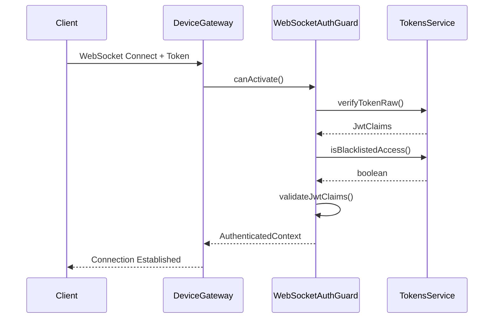

# WebSocket Connection Guide

## Overview

This document provides the complete input structure requirements for connecting to and communicating with the Mitsubishi AC Remote Control WebSocket API. The WebSocket system enables real-time device control and status updates through secure, authenticated connections.

## 🔌 WebSocket Connection Requirements

### Connection Endpoint
```
WebSocket URL: ws://localhost:3000/ws/airconditioner
```

### Required Connection Parameters
All three query parameters are **required** for successful connection:

```typescript
interface ConnectionParams {
  token: string;           // JWT authentication token
  roomId: string;          // Room/device identifier
  familyMemberId: string; // Family member identifier
}
```

### Example Connection
```typescript
const socket = io('ws://localhost:3000/ws/airconditioner', {
  query: {
    token: 'JWT_AUTH_TOKEN',
    roomId: 'living-room-123',
    familyMemberId: 'member-456'
  },
  transports: ['websocket']
});
```

## 🔐 Authentication Requirements

### JWT Token Structure
The JWT token must include these required claims:

```typescript
interface JwtClaims {
  sub: string;      // User ID
  email: string;    // User email
  householdId: string; // Household ID
  role: string;     // User role (ADMIN/PARENT/USER/GUEST)
  exp: number;      // Expiration timestamp
  jti: string;      // Token ID (for blacklist checking)
  iat: number;      // Issued at timestamp
}
```

### Token Extraction Priority
The system attempts to extract the JWT token in this order:
1. **Query Parameter** (`?token=xxx`)
2. **Authorization Header** (`Bearer xxx`)
3. **Custom Auth Data** (`{ token: "xxx" }`)

### Authentication Flow


## 📨 Message Structure Overview

### Base Message Format
All WebSocket messages follow this structure:

```typescript
interface BaseMessage {
  id: string;           // Unique message identifier
  type: 'command' | 'response' | 'event';
  gatewayType: 'device' | 'quota';
  metadata: {
    roomId: string;     // Target room ID
    userId: string;     // User ID (from JWT)
    householdId: string; // Household ID (from JWT)
    timestamp: string;  // ISO timestamp
  };
}
```

### Message Types
- **device_command**: Client-to-Server device control commands
- **device_response**: Server-to-Client command responses
- **broadcast_update**: Server-to-Client real-time status updates
- **error**: Server-to-Client error messages

## 📤 Client-to-Server Commands

### Command Message Format
```typescript
interface DeviceCommandMessage extends BaseMessage {
  command: string;       // Command identifier
  data: object;         // Command-specific data
}
```

### Supported Power Commands

#### Set Power
```typescript
{
  id: 'cmd-12345',
  type: 'command',
  gatewayType: 'device',
  command: 'device_set_power',
  data: { power: boolean },  // true = on, false = off
  metadata: {
    roomId: 'living-room-123',
    userId: 'user-789',
    householdId: 'household-001',
    timestamp: '2024-01-15T10:30:00.000Z'
  }
}
```

#### Get Power
```typescript
{
  id: 'cmd-12346',
  type: 'command',
  gatewayType: 'device',
  command: 'device_get_power',
  data: {},  // Empty for get commands
  metadata: {
    roomId: 'living-room-123',
    userId: 'user-789',
    householdId: 'household-001',
    timestamp: '2024-01-15T10:30:00.000Z'
  }
}
```

### Supported Temperature Commands

#### Set Temperature
```typescript
{
  id: 'cmd-12347',
  type: 'command',
  gatewayType: 'device',
  command: 'device_set_temperature',
  data: { temperature: number },  // Range: 16-32°C
  metadata: {
    roomId: 'living-room-123',
    userId: 'user-789',
    householdId: 'household-001',
    timestamp: '2024-01-15T10:30:00.000Z'
  }
}
```

#### Get Temperature
```typescript
{
  id: 'cmd-12348',
  type: 'command',
  gatewayType: 'device',
  command: 'device_get_temperature',
  data: {},
  metadata: {
    roomId: 'living-room-123',
    userId: 'user-789',
    householdId: 'household-001',
    timestamp: '2024-01-15T10:30:00.000Z'
  }
}
```

### Supported Mode Commands

#### Set Mode
```typescript
{
  id: 'cmd-12349',
  type: 'command',
  gatewayType: 'device',
  command: 'device_set_mode',
  data: {
    mode: 'auto' | 'cool' | 'heat' | 'dry' | 'fan'
  },
  metadata: {
    roomId: 'living-room-123',
    userId: 'user-789',
    householdId: 'household-001',
    timestamp: '2024-01-15T10:30:00.000Z'
  }
}
```

#### Get Mode
```typescript
{
  id: 'cmd-12350',
  type: 'command',
  gatewayType: 'device',
  command: 'device_get_mode',
  data: {},
  metadata: {
    roomId: 'living-room-123',
    userId: 'user-789',
    householdId: 'household-001',
    timestamp: '2024-01-15T10:30:00.000Z'
  }
}
```

### Supported Fan Commands

#### Set Fan Speed
```typescript
{
  id: 'cmd-12351',
  type: 'command',
  gatewayType: 'device',
  command: 'device_set_fan',
  data: {
    fan: 'auto' | 'low' | 'medium' | 'high' | 'quiet'
  },
  metadata: {
    roomId: 'living-room-123',
    userId: 'user-789',
    householdId: 'household-001',
    timestamp: '2024-01-15T10:30:00.000Z'
  }
}
```

#### Get Fan Speed
```typescript
{
  id: 'cmd-12352',
  type: 'command',
  gatewayType: 'device',
  command: 'device_get_fan',
  data: {},
  metadata: {
    roomId: 'living-room-123',
    userId: 'user-789',
    householdId: 'household-001',
    timestamp: '2024-01-15T10:30:00.000Z'
  }
}
```

### Supported Vane Commands

#### Set Vane
```typescript
{
  id: 'cmd-12353',
  type: 'command',
  gatewayType: 'device',
  command: 'device_set_vane',
  data: {
    vane: 'auto' | '1' | '2' | '3' | '4' | '5'
  },
  metadata: {
    roomId: 'living-room-123',
    userId: 'user-789',
    householdId: 'household-001',
    timestamp: '2024-01-15T10:30:00.000Z'
  }
}
```

#### Set Wide Vane
```typescript
{
  id: 'cmd-12354',
  type: 'command',
  gatewayType: 'device',
  command: 'device_set_wideVane',
  data: {
    wideVane: '<<' | '<' | '|' | '>' | '>>'
  },
  metadata: {
    roomId: 'living-room-123',
    userId: 'user-789',
    householdId: 'household-001',
    timestamp: '2024-01-15T10:30:00.000Z'
  }
}
```

### Generic Device Commands

#### Get Device Info
```typescript
{
  id: 'cmd-12355',
  type: 'command',
  gatewayType: 'device',
  command: 'device_get_info',
  data: {},
  metadata: {
    roomId: 'living-room-123',
    userId: 'user-789',
    householdId: 'household-001',
    timestamp: '2024-01-15T10:30:00.000Z'
  }
}
```

#### Get Capabilities
```typescript
{
  id: 'cmd-12356',
  type: 'command',
  gatewayType: 'device',
  command: 'device_get_capabilities',
  data: {},
  metadata: {
    roomId: 'living-room-123',
    userId: 'user-789',
    householdId: 'household-001',
    timestamp: '2024-01-15T10:30:00.000Z'
  }
}
```

#### Ping Device
```typescript
{
  id: 'cmd-12357',
  type: 'command',
  gatewayType: 'device',
  command: 'device_ping',
  data: {},
  metadata: {
    roomId: 'living-room-123',
    userId: 'user-789',
    householdId: 'household-001',
    timestamp: '2024-01-15T10:30:00.000Z'
  }
}
```

#### Health Check
```typescript
{
  id: 'cmd-12358',
  type: 'command',
  gatewayType: 'device',
  command: 'device_health_check',
  data: {},
  metadata: {
    roomId: 'living-room-123',
    userId: 'user-789',
    householdId: 'household-001',
    timestamp: '2024-01-15T10:30:00.000Z'
  }
}
```

#### Subscribe to Events
```typescript
{
  id: 'cmd-12359',
  type: 'command',
  gatewayType: 'device',
  command: 'subscribe_events',
  data: {},
  metadata: {
    roomId: 'living-room-123',
    userId: 'user-789',
    householdId: 'household-001',
    timestamp: '2024-01-15T10:30:00.000Z'
  }
}
```

## 📥 Server-to-Client Responses

### Success Response Format
```typescript
interface DeviceSuccessResponse {
  success: true;
  data: object;           // Command-specific response data
  deviceId: string;      // Room/device ID
  commandId: string;     // Matches request command ID
  processingTime: number; // Processing time in milliseconds
  timestamp: Date;       // Response timestamp
  metadata: {
    strategy: 'airconditioner';    // Processing strategy
    gatewayType: 'device';         // Gateway type
    command: string;               // Command type
    sessionId?: string;           // WebSocket session ID
  };
}
```

### Error Response Format
```typescript
interface DeviceErrorResponse {
  success: false;
  error: string;          // Human-readable error message
  errorCode: string;      // Machine-readable error code
  errorCategory: 'validation' | 'authorization' | 'execution' | 'infrastructure';
  processingTime: number;
  deviceId: string;
  commandId: string;
  timestamp: Date;
  retryable: boolean;     // Whether operation can be retried
  metadata: {
    strategy: string;     // Processing strategy
    gatewayType: string;  // Gateway type
    sessionId: string;    // WebSocket session ID
  };
}
```

### Response Examples

#### Successful Power Command Response
```typescript
{
  success: true,
  data: {
    power: true,
    status: 'command_sent'
  },
  deviceId: 'living-room-123',
  commandId: 'cmd-12345',
  processingTime: 45,
  timestamp: '2024-01-15T10:30:00.045Z',
  metadata: {
    strategy: 'airconditioner',
    gatewayType: 'device',
    command: 'device_set_power',
    sessionId: 'socket-abc123'
  }
}
```

#### Error Response Example
```typescript
{
  success: false,
  error: 'Temperature must be between 16°C and 32°C',
  errorCode: 'VALIDATION_ERROR',
  errorCategory: 'validation',
  processingTime: 12,
  deviceId: 'living-room-123',
  commandId: 'cmd-12347',
  timestamp: '2024-01-15T10:30:00.012Z',
  retryable: false,
  metadata: {
    strategy: 'airconditioner',
    gatewayType: 'device',
    sessionId: 'socket-abc123'
  }
}
```

## 📡 Real-time Event Updates

### Broadcast Update Format
```typescript
interface BroadcastUpdate {
  kind: 'device_status';
  update: {
    deviceId: string;           // Device identifier
    deviceType: 'airconditioner'; // Device type
    status: string;              // Status type
    properties: object;         // Device properties
    timestamp: string;          // Event timestamp
    metadata: {
      roomId: string;           // Room ID
    };
  };
  roomId: string;        // Target room
  timestamp: string;     // Broadcast timestamp
}
```

### Status Update Examples

#### Power Status Update
```typescript
{
  kind: 'device_status',
  update: {
    deviceId: 'living-room-123',
    deviceType: 'airconditioner',
    status: 'power_changed',
    properties: {
      power: true,
      mode: 'cool',
      temperature: 22
    },
    timestamp: '2024-01-15T10:30:05.000Z',
    metadata: {
      roomId: 'living-room-123'
    }
  },
  roomId: 'living-room-123',
  timestamp: '2024-01-15T10:30:05.000Z'
}
```

#### Temperature Status Update
```typescript
{
  kind: 'device_status',
  update: {
    deviceId: 'living-room-123',
    deviceType: 'airconditioner',
    status: 'temperature_changed',
    properties: {
      temperature: 22,
      targetTemperature: 22,
      power: true
    },
    timestamp: '2024-01-15T10:30:10.000Z',
    metadata: {
      roomId: 'living-room-123'
    }
  },
  roomId: 'living-room-123',
  timestamp: '2024-01-15T10:30:10.000Z'
}
```

## 🔧 Complete Implementation Example

### Full WebSocket Client Implementation
```typescript
import { io, Socket } from 'socket.io-client';

interface ConnectionParams {
  token: string;
  roomId: string;
  familyMemberId: string;
}

class AirConditionerWebSocketClient {
  private socket: Socket | null = null;
  private params: ConnectionParams;

  constructor(params: ConnectionParams) {
    this.params = params;
  }

  connect(): Promise<void> {
    return new Promise((resolve, reject) => {
      this.socket = io('ws://localhost:3000/ws/airconditioner', {
        query: this.params,
        transports: ['websocket']
      });

      // Connection established
      this.socket.on('connect', () => {
        console.log('✅ Connected to AC WebSocket');
        resolve();
      });

      // Connection failed
      this.socket.on('connect_error', (error) => {
        console.error('❌ Connection failed:', error.message);
        reject(error);
      });

      // Listen for responses
      this.socket.on('device_response', (response) => {
        this.handleResponse(response);
      });

      // Listen for real-time updates
      this.socket.on('broadcast_update', (update) => {
        this.handleStatusUpdate(update);
      });

      // Handle errors
      this.socket.on('error', (error) => {
        console.error('❌ WebSocket error:', error);
      });

      // Handle disconnection
      this.socket.on('disconnect', (reason) => {
        console.log('🔌 Disconnected:', reason);
      });
    });
  }

  // Power Control
  async setPower(power: boolean): Promise<void> {
    this.emitCommand('device_set_power', { power });
  }

  async getPower(): Promise<void> {
    this.emitCommand('device_get_power', {});
  }

  // Temperature Control
  async setTemperature(temperature: number): Promise<void> {
    if (temperature < 16 || temperature > 32) {
      throw new Error('Temperature must be between 16°C and 32°C');
    }
    this.emitCommand('device_set_temperature', { temperature });
  }

  async getTemperature(): Promise<void> {
    this.emitCommand('device_get_temperature', {});
  }

  // Mode Control
  async setMode(mode: 'auto' | 'cool' | 'heat' | 'dry' | 'fan'): Promise<void> {
    this.emitCommand('device_set_mode', { mode });
  }

  async getMode(): Promise<void> {
    this.emitCommand('device_get_mode', {});
  }

  // Fan Control
  async setFan(fan: 'auto' | 'low' | 'medium' | 'high' | 'quiet'): Promise<void> {
    this.emitCommand('device_set_fan', { fan });
  }

  async getFan(): Promise<void> {
    this.emitCommand('device_get_fan', {});
  }

  // Vane Control
  async setVane(vane: 'auto' | '1' | '2' | '3' | '4' | '5'): Promise<void> {
    this.emitCommand('device_set_vane', { vane });
  }

  async setWideVane(wideVane: '<<' | '<' | '|' | '>' | '>>'): Promise<void> {
    this.emitCommand('device_set_wideVane', { wideVane });
  }

  // Device Information
  async getDeviceInfo(): Promise<void> {
    this.emitCommand('device_get_info', {});
  }

  async getCapabilities(): Promise<void> {
    this.emitCommand('device_get_capabilities', {});
  }

  // System Commands
  async ping(): Promise<void> {
    this.emitCommand('device_ping', {});
  }

  async healthCheck(): Promise<void> {
    this.emitCommand('device_health_check', {});
  }

  // Event Subscription
  async subscribeToEvents(): Promise<void> {
    this.emitCommand('subscribe_events', {});
  }

  // Disconnect
  disconnect(): void {
    if (this.socket) {
      this.socket.disconnect();
      this.socket = null;
    }
  }

  // Private Methods
  private emitCommand(command: string, data: object): void {
    if (!this.socket) {
      throw new Error('WebSocket not connected');
    }

    const message = {
      id: `cmd-${Date.now()}-${Math.random().toString(36).substr(2, 9)}`,
      type: 'command',
      gatewayType: 'device',
      command,
      data,
      metadata: {
        roomId: this.params.roomId,
        userId: 'extracted-from-jwt', // This would be set by the server
        householdId: 'extracted-from-jwt', // This would be set by the server
        timestamp: new Date().toISOString()
      }
    };

    this.socket.emit('device_command', message);
    console.log(`📤 Sent command: ${command}`, message);
  }

  private handleResponse(response: any): void {
    if (response.success) {
      console.log(`✅ Command successful: ${response.metadata.command}`, response.data);
    } else {
      console.error(`❌ Command failed: ${response.metadata.command}`, response.error);
    }
  }

  private handleStatusUpdate(update: any): void {
    console.log(`📡 Status update: ${update.update.status}`, update.update.properties);
  }
}

// Usage Example
async function main() {
  const client = new AirConditionerWebSocketClient({
    token: 'your-jwt-token-here',
    roomId: 'living-room-123',
    familyMemberId: 'member-456'
  });

  try {
    await client.connect();

    // Subscribe to real-time updates
    await client.subscribeToEvents();

    // Get current device info
    await client.getDeviceInfo();

    // Turn on the AC
    await client.setPower(true);

    // Set temperature to 22°C
    await client.setTemperature(22);

    // Set mode to cool
    await client.setMode('cool');

    // Set fan to auto
    await client.setFan('auto');

    // Get current status
    await client.getPower();
    await client.getTemperature();

  } catch (error) {
    console.error('Client error:', error);
  }
}

// Run the client
main();
```

## ✅ Validation Requirements

### Input Validation
- **JWT Token**: Must be valid, not expired, and not blacklisted
- **Room ID**: Must match existing room configuration
- **Family Member ID**: Must belong to the authenticated user's household
- **Command Data**: Must match exact schema requirements for each command type

### Value Ranges and Constraints
- **Temperature**: 16°C to 32°C
- **Power**: Boolean (true/false)
- **Mode**: 'auto', 'cool', 'heat', 'dry', 'fan'
- **Fan Speed**: 'auto', 'low', 'medium', 'high', 'quiet'
- **Vane**: 'auto', '1', '2', '3', '4', '5'
- **Wide Vane**: '<<', '<', '|', '>', '>>'

### Permission Validation
- **Household Access**: User must belong to the same household as the room
- **Role-based Access**: User role must have sufficient permissions
- **Device Access**: User must have access to the specific device/room

## 🚨 Common Issues and Troubleshooting

### Connection Issues

#### Missing Required Parameters
```typescript
// ❌ WRONG - Missing familyMemberId
const socket = io('ws://localhost:3000/ws/airconditioner', {
  query: {
    token: 'jwt-token',
    roomId: 'room-123'
    // Missing familyMemberId
  }
});

// ✅ CORRECT - All required parameters
const socket = io('ws://localhost:3000/ws/airconditioner', {
  query: {
    token: 'jwt-token',
    roomId: 'room-123',
    familyMemberId: 'member-456'
  }
});
```

#### Invalid JWT Token
```
Error: Authentication failed - Token has been revoked
```
**Solution**: Ensure JWT token is valid, not expired, and not blacklisted.

#### Room Access Denied
```
Error: Access denied - User does not have access to this room
```
**Solution**: Verify user belongs to the same household as the room.

### Command Issues

#### Invalid Command Data
```typescript
// ❌ WRONG - Temperature out of range
{
  command: 'device_set_temperature',
  data: { temperature: 35 }  // Too high
}

// ✅ CORRECT - Temperature in valid range
{
  command: 'device_set_temperature',
  data: { temperature: 22 }  // Valid range 16-32
}
```

#### Missing Command Data
```typescript
// ❌ WRONG - Missing required data
{
  command: 'device_set_power',
  data: {}  // Missing power property
}

// ✅ CORRECT - All required data present
{
  command: 'device_set_power',
  data: { power: true }
}
```

### Message Format Issues

#### Invalid Message Structure
```typescript
// ❌ WRONG - Missing required fields
{
  command: 'device_set_power',
  data: { power: true }
  // Missing id, type, gatewayType, metadata
}

// ✅ CORRECT - Complete message structure
{
  id: 'cmd-12345',
  type: 'command',
  gatewayType: 'device',
  command: 'device_set_power',
  data: { power: true },
  metadata: {
    roomId: 'living-room-123',
    userId: 'user-789',
    householdId: 'household-001',
    timestamp: '2024-01-15T10:30:00.000Z'
  }
}
```

## 📊 Error Codes Reference

### Authentication Errors
- `MISSING_TOKEN`: No JWT token provided
- `INVALID_TOKEN`: JWT token is invalid or malformed
- `EXPIRED_TOKEN`: JWT token has expired
- `TOKEN_REVOKED`: JWT token has been blacklisted/revoked

### Authorization Errors
- `INSUFFICIENT_PERMISSIONS`: User lacks required permissions
- `ROOM_ACCESS_DENIED`: User cannot access specified room
- `HOUSEHOLD_ACCESS_DENIED`: User does not belong to household

### Validation Errors
- `INVALID_MESSAGE_FORMAT`: Message structure is invalid
- `MISSING_REQUIRED_FIELDS`: Required message fields are missing
- `INVALID_PARAMETER_VALUES`: Command data values are invalid
- `SCHEMA_VALIDATION_FAILED`: Message fails schema validation

### Execution Errors
- `COMMAND_NOT_SUPPORTED`: Command type is not supported
- `DEVICE_OFFLINE`: Device is not responding
- `MQTT_CONNECTION_FAILED`: Cannot connect to MQTT broker

### Infrastructure Errors
- `INTERNAL_SERVER_ERROR`: Unexpected server error
- `SERVICE_UNAVAILABLE`: Required service is unavailable
- `TIMEOUT_ERROR`: Operation timed out

This guide provides comprehensive documentation for successfully connecting to and using the WebSocket API for Mitsubishi AC device control.