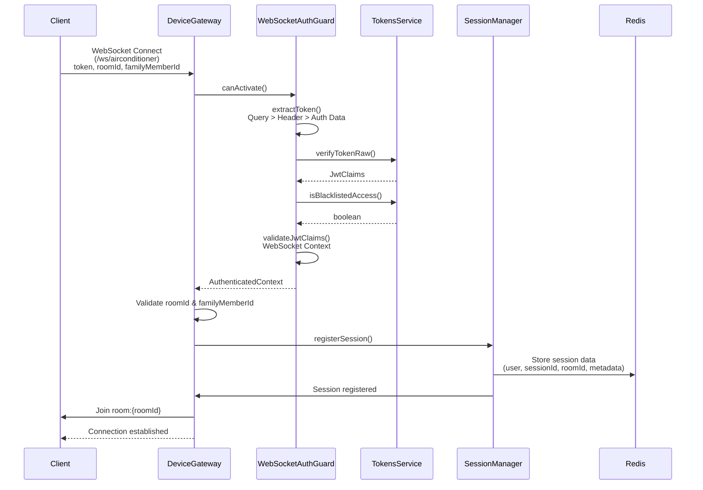
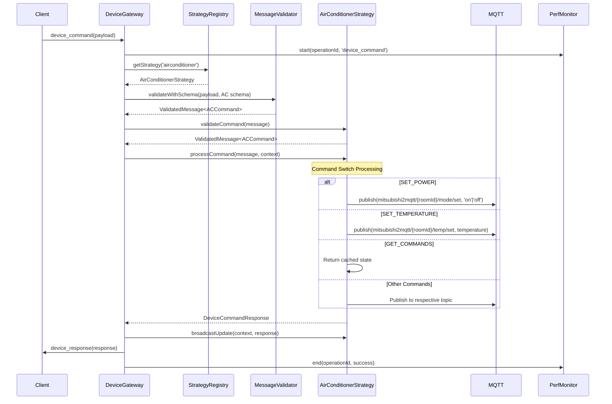
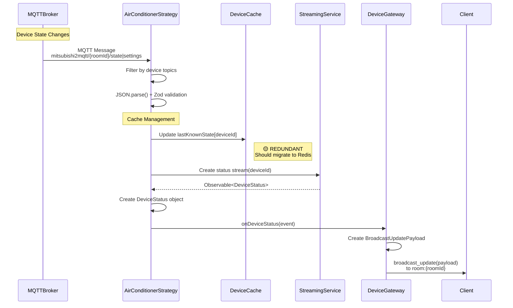

# WebSocket Device Flow Architecture Analysis

## Overview

This document provides a comprehensive analysis of the WebSocket device flow architecture in the backend-2 system, including detailed flow diagrams and identification of used vs redundant components.

## Architecture Summary

The backend WebSocket system implements a sophisticated real-time device control architecture using:
- **NestJS** with Socket.IO for WebSocket communication
- **Strategy Pattern** for device abstraction
- **Redis** for session persistence
- **MQTT** for device communication
- **RxJS** for reactive data streams
- **Zod** for runtime validation

## Complete WebSocket Device Flow

```mermaid
%% WebSocket Device Flow Architecture
%% Active components shown as solid boxes
%% Redundant/underutilized components shown as dashed boxes

graph TB
    %% External Systems
    Client[Frontend Client<br/>React App]
    MQTT[MQTT Broker<br/>mitsubishi2mqtt]
    Redis[(Redis<br/>Session Store)]
    Auth[JWT Auth Service]

    %% Main Gateway
    Gateway[DeviceGateway<br/>/ws/airconditioner<br/>🟢 ACTIVE]

    %% Authentication Layer
    Guard[WebSocketAuthGuard<br/>🟢 ACTIVE]

    %% Strategy Registry
    Registry[StrategyRegistryService<br/>🟢 ACTIVE]

    %% Device Strategies
    ACStrategy[AirConditionerStrategy<br/>🟢 ACTIVE<br/>Full AC Control]
    GenericStrategy[GenericDeviceStrategy<br/>🟡 PARTIAL<br/>Basic Commands Only]

    %% Supporting Services
    SessionManager[WebSocketSessionManagerService<br/>🟢 ACTIVE<br/>Redis-backed]
    MessageValidator[MessageValidatorService<br/>🟢 ACTIVE<br/>Zod Validation]
    PerfMonitor[PerformanceMonitorService<br/>🟢 ACTIVE<br/>Operation Metrics]
    StreamingService[StreamingService<br/>🟢 ACTIVE<br/>RxJS Helpers]
    ErrorHandler[ErrorHandlerService<br/>🟢 ACTIVE]

    %% Caching Systems
    SessionCache[(Redis Sessions)<br/>🟢 ACTIVE]
    DeviceCache[In-Memory Device State<br/>🟡 REDUNDANT<br/>TODO: Redis Migration]

    %% Data Flows
    %% Connection Flow
    Client -->|1. Connect with token<br/>roomId, familyMemberId| Gateway
    Gateway -->|2. Authenticate| Guard
    Guard -->|3. Validate JWT| Auth
    Auth -->|4. User Claims| Guard
    Guard -->|5. Auth Context| Gateway
    Gateway -->|6. Register Session| SessionManager
    SessionManager -->|7. Store in Redis| SessionCache
    Gateway -->|8. Join Socket Room| Gateway

    %% Command Processing Flow
    Client -->|9. device_command| Gateway
    Gateway -->|10. Start Monitoring| PerfMonitor
    Gateway -->|11. Resolve Strategy| Registry
    Registry -->|12. Get Strategy| ACStrategy
    Gateway -->|13. Validate Message| MessageValidator
    MessageValidator -->|14. Zod Schema Check| ACStrategy
    ACStrategy -->|15. Process Command| MQTT
    MQTT -->|16. Publish to Device| ACStrategy
    ACStrategy -->|17. Send Response| Gateway
    Gateway -->|18. device_response| Client
    Gateway -->|19. End Monitoring| PerfMonitor

    %% Real-time Event Flow
    MQTT -->|20. Device State Updates| ACStrategy
    ACStrategy -->|21. Validate MQTT Payload| DeviceCache
    ACStrategy -->|22. Create Status Stream| StreamingService
    ACStrategy -->|23. broadcast_update| Gateway
    Gateway -->|24. Room Broadcast| Client

    %% Error Handling Flow
    Gateway -.->|25. Error Events| ErrorHandler
    ACStrategy -.->|26. Strategy Errors| ErrorHandler
    ErrorHandler -->|27. Error Response| Client

    %% Strategy Selection (Generic vs AC)
    Registry -.->|28. Unused Strategy| GenericStrategy
    GenericStrategy -.->|29. Basic Commands Only| Client

    %% Redundancy Notes
    classDef redundant fill:#fff9e6,stroke:#ffa726,stroke-width:2,stroke-dasharray: 5 5
    classDef active fill:#e8f5e8,stroke:#4caf50,stroke-width:2
    classDef external fill:#e3f2fd,stroke:#2196f3,stroke-width:2

    class DeviceCache,GarmonicStrategy redundant
    class Gateway,Guard,Registry,ACStrategy,SessionManager,MessageValidator,PerfMonitor,StreamingService,ErrorHandler active
    class Client,MQTT,Redis,Auth external

    %% Flow Annotations
    subgraph "Main Active Flow"
        Gateway
        Guard
        Registry
        ACStrategy
        SessionManager
        MessageValidator
        PerfMonitor
    end

    subgraph "External Dependencies"
        Client
        MQTT
        Redis
        Auth
    end

    subgraph "Redundant/Underutilized"
        GenericStrategy
        DeviceCache
    end
```

## Detailed Flow Analysis

### 1. Connection Establishment Flow



### 2. Command Processing Flow



### 3. Real-time Event Broadcasting Flow



## Component Analysis

### 🟢 Active Components (Essential)

| Component | Purpose | Status |
|-----------|---------|--------|
| **DeviceGateway** | Main WebSocket entry point for AC namespace | Fully Implemented |
| **WebSocketAuthGuard** | JWT authentication with multi-method extraction | Fully Implemented |
| **AirConditionerStrategy** | Complete AC control logic with MQTT integration | Fully Implemented |
| **StrategyRegistryService** | Strategy resolution and lifecycle management | Fully Implemented |
| **WebSocketSessionManagerService** | Redis-backed session persistence | Fully Implemented |
| **MessageValidatorService** | Zod schema validation for messages | Fully Implemented |
| **PerformanceMonitorService** | Operation timing and metrics tracking | Fully Implemented |
| **StreamingService** | RxJS stream utilities and retry logic | Fully Implemented |
| **ErrorHandlerService** | Centralized error handling and logging | Fully Implemented |

### 🟡 Partial/Redundant Components

| Component | Purpose | Issue |
|-----------|---------|-------|
| **GenericDeviceStrategy** | Generic device abstraction | Only basic commands implemented, most functionality is placeholder |
| **In-Memory Device Cache** | Device state caching | Redundant with Redis sessions, TODO for migration mentioned in code |
| **Strategy Metrics** | Individual strategy performance tracking | Duplicates PerformanceMonitorService functionality |
| **Complex Type System** | TypeScript discriminated unions | Over-engineered for current use case |

### 🔴 Technical Debt Identified

1. **TODO: Redis Migration** - Device state cache should use Redis like sessions
2. **Hardcoded Dependencies** - AirConditionerStrategy directly imports MQTT service
3. **Mixed Concerns** - Broadcasting logic mixed with strategy logic
4. **Over-abstraction** - Some interfaces and abstractions seem unnecessary

## Architecture Patterns Applied

### ✅ Well-Implemented Patterns

1. **Strategy Pattern** - Clean device abstraction with strategy registry
2. **Repository Pattern** - Session management with Redis persistence
3. **Observer Pattern** - RxJS streams for real-time updates
4. **Gateway Pattern** - WebSocket entry point with authentication
5. **CQRS-like Separation** - Separate command and query flows

### ⚠️ Areas for Improvement

1. **Simplify Validation Pipeline** - Reduce multiple validation layers
2. **Consolidate Caching** - Use Redis for both sessions and device state
3. **Remove Unused Strategy** - GenericDeviceStrategy or complete implementation
4. **Simplify Type System** - Reduce complex discriminated unions where not needed

## Performance Considerations

### Current Optimizations
- **Redis Session Management** - Persistent sessions with TTL
- **RxJS Stream Sharing** - Efficient broadcast to multiple clients
- **Connection Pooling** - MQTT connection reuse
- **Schema Validation** - Runtime type safety with Zod

### Potential Optimizations
- **Device State Redis Migration** - Cross-instance state sharing
- **Command Batching** - Reduce MQTT round trips
- **Connection Health Monitoring** - Proactive connection management
- **Metrics Consolidation** - Single source of performance truth

## Security Features

1. **JWT Authentication** - Multi-method token extraction
2. **Household-based Access Control** - User isolation by household
3. **Role-based Permissions** - ADMIN > PARENT > USER > GUEST hierarchy
4. **Input Validation** - Zod schema validation for all messages
5. **Blacklist Checking** - Token revocation support

## Recommendations

### Immediate Actions
1. **Complete Redis Migration** - Move device state cache to Redis
2. **Remove/Complete Generic Strategy** - Either implement fully or remove
3. **Consolidate Metrics** - Use PerformanceMonitorService as single source
4. **Simplify Validation** - Reduce redundant validation layers

### Future Considerations
1. **Strategy Factory Pattern** - For dynamic strategy creation
2. **Circuit Breaker Pattern** - For MQTT connection resilience
3. **Event Sourcing** - For device state history
4. **Distributed Tracing** - For better observability

## Conclusion

The WebSocket device architecture is well-designed and implements solid patterns with good separation of concerns. The core functionality for AC control is fully operational and properly abstracted. However, there are areas of redundancy and technical debt that should be addressed to improve maintainability and performance.

The main strengths are the strategy pattern implementation, Redis-backed session management, and reactive streaming architecture. The primary areas for improvement are consolidating redundant components and completing the Redis migration for device state caching.